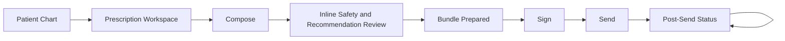
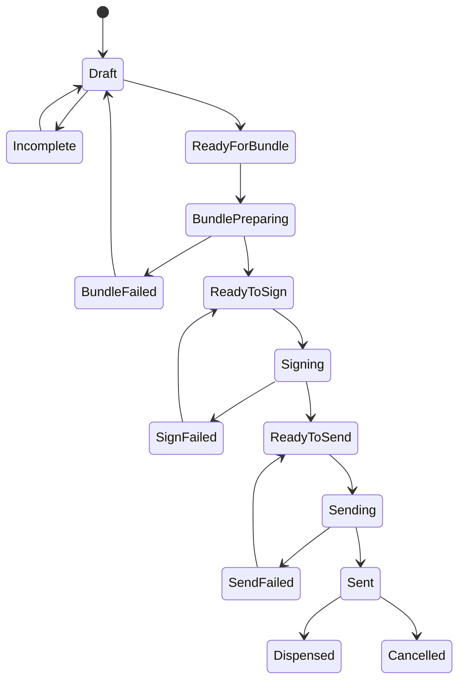

# Unified User Flow — Prescription Workspace

## Context
This flow is the proposed CorePVS target flow for a seamless doctor-facing prescription experience.

It is based on:
- as-is audit of `pvs-base-1`
- CorePVS prescription direction in `docs/_ngan/2-prescription/`
- product-context requirement that doctors need compliant E-Rezept with safety checks

## Goal
Unify the currently split workflow:

`search/select/edit -> shopping bag -> save/print`

and

`bundle/sign/send/status`

into one continuous doctor workflow.

## Primary Persona
Doctor.

## End-to-End Flow
1. Open patient chart and launch `Prescription Workspace`
2. Review sticky patient context
3. Search medication
4. Select medication or free-text mode
5. Add medication row to workspace
6. Enter dosage, intake instructions, quantity, and optional notes
7. Choose prescription form or mode
   - E-Rezept
   - Muster 16
   - private prescription
   - green prescription
   - BTM or other specialized forms when relevant
8. Review automatic recommendation, substitution, and safety feedback
9. Resolve blocking issues or acknowledge non-blocking warnings
10. Generate E-Rezept bundle in-place
11. Review readiness summary
12. Sign using QES or comfort signature
13. Send to Fachdienst
14. Show success state with patient copy and queue actions
15. Track lifecycle status in the same workspace
16. Retry, resend, print, or cancel if allowed

## Workflow Moments
| Workflow moment | Why it matters |
|---|---|
| Enter workspace | Keeps patient context, allergies, and insurance visible from the first second |
| Add medication | Converts search into an editable prescription row without switching surface |
| Edit prescription details | Main work phase; must stay fast and dense |
| Safety and recommendation overlay | Must happen inline, not as a separate detached review world |
| Bundle generation | Technical step should feel like system preparation, not user navigation |
| Sign | Legal commitment point |
| Send | External integration point with recoverable failures |
| Status | Must remain visible after sending without sending the user to another module |

## Screen Sequence

## State Transitions

## User Actions
- Search medication
- Select result or free-text prescription mode
- Edit row fields inline
- Change form type
- Review safety warnings
- Accept warning override where allowed
- Save draft
- Generate bundle
- Sign
- Send
- Print patient copy
- Retry failed bundle, sign, or send
- View current status
- Cancel if permitted

## System Actions
- Load patient context, current medication, allergies, insurance, and relevant history
- Fetch medication results and recommendation metadata
- Validate row completeness and form-specific prerequisites
- Run safety checks continuously
- Auto-generate readiness summary
- Generate bundle without forcing navigation away from the workspace
- Lock signed data
- Send signed bundle to Fachdienst
- Refresh lifecycle status after send
- Surface actionable errors and recovery paths

## Branches
- Catalog medication vs free-text medication
- E-Rezept vs paper or non-ERP form branch
- Single prescription vs multiple rows in one workspace session
- Individual sign/send vs batch sign/send
- Comfort signature available vs explicit QES prompt required
- Send success vs recoverable send failure
- Sent but not dispensed vs dispensed vs cancelled

## Edge Cases
- Drug search unavailable
- Free-text medication missing required name
- Quantity invalid
- Intake interval missing for form types that require it
- Severe interaction blocks bundle/sign
- Warning interaction allows proceed with acknowledgement
- Bundle generation fails because required fields are incomplete
- Signing fails because TI or certificate state is invalid
- Sending fails because connector, network, or Fachdienst request is rejected
- Status refresh unavailable after send
- Cancellation requested after dispensing and must be blocked

## Audit-To-Target Shift
- As-is `pvs-base-1` splits form prescription from ERP lifecycle
- Target CorePVS flow keeps authoring, readiness, signing, sending, and status in one workspace
- The user should experience the ERP lifecycle as part of the prescription workflow, not as a separate technical submodule
