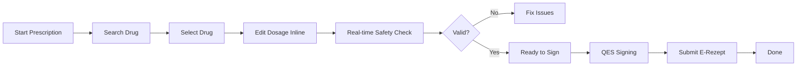
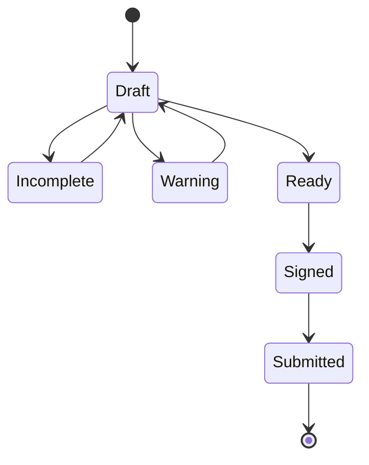

# CorePVS — Prescription Master Spec (Flow → Detail → Screen)

## 1. OVERALL FLOW



---

## 2. FLOW DETAILS

### Step 1 — Search Drug
- Keyboard focus default
- Results ranked by:
  - patient context
  - recent usage
  - insurance relevance

### Step 2 — Select Drug
- Inline expansion (no modal)
- Auto-fill dosage defaults

### Step 3 — Edit Dosage
- Fields:
  - dosage
  - frequency
  - duration
- Keyboard navigation only

### Step 4 — Safety Check
- Runs in real-time
- Severity:
  - 🔴 Critical
  - 🟡 Warning
  - 🟢 OK

### Step 5 — Signing
- Batch queue supported
- Status visible per item

---

## 3. SCREEN STRUCTURE

```
+----------------------------------------------------------------------------------+
| Patient Header (Sticky)                                                          |
|----------------------------------------------------------------------------------|
| Search Panel     | Prescription Workspace        | Safety Panel                  |
|----------------------------------------------------------------------------------|
| Action Bar (Sticky Bottom)                                                       |
+----------------------------------------------------------------------------------+
```

---

## 4. REGIONS

### 4.1 Patient Header
- Read-only
- Shows:
  - allergies
  - insurance
  - chronic conditions

### 4.2 Search Panel
- Input + result list
- Dense rows
- Keyboard navigation

### 4.3 Prescription Workspace
- Table-based rows
- Inline editable
- Expandable rows

### 4.4 Safety Panel
- Real-time updates
- Severity-based alerts

### 4.5 Action Bar
- Save Draft
- Sign
- Submit

---

## 5. STATE SYSTEM



### Rules
- Read-only vs editable clearly separated
- Signed = locked
- Submitted = immutable

---

## 6. P1 — ERROR & EDGE CASES (NEW)

### 6.1 Signing Errors

| Case | Trigger | UI Handling | Recovery |
|------|--------|-------------|----------|
| QES timeout | eHBA session expired | Red banner + retry CTA | Re-authenticate |
| Partial sign | Batch signing interrupted | Mark signed vs unsigned rows | Resume queue |
| Invalid certificate | eHBA invalid | Blocking error | Contact admin |

---

### 6.2 Submission Errors

| Case | Trigger | UI Handling | Recovery |
|------|--------|-------------|----------|
| FHIR rejected | Validation error | Highlight fields inline | Fix + resubmit |
| Network failure | API timeout | Retry banner | Auto-retry / manual retry |
| Duplicate submission | Already sent | Warning + lock | Prevent resubmit |

---

### 6.3 Safety Edge Cases

| Case | Handling |
|------|----------|
| Critical interaction | Block signing |
| Warning ignored | Require confirmation |
| Allergy conflict | Highlight in header + row |

---

### 6.4 Multi-Prescription

- Multiple drugs in one session
- Mixed states allowed:
  - some Draft
  - some Signed
- Batch operations:
  - Sign all valid
  - Submit all signed

---

### 6.5 Data Integrity

| Case | Rule |
|------|------|
| Signed data | Immutable |
| Submitted data | Fully locked |
| Draft edit | Always allowed |

---

## 7. DESIGN PRINCIPLES

- One-screen workflow
- No modal interruption
- High-density layout
- Keyboard-first interaction
- Real-time safety feedback

---

## 8. SUMMARY

This spec links:

Flow → Detail → Screen → State → Error handling

Goal:

> High-throughput, safe, and resilient prescribing workstation
