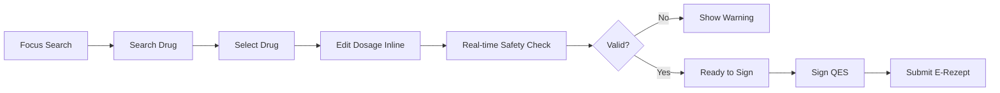
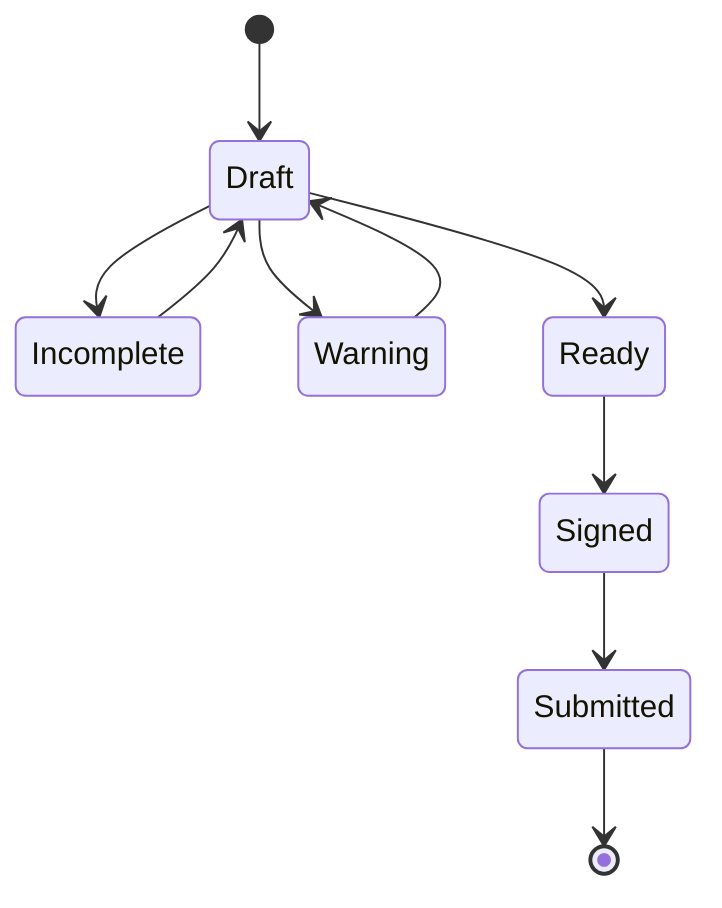

# CorePVS — Prescription Workflow Spec (Option B)

## 1. Keyboard Shortcuts

| Action | Shortcut |
|-------|---------|
| Focus search | / |
| Navigate results | ↑ ↓ |
| Select drug | Enter |
| Add medication row | Ctrl + Enter |
| Next field | Tab |
| Save draft | Ctrl + S |
| Sign (QES) | Ctrl + Shift + S |
| Submit | Ctrl + Enter (on valid) |

---

## 2. Interaction Flow (Mermaid)

---

## 3. State Transitions (Mermaid)

---

## 4. Rules

- No modal interruption
- Safety always visible
- Signing supports batch queue
