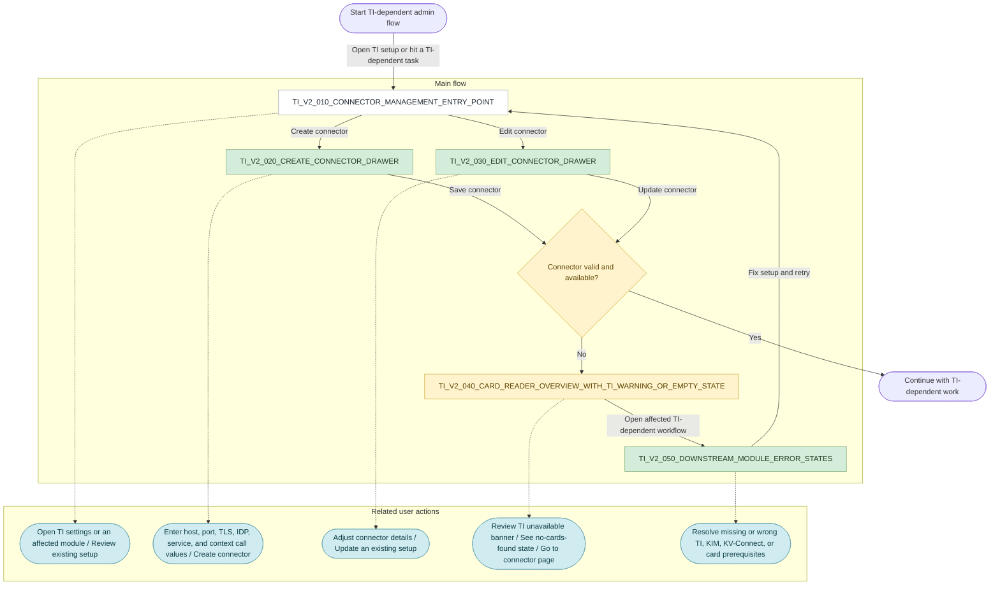
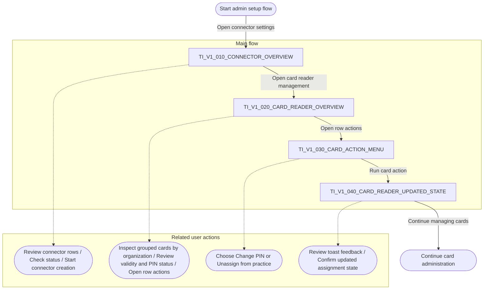

# TI Connector and Card Reader Admin Flow

**Version:** 2.0.0
**Last Updated:** 2026-03-17 by Ngan
**Figma link:** https://www.figma.com/design/vTFssetTZBVbrQDCqgDRt4/TI-Settings--Card-Overview--System--xBDT?node-id=1-213&p=f&t=O43CpA5SPmzEMQ0m-0
**Artifact Date:** 2026-03-17
**Artifact Scope:** TI connector create/edit admin flow and downstream TI-dependent card-reader error states
**Artifact Status:** Aspirational, inferred from the current Figma flow boards

## V2

V2 extends the V1 admin setup flow from basic connector and card-reader management into a broader TI dependency and error-handling flow.

### What's New/Modified In V2

- `🆕 New` adds a dedicated `Create connector drawer` with full connection, TLS, IDP, service, context-call, and online-check settings
- `🆕 New` adds an `Edit connector drawer` for updating an existing connector configuration
- `🆕 New` adds grouped downstream error coverage for e-documents, eAU, eAB, KV billing, KIM inbox, device list, and stationary card-reader scenarios
- `✏️ Modified` changes the card-reader outcome from a populated card list to warning and empty states when TI is unavailable
- `✏️ Modified` makes connector validity a central decision point before the user can continue TI-dependent work
- `⚪ Unchanged` keeps admin entry through connector settings and card-reader-related areas as the base path into the flow

### User Flow

**Date:** 2026-03-17
**Scope:** TI connector create and edit flows plus downstream TI-dependent error states in card reader, KIM, KV billing, and e-document scenarios
**Status:** Aspirational, inferred from the current Figma V2 flow board
**Legend:** 🆕 New · ✏️ Modified · ⚪ Unchanged · 🔵 Info/Reference

### Screenshot Assets

- `v2-ti2_010-connector-management-entry-point.png`
- `v2-ti2_020-create-connector-drawer.png`
- `v2-ti2_030-edit-connector-drawer.png`
- `v2-ti2_040-card-reader-warning-empty-state.png`
- `v2-ti2_050-downstream-module-error-states.png`
- `v2-ti2_decision-connector-valid-and-available.png`

### Product Flow

1. A user opens TI connector settings directly or reaches them because a TI-dependent workflow is blocked.
2. The user creates a new connector or edits an existing connector by entering connection, TLS, IDP, service, and context-call details.
3. The system validates whether the connector is usable and available.
4. If the connector works, the user can continue with TI-dependent tasks.
5. If the connector is missing, offline, or configured incorrectly, the system shows warnings, empty states, or blocking feedback.
6. The user returns to connector management, fixes the setup, and retries the affected workflow.

### Main Screens Or Major UI States

1. `Connector management entry point`

This is the setup area where the user manages TI connector configuration or lands after a TI-related problem surfaces elsewhere.

The user can:

- review whether a connector already exists
- decide to create a new connector
- decide to edit an existing connector
- return here from downstream error states

2. `Create connector drawer`

This is the form for adding a new TI connector. It groups the setup into connection settings, TLS, IDP, service configuration, context call, and online-check behavior.

The user can:

- enter host and port values
- choose a TLS mode
- enter IDP and authentication callback details
- configure the e-prescription service URL
- assign admin device, device, mandant, and client system information
- choose when the online check should run
- create the connector or cancel

3. `Edit connector drawer`

This is the update state for an existing connector. It exposes the same setup structure as create, but with current values already filled in.

The user can:

- review the current connector configuration
- change connection, TLS, IDP, service, or device settings
- update the connector
- cancel without saving

4. `Card reader overview with TI warning or empty state`

This is the admin card-reader screen when TI is not available or cards cannot be loaded. The page shows a warning banner and an empty-state message instead of usable card data.

The user can:

- see that the TI connector is not available
- follow the prompt to go to the connector setup page
- confirm that no connected cards are currently available
- understand that card-reader work is blocked until setup is fixed

5. `Downstream module error states`

These are TI-dependent screens outside connector management that surface missing or broken prerequisites. The V2 page groups them as examples across e-documents, eAU preview, eAB preview, KV billing, KIM inbox, device lists, and stationary card-reader views.

The user can:

- encounter missing-card, missing-connector, or wrong-configuration states
- see when KIM or KV-Connect setup is missing or invalid
- understand why a module cannot continue
- navigate back to TI setup and correct the root issue

## V1

### User Flow

**Date:** 2026-03-17
**Scope:** Baseline connector overview and card-reader admin flow with row actions
**Status:** Aspirational, inferred from the current Figma V1 flow board

### Screenshot Assets

- `v1-ti1_010-connector-overview.png`
- `v1-ti1_020-card-reader-overview.png`
- `v1-ti1_030-card-action-menu.png`
- `v1-ti1_040-card-reader-updated-state.png`

### Product Flow

1. A user opens connector settings to review existing connector rows and status information.
2. The user moves to the card-reader overview to inspect connected cards grouped by organization or practice.
3. From a selected row, the user opens the action menu.
4. The user chooses an action such as changing a PIN or unassigning a card from a practice.
5. The system updates the card state and shows feedback in the card-reader screen.

### Main Screens Or Major UI States

1. `Connector overview`

This is the baseline TI setup list in V1. It shows existing connectors, online-check behavior, context-call count, validity, and current status.

The user can:

- review existing connector rows
- compare online and offline connector status
- start creating a connector from the action button
- use connector information before moving into card-reader work

2. `Card reader overview`

This is the main card administration screen in V1. It groups cards under organizations and shows type, holder, ICCSN, slot, validity, and PIN status.

The user can:

- review connected cards by organization
- scan card status such as verified, blocked, or pending initialization
- open row actions for a specific card
- continue with card administration tasks

3. `Card action menu`

This is the row-level action menu that appears from the card-reader overview.

The user can:

- choose `Change PIN`
- choose `Unassign from practice`
- leave the menu without making a change

4. `Card reader updated state`

This is the follow-up card-reader state after an action is applied. The board shows this with a success toast and an updated assignment label after unassigning a card.

The user can:

- confirm the action succeeded
- review the updated card assignment state
- continue working in the card-reader overview
