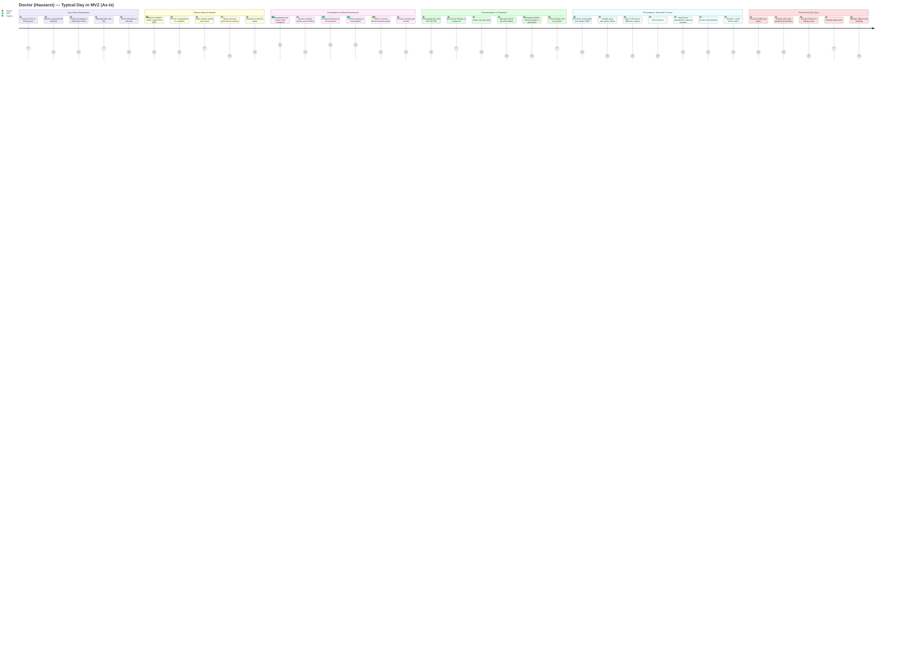

# Doctor (Hausarzt) Journey Map — As-Is

**Version:** 1.0.0
**Last Updated:** 2026-03-17 by Ngan

**Purpose:** Design validation and stakeholder communication. Maps the current-state experience of a Hausarzt in an MVZ across a typical day (~40-60 patients, ~7-8 min per encounter). Identifies pain points, moments of truth, and gaps against the [doctor bird-eye view](FLOW260313-doctor-bird-eye-view.md).

**Persona:** General practitioner (Hausarzt) in an MVZ with 2-3 locations, rotating between sites. Uses a legacy PVS (e.g., CGM or medatixx).

**References:**
- Anti-pattern numbers (e.g., #6, #7) refer to the UX/UI Anti-Patterns table in [product-context.md](../product-context/product-context.md#uxui-anti-patterns)
- 62.4% connector issue rate: KBV Praxisbarometer / gematik TI survey data
- 49-96% alert override rates: Published CPOE/CDSS literature (van der Sijs et al., systematic reviews)

---

## Journey Diagram

---

## Phase Details

### Phase 1: Day Start & Preparation (~07:30–08:00)

**Bird-eye steps covered:** 1 (Schedule appointment — reviewed, not performed by doctor), 2 (Day preparation), 3 (Daily list / to-do list)

**Actions:**
- Arrive at practice, log into PVS on workstation
- Review today's appointment calendar — scan for patient count, appointment types, gaps
- Check which patients are returning (Dauerdiagnosen, chronic eDMP patients) vs. new
- Glance at yesterday's unfinished items (offline to-do queue)
- Mentally plan the day — estimate which patients will be complex

**Touchpoints:**
- PVS calendar view, waiting room board, offline to-do list
- Paper printout of daily schedule (common in current PVS)
- Coffee-room conversations with MFA about expected patient load

**Thoughts & Emotions:**
- *"42 patients today, 3 slots double-booked again. Going to run late by 10am."*
- *"I see Herr Schmidt is back — need to check his DMP documentation from last quarter."*
- Mild anxiety about volume; resignation about system limitations
- If multi-location MVZ: *"Which location am I at today? Do I have my settings/preferences here?"*

**Pain Points:**
- **Calendar lacks clinical context** — sees appointment slots but not why the patient is coming. Must click into each patient to understand visit complexity.
- **No cross-day continuity** — yesterday's unfinished work (pending lab results, unsigned letters) lives in a separate queue with no connection to today's schedule.
- **Multi-location disorientation** — rotating doctors arrive at a different Standort and the PVS doesn't carry over their workspace preferences, recent patient context, or pending tasks from the other location.
- **Paper shadow system** — many doctors print the schedule because the PVS calendar is too slow or information-sparse to scan efficiently.

**Moments of Truth:**
- The first 5 minutes of the day set the doctor's confidence. If the PVS gives a clear, dense overview of what's ahead with clinical context, the day starts controlled. If it's a blank calendar with time slots, the doctor is already behind.

---

### Phase 2: Patient Intake & Handoff (recurring throughout day)

**Bird-eye steps covered:** 4 (Offline to-do), 5 (Patient registration handoff), 6 (Enrollment), 7 (MFA examination / waiting-room assignment), 8 (Scanning external documents), 9 (Primary anamnesis)

**Actions:**
- Receive notification that next patient is ready (waiting room status change, MFA verbal handoff, or paper note)
- Glance at MFA's intake notes — vitals, chief complaint, anamnesis summary
- Check if registration is complete (eGK read, Schein created, documents attached)
- Open patient profile and orient: who is this patient, why are they here today, what's their history?

**Touchpoints:**
- Waiting room board/list, patient profile, timeline, MFA handoff (verbal or system)
- Scanned external documents (hospital letters, specialist reports)
- Enrollment status indicators (HZV/FAV, eDMP)

**Thoughts & Emotions:**
- *"MFA says patient is ready, but I can see the Schein isn't created yet — do I wait or start?"*
- *"There's a hospital discharge letter scanned in, but it's a 4-page PDF — no summary, I have to read the whole thing."*
- Frustration when handoff is incomplete — doctor must either wait or context-switch to fix administrative gaps
- Cognitive load spike: switching from previous patient's mental model to a new one every 7-8 minutes

**Pain Points:**
- **Unreliable handoff signal** — no clear system-level indicator that intake is truly complete. Doctor opens the patient and discovers missing Schein, unread eGK, or no anamnesis. Wasted time backtracking.
- **Scanned documents without structure** — external documents are flat PDFs. No highlights, no summary, no tagging of key findings. Doctor must read everything linearly.
- **Context switch cost** — PVS doesn't help the doctor transition between patients. No "patient briefing" view that summarizes: reason for visit, relevant history, open items from last encounter.
- **MFA-Doctor communication gap** — handoff is often verbal ("Frau Müller is in room 2, she has back pain") because the PVS doesn't surface intake notes prominently in the doctor's view.
- **Enrollment blind spots** — doctor doesn't easily see if the patient is enrolled in HZV/FAV or eDMP, which affects what documentation is required during this visit.

**Moments of Truth:**
- The handoff is the most fragile point in the flow. If the doctor opens a patient and everything is ready — Schein, anamnesis, relevant history surfaced — consultation starts immediately. If anything is missing, the doctor loses 1-2 minutes per patient, which compounds to 30-60 minutes lost per day across 40+ patients.

---

### Phase 3: Consultation & Clinical Assessment (~7-8 min per patient)

**Bird-eye steps covered:** 10 (Doctor preparation for consultation), 11 (Get understanding about patient's problems), 14 (Examination), 15 (Laboratory — reviewing existing results; ordering new labs is in Phase 4)

**Actions:**
- Greet patient, establish rapport
- Review chief complaint — either from MFA anamnesis notes or by asking the patient directly
- Open patient timeline and medical data sidebar to review history
- Conduct structured anamnesis conversation — current symptoms, duration, prior treatments
- Perform physical examination
- If needed: order or review device-based examination (EKG, spirometry via GDT)
- If available: review incoming lab results from prior visit

**Touchpoints:**
- Patient profile, medical data sidebar, timeline
- Examination devices (GDT-connected hardware)
- Patient (face-to-face conversation)
- Paper notes (many doctors still jot on paper during the conversation, entering into PVS after)

**Thoughts & Emotions:**
- *"This is why I became a doctor"* — the consultation itself is often the most satisfying part of the day
- *"I need to look at the screen to check history, but I want to maintain eye contact with the patient."*
- *"The timeline shows 8 years of visits. I need the last 3 entries, not all of them."*
- Flow state when patient interaction is smooth; frustration when PVS interrupts the clinical thought process
- Time pressure: *"I'm already 15 minutes behind schedule."*

**Pain Points:**
- **Screen vs. patient attention split** — the PVS requires the doctor to look at and interact with the screen during a conversation that demands eye contact and active listening. No voice input, no ambient capture, no way to defer documentation.
- **Timeline overload** — long-term patients have years of entries. No intelligent filtering by relevance. The doctor must manually scroll to find what matters for today's complaint.
- **GDT device friction** — device-based exams (EKG, spirometry) require separate GDT workflows that don't integrate smoothly. Results appear asynchronously and may not link to the current encounter automatically.
- **Lab result scattering** — lab results from external labs arrive via different channels (LDT import, fax, scanned PDF) and land in different places in the PVS. No unified "results inbox" with trend visualization.
- **No visit-reason-driven workspace** — whether the patient comes for a cold, a DMP follow-up, or acute chest pain, the doctor sees the same generic patient profile. No contextual adaptation of what's shown.

**Moments of Truth:**
- The quality of the clinical encounter depends on how little the PVS intrudes. The best experience is when the doctor can focus entirely on the patient and the system stays out of the way. The worst is when the doctor spends more time navigating the PVS than listening to the patient.

---

### Phase 4: Documentation & Treatment (during/after encounter)

**Bird-eye steps covered:** 12 (Schein documentation), 13 (DMP documentation), 15 (Laboratory — ordering new tests; reviewing existing results is in Phase 3), 16 (Diagnoses and findings), 17 (Therapy)

**Actions:**
- Code diagnoses using ICD-10-GM — search, select, set Diagnosensicherheit (V/G/A/Z)
- Document examination findings in the composer (free text + structured fields)
- Check and manage Schein — verify correct Schein type, link GOPs
- If eDMP patient: open eDMP sidebar, complete structured documentation, run plausibility check
- Order lab tests if needed
- Plan and document therapy — treatment decisions, recommendations, follow-up timeline
- Review Dauerdiagnosen — confirm or update chronic diagnoses carried from prior quarters

**Touchpoints:**
- ICD-10-GM search, SDKRW validation engine
- Composer (text editor for Befund), text modules/templates
- Schein management view, schein details
- eDMP sidebar with enrollment and documentation screens
- Lab order module
- Patient profile "next gen" (if available)

**Thoughts & Emotions:**
- *"I know the diagnosis, but what's the exact ICD code? Is it M54.5 or M54.4?"*
- *"The SDKRW says this combination is invalid — but clinically it's correct. Now I have to figure out the coding workaround."*
- *"This DMP form has 30 fields. The patient has been stable for 2 years. Why can't I just confirm 'no change'?"*
- Documentation feels like a second job layered on top of patient care
- Anxiety about coding accuracy — wrong codes mean rejected billing or audit flags

**Pain Points:**
- **ICD search friction** — the ICD-10-GM catalog is massive. Current PVS search is often keyword-based with poor ranking. Doctors resort to memorizing common codes or using personal cheat sheets.
- **SDKRW validation is cryptic** — when the rule engine rejects a code combination, the error message is technical (rule IDs, field references). The doctor doesn't understand what to fix without looking up the rule.
- **eDMP documentation burden** — structured eDMP forms are repetitive for stable chronic patients. No "carry forward with confirmation" pattern. Every quarter requires re-entering or re-clicking the same stable values.
- **Schein complexity in MVZ** — multi-specialty MVZ means multiple Schein types. Doctor must manually select or verify the correct one. Wrong Schein → billing rejection discovered weeks later.
- **Composer limitations** — free-text Befund writing lacks intelligent templates. Copy-paste from prior visits carries forward errors (anti-pattern #12 from the UX anti-patterns doc).
- **Documentation happens after the patient leaves** — many doctors defer documentation to between patients or end of day, leading to recall errors and overtime.

**Moments of Truth:**
- ICD coding is the single highest-friction documentation task. If the PVS helps the doctor find the right code fast and explains validation errors in clinical language, documentation flows. If it doesn't, every patient adds 30-60 seconds of coding friction, totaling 20-30 minutes of lost time per day.

---

### Phase 5: Prescriptions, Referrals & Forms (during/after encounter)

**Bird-eye steps covered:** 18 (Prescription), 19 (Forms), 20 (Doctor search), 21 (Doctor letter / documents), 22 (Forms / referral letter)

**Actions:**
- Search for medication, check dosage, select package size
- Review drug interaction and contraindication alerts (ABDA, Priscus list, BtM)
- Generate prescription — currently paper Muster 16 or E-Rezept where adopted
- Create medication plan (BMP) if multiple medications
- Fill out required forms (eAU, BFB forms, Heilmittel/Hilfsmittel orders)
- If referral needed: search for specialist (KBV doctor search), create referral letter (Überweisung)
- Dictate or type doctor letter (Arztbrief) for external communication

**Touchpoints:**
- Medication search, ABDA drug database, interaction checker
- Prescription module (HIMI, HEIMI, KBV medication)
- Medication plan (BMP)
- Forms module (eAU, BFB, Muster forms)
- Doctor search (KBV, house doctor, specialist)
- Letter/document composer
- E-Rezept signing (QES via HBA card + PIN, if available)

**Thoughts & Emotions:**
- *"Another interaction alert for ibuprofen + aspirin. Yes, I know. I've dismissed this 400 times."*
- *"I need to refer to a Kardiologe. Is there one in our MVZ network or do I search externally?"*
- *"The E-Rezept signing failed again — TI connector issue. Now I have to print Muster 16 anyway."*
- Alert fatigue is real — critical warnings drown in noise
- Referral creation feels like busywork when the receiving doctor is a colleague two doors down

**Pain Points:**
- **Alert fatigue** — drug interaction warnings are undifferentiated (anti-pattern #7). Every alert looks the same regardless of severity. Override rates of 49-96% mean real safety signals get lost.
- **E-Rezept fragility** — E-Rezept requires a working TI connection, HBA card inserted, and QES PIN entry. Any failure in this chain forces fallback to paper Muster 16. 62.4% of practices report connector issues (anti-pattern #6).
- **Modal dialog gauntlet** — prescription workflows in current PVS often present each step as a blocking modal. A task that takes 15 seconds on paper becomes 45 seconds of click-through (anti-pattern #8).
- **No MVZ-internal referral shortcut** — referring to a colleague within the same MVZ uses the same workflow as referring to an external specialist. No awareness of the organization's own doctor pool.
- **Form redundancy** — each Muster form is an isolated module (anti-pattern #15). Patient data, diagnoses, and LANR/BSNR must be re-entered or manually verified instead of auto-filling from the current encounter.
- **Doctor letter is time-consuming** — composing an Arztbrief requires pulling together findings, diagnoses, therapy, and recommendations into a structured letter. No intelligent pre-filling from the encounter documentation.

**Moments of Truth:**
- Prescriptions and referrals are where the doctor's clinical decision meets administrative execution. Every second of friction here is time stolen from the next patient. The best experience is "one click to prescribe what I just decided." The worst is a 5-dialog journey to generate a prescription that still needs a physical signature.

---

### Phase 6: Post-Visit & Day Close (end of day / between patients)

**Bird-eye steps covered:** 4 (Offline to-do), 23 (Follow-up processing), 24 (Edit schein), 25 (Billing correction), 26 (Stats / report)

**Actions:**
- Process follow-up tasks accumulated during the day (pending lab orders, unsigned letters, incomplete documentation)
- Review and sign outgoing documents (Arztbriefe, referrals, eAU)
- Correct Schein errors flagged by MFA or system validation
- Address billing corrections — missing GOPs, invalid ICD/GOP combinations
- Optionally review daily statistics and practice performance
- Clear offline to-do queue items that are now unblockable

**Touchpoints:**
- Offline to-do / follow-up queue
- Document signing interface
- Schein management (edit mode)
- Billing correction view
- Stats / reporting dashboard
- MFA (verbal or system-based correction requests)

**Thoughts & Emotions:**
- *"It's 18:30. I still have 12 unsigned letters and 3 Schein corrections. My family is waiting."*
- *"The MFA flagged a billing error from a patient I saw 3 weeks ago. I barely remember the encounter."*
- *"I never look at the stats screen. I don't trust the numbers and I don't have time to interpret them."*
- Exhaustion and resentment — post-visit administrative work feels like unpaid overtime
- Guilt about deferred documentation — the longer it waits, the less accurate it becomes

**Pain Points:**
- **Administrative debt accumulates** — every shortcut taken during the rushed encounter (deferred documentation, skipped DMP fields, unsigned letters) becomes end-of-day work. The PVS doesn't help manage or prioritize this debt.
- **Billing corrections are retrospective** — errors surface days or weeks after the encounter (anti-pattern #9). The doctor has lost clinical context and must reconstruct what happened from incomplete notes.
- **Schein corrections require full context reload** — editing a Schein from a prior visit means reopening the patient, finding the correct Schein, understanding the problem, and fixing it — often for a 30-second correction buried in a 5-minute navigation.
- **Stats are an afterthought** — reporting screens in current PVS are data dumps, not actionable insights. No traffic-light overview, no drill-down, no connection to daily decisions.
- **No "day complete" signal** — the doctor has no clear indicator that all required work for the day is actually done. Items can lurk in separate queues (unsigned letters, open lab orders, unvalidated Scheine) without a unified view.
- **Overtime is normalized** — 30-60 minutes of post-visit administrative work per day is considered normal. Doctors accept it as the cost of using the PVS.

**Moments of Truth:**
- The end of day reveals the true cost of every friction point accumulated throughout the day. A PVS that prevents administrative debt from building up (continuous validation, smart defaults, auto-filled forms) gives the doctor their evening back. A PVS that defers everything to end-of-day creates burnout.

---

## Gap Analysis: Journey Map vs. Bird-Eye View

### Gaps Found — Missing from the Bird-Eye Flow

| # | Gap | Journey Phase | Impact | Notes |
|---|-----|--------------|--------|-------|
| G1 | **Login & workspace initialization** | Phase 1 | Medium | The bird-eye flow starts at "Schedule appointment" — it doesn't account for the doctor's system entry, authentication, multi-location workspace setup, or preference loading. For rotating MVZ doctors, this is a real daily friction point. |
| G2 | **Cross-day continuity / overnight queue** | Phase 1 | High | No representation of how yesterday's unfinished work connects to today. The "offline to-do" (step 4) exists but isn't positioned as a day-start activity. Doctors begin their day catching up, not just preparing. |
| G3 | **Patient briefing / pre-consultation summary** | Phase 2 | High | The flow shows "Doctor preparation for consultation" (step 10) but only lists UI elements (waiting room, patient profile, sidebar, timeline). Missing: the cognitive task of synthesizing a patient briefing — why is this patient here, what happened last time, what's pending. Distinct from G4: G3 is about the *system* synthesizing a briefing from existing data; G4 is about the *MFA* communicating intake findings to the doctor. |
| G4 | **MFA-to-Doctor structured handoff** | Phase 2 | High | Steps 7-9 describe MFA examination and anamnesis, but the actual handoff mechanism — how the doctor knows the patient is ready and what the MFA found — is invisible. Currently verbal in most practices. Distinct from G3: G4 is about the communication channel; G3 is about the data synthesis. Mirror of MFA journey map gap G7 in [JMAP260317-mfa-front-desk.md](JMAP260317-mfa-front-desk.md). |
| G5 | **Screen vs. patient attention management** | Phase 3 | Medium | The bird-eye flow lists consultation steps but doesn't acknowledge the fundamental tension between looking at the PVS and looking at the patient. This is a core UX constraint that shapes every screen design. |
| G6 | **Visit-reason-driven workspace adaptation** | Phase 3 | Medium | The bird-eye flow shows the same set of UI surfaces (patient profile, sidebar, timeline) regardless of visit type. A cold, a DMP follow-up, and acute chest pain all look the same. Relates to anti-pattern #10 (one-size-fits-all). |
| G7 | **Lab result consolidation and trending** | Phase 3, 4 | Medium | "Laboratory" is step 15 in the flow — a single line. In practice, lab results arrive from multiple sources (LDT, fax, scan), at different times, and need trend visualization. This is a complex subflow, not a single step. |
| G8 | **Dauerdiagnosen review/confirmation** | Phase 4 | Medium | Chronic diagnoses carry forward across quarters and need explicit review. Not represented in the bird-eye flow despite being a recurring documentation task for every returning patient. |
| G9 | **Documentation timing (during vs. after encounter)** | Phase 4 | High | The bird-eye flow implies documentation happens in sequence during the encounter. In reality, many doctors defer documentation to between patients or end of day. The flow doesn't account for this split or its consequences. |
| G10 | **Drug interaction alert handling** | Phase 5 | Medium | "Prescription" (step 18) lists medication-related UI elements but doesn't represent the alert/override workflow. Given 49-96% override rates and alert fatigue, this is a critical experience gap. |
| G11 | **E-Rezept failure and fallback** | Phase 5 | High | The prescription step doesn't acknowledge that E-Rezept signing can fail (TI connector, HBA card, QES issues). The fallback to paper Muster 16 is a daily reality for many practices. |
| G12 | **MVZ-internal referral awareness** | Phase 5 | Medium | "Doctor search" (step 20) shows KBV/house/specialist search but doesn't distinguish between MVZ-internal colleagues and external providers. The MVZ organizational context is invisible. |
| G13 | **Arztbrief composition** | Phase 5 | Medium | "Doctor letter / documents" (step 21) is a single step. In practice, composing an Arztbrief requires synthesizing the entire encounter into a structured letter — a 5-10 minute task that benefits significantly from auto-generation. |
| G14 | **Unsigned document queue** | Phase 6 | Medium | Follow-up processing (step 23) exists but doesn't explicitly cover the daily accumulation of unsigned letters, unfinished forms, and pending approvals that the doctor must clear before leaving. |
| G15 | **Continuous billing validation** | Phase 6 | High | "Billing correction" (step 25) is positioned as a post-visit step. Anti-pattern #9 argues for continuous inline validation throughout the quarter — the bird-eye flow doesn't show where validation triggers should appear during the encounter. |
| G16 | **Day-complete indicator** | Phase 6 | Medium | "Stats / report" (step 26) exists but there's no concept of a unified "day done" view that confirms all required tasks are complete across all queues. |
| G17 | **Multi-location context switching** | Cross-phase | High | The entire bird-eye flow assumes a single-location context. For MVZ doctors rotating between Standorte, workspace preferences, pending tasks, and patient context need to follow them. This is a core MVZ differentiator missing from the flow. |
| G18 | **Emotional and cognitive load patterns** | Cross-phase | Medium | The bird-eye flow is purely functional — it maps tasks, not the experience. The cumulative cognitive load of 40-60 context switches per day, constant time pressure, and screen-vs-patient tension are invisible but shape every design decision. |
| G19 | **Break / non-clinical time** | Cross-phase | Low | A real doctor day includes breaks, phone calls, colleague consultations, administrative meetings. These interruptions fragment the linear flow and create re-entry challenges. |

### Structural Observations

**What the bird-eye flow does well:**
- Comprehensive coverage of clinical and administrative task types
- Correct left-to-right sequencing of the core encounter flow
- Includes both doctor-owned steps and upstream/downstream handoffs
- Captures the full arc from scheduling through reporting

**What the bird-eye flow structurally misses:**
- **The MVZ dimension** — the flow reads like a single-practice workflow. Cross-location, cross-specialty, and organizational-level concerns are absent.
- **The temporal dimension** — the flow is sequential, but a real day is concurrent. Doctors juggle multiple patients (one in the room, one waiting for lab results, one with unsigned documents). The flow doesn't show parallelism or interrupts.
- **The emotional dimension** — pain points, cognitive load, and frustration are invisible. This is expected for a task flow but critical for design decisions.
- **The failure dimension** — the flow shows the happy path. TI failures, missing data, incomplete registrations, and system errors are not represented despite being daily occurrences.

---

## Summary: Top 5 Gaps by Design Impact

| Priority | Gap | Why It Matters for Design |
|----------|-----|--------------------------|
| 1 | **MFA-Doctor structured handoff (G4)** | This is the most repeated interaction in the day (~40-60 times). Designing the handoff screen is arguably more important than the consultation screen itself. |
| 2 | **Multi-location context switching (G17)** | This is CorePVS's core differentiator. If the PVS doesn't solve MVZ rotation, it's just another single-practice system. Must be designed from day one, not retrofitted. |
| 3 | **Continuous billing validation (G15)** | Prevents the end-of-quarter error dump. Requires validation triggers embedded throughout the encounter flow, not a separate billing correction phase. |
| 4 | **Documentation timing split (G9)** | Shapes whether the PVS is designed for "document during" or "document after" — two fundamentally different interaction models. Current bird-eye flow assumes "during" but reality is mixed. |
| 5 | **E-Rezept failure and fallback (G11)** | Affects every prescription. The fallback path must be as smooth as the happy path, or doctors will avoid E-Rezept entirely. |
