# gPRO (TUI) Compliance Workflow Diagrams

Derived from the TUI application codebase (`ext/tui/`). Each diagram documents the **as-built** user workflow and maps to compliance obligations from the PM Compliance Inventory.

**Convention:**
- `==>` primary/happy path. `-->` alternate path. `-.->` edge case / optional.
- `(ID)` = compliance inventory reference. Blocks without IDs = no compliance mapping found.
- `[NOT IMPL]` = compliance-required step not implemented in gPRO. `[PARTIAL]` = partially implemented.
- Only **user goals, decisions, compliance actions, and meaningful outcomes** are shown. UI mechanics (keyboard shortcuts, pagination, scroll behavior) are omitted.

---

## Workflow Diagram Index

| # | Workflow | gPRO Screens | Compliance Source | Coverage |
|---|---|---|---|---|
| 1 | Authentication & Session Setup | G001, G002 | Infrastructure | Implemented |
| 2 | Patient Browse & Selection | G003 | KVDT §2 (Patient Data) | Implemented (read-only) |
| 3 | Schein Browse & Selection | G004 | KVDT §2-§4 (Schein/Service Data) | Implemented (read-only) |
| 4 | Clinical Timeline Browse | G005 | KVDT-SD (Service Documentation) | Implemented (read-only) |
| 5 | Diagnosis Entry via QuickEntry | G005a | ICD-10-GM (3.16), ABRD (diagnosis) | Implemented (basic) |
| 6 | Service Entry via QuickEntry | G005b | KBV EBM (3.11), KVDT-SD | Implemented (basic) |
| 7 | Full Clinical Documentation Session | G003→G004→G005 | Cross-cutting | Implemented |
| 8 | Patient Check-In (Card Read) | — | PSDV, KVDT §2-§4 | Not Implemented |
| 9 | Billing Documentation | — | ABRD, ABRG | Not Implemented |
| 10 | Billing Submission | — | ABRG | Not Implemented |
| 11 | Prescription & Drug Safety | — | 3.19 (E-Rezept) | Not Implemented |
| 12 | Form Management | — | FORM | Not Implemented |

> **Coverage key:** `Implemented` = workflow exists in gPRO. `Implemented (read-only)` = data can be viewed but not created/edited. `Implemented (basic)` = core functionality works but compliance validations are missing. `Not Implemented` = workflow does not exist in gPRO (handled by web app or not yet built).

---

## 1. Authentication & Session Setup

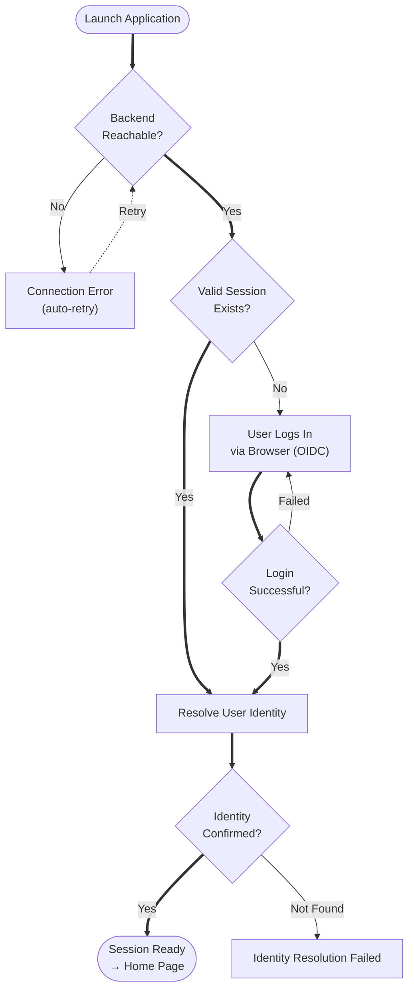

### Compliance Gaps — Authentication

| Gap | Compliance Ref | Impact |
|-----|---------------|--------|
| No eGK/card-based auth | PSDV654 | Card read not supported in TUI — handled by web app |
| No VSDM online verification | KP2-190 | VSDM check not in TUI — requires TI connector integration |
| No certificate-based auth | gematik TI | TI connector auth not in TUI scope |

---

## 2. Patient Browse & Selection

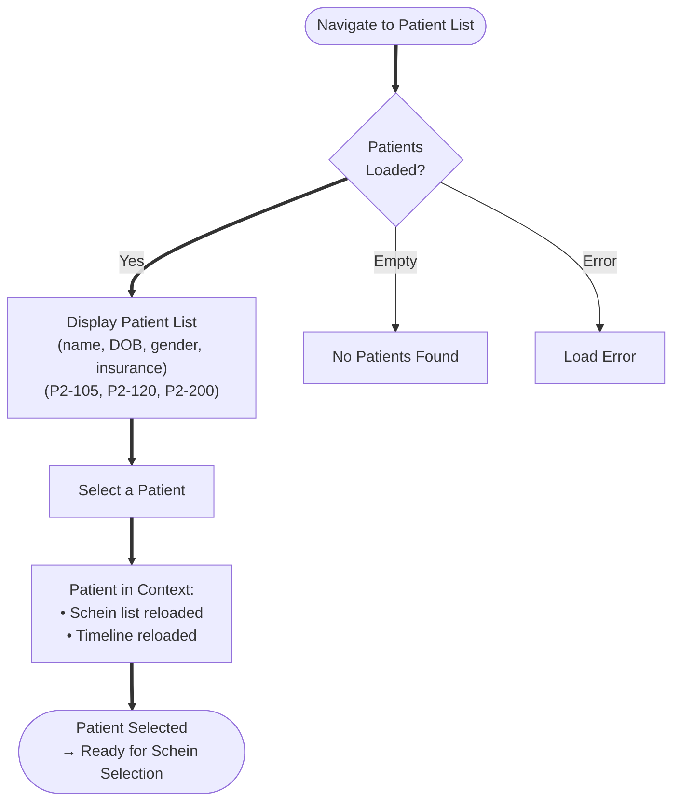

### Compliance Mapping — Patient Data

| What gPRO Shows | Compliance Ref | Status |
|-----------------|---------------|--------|
| Patient name, DOB, gender | KVDT P2-105 (field mapping) | Read-only display |
| Insurance name + number | KVDT P2-120, P2-200 (cost carrier) | Read-only display |
| Patient type (K/P) | KVDT P2-400 (record type) | Read-only display |
| Patient address, phone | KVDT P2-105 | Read-only display |
| Card read date (FK 4109) | KVDT P2-135 | Not displayed |
| VSDM status (FK 4136) | KVDT KP2-190 | Not displayed |
| Coverage validity dates | KVDT P2-140, P2-166 | Not displayed |
| Cost carrier IK/VKNR | KVDT P2-200, P2-260 | Not displayed directly |

---

## 3. Schein Browse & Selection

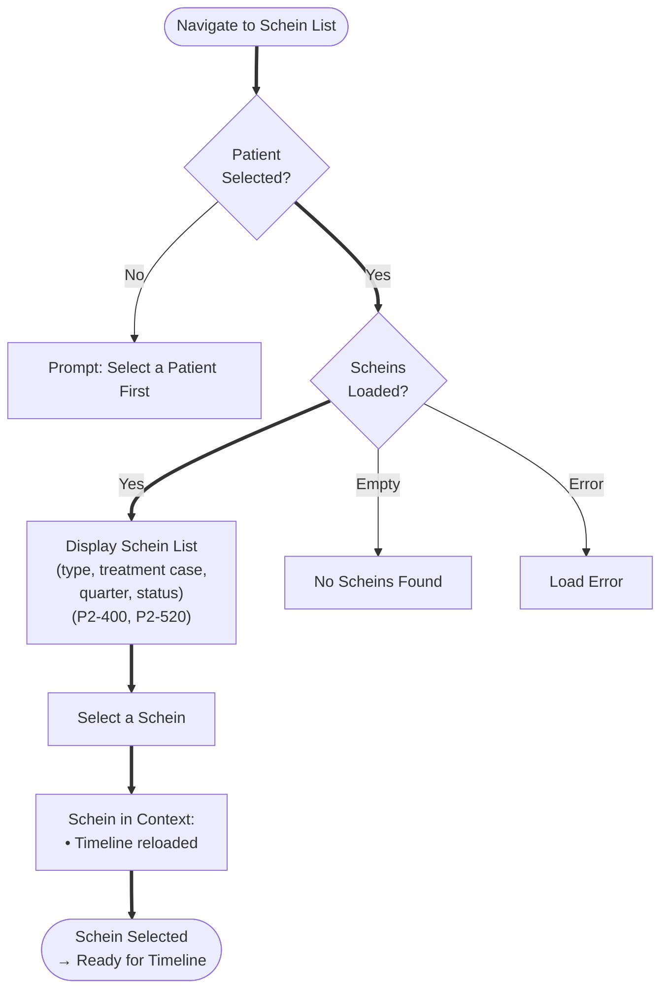

### Compliance Mapping — Schein Data

| What gPRO Shows | Compliance Ref | Status |
|-----------------|---------------|--------|
| Schein type (KV/HZV/FAV/BG/Private/IGEL) | KVDT P2-400 (Satzart) | Read-only display |
| Treatment case type | KVDT P2-400 (Scheinuntergruppe) | Read-only display |
| Quarter/year | KVDT P2-520 (quarter assignment) | Read-only display |
| Billing status | ABRG490 (transmission marking) | Read-only display |
| Creation date | — | Read-only display |
| Record split indicator | KVDT P2-530, P2-535 | Not displayed |
| TSS fields (FK 4103) | KBV TSS (3.13) | Not displayed |
| Referral fields | KVDT Muster 6/10/39 | Not displayed |

---

## 4. Clinical Timeline Browse

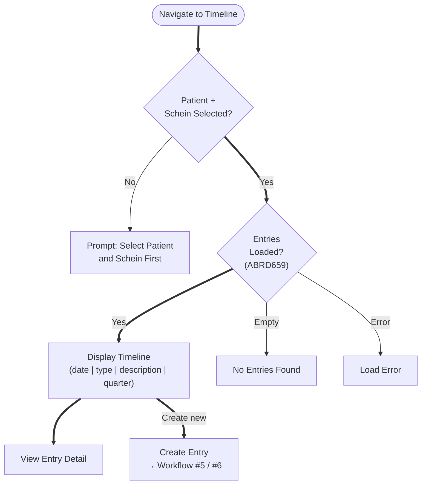

---

## 5. Diagnosis Entry via QuickEntry

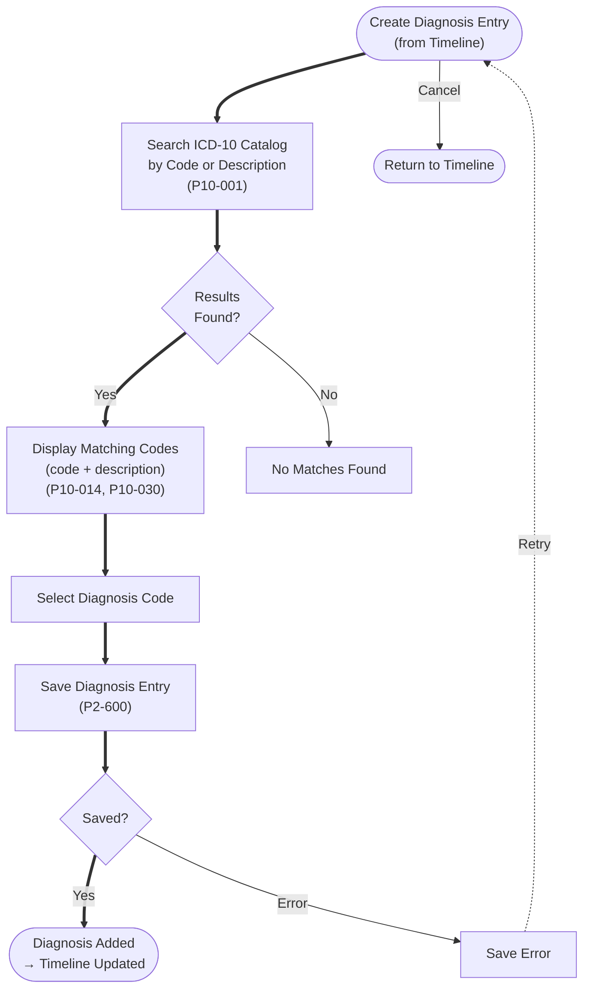

### Compliance Mapping — Diagnosis Entry (V1 KV Scope)

| Compliance Obligation | Ref | gPRO Status |
|-----------------------|-----|-------------|
| ICD-10 code search against SDICD catalog | ICD-GM (3.16) | Implemented |
| Code validity check (exists in catalog) | ICD-GM.26 | [NOT IMPL] No explicit validation — search only returns valid codes |
| Terminal code check (non-terminal prompt) | ICD-GM.26 | [NOT IMPL] No terminal/non-terminal distinction |
| Diagnosensicherheit selection (V/G/A/Z) | ICD-GM.1-4 | [NOT IMPL] Not captured |
| Laterality selection (R/L/B) | ICD-GM.7 | [NOT IMPL] Not captured |
| Gender plausibility check | ICD-GM.14 | [NOT IMPL] |
| Age plausibility check | ICD-GM.15 | [NOT IMPL] |
| Coding rule execution (SDKRW) | ICD-GM.40-47 | [NOT IMPL] |
| Dauerdiagnose carry-forward | ABRD609 | [NOT IMPL] No chronic diagnosis pool |
| Acute-as-permanent warning | ABRD514, ABRD969 | [NOT IMPL] |

---

## 6. Service Entry via QuickEntry

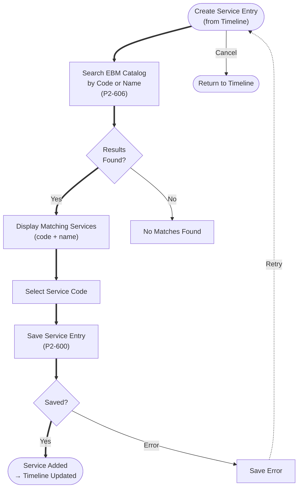

### Compliance Mapping — Service Entry (V1 KV Scope)

| Compliance Obligation | Ref | gPRO Status |
|-----------------------|-----|-------------|
| GNR search against SDEBM catalog | KBV EBM (3.11) | Implemented |
| Gender check | EBM.1 | [NOT IMPL] |
| Age check | EBM.2 | [NOT IMPL] |
| Frequency limit check | EBM.3 | [NOT IMPL] |
| Specialty gate check | EBM.4 | [NOT IMPL] |
| Exclusion check | EBM.5-8 | [NOT IMPL] |
| Code 0000 (Arzt-Patienten-Kontakt) prompt | ABRD456 | [NOT IMPL] |
| Diagnoses per §295 requirement | ABRD608 | [NOT IMPL] |
| OPS code entry | KVDT-SD.OPS | [NOT IMPL] |
| TSS surcharge calculation | KBV TSS (3.13) | [NOT IMPL] |
| Service deletion protection | ABRD607 | [NOT IMPL] |
| Regional service filter | ABRD603 | [NOT IMPL] |

---

## 7. Full Clinical Documentation Session (End-to-End)

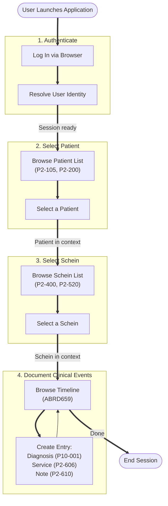

---

## 8–12. Not Implemented Workflows

The following compliance workflows are **not implemented in gPRO** and are handled by the PVS web application or planned for future development.

### 8. Patient Check-In (Card Read) — Not Implemented

**Compliance Source:** PSDV (Card Read), KVDT §2-§4 (Patient Data), ~64 items

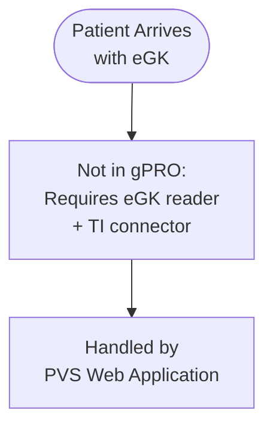

**Key missing capabilities:**
- eGK card read (PSDV654)
- VSDM online verification (KP2-190)
- KVK rejection logic (KP2-121)
- Cost carrier resolution (P2-200, P2-260)
- Field-level controls (KP2-185)
- Insurance change detection (P2-530)

---

### 9. Billing Documentation — Not Implemented

**Compliance Source:** ABRD (46 items), KVDT-SD

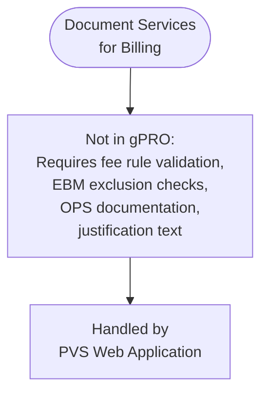

**Key missing capabilities:**
- Code 0000 enforcement (ABRD456)
- Diagnosis per §295 (ABRD608)
- ICD validity check (ABRD679)
- Terminal code enforcement (ABRD611, ABRD612)
- Deletion protection for submitted services (ABRD607)
- KV region filtering (ABRD603)

---

### 10. Billing Submission — Not Implemented

**Compliance Source:** ABRG (45 items)

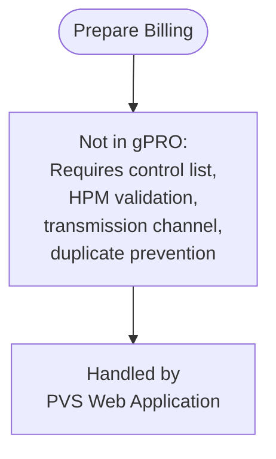

---

### 11. Prescription & Drug Safety — Not Implemented

**Compliance Source:** Crucial Workflows 3.19

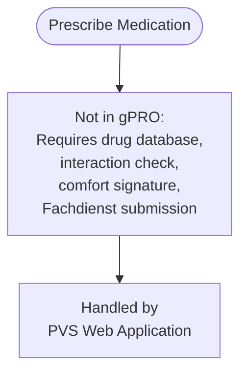

---

### 12. Form Management — Not Implemented

**Compliance Source:** FORM (~25 items)

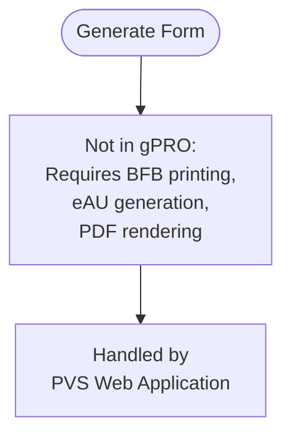

---

## Compliance Coverage Summary (V1 KV Scope)

### By Compliance Source

| Source | Total Items | gPRO Covers | gPRO Partial | Not in gPRO | Notes |
|--------|-------------|-------------|--------------|-------------|-------|
| **KVDT** (Patient Data §2) | ~70 | ~10 | 0 | ~60 | Read-only patient display |
| **KVDT** (Service Data §3) | ~45 | ~5 | 0 | ~40 | Read-only schein display |
| **KVDT** (Billing §4-5) | ~43 | 0 | 0 | ~43 | Not in gPRO scope |
| **ICD-10-GM** | 57 | 1 | 0 | 56 | Basic search only |
| **KBV EBM** | 14 | 1 | 0 | 13 | Basic search only |
| **ABRD** | 46 | 0 | 0 | 46 | Not in gPRO scope |
| **ABRG** | 45 | 0 | 0 | 45 | Not in gPRO scope |
| **Crucial Workflows** | 56 | 0 | 0 | 56 | Not in gPRO scope |
| **PSDV** (Card Read) | ~15 | 0 | 0 | ~15 | Requires hardware |
| **ALLG** | 28 | 0 | 0 | 28 | Not in gPRO scope |
| **FORM** | ~25 | 0 | 0 | ~25 | Not in gPRO scope |
| **GOÄ** | 1 | 0 | 0 | 1 | Not in gPRO scope |
| **KBV TSS** | 1 | 0 | 0 | 1 | Not in gPRO scope |

### gPRO Strengths (What It Does Well)

1. **Authentication** — Full OIDC flow with identity resolution and role mapping
2. **Patient browsing** — Patient list with essential demographic data
3. **Schein browsing** — Schein type/status overview per patient
4. **Timeline browsing** — Chronological entry view
5. **Quick clinical entry** — ICD-10 and EBM catalog search for rapid documentation
6. **Keyboard-driven** — Efficient for power users (doctors/MFAs who prefer keyboard)

### gPRO Gaps (What Needs V1 KV Compliance Work)

| Priority | Gap | Compliance Impact | Effort Est. |
|----------|-----|-------------------|-------------|
| P1 | Diagnosensicherheit (V/G/A/Z) not captured | ICD-GM.1-4: Mandatory for billing | QuickEntry extension |
| P1 | No terminal code enforcement | ICD-GM.26: Non-terminal codes rejected at billing | Validation layer |
| P1 | No EBM rule checks (gender/age/frequency/exclusion) | EBM.1-8: Mandatory for KV billing | Service-side validation |
| P2 | No laterality capture | ICD-GM.7: Required for applicable codes | QuickEntry extension |
| P2 | No code 0000 warning | ABRD456: Revenue protection | Timeline-level check |
| P2 | No coding rule execution (SDKRW) | ICD-GM.40-47: Compliance requirement | New service integration |
| P3 | No Dauerdiagnose management | ABRD609: Carry-forward required for billing | New component |
| P3 | No VSDM/coverage display | KP2-190, P2-140: Visibility gap | Patient detail extension |
