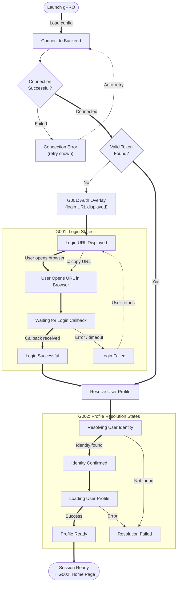
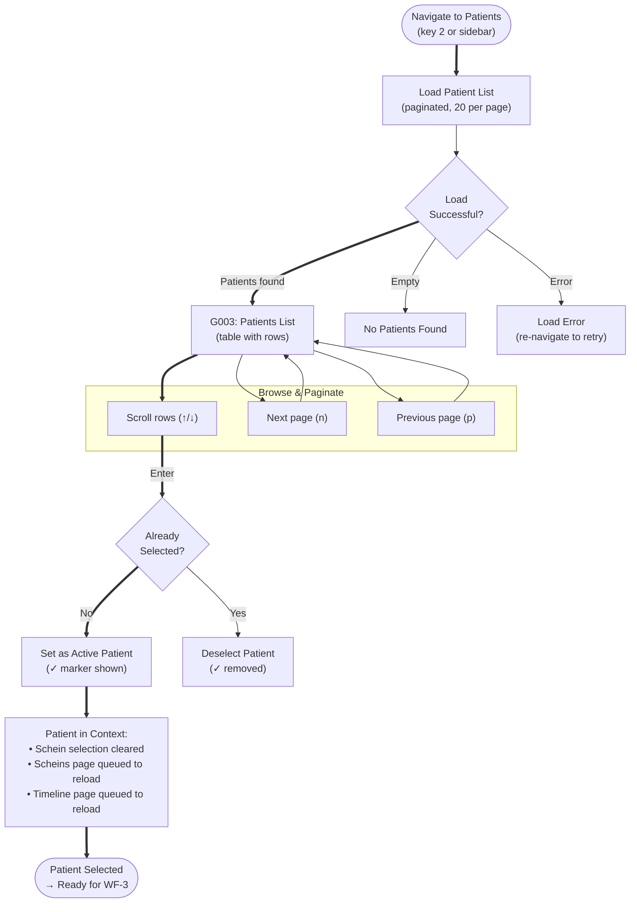
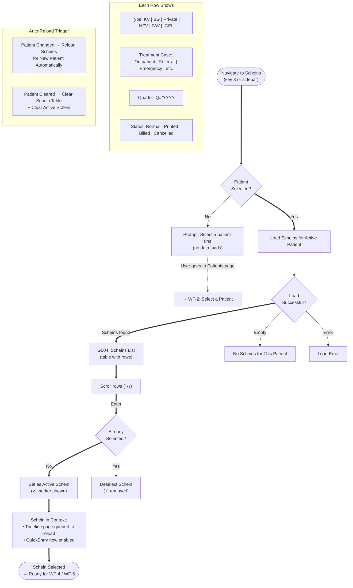
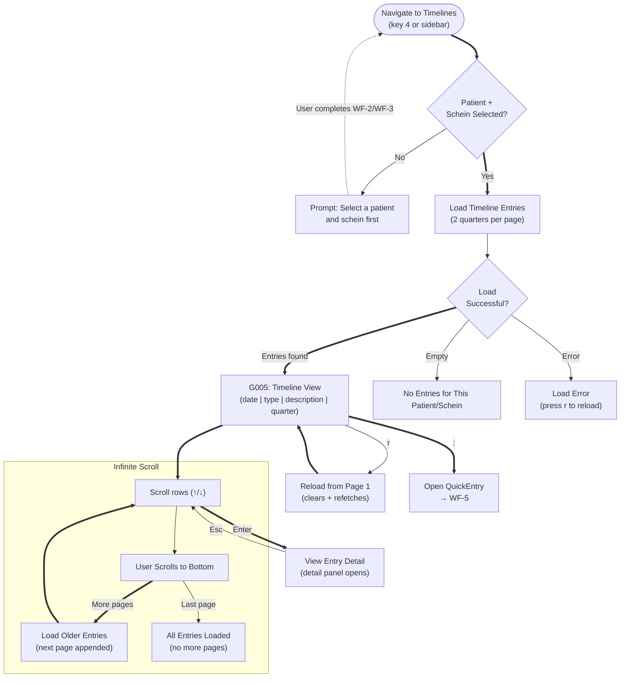
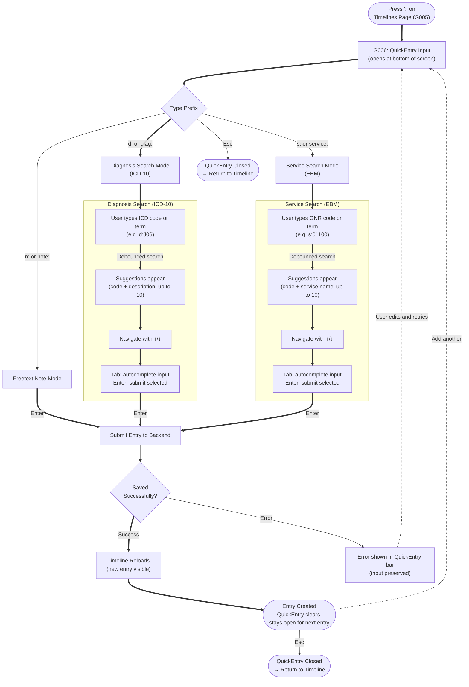
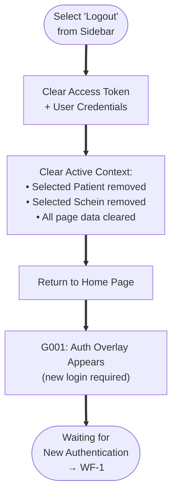
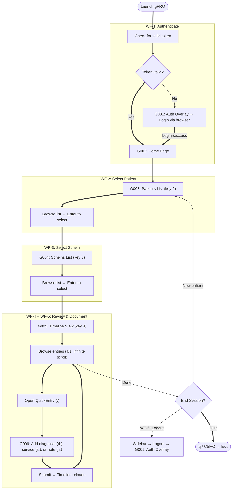

# gPRO (TUI) User Workflow Diagrams

Derived from the gPRO TUI codebase (tini-works/pvs-base-1). Each diagram shows **user goals → steps → decision points → outcomes**. Screens (IA260319-gpro-screen-inventory.md) are derived from these workflows.

**Convention:** `==>` primary/happy path. `-->` alternate path. `-.->` edge case / optional.

---

## Workflow Index

| # | Workflow | Trigger | Role | Screens Required |
|---|---|---|---|---|
| WF-1 | Authentication & Session Setup | App launch, no valid token | All | G001, G002 |
| WF-2 | Select a Patient | User navigates to Patients page | All | G003 |
| WF-3 | Select a Schein | User navigates to Scheins page | All | G004 |
| WF-4 | Browse Timeline Entries | User navigates to Timelines page | All | G005 |
| WF-5 | Create a Timeline Entry | User opens QuickEntry (`:` key) | All | G005, G006 |
| WF-6 | Logout | User triggers Logout from sidebar | All | G001 |

---

## WF-1 — Authentication & Session Setup

**Goal:** Establish a valid, authenticated session so the user can access patient data.

---

## WF-2 — Select a Patient

**Goal:** Set a patient in context so Scheins and Timeline entries can be loaded for them.

---

## WF-3 — Select a Schein

**Goal:** Set a Schein in context so Timeline entries can be scoped to the correct billing record.

---

## WF-4 — Browse Timeline Entries

**Goal:** Review the clinical history for the active patient and schein.

---

## WF-5 — Create a Timeline Entry

**Goal:** Document a clinical event (diagnosis, service, or note) against the active patient and schein.

**Prerequisite:** Patient selected (WF-2) AND Schein selected (WF-3).

---

## WF-6 — Logout

**Goal:** End the current session and return the app to the login state.

---

## End-to-End — Full Clinical Documentation Session

