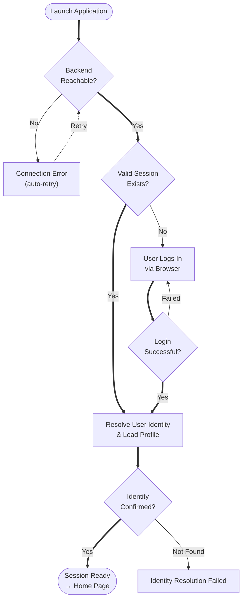
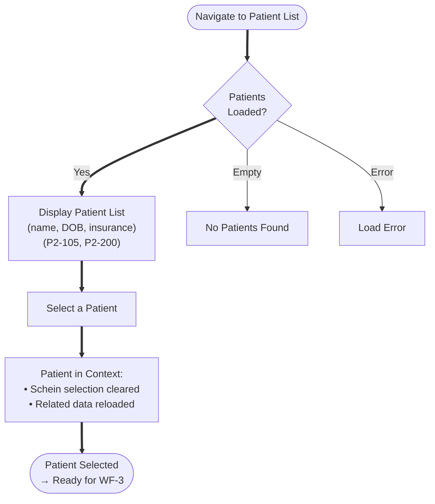
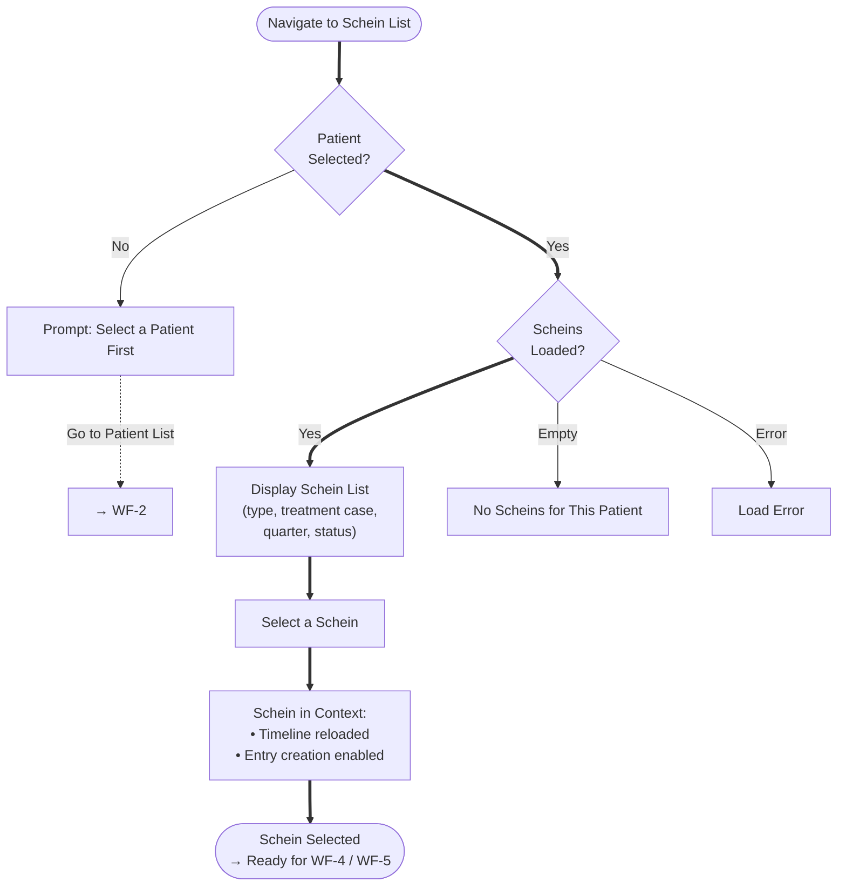
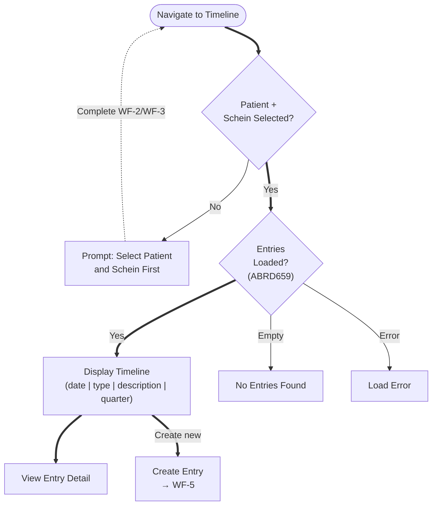
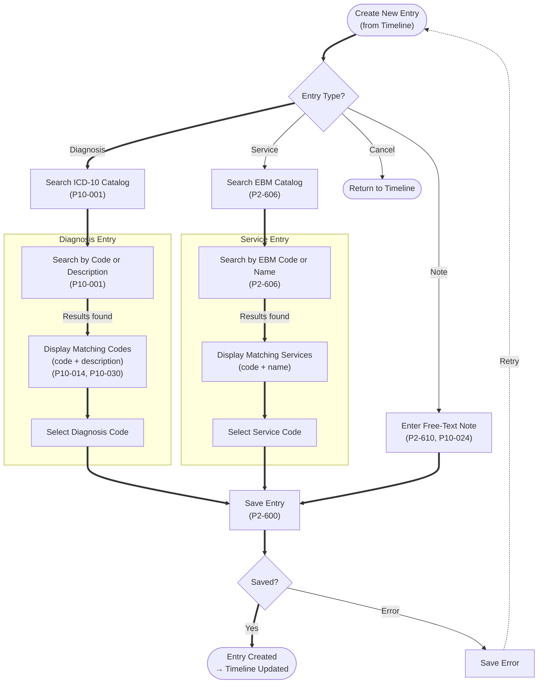
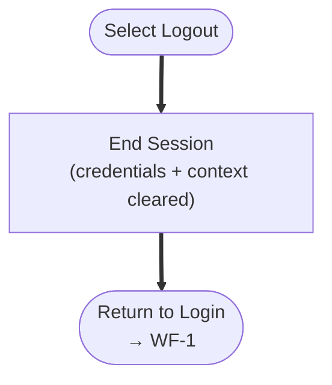

# gPRO Workflows — Compliance-Aligned Translation

Translated from `FLOW260319-gpro-user-workflow-detail.md` (as-built from pvs-base-1 codebase). Each block uses natural language and maps to compliance inventory IDs where applicable.

**Convention:**
- `==>` primary/happy path. `-->` alternate path. `-.->` edge case / optional.
- `(ID)` = compliance inventory reference. Blocks without IDs = no compliance mapping found.
- Only **user goals, decisions, compliance actions, and meaningful outcomes** are shown. UI mechanics (pagination, keyboard shortcuts, scroll behavior) are omitted.

---

## Workflow Index

| # | Workflow | Compliance Areas Touched | Coverage |
|---|---|---|---|
| WF-1 | Authentication & Session Setup | ALLG (general software requirements) | Minimal — infrastructure only |
| WF-2 | Select a Patient | KVDT Patient Data (KP2/P2), PSDV | Partial — read-only display, no card read |
| WF-3 | Select a Schein | KVDT Patient Data (KP2-500, P2-501) | Partial — list/select only, no creation rules |
| WF-4 | Browse Timeline Entries | ABRD659 (patient documentation) | Partial — display only |
| WF-5 | Create a Timeline Entry | ICD-10-GM (P10), KBV EBM (#306-319), KVDT Service (P2-600+), ABRD | Low — basic entry, missing all validation |
| WF-6 | Logout | None | N/A — session management only |

---

## WF-1 — Authentication & Session Setup

**Goal:** Establish a valid session so the user can access patient data.

**Compliance relevance:** Low. Authentication is infrastructure. Some ALLG items apply indirectly (ALLG799 user manual, ALLG824 change documentation).

### Compliance Gaps in WF-1

| Gap | Compliance Ref | Description |
|-----|---------------|-------------|
| No HÄEVG-ID management | ALLG657 | System should manage HÄEVG-ID per physician during profile resolution |
| No VP-ID type management | ALLG1850 | System should manage VP-ID types (GP "H", specialist "F", care team "B") |
| No VP-ID retrieval via HPM | ALLG1851, ALLG1852 | If physician has HÄEVG-ID but no VP-ID, system should retrieve via HPM |

---

## WF-2 — Select a Patient

**Goal:** Set a patient in context so Scheins and Timeline entries can be loaded.

**Compliance relevance:** Medium. gPRO displays patient data read-only (loaded from backend). Does not perform card reading or VSDM verification.

### Compliance Gaps in WF-2

gPRO only displays pre-loaded patient data. All card reading, VSDM, and data entry happen in the web app.

| Gap | Compliance Ref | Description |
|-----|---------------|-------------|
| No eGK/KVK card reading | KP2-100 | Patient data must be capturable from card terminals |
| No legacy KVK rejection | KP2-101, KP2-121 | Legacy KVK must be rejected for statutory insured since 01/2015 |
| No manual data transfer | KP2-102 | Manual transfer from rejected/mobile cards not supported |
| No field-level controls | KP2-185 | Card data fields should distinguish official (read-only) vs user-editable |
| No VSDM online verification | KP2-190 | VSDM proof status (FK 4136) must be captured |
| No VSDM timestamp validation | KP2-191 | Timestamp must be validated against current quarter; under-18 auto fee-exempt |
| No card read date capture | P2-135 | FK 4109 must be auto-captured, read-only |
| No card read date propagation | P2-136, P2-150 | Re-read must update FK 4109 across all billing records |
| No insurance coverage check | P2-140, P2-166 | Coverage validity must be verified; alert if expired |
| No cost carrier resolution | P2-200, P2-210, P2-220, P2-230, P2-260 | Full cost carrier lifecycle (active/dissolved/merged/invalid IK) |
| No duplicate patient prevention | KP2-300 | Must match card data against existing records |
| No insurance change detection | KP2-310, P2-530, P2-535 | Changes must be detected, billing records split |
| No gender/DOB validation | P2-470, P2-430 | All gender options (incl. diverse) and special DOB ranges |
| No postal code validation | P2-460 | PLZ must be validated against master data |
| No KT master data file support | PSDV654 | ehd file support required |

---

## WF-3 — Select a Schein

**Goal:** Set a Schein (billing record) in context so Timeline entries are scoped to the correct billing case.

**Compliance relevance:** Medium. gPRO displays Schein list and types. Does not create Scheins or enforce billing record rules.

### Compliance Gaps in WF-3

| Gap | Compliance Ref | Description |
|-----|---------------|-------------|
| No billing record type selection on first card read | KP2-500 | Satzart 010x selection required on first read per quarter |
| No multiple 010x records management | P2-501 | Multiple billing records per patient per quarter must be supported |
| No TSS case marking | KP2-502, KP2-503 | TSS appointment cases must be marked and maintained separately |
| No TSS referral code capture | KP2-504, KP2-505, KP2-507, KP2-508 | TSS Vermittlungscode, appointment date, referral source |
| No TSS case completion | KP2-509, P2-510 | TSS Fallabschluss and data integrity |
| No TSS surcharge calculation | KP2-513 | Time-graded surcharges (A/B/C/D) based on days between referral and appointment |
| No quarter transition handling | P2-520, P2-521 | Quarter closure, initialization, and case carry-forward |
| No insurance change within quarter | P2-530, P2-535, P2-540 | Billing record split on insurance/status change |
| No referral case processing | KP2-560, KP2-561, KP2-562 | Muster 6/10 referral handling |
| No preventive case marking | ABRD920 | Vorsorge-Behandlungsfall must be flagged |
| No case type assignment | ABRD921, ABRD968 | Treatment case type rules |

---

## WF-4 — Browse Timeline Entries

**Goal:** Review the clinical history for the active patient and schein.

**Compliance relevance:** Low. Read-only display of existing documentation.

### Compliance Gaps in WF-4

| Gap | Compliance Ref | Description |
|-----|---------------|-------------|
| No structured patient documentation display | ABRD659 | Documentation exists as timeline but lacks structured clinical record format |
| No service-to-diagnosis linkage display | P2-609, P10-029 | Timeline shows entries but no explicit linkage between services and diagnoses |
| No audit trail for deletions | P2-603, P10-026 | Deleted entries should be audit-logged |
| No permanent vs acute diagnosis distinction | P10-019, ABRD609 | No visual distinction or carry-forward management |
| No diagnosis certainty display | P10-003 | V/G/A/Z qualifiers not shown on diagnosis entries |
| No laterality display | P10-004 | R/L/B not shown on applicable diagnosis entries |

---

## WF-5 — Create a Timeline Entry

**Goal:** Document a clinical event (diagnosis, service, or note) against the active patient and schein.

**Compliance relevance:** **HIGH.** This is the core clinical documentation workflow. Most compliance gaps are here.

**Prerequisite:** Patient selected (WF-2) AND Schein selected (WF-3).

### Compliance Gaps in WF-5 — Diagnosis Entry

**Critical (billing-blocking):**

| Gap | Compliance Ref | Description |
|-----|---------------|-------------|
| No Diagnosensicherheit (V/G/A/Z) | P10-003, ICD-GM.1-4 | Certainty qualifier must be selectable — KV rejects without it |
| No terminal code enforcement | P10-008, ABRD611, ABRD612 | Non-terminal (group) codes must trigger warning; confirmed diagnoses ('G') require terminal codes |
| No ICD validity check against catalog | P10-002, ABRD679 | Code must be validated against current annual catalog version |
| No diagnoses required per §295 | ABRD608 | At least one diagnosis must be present per billing case |

**Required (audit-relevant):**

| Gap | Compliance Ref | Description |
|-----|---------------|-------------|
| No laterality (R/L/B) | P10-004, ICD-GM.7 | Laterality must be selectable for applicable codes |
| No cross-reference codes (Kreuz-Stern) | P10-005 | Dagger/asterisk pairing must be supported |
| No exclamation mark code validation | P10-006 | Cannot stand alone — requires primary code |
| No gender plausibility check | P10-010, ICD-GM.14 | Gender-specific codes must be validated against patient |
| No age plausibility check | P10-011, ICD-GM.15 | Age-specific codes must be validated against patient |
| No coding rules (SDKRW) execution | KP10-018, ICD-GM.40-47 | Cross-reference warnings must be applied |
| No SDICD validation | KP10-016 | SDICD rules must be applied during entry |
| No retired/deleted code handling | P10-009 | Retired codes must flag with replacement suggestion |
| No permanent diagnosis management | P10-019, P10-020, ABRD609 | Permanent vs acute distinction and quarter carry-forward |
| No acute-as-permanent warning | P10-021, ABRD514, ABRD969 | Warning when acute diagnosis marked as permanent |
| No suspected diagnosis review | P10-022, ABRD887 | Warning when 'V' persists across multiple quarters |
| No 'Z' marker warning for acute | ABRD786 | 'Z' (Zustand nach) must not be used for acute diseases |
| No UUU restriction | P10-028, ABRD613 | "UUU" only with Auftragsleistung |
| No diagnosis date capture | P10-023 | Date must be captured and validated |
| No diagnosis deletion audit | P10-026 | Deletion must be audit-logged |
| No diagnosis-to-service linkage | P10-029, P2-609 | Explicit linkage for billing justification |
| No code 0000 (APK) prompt | ABRD456 | System must prompt when no Arzt-Patienten-Kontakt code |

### Compliance Gaps in WF-5 — Service Entry

**Critical (billing-blocking):**

| Gap | Compliance Ref | Description |
|-----|---------------|-------------|
| No EBM gender check | #306 (KBV EBM) | Gender-restricted codes must warn on wrong patient gender |
| No EBM age check | #307 (KBV EBM) | Age-restricted codes must warn when outside range |
| No EBM frequency limit | #308 (KBV EBM) | Frequency limits per reference period must be enforced |
| No EBM exclusion rules | #314 (KBV EBM), P2-607 | Same-day/same-case exclusions must be validated |
| No ICD prerequisite check | #309 (KBV EBM) | Services requiring ICD must block without diagnosis |

**Required (audit-relevant):**

| Gap | Compliance Ref | Description |
|-----|---------------|-------------|
| No KV region filter | ABRD603, KP6-809 | Service lookup must filter by KV region |
| No IK assignment filter | ABRD606 | Service lookup must filter by IK |
| No IK group filter | ABRD830 | Service lookup must filter by IK group |
| No doctor specialty gate | #317 (KBV EBM), EBM.4 | Doctor specialty must match EBM code requirements |
| No service time capture | P2-601 | Time-based codes require time documentation |
| No service frequency documentation | P2-602 | Mehrfacherbringung must be documentable |
| No service deletion audit | P2-603 | Deletion must be audit-logged with reason |
| No OPS code support | ABRD991, ABRD992, P2-617 | OPS codes mandatory when applicable, validity checked |
| No material cost documentation | ABRD994, P2-618 | Sachkosten with manufacturer/supplier details |
| No billing justification text | ABRD995, P2-619 | Required for flagged services |
| No service deletion protection | ABRD607 | Submitted services must be protected from deletion |
| No contract-specific service catalog | ABRD602, KP6-801 | Services must be filtered by contract |
| No substitute doctor marking | #313 (KBV EBM), KP6-800 | Substitute LANR required |
| No TSS surcharge calculation | #321 (KBV TSS), KP2-513 | A/B/C/D surcharges based on appointment timing |
| No EBM point value display | P2-620 | Service point values from current catalog |
| No service prerequisites check | P2-608 | Voraussetzungen must be checked |

---

## WF-6 — Logout

**Goal:** End the current session and return to login.

**Compliance relevance:** None. Session management only.

### Compliance Gaps in WF-6

None identified. Session management is not directly covered by compliance obligations.

---

## Consolidated Gap Summary

### By Priority

| Priority | Count | Description |
|----------|-------|-------------|
| **Critical (billing-blocking)** | 9 | Without these, entries will be rejected at KV billing |
| **Required (audit-relevant)** | 30+ | Missing = Prüfmodul warnings during billing |
| **Infrastructure (web app scope)** | 60+ | Card reading, VSDM, billing submission — outside gPRO |

### By Workflow

| Workflow | Compliance IDs Mapped | Gaps Found | Severity |
|----------|----------------------|------------|----------|
| WF-1 Auth | 0 mapped | 3 (ALLG) | Low |
| WF-2 Patient | ~4 display-only | 15+ | Medium — all entry/validation missing |
| WF-3 Schein | ~2 display-only | 11+ | Medium — no creation/TSS/quarter rules |
| WF-4 Timeline | ~1 (ABRD659) | 6 | Medium — no structured display |
| WF-5 Entry | ~5 (basic search/entry) | **40+** | **HIGH — core gaps here** |
| WF-6 Logout | 0 | 0 | None |

### What This Means for CorePVS

1. **pvs-base-1 (gPRO) covers ~3% of V1 KV compliance** — mostly basic search and display
2. **WF-5 (Create Entry) is the highest-value reuse target** — the search/select/submit pattern exists, but needs a validation layer added between selection and submission
3. **WF-2 and WF-3 patterns are reusable** — list/select/context-setting works, but needs card reading and data entry added upstream
4. **WF-1 and WF-6 are reusable as-is** — authentication and logout have no compliance requirements beyond infrastructure
5. **File B (master compliance workflows) remains the blueprint** — this file only audits what pvs-base-1 does today
