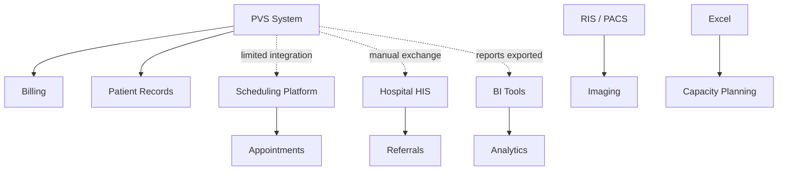
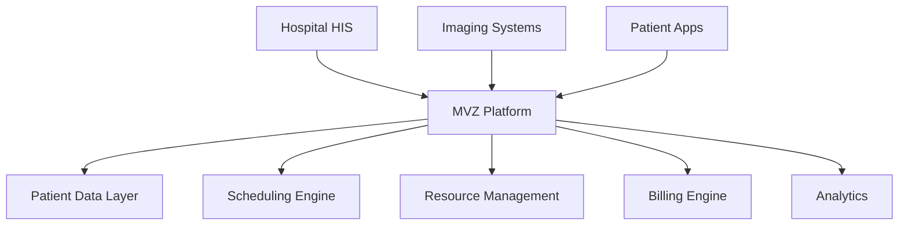
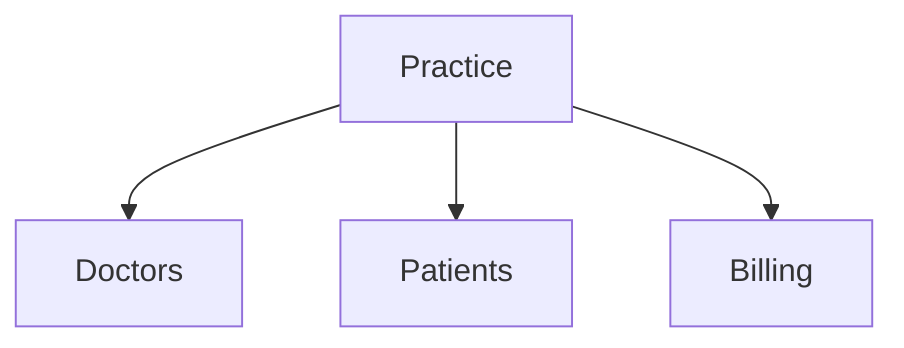
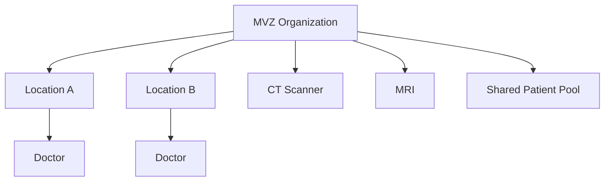

# Hospital Information System (HIS), Emergency Department (ED), PVS and MVZ
Healthcare System Knowledge Overview

---

# 1. Hospital Information System (HIS)

A **Hospital Information System (HIS)** is the central digital platform used to manage the operational, administrative, and clinical workflows of a hospital.

It acts as the **core infrastructure for handling patient data and coordinating healthcare services across departments**.

## Key Functions

- Patient registration and demographics
- Appointment scheduling
- Electronic Medical Records (EMR)
- Laboratory order management
- Radiology order management
- Pharmacy management
- Billing and insurance processing
- Bed and ward management
- Clinical documentation
- Reporting and analytics

## Typical HIS Ecosystem

HIS usually connects with several specialized subsystems:

- EMR/EHR – Electronic medical records
- LIS – Laboratory Information System
- RIS – Radiology Information System
- PACS – Imaging storage and retrieval
- Pharmacy systems
- Billing modules

## Simplified HIS Architecture

```
                +-----------------------+
                |   Hospital HIS Core   |
                +-----------------------+
                         |
      -------------------------------------------------
      |           |            |            |          |
     EMR         LIS          RIS          PACS      Billing
```

---

# 2. Emergency Department (ED)

The **Emergency Department (ED)** is the hospital unit responsible for **treating urgent and acute medical conditions**.

It is usually the **primary entry point for unscheduled patient visits**.

Alternative terms:

- ER – Emergency Room
- A&E – Accident & Emergency

## Typical ED Cases

- Trauma / accidents
- Heart attack
- Stroke
- Severe infections
- Acute abdominal pain
- Breathing difficulties

## Typical ED Patient Flow

```
Patient arrives
      ↓
Registration (HIS)
      ↓
Triage assessment
      ↓
Emergency physician evaluation
      ↓
Diagnostics (Lab / CT / X-ray)
      ↓
Decision
   → Discharge
   → Outpatient referral
   → Hospital admission
```

## Triage Levels Example

| Level | Meaning |
|------|--------|
| 1 | Immediate life threat |
| 2 | Very urgent |
| 3 | Urgent |
| 4 | Less urgent |
| 5 | Non‑urgent |

---

# 3. How HIS and ED Work Together

The **Emergency Department operates within the HIS environment**.

All patient interactions and diagnostics are recorded in the HIS.

```
Patient arrives at ED
      ↓
Registration in HIS
      ↓
Triage recorded
      ↓
Doctor orders diagnostics
      ↓
Lab / Imaging results returned
      ↓
Treatment decision
```

---

# 4. Cross‑Sector Data Exchange (Hospital ↔ Outpatient)

Modern healthcare systems increasingly exchange data between hospital systems and outpatient systems.

Example flow:

```
Patient arrives at hospital ED
      ↓
Initial assessment in HIS
      ↓
Referral to outpatient center
      ↓
Patient record shared
      ↓
Diagnostics performed
      ↓
Results returned
```

Common interoperability standards:

- HL7
- FHIR
- DICOM

---

# 5. Key System Concepts

| Concept | Type | Description |
|-------|------|-------------|
| HIS | System | Core hospital software platform |
| ED | Department | Emergency care unit |
| EMR/EHR | Clinical system | Patient medical record |
| PVS | Practice system | Outpatient practice management system |

---

# 6. Difference Between PVS and MVZ

Understanding **PVS** and **MVZ** is essential for outpatient healthcare systems in Germany.

| Term | Type | Meaning |
|---|---|---|
| PVS | Software | Practice management software |
| MVZ | Organization | Multi‑doctor outpatient medical center |

---

# 7. PVS (Praxisverwaltungssystem)

A **PVS** is software used to manage the operations of outpatient clinics.

## Core Capabilities

- Patient registration
- Appointment scheduling
- Clinical documentation
- Billing (EBM / GOÄ)
- Prescription management
- Lab orders
- Referral management

## Typical Workflow

```
Patient
  ↓
Registration
  ↓
Appointment
  ↓
Consultation
  ↓
Documentation
  ↓
Billing
```

---

# 8. MVZ (Medizinisches Versorgungszentrum)

An **MVZ** is a medical care center where multiple doctors and specialties operate together.

Typical characteristics:

- Multiple specialties
- Multiple doctors
- Shared devices
- Central management
- Sometimes multiple locations

## Example MVZ Structure

```
MVZ
 ├ Radiology
 ├ Surgery
 ├ Internal Medicine
 └ Dermatology
```

---

# 9. Relationship Between PVS and MVZ

An **MVZ uses a PVS system to operate daily workflows**.

```
MVZ (organization)
      ↓
uses
      ↓
PVS (software system)
```

Example interaction:

```
Patient → MVZ → PVS
                 ├ Appointment system
                 ├ Patient record
                 └ Billing
```

---

# 10. Why This Matters for Healthcare Software

MVZ structures create complexity that traditional single‑practice systems struggle to manage.

| MVZ Complexity | Software Requirement |
|---|---|
| Multiple locations | Multi‑site scheduling |
| Multiple specialties | Cross‑specialty workflows |
| Shared devices | Resource optimization |
| Central management | Operational dashboards |

Healthcare platforms increasingly position themselves as:

**“The PVS that masters MVZ complexity.”**

---

# 11. Simple Mental Model

```
Hospital
   ↓ uses
HIS

MVZ / Clinic Network
   ↓ uses
PVS
```

---

**Summary**

- **HIS** manages hospital operations.
- **ED** is the emergency treatment department inside hospitals.
- **PVS** manages outpatient clinic operations.
- **MVZ** is a multi‑doctor outpatient organization that uses a PVS.

---

# 12. MVZ Software Ecosystem Map

MVZs rarely operate on a **single system**.  
Instead they run a **fragmented stack of specialized software**.

## Typical MVZ Software Stack

| Layer | System Type | Example Vendors | Function |
|---|---|---|---|
| Patient administration | PVS | CGM, medatixx, T2med | Patient data, billing |
| Appointment scheduling | Scheduling SaaS | Doctolib, samedi | Appointment booking |
| Imaging workflow | RIS / PACS | Dedalus, Sectra | Radiology workflow |
| Hospital integration | HIS | ORBIS, i.s.h.med | Inpatient ↔ outpatient |
| Document exchange | TI / KIM | gematik infrastructure | eAU, eArztbrief |
| Data analytics | BI tools | Tableau, Power BI | Management dashboards |
| Resource planning | Custom spreadsheets | Excel | Capacity planning |
| Referral management | Email / fax / manual | — | Hospital referrals |

## Current MVZ Architecture (Reality)



### Key Characteristics

- Systems connected by **manual exports**
- **Duplicate patient records**
- Limited interoperability
- No operational overview across locations

## Resulting Operational Problems

| Problem | Cause |
|---|---|
| Overbooked doctors | scheduling isolated from clinical capacity |
| Idle devices | no cross-location optimization |
| Duplicate examinations | missing shared records |
| Lost referrals | manual communication |
| Invisible performance metrics | no aggregated data |

---

# 13. Emerging Architecture Trend (Future MVZ Platforms)

Healthcare IT is moving toward **platform-based architectures**.

Instead of isolated tools:



### Key Differences

| Legacy | Platform |
|---|---|
| location-centric | organization-centric |
| static workflows | dynamic orchestration |
| isolated modules | shared data layer |

---

# 14. Strategic Paper — Why MVZ Needs a New PVS Architecture

## Background

Germany has seen rapid growth in **MVZ organizations**.

| Feature | Impact |
|---|---|
| Multiple locations | distributed operations |
| Multiple specialties | complex scheduling |
| Shared patients | unified records required |
| Shared resources | optimization needed |

Traditional PVS systems were designed for:

**one doctor, one practice, one location**

---

## Structural Mismatch

### Legacy PVS Model



Works well for:

- small practices
- stable teams
- fixed locations

### MVZ Reality



Complexity increases:

- doctors rotate
- patients move between sites
- devices must be shared
- scheduling affects billing

---

## The Three Missing Layers

Existing PVS systems implement only **clinical administration**.

| Layer | Capability |
|---|---|
| Clinical | documentation, coding |
| Administrative | billing, insurance |
| Operational | scheduling, resource planning |
| Strategic | analytics and management |

Current PVS systems stop at **layer 2**.

---

## Consequences of Legacy Architecture

| Issue | Example |
|---|---|
| Idle resources | CT scanner unused while another location overloaded |
| Long waiting times | demand not redistributed |
| No operational insight | leadership cannot see system-wide metrics |
| Duplicate diagnostics | patient data not shared |

---

## Opportunity

This gap creates space for a **new category of software**.

Not just a PVS.

A **Healthcare Operations Platform**.

---

## Strategic Positioning

Traditional PVS: Practice management software

Next-generation system: **MVZ Operating System**

### Traditional PVS vs. MVZ Operating System

| Aspect              | **Traditional PVS**          | **MVZ Operating System (Next-gen)**          |
| ------------------- | ---------------------------- | -------------------------------------------- |
| Core role           | Practice management tool     | Organization-wide orchestration platform     |
| Scope               | Single practice (1 location) | Entire MVZ (multiple locations, specialties) |
| Focus               | Admin + clinical workflows   | Operations + optimization + management       |
| Data model          | Per practice                 | Shared across organization                   |
| Scheduling          | Local calendar               | Cross-location scheduling                    |
| Resource management | Not supported                | Doctors + devices optimized across sites     |
| Analytics           | Basic reporting              | Real-time operational dashboard              |
| Decision support    | Minimal                      | Active recommendations                       |


---

## Key Insights from Source Documents

*Extracted from [HIS ED- MVZ PVS Core Knowledge.md](./_HIS ED-MVZ PVS Knowledge.md) and [RSYN260320-competitive-landscape.md](../../discover/RSYN260320-competitive-landscape.md). These are validated observations, not open questions — they inform the questions above.*

### Current MVZ Reality

- Systems connected by **manual exports** — no real-time data flow between tools
- **Duplicate patient records** across systems — patient registered separately in PVS, scheduling platform, HIS
- Limited interoperability between PVS, scheduling, imaging, and hospital systems
- **No operational overview across locations** — leadership flies blind
- MVZs run **7-8 disconnected systems**: PVS, Doctolib/samedi, RIS/PACS, HIS, TI/KIM, BI tools, Excel, email/fax
- **Excel is the capacity planning tool** — no purpose-built alternative exists
- **Fax and email are the referral management system** — no structured handoff between hospital and MVZ

### Operational Problems Caused by Fragmentation

| Problem | Root Cause |
|:--|:--|
| Overbooked doctors | Scheduling isolated from clinical capacity |
| Idle devices (CT/MRI) | No cross-location optimization |
| Duplicate examinations | Missing shared patient records |
| Lost referrals | Manual communication (fax, phone, email) |
| Invisible performance metrics | No aggregated data across locations |
| Long waiting times | Demand not redistributed across sites |

### Structural Mismatch

- Legacy PVS designed for **one doctor, one practice, one location**
- MVZ reality: **doctors rotate, patients move between sites, devices are shared, scheduling affects billing**
- Legacy PVS lacks an **organization layer above locations** — this is an architectural limitation, not a missing feature

### The Four-Layer Model

| Layer | Capability | Current PVS Coverage |
|:--|:--|:--|
| Clinical | Documentation, coding | Yes |
| Administrative | Billing, insurance | Yes |
| Operational | Scheduling, resource planning | **No** |
| Strategic | Analytics, management dashboards | **No** |

Current PVS systems stop at layer 2. Layers 3-4 are the unoccupied space.

### Competitive Gap

- Most PVS vendors (CGM, medatixx, tomedo, Epikur, T2med) claim MVZ support but only offer: multi-BSNR locations, partial shared patient data, central billing, per-location user access
- **True MVZ orchestration is missing**: cross-location scheduling, shared resource optimization, device capacity balancing, organization dashboards, cross-location analytics
- Cross-sector threats (Doctolib, Dedalus, Nexus, Doctena) have **network orchestration but lack certified PVS billing**
- MVZ sits **between hospital HIS and outpatient PVS** — neither domain fully serves it

### Emerging Direction

- Healthcare IT moving toward **platform-based architectures**: organization-centric (not location-centric), dynamic orchestration (not static workflows), shared data layer (not isolated modules)
- The opportunity is not "a better PVS" but a **new category**: Healthcare Operations Platform / MVZ Operating System
