# PVS-Core User Workflow Diagrams (Detailed)

Derived from the Master Screen Inventory (88 surfaces). Unlike the roadmap-based diagram, this version includes **state transitions, decision points, and component interactions** within each surface.

---

## 1. MFA — Patient Check-In & Registration

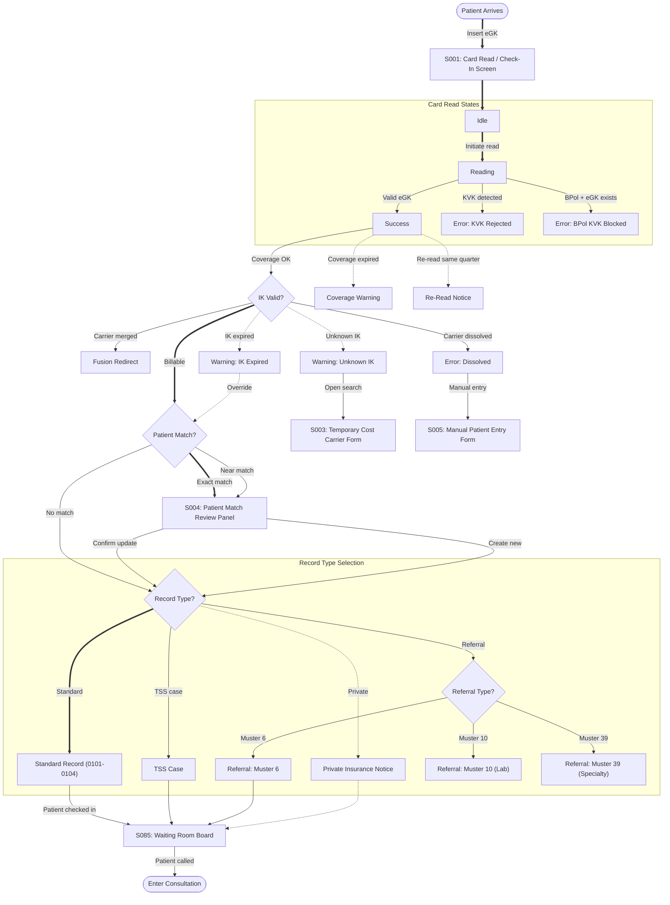

---

## 2. MFA — Patient Check-In (Alternate Paths)

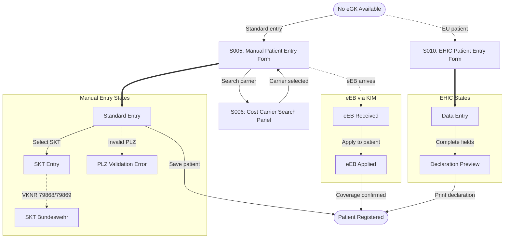

---

## 3. MFA — Insurance & Enrollment (HZV/FAV)

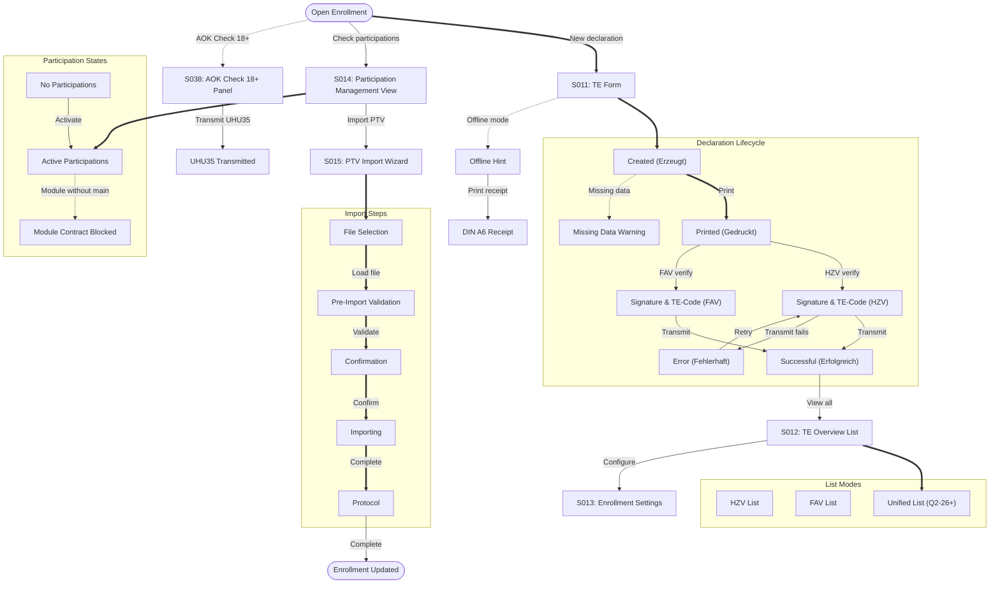

---

## 4. MFA — Forms & Certificates

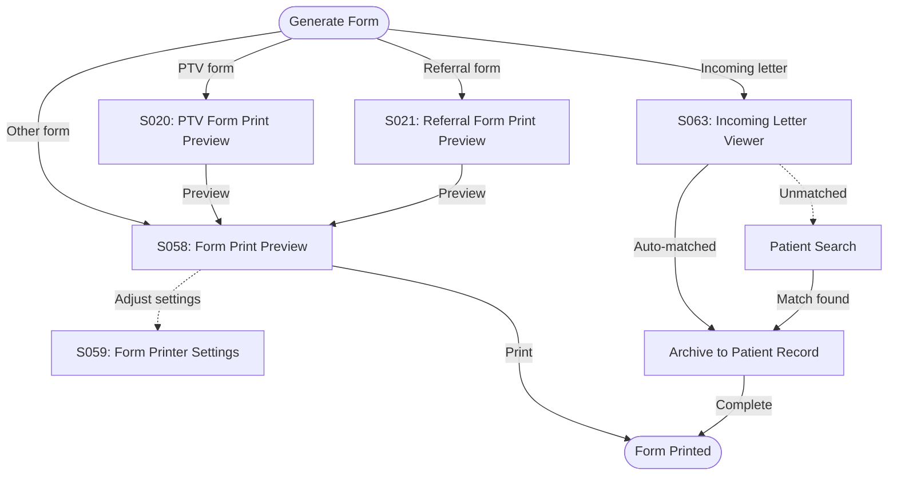

---

## 5. Doctor — Clinical Documentation

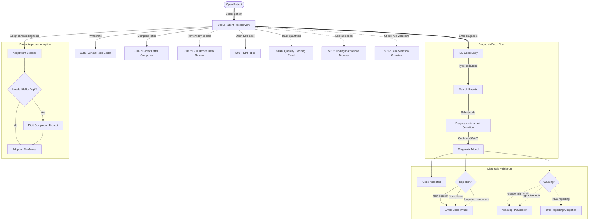

---

## 6. Doctor — Service & Billing Documentation

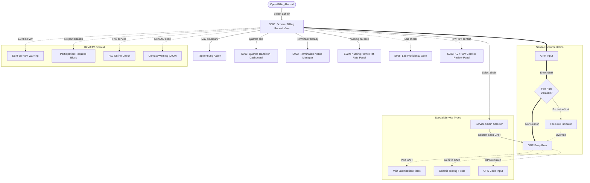

---

## 7. Doctor — Prescriptions (E-Rezept)

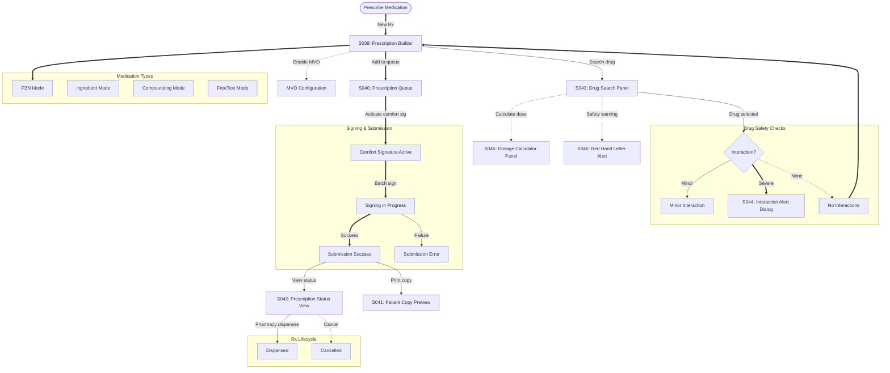

---

## 8. Doctor — Prescriptions (Specialty)

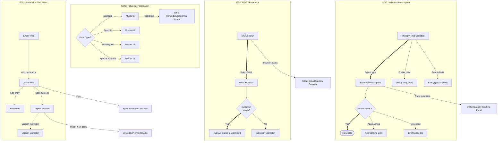

---

## 9. Doctor — Forms & Certificates

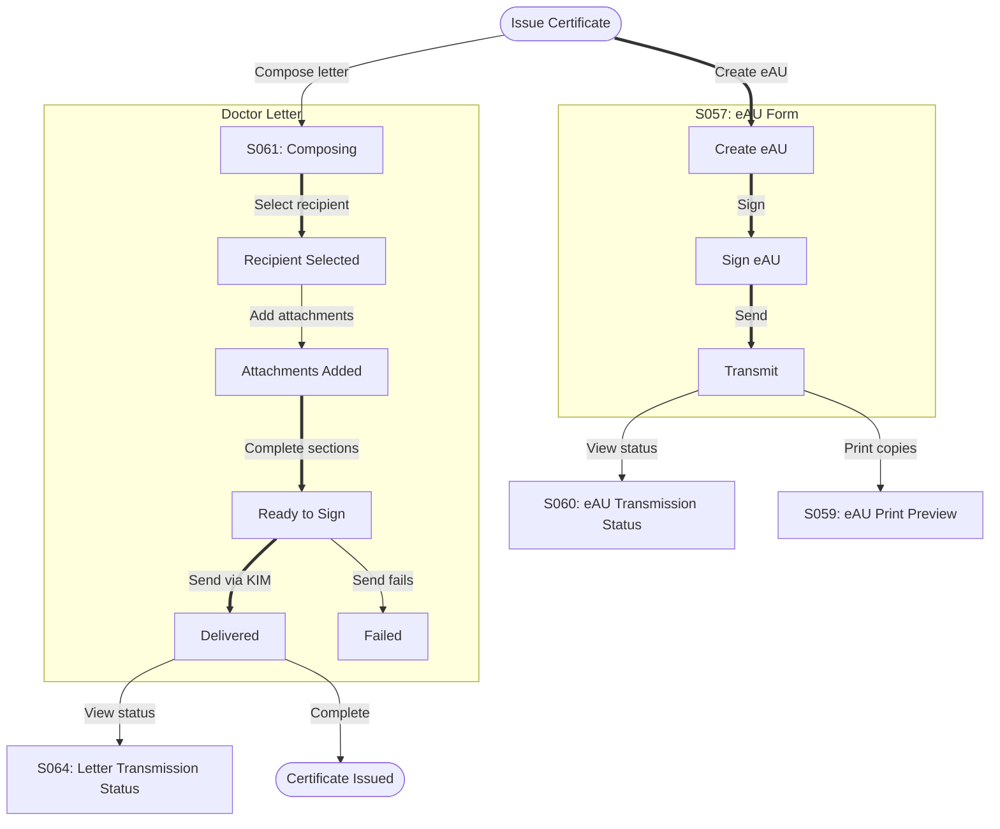

---

## 10. Doctor — Chronic Care Programs

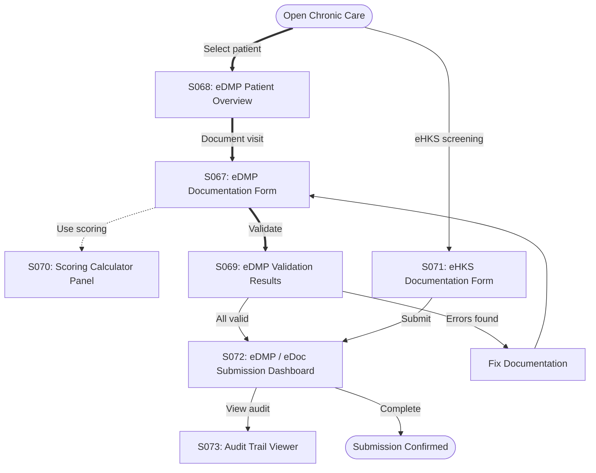

---

## 11. Doctor — Billing & Submission

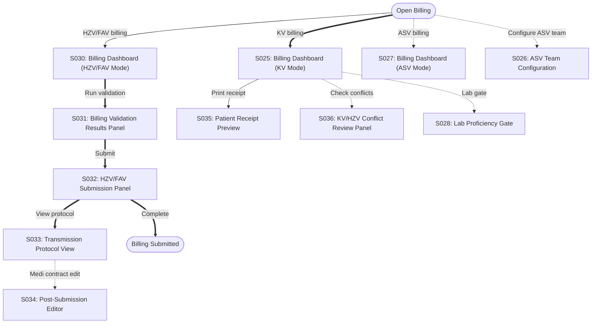

---

## 12. Doctor — ePA & Document Exchange

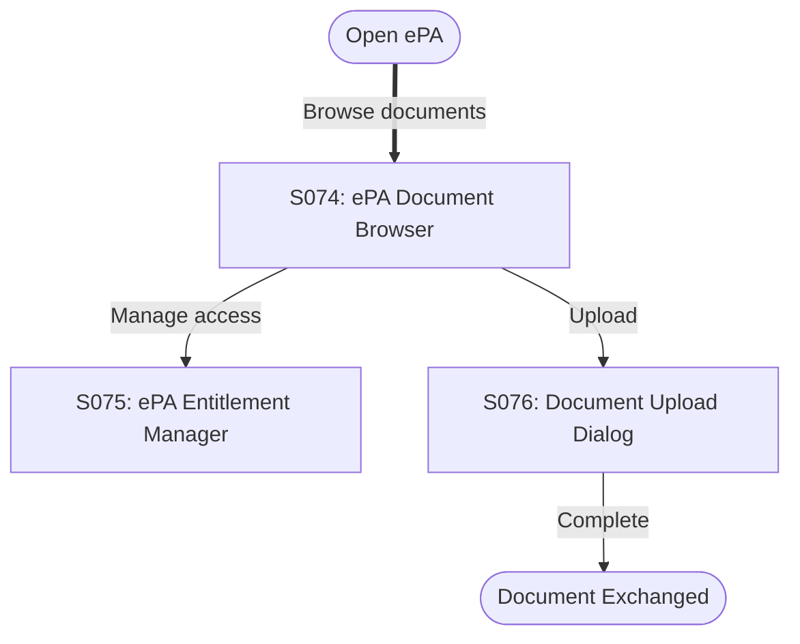

---

## 13. Admin — Practice Administration

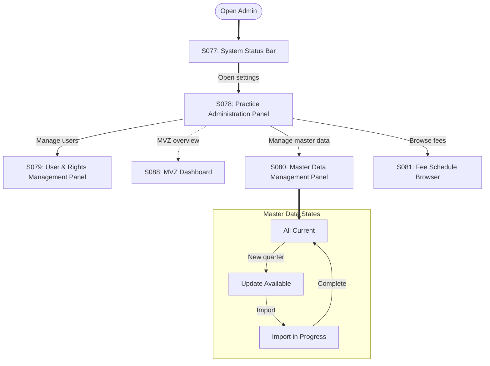

---

## 14. Admin — System Infrastructure

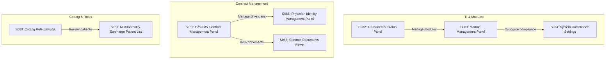

---

## 15. Admin — Data Import & Sync

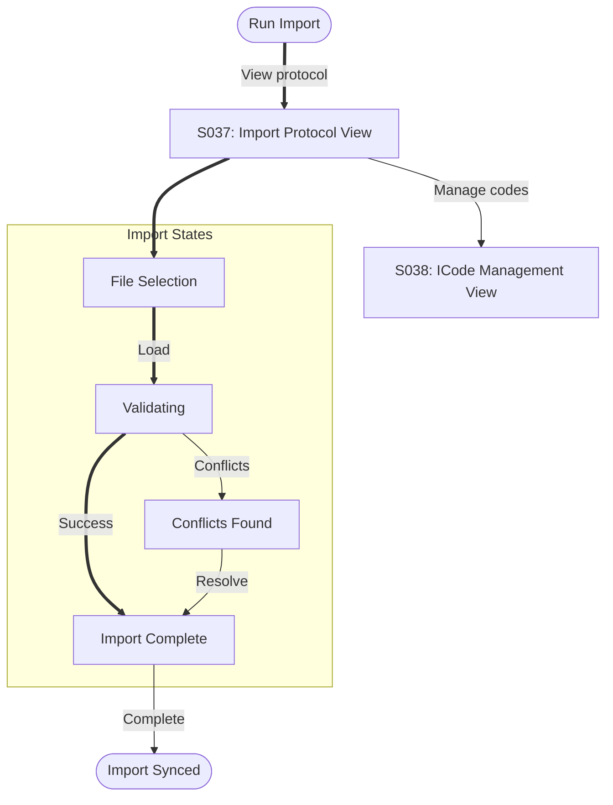
