# PVS-Core User Workflow Diagrams

Derived from the Design Roadmap (88 surfaces). Organized by **role** and **workflow**, showing how screens connect in each user journey.

---

## 1. MFA — Patient Check-In & Registration

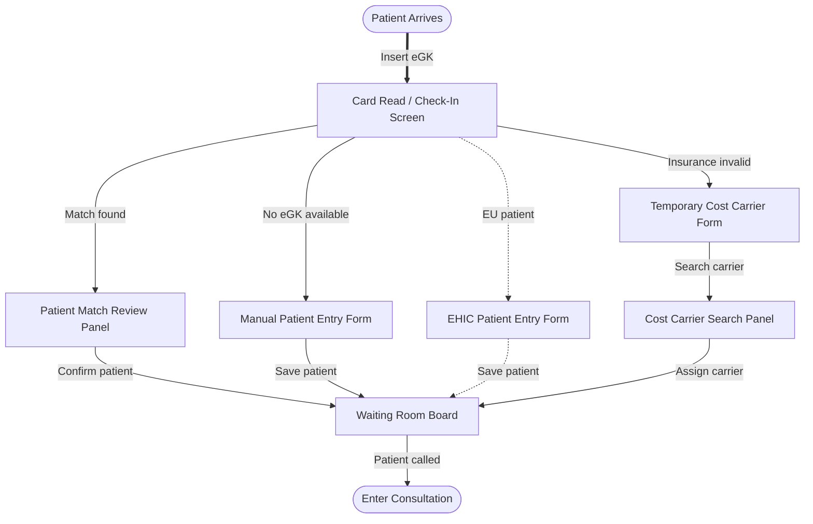

---

## 2. MFA — Insurance & Enrollment (HZV/FAV)

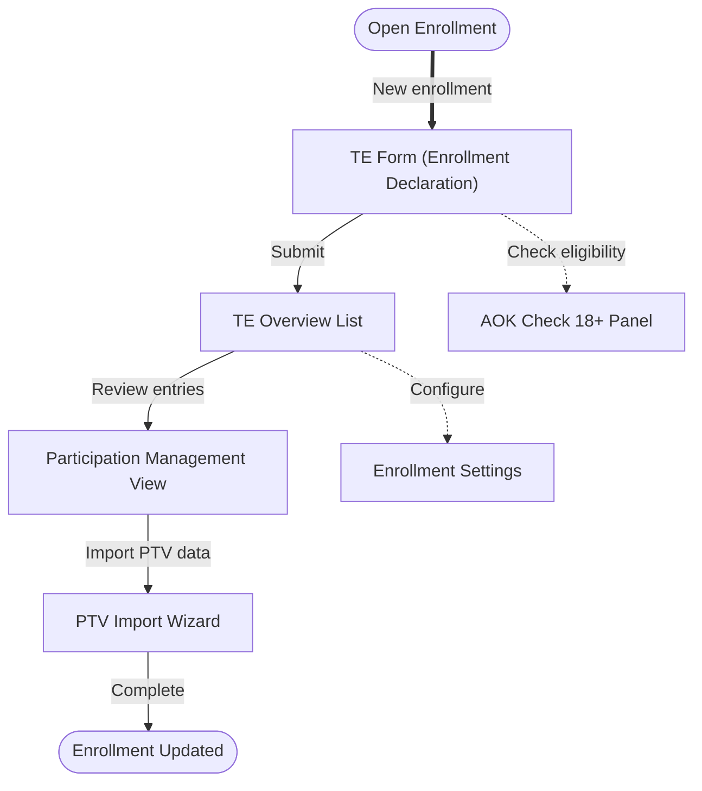

---

## 3. MFA — Forms & Certificates

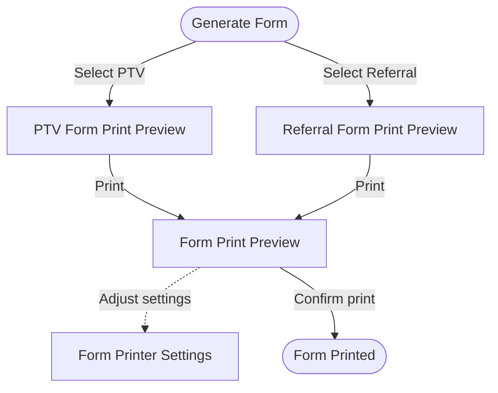

---

## 4. Doctor — Clinical Documentation

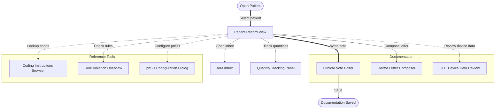

---

## 5. Doctor — Service & Billing Documentation

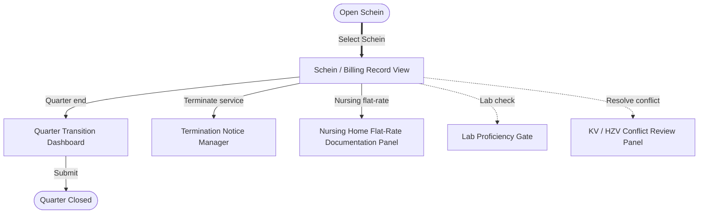

---

## 6. Doctor — Prescriptions (Core)

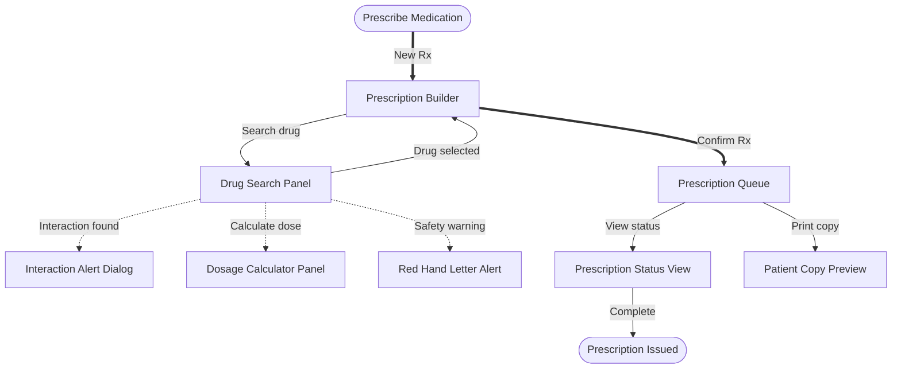

---

## 7. Doctor — Prescriptions (Specialty)

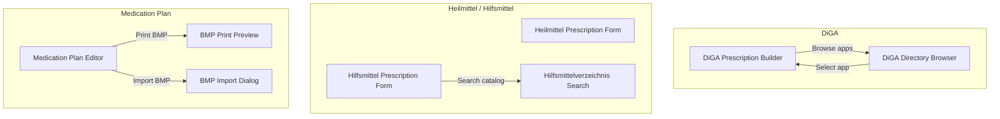

---

## 8. Doctor — Forms & Certificates

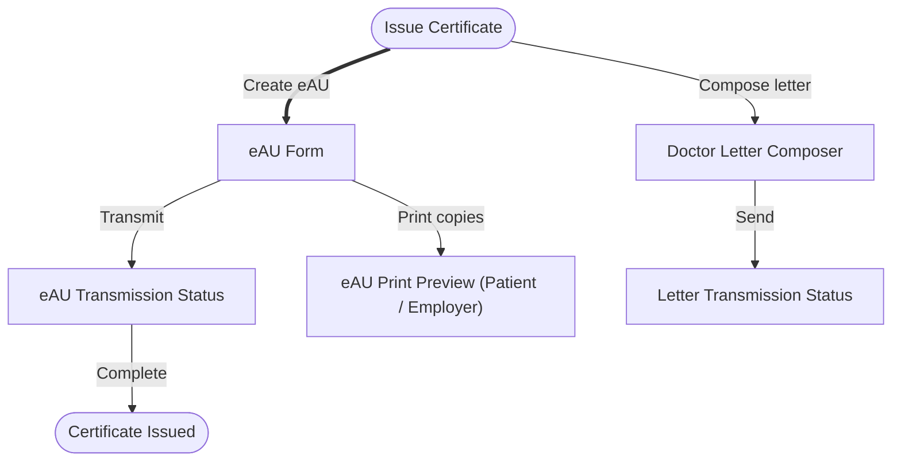

---

## 9. Doctor — Chronic Care Programs

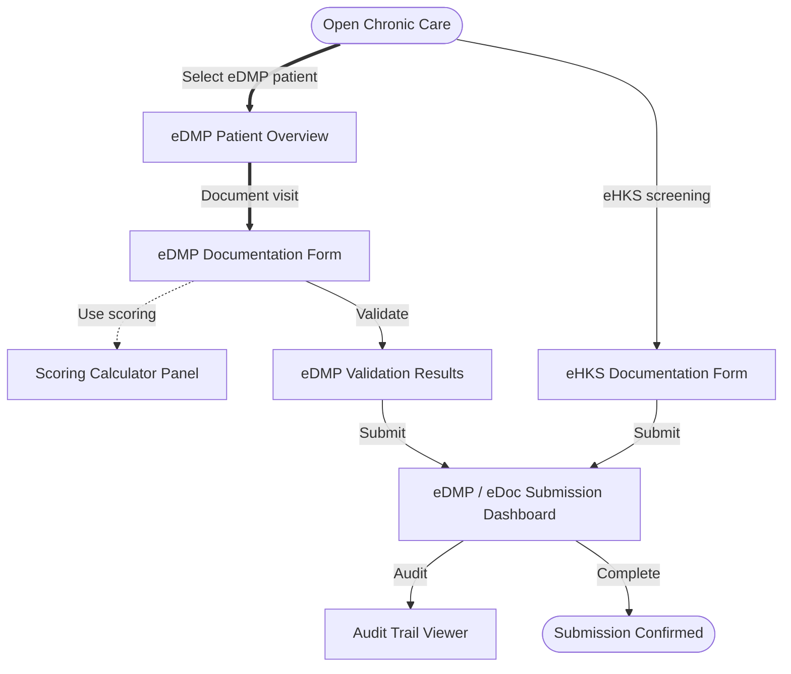

---

## 10. Doctor — Billing & Submission

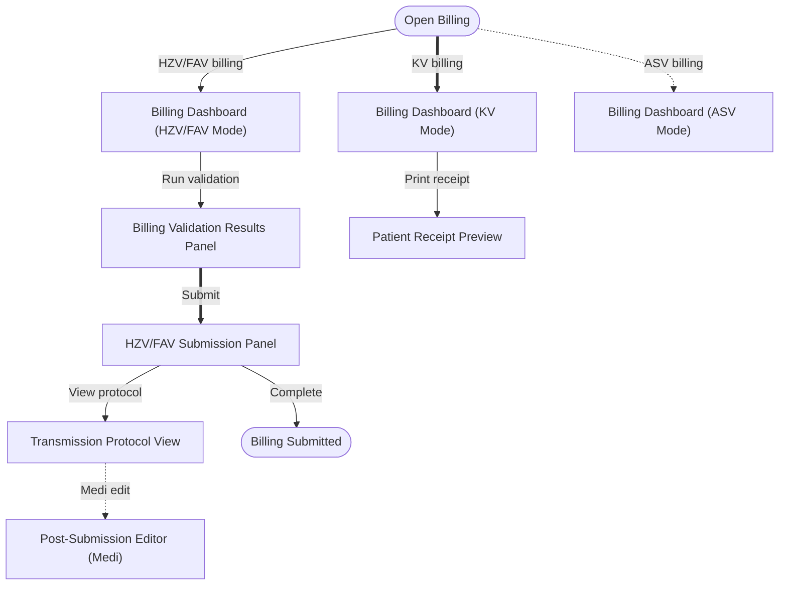

---

## 11. Doctor — ePA & Document Exchange

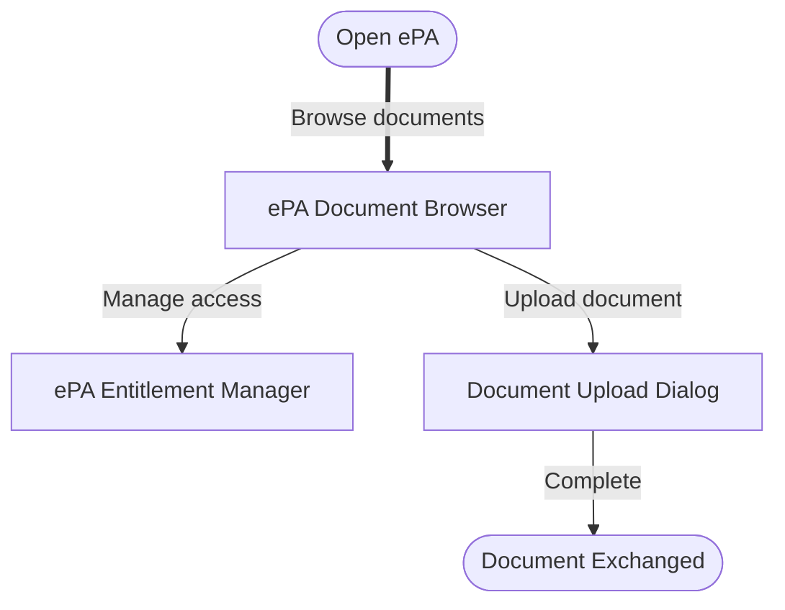

---

## 12. Admin — Practice Administration

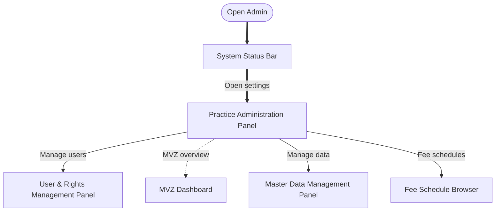

---

## 13. Admin — System Infrastructure

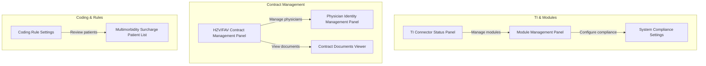

---

## 14. Admin — Data Import & Sync

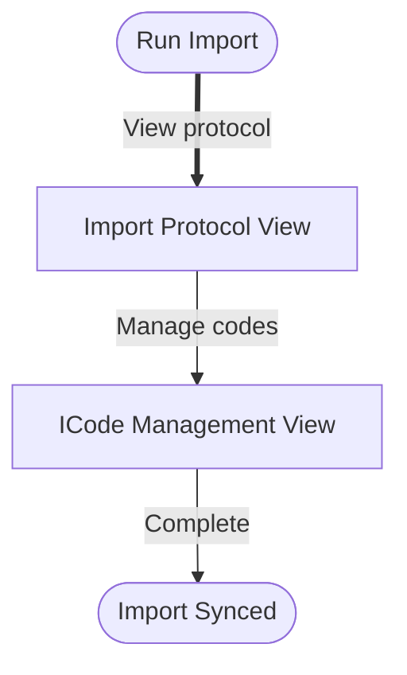

---

## 15. Cross-Tier Dependency Chain

This section captures **design dependencies** so we can sequence design work to minimize rework.

### 15A. Screen-level foundation chain (as-is)

These foundation surfaces cascade layout to all dependent screens.

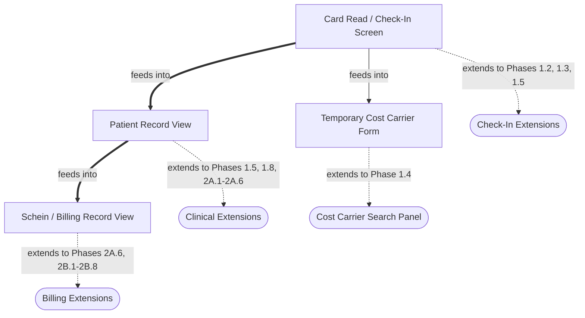

### 15B. Workflow-level dependency chain (proposed)

Workflows above are not independent. They share **contexts** (patient, billing case/Schein, contracts, master data, permissions) that create design coupling.

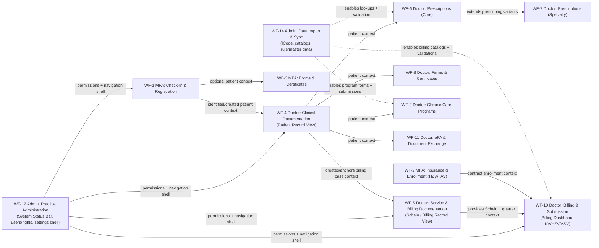

#### Dependency summary (workflow → depends on)

| Workflow | Depends on (design context) | Why it matters for design |
|---|---|---|
| **WF-12 Practice Administration** | — | Defines the **global shell** (status bar, settings entry points) and **RBAC** surfaces everything else lives under |
| **WF-1 Check-In & Registration** | WF-12 | Needs global shell + permissions; creates the **patient context** that feeds downstream clinical work |
| **WF-4 Clinical Documentation** | WF-12, (often WF-1) | Patient Record is a **hub surface**; many later screens are panels/dialogs launched from it |
| **WF-5 Service & Billing Documentation** | WF-12, WF-4 | Schein view depends on patient hub context and becomes the anchor for billing lifecycle |
| **WF-10 Billing & Submission** | WF-12, WF-5, (partly WF-2), WF-14 | Billing dashboard UI depends on Schein/quarter context and needs validations + catalogs |
| **WF-6 Prescriptions (Core)** | WF-12, WF-4, WF-14 | Needs patient hub context + drug/coding master data for search and safety dialogs |
| **WF-7 Prescriptions (Specialty)** | WF-6 | Reuses the prescribing workspace patterns; adds specialty variants |
| **WF-3 MFA Forms & Certificates** | WF-12, (often WF-1) | Printing flows can be designed early, but feel “real” once patient identity is in place |
| **WF-8 Doctor Forms & Certificates** | WF-12, WF-4 | Certificates/letters are launched from patient context; transmission status patterns should be consistent |
| **WF-9 Chronic Care Programs** | WF-12, WF-4, WF-14 | Program-specific forms + submissions depend on patient hub and structured master data |
| **WF-11 ePA & Document Exchange** | WF-12, WF-4 | Access/entitlement UI must live in the same patient context patterns |
| **WF-2 Insurance & Enrollment (HZV/FAV)** | WF-12, WF-4 | Enrollment is often a patient-specific workflow; affects billing mode/eligibility surfaces |
| **WF-14 Data Import & Sync** | WF-12 | Admin-only shell; enables catalogs and validation UIs used across clinical/billing |
| **WF-13 System Infrastructure** | WF-12 | Mostly admin-only; can be designed in parallel unless TI/module UI is a prerequisite for ePA/KIM |

### 15C. Proposed workflow-based design roadmap (dependency-minimizing)

This is a **workflow-first** sequencing that aligns with the design-roadmap “Tier 1 → Tier 5” intent, but expressed as workflow milestones.

1. **Global shells & access (WF-12)** — establish status bar, settings entry points, and user/rights patterns early so other workflows don’t re-invent layout/affordances.
2. **Patient identity → patient hub (WF-1 → WF-4)** — design the check-in flows *and* Patient Record as a coupled pair (they share patient identity patterns, search/match patterns, and “context handoff” states).
3. **Billing case anchor (WF-5)** — design Schein / Billing Record View next so downstream billing dashboards have a stable “case + quarter” object to reference.
4. **Billing dashboard shell, then deep submission (WF-10)** — design the KV dashboard shell early, but defer HZV/FAV submission + protocol + post-submit editing until WF-5 (Schein) patterns are locked.
5. **Prescribing core, then specialty variants (WF-6 → WF-7)** — lock the base prescribing workspace patterns before adding DiGA/Heilmittel/Hilfsmittel/MedPlan branches.
6. **Certificates/printing (WF-3 + WF-8)** — reuse print-preview + transmission-status layout primitives across MFA and Doctor.
7. **Chronic programs (WF-9)** — build on validated, consistent “form → validate → submit → audit” patterns established by earlier flows.
8. **Document exchange (WF-11)** — design once patient hub and permissions are stable.
9. **Enrollment + infra/admin deep-dive (WF-2, WF-14, WF-13)** — schedule in parallel or later unless contract/TI requirements are explicitly gating the earlier MVP.
