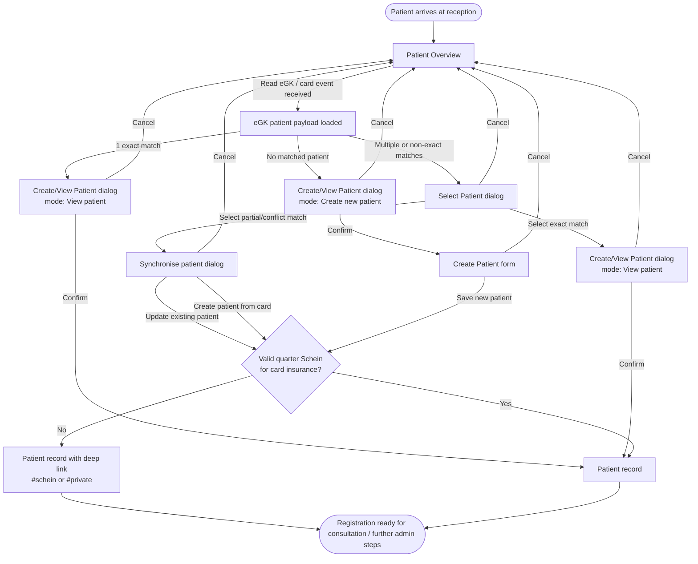
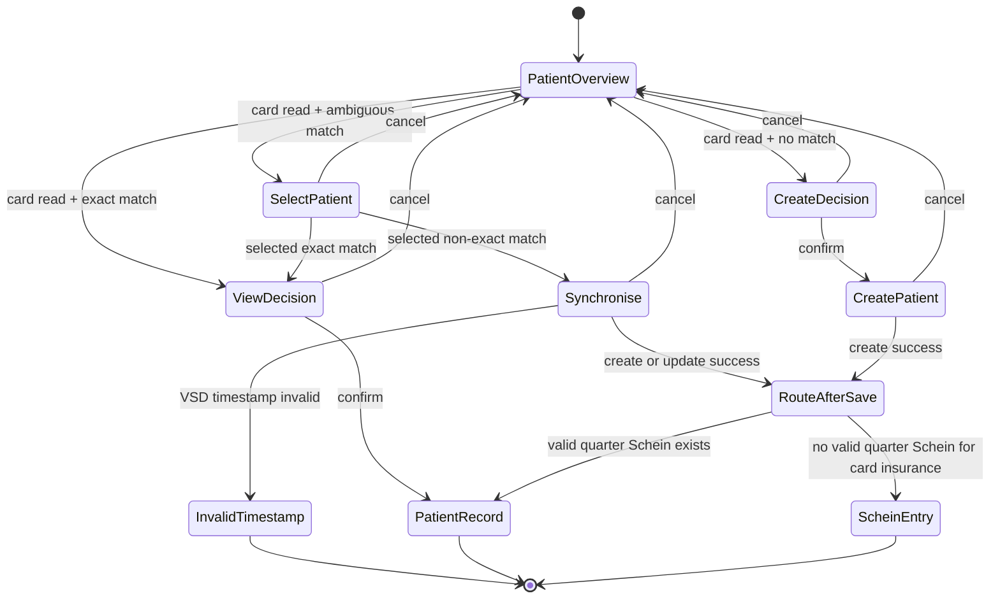

# Audit Flow — Patient Check-In & Registration

## Artifact Info
- Artifact code: `AUDIT`
- Date: `260322`
- Workflow: `Patient Check-In & Registration`
- Total screens: `6`
- Reference system: `https://github.com/tini-works/pvs-base-1.git`
- Step: `CorePVS design pipeline - Step 1 (Audit Flow)`

## Audit scope

This audit captures the as-is reception/check-in flow implemented in the reference repo, centered on:

- `pkgs/app_mvz/pages/patient-overview/index.tsx`
- `pkgs/app_mvz/module_patient-overview/PatientOverview.tsx`
- `pkgs/app_mvz/module_patient-management/card-reader/*`
- `pkgs/app_mvz/module_patient-overview/patient-overview-synchronise/*`
- `pkgs/app_mvz/module_patient-management/create-patient-v2/*`

This is a current-state audit only. It does not inject compliance or redesign.

## 1. Flow summary

## 2. Screen map

### A. Patient Overview

**Purpose**  
Main reception entry point for patient lookup, card-read handling, filtering, and routing into registration follow-up actions.

**User actions**

- Open `Patient Overview`
- Trigger or receive eGK/card read
- Review patient list and filters
- Continue from auto-opened dialog after card read

**System actions**

- Listen for `useListenEgkPatientProfile` event
- Store incoming card patient data
- Evaluate matched patient count and compare status
- Open one of three next states: create, view, or select

**States**

- Idle overview
- Card payload received
- No match found
- Single exact match found
- Multiple / ambiguous matches found

### B. Create/View Patient dialog

**Purpose**  
Small decision dialog used after card read to confirm the next step.

**User actions**

- Cancel
- Confirm `Create new patient`
- Confirm `View patient`

**System actions**

- Change dialog title/body based on `isCreate`
- Preload confirm action to either open create flow or route to patient record

**States**

- Create-new mode
- View-existing mode
- Closed

### C. Select Patient dialog

**Purpose**  
Resolve ambiguous matching when the card payload returns multiple or non-exact candidate patients.

**User actions**

- Compare card patient row with PVS candidate rows
- Select one candidate patient
- Cancel or confirm selection

**System actions**

- Render card data and matched PVS patients side-by-side
- Carry selected patient into follow-up branch
- Route exact match back into view flow
- Route non-exact match into synchronisation flow

**States**

- Candidate selection open
- Exact candidate selected
- Conflict candidate selected
- Closed

### D. Synchronise patient dialog

**Purpose**  
Compare card data against an existing patient record and let reception update or create from the card payload.

**User actions**

- Review field-by-field comparison
- Adjust gender when required
- Cancel
- Create patient
- Update patient detail

**System actions**

- Load original patient profile
- Compare accepted fields across personal, address, and insurance data
- Reject update when required payload is incomplete
- Block sync UI for invalid VSD timestamp
- After save, decide whether to open patient record directly or deep-link into Schein creation

**States**

- Comparison ready
- Conflict warning shown
- Invalid VSD timestamp
- Create pending
- Update pending
- Route to record
- Route to `#schein` / `#private`

### E. Create Patient form

**Purpose**  
Full patient registration form used when no match exists or the operator decides to create a patient from card data.

**Main sections**

- Generic info
- Personal info
- Address info
- Contact info
- Insurance info
- G81 EHIC info
- Doctor info
- ePA consent
- Other info
- Visit info

**User actions**

- Navigate sections from shortcut menu
- Edit demographic and address data
- Add or edit insurance entries
- Fill EHIC section for public patients
- Save or cancel

**System actions**

- Hide `G81 EHIC` for private patients
- Hide patient deletion except for manager-capable edit flows
- Transform form values before create/update API calls
- Enforce active insurance requirements for public patients
- After successful create, route to patient record or Schein entry based on quarter/Schein check

**States**

- Create mode
- Edit mode
- Card-read-backed insurance mode
- Dirty form with leave confirmation
- Validation errors
- Save pending
- Saved

### F. Patient record / Schein entry

**Purpose**  
Post-registration landing area after create/update/view.

**User actions**

- Enter patient record
- Continue into Schein creation when deep-linked

**System actions**

- Navigate to `/patients/:id`
- If no valid current-quarter Schein exists for the card insurance, route to `/patients/:id#schein`
- If patient type is private, route to `/patients/:id#private`
- Reload page after routing

**States**

- Record opened
- Private Schein entry opened
- Public Schein entry opened

## 3. Journey / state diagram

## 4. Branches and edge cases

### Main branches

- **No matched patient from card:** open create dialog, then full create-patient flow
- **Single exact match:** open confirm-to-view dialog, then route directly into patient record
- **Multiple or non-exact matches:** force candidate selection before view or sync
- **Non-exact selected patient:** open synchronisation comparison rather than direct entry
- **Successful save with missing valid quarter Schein:** route into `#schein` or `#private` instead of plain patient record

### Adjacent downstream flow

- **Waiting room exists as a downstream handoff, not as evidenced core registration path:** after the workflow lands in `Patient record`, the user can add the patient to a waiting room from patient information and the app also exposes a dedicated `/waiting-room` page plus waiting-room APIs
- **Practical implication:** waiting room should remain connected to this workflow in future design work, but it should be modeled as a post-registration operational handoff unless a tighter direct handoff is evidenced elsewhere

### Edge cases observed in reference

- **Invalid VSD timestamp:** synchronisation dialog is replaced by an error state (`Hoppla`) instead of allowing update
- **Missing update payload / unresolved required fields:** update is blocked and shows an error; gender can be explicitly edited in the comparison UI
- **Public patient without active insurance:** create flow fails until at least one active insurance is present
- **Insurance mismatch in current quarter:** even for an existing patient, a new Schein path is opened when the card insurance does not match a valid current-quarter Schein
- **Private patient:** `G81 EHIC` section is hidden and post-save routing goes to `#private` when Schein creation is required
- **Ambiguous matches:** the flow does not auto-resolve; the operator must choose a candidate
- **Cancel behavior:** dialogs consistently allow returning to the overview without committing registration changes

## 5. Audit conclusion

The implemented as-is workflow in `https://github.com/tini-works/pvs-base-1.git` is a **match-and-route registration flow**, not a simple linear "read card -> waiting room" flow.

The operational backbone is:

1. receive card data
2. decide match quality
3. create, view, or synchronise patient
4. ensure quarter-appropriate Schein context
5. enter patient record

Two important audit findings for downstream design work:

- **Waiting room is present in the reference system, but the evidenced entry point is downstream from `Patient record`** rather than directly inside the audited registration code path
- **Schein readiness is part of registration completion** because successful create/update may still deep-link into `#schein` / `#private` before the workflow is truly ready for consultation

## 6. Risk note

There is a modeling risk in either direction:

- **If waiting room is omitted entirely:** later artifacts may miss a real operational handoff that clearly exists in the system
- **If waiting room is embedded inside the core Step 1 path:** the audit would overstate the evidence from the reference code and blur the boundary between registration completion and post-registration operational handling

For this reason, the audit treats waiting room as an **adjacent downstream flow** linked from `Patient record`, not as a mandatory branch in the core audited registration flow.

## Reference files

- `pkgs/app_mvz/pages/patient-overview/index.tsx`
- `pkgs/app_mvz/module_patient-overview/PatientOverview.tsx`
- `pkgs/app_mvz/module_patient-management/card-reader/create-view-patient-dialog/CreateViewPatientDialog.tsx`
- `pkgs/app_mvz/module_patient-management/card-reader/select-patient-dialog/SelectPatientDialog.tsx`
- `pkgs/app_mvz/module_patient-overview/patient-overview-synchronise/index.tsx`
- `pkgs/app_mvz/module_patient-overview/patient-overview-synchronise/PatientDataComparison.tsx`
- `pkgs/app_mvz/module_patient-management/create-patient-v2/CreatePatient.tsx`
- `pkgs/app_mvz/module_patient-management/create-patient-v2/CreatePatientContent.tsx`
- `pkgs/app_mvz/module_patient-management/create-patient-v2/CreatePatient.helper.ts`
- `pkgs/app_mvz/module_patient-management/create-patient-v2/CreatePatient.service.ts`
- `pkgs/app_mvz/module_patient-management/create-patient-v2/Insurance-info-section/InsuranceInfoSection.tsx`
- `pkgs/app_mvz/module_patient-management/patient-file/patient-information/PatientInformation.tsx`
- `pkgs/app_mvz/pages/waiting-room.tsx`
- `pkgs/pvs-hermes/bff/app_mvz_waiting_room.ts`
- `ext/open-api/plans/planning_v1.md`
- `testings/tests/mvz.create-patient.spec.ts`
