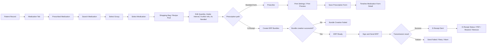
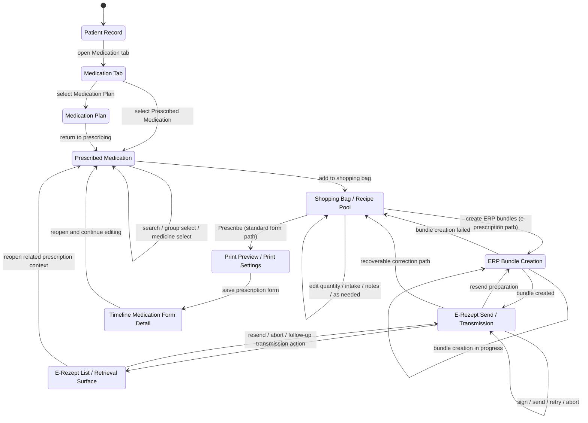
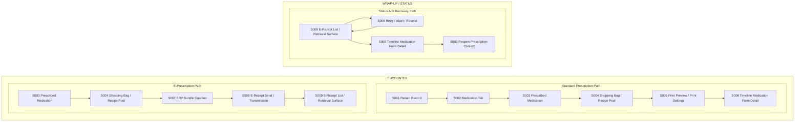

# System Audit — Prescription Flow in `pvs-base-1`

## Artifact Info
- Artifact code: `AUDIT`
- Date: `260322`
- Workflow: `Prescription`
- Total screens: `10`
- Reference system: `https://github.com/tini-works/pvs-base-1.git`
- Audit basis: GitHub repository `https://github.com/tini-works/pvs-base-1.git`

## Reference Set
- `testings/kit/page-object/mvz/mvz-medication.po.ts`
- `pkgs/app_mvz/module_medication_kbv/medication/MedicationKBV.tsx`
- `pkgs/app_mvz/module_medication_kbv/shopping-bag/MedicationShoppingBag.tsx`
- `docs/api/form-service-payloads.md`
- `ares/app/mvz/test/app/medicine/medicine_test.go`
- `pkgs/pvs-hermes/bff/app_mvz_erezept.ts`
- `ares/app/mvz/api/erezept/erezept.d.go`

## 1. Flow Summary

## 2. Screen Map With Related Actions And States

### Journey Diagram

### Swimlane Journey

### `Patient Record`
Entry point where the user reaches the medication workflow.

**User actions**
- Open patient chart.
- Open `Medication` tab.

**System actions**
- Load patient context.
- Resolve medication-related patient data.

**States**
- `patient_record_loaded`

### `Medication Tab`
Container surface for medication-related work.

**User actions**
- Switch to `Prescribed Medication`.
- Switch to `Medication Plan`.

**System actions**
- Load medication tab data and shared medication context.
- Fetch predefined medication data and supporting metadata.

**States**
- `medication_tab_loaded`
- `prescribed_medication_active`
- `medication_plan_active`

### `Prescribed Medication`
Primary prescribing workspace for search, selection, and current prescription work.

**User actions**
- Click into the medication search field.
- Enter search criteria.
- Select a medication group.
- Select a trade-name medication or free-text medication.
- Open secondary detail flows when needed.

**System actions**
- Search medication database and render grouped results.
- Load secondary data such as price comparison, alternatives, warnings, hand letters, and MMI status.

**States**
- `search_idle`
- `searching`
- `search_results_loaded`
- `group_selected`
- `medicine_selected`
- `second_layer_open`

### `Medication Plan`
Adjacent medication-management surface.

**User actions**
- Review existing medication plan.
- Switch back to prescribing workspace.

**System actions**
- Load plan-related medication context.

**States**
- `medication_plan_active`

### `Shopping Bag / Recipe Pool`
Temporary working collection of selected medicines and editable prescription details.

**User actions**
- Add medication to shopping bag.
- Increase or decrease quantity.
- Enter intake interval.
- Enter further information.
- Toggle `As needed`.
- Remove individual items.
- Remove all items.
- Open `Prescribe`.

**System actions**
- Add chosen medication into a persisted shopping bag structure.
- Validate whether a prescription is allowed based on intake interval, quantity, and free-text completeness.

**States**
- `shopping_bag_empty`
- `shopping_bag_with_items`
- `editing_medicine`
- `missing_intake_interval`
- `missing_freetext_name`
- `invalid_quantity`
- `not_prescribe_able`
- `prescribe_able`
- `remove_all_confirm_open`

### `Print Preview / Print Settings`
Form-oriented prescription review and print/save configuration for the standard prescription path.

**User actions**
- Review `Print settings`.
- Save the prescription or form.

**System actions**
- Generate form payloads for selected prescription type such as `Muster_16`, `Blaues_Rezept`, `Gruenes_Rezept`, `Btm_Rezept`, and `eRezept`.
- Save or print prescription forms through `/api/app/mvz/form/app/prescribeV2`.

**States**
- `print_settings_open`
- `saving_prescription`
- `prescription_saved`

### `ERP Bundle Creation`
Transitional flow state for the e-prescription path.

**User actions**
- Trigger ERP bundle creation from prepared form info.

**System actions**
- Create bundles from `FormInfos`.

**States**
- `bundle_creation_in_progress`
- `bundle_created`
- `bundle_creation_failed`
- `erezept_ready_to_sign_send`

### `E-Rezept Send / Transmission`
Dedicated ERP branch for sign, send, retry, and abort behaviors.

**User actions**
- Sign and send ERP.
- Retry failed transmission.
- Abort where supported.

**System actions**
- Persist e-prescription metadata.
- Call `PrescribeERP`, `SignAndSendERP`, `ResendERP`, and `GetPdfUrl`.
- Through companion/TI integration, create, activate, or abort e-prescription tasks against external services.

**States**
- `erezept_created`
- `erezept_sent`
- `erezept_aborted`
- `erezept_resend_pending`
- `send_failed`

### `Timeline Medication Form Detail`
Read-back detail view for saved medication prescription entries.

**User actions**
- Re-open saved prescription details from timeline or history.

**System actions**
- Load saved medication form detail.

**States**
- `timeline_detail_view`

### `E-Rezept List / Retrieval Surface`
Status and retrieval surface exposed by E-Rezept APIs for existing items.

**User actions**
- Review sent status.
- Open PDF.
- Resend.
- Remove items where supported.

**System actions**
- Expose list, PDF, and status APIs for ERP items.

**States**
- `erezept_sent`
- `erezept_removed`
- `erezept_resend_pending`

## 3. Branches And Edge Cases
- Standard form prescription vs e-prescription branch split after shopping-bag or form preparation.
- Medication can be selected as structured catalog entry or free text.
- Some form types relax validation: green and private prescriptions do not require the same intake-interval rule as other types.
- Free-text medication requires a name; otherwise prescribing is blocked.
- Quantity less than `1` blocks prescribing.
- Shopping bag can be empty, making prescribe actions unavailable.
- User may remove individual items or clear the whole recipe pool before saving.
- Search may require group selection before final medicine selection.
- Alternate detail flows exist through second-layer dialogs, price comparison, alternatives, and warning surfaces.
- E-prescription bundle creation can fail before sign/send.
- Sign/send is not represented as a single visible medication-screen step; it branches into a dedicated ERP, API, and companion path.
- ERP flow supports abort, resend, remove, and PDF retrieval after creation.
- Tests show support for partial prescription metadata in ERP payloads, even if that is not clearly surfaced in the main UI flow.
- Status tracking exists at API and domain level for e-prescriptions, but the visible UI flow in the repo is more explicit for save/print than for full submission lifecycle.

## Audit Conclusion
- The current as-is flow is best described as `search/select/edit -> shopping bag -> prescribe/save/print`, with `bundle/sign/send/status` as an attached downstream branch.
- If CorePVS wants a seamless doctor-facing prescription experience, the current split between medication authoring and ERP lifecycle needs to be unified into one continuous workflow surface.
