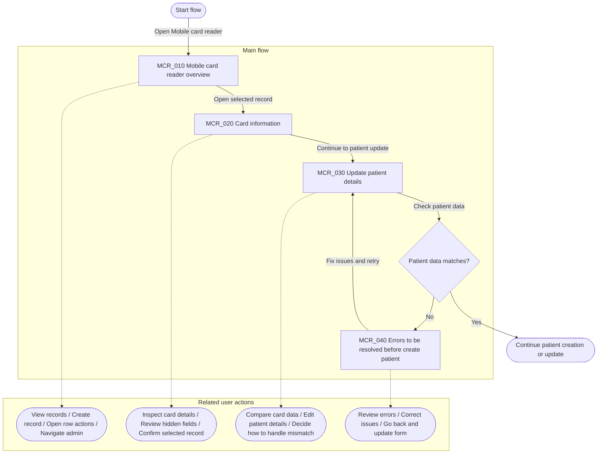

# Mobile Card Reader - Inventory

**Version:** 1.0.0
**Last Updated:** 2026-03-16 by Ngan

## User Flow

**Date:** 2026-03-16
**Scope:** Mobile Card Reader flow from overview to patient update validation
**Status:** Aspirational, inferred from current Figma flow

## Product Flow

1. A user sees card-reader records in a main overview.
2. They open one record to inspect card information.
3. The app compares the card data against existing patient data.
4. If everything matches, the user can continue normally.
5. If some things conflict, the app shows comparison screens and prompts the user to choose or correct data.
6. If required information is invalid or missing, the app blocks progress and shows error states until the data is fixed.

## Main Screens Or Major UI States

1. `Mobile card reader overview`

This is the main management screen for card-reader records. It helps the user see what already exists and start the next action.

The user can:

- see existing card-reader records in a table
- scan key information for each record
- create a new record with the plus button
- open row actions for a specific record
- move to other admin sections from the left navigation

2. `Card information`

This is the detail screen for one selected record. It lets the user look more closely at the information related to that card or patient card entry.

The user can:

- inspect detailed information for the selected card
- review fields that are not visible in the overview table
- confirm whether the selected record looks correct
- continue into follow-up actions or related workflows

3. `Update patient details`

This is a workflow screen where the user compares card data with patient data and updates the patient profile when needed.

The user can:

- compare information from the card with existing patient information
- edit or update patient details
- decide how to handle mismatched information
- continue the patient creation or update flow

4. `Errors to be resolved before create patient`

This is a blocking validation state. The system is telling the user that some required information must be fixed before a patient can be created.

The user can:

- review which fields or sections have errors
- correct missing or conflicting information
- go back through the form and make changes
- continue only after the errors are resolved
