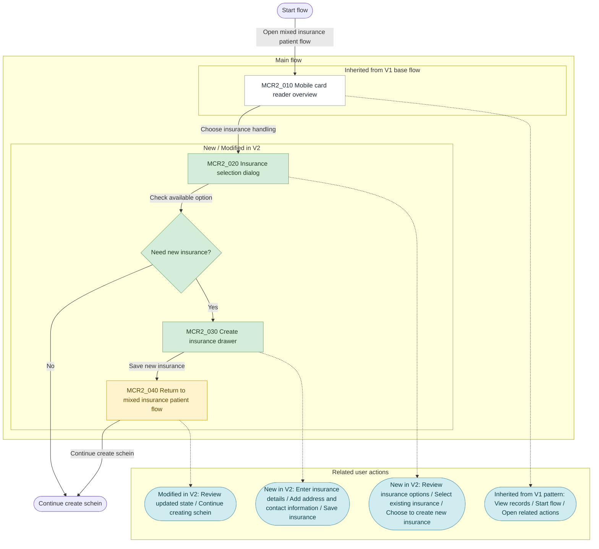

# Mobile Card Reader - Inventory

**Version:** 1.0.0
**Last Updated:** 2026-03-16 by Ngan

## V2

V2 appears to inherit the core V1 structure and extend it for the `Create schein for mixed insurance patients` scenario.

### What's New/Modified In V2

- `🆕 New` introduces an `Insurance selection dialog` as a distinct decision step
- `🆕 New` introduces a `Create insurance drawer` when an existing insurance option is not suitable
- `✏️ Modified` adds a mixed-insurance-specific branch instead of staying only in the base card-reader flow
- `✏️ Modified` adds a return step back into the main create-schein process after insurance handling
- `✏️ Modified` shifts the focus from general card-reader management to scenario-specific insurance handling for patient creation
- `⚪ Unchanged` keeps the shared `Mobile card reader overview` pattern, but uses it as the entry point for this specialized case

### User Flow

**Date:** 2026-03-16
**Scope:** Create schein for mixed insurance patients
**Status:** Aspirational, inferred from current Figma flow metadata
**Legend:** 🆕 New · ✏️ Modified · ⚪ Unchanged · 🔵 Info/Reference

### Product Flow

1. A user opens the mixed-insurance-patient scenario from the mobile card reader flow.
2. The app shows the relevant patient or history context for the selected case.
3. The user chooses how to handle insurance information.
4. If an existing insurance option works, the user selects it and continues.
5. If a new insurance record is needed, the user opens the create-insurance form and enters the required information.
6. After saving or selecting insurance, the user returns to the flow and continues creating the schein.

### Main Screens Or Major UI States

1. `Mobile card reader overview`

This is the entry screen for the mixed-insurance-patient scenario. It gives the user the record context and a way to begin the next step.

The user can:

- review history rows or record states
- start the mixed-insurance-patient flow
- open related actions from the record area
- move into the create-schein process

2. `Insurance selection dialog`

This is a choice screen where the user decides which insurance should be used for the current patient.

The user can:

- review available insurance options
- select an existing insurance option
- choose to create a new insurance entry instead
- confirm or cancel the selection step

3. `Create insurance drawer`

This is a form state for creating a new insurance entry when an existing option is not suitable.

The user can:

- enter insurance details
- add address information
- add contact-related information
- save the new insurance entry or leave the form

4. `Return to mixed insurance patient flow`

This is the follow-up state after insurance handling is complete. It brings the user back to the main process so they can continue.

The user can:

- review the updated state after insurance selection or creation
- confirm that the insurance step is complete
- continue creating the schein

## V1

### User Flow

**Date:** 2026-03-16
**Scope:** Mobile Card Reader flow from overview to patient update validation
**Status:** Aspirational, inferred from current Figma flow

### Product Flow

1. A user sees card-reader records in a main overview.
2. They open one record to inspect card information.
3. The app compares the card data against existing patient data.
4. If everything matches, the user can continue normally.
5. If some things conflict, the app shows comparison screens and prompts the user to choose or correct data.
6. If required information is invalid or missing, the app blocks progress and shows error states until the data is fixed.

### Main Screens/Major UI States

1. `Mobile card reader overview`

This is the main management screen for card-reader records. It helps the user see what already exists and start the next action.

The user can:

- see existing card-reader records in a table
- scan key information for each record
- create a new record with the plus button
- open row actions for a specific record
- move to other admin sections from the left navigation

2. `Card information`

This is the detail screen for one selected record. It lets the user look more closely at the information related to that card or patient card entry.

The user can:

- inspect detailed information for the selected card
- review fields that are not visible in the overview table
- confirm whether the selected record looks correct
- continue into follow-up actions or related workflows

3. `Update patient details`

This is a workflow screen where the user compares card data with patient data and updates the patient profile when needed.

The user can:

- compare information from the card with existing patient information
- edit or update patient details
- decide how to handle mismatched information
- continue the patient creation or update flow

4. `Errors to be resolved before create patient`

This is a blocking validation state. The system is telling the user that some required information must be fixed before a patient can be created.

The user can:

- review which fields or sections have errors
- correct missing or conflicting information
- go back through the form and make changes
- continue only after the errors are resolved
