# PVS-Core User Workflow Diagrams (Markdown)

This file is a Markdown version of the workflow-diagram artifact set (flowcharts + role-based user journeys).

---

## 1. Overview

### 1.1 Workflow Index

| Workflow | Role | Audit |
|---|---|---|
| [1.2 Cross-Tier Dependency Chain](#cross-tier) | Cross-tier | -- |
| [2.1 (WF-1) Patient Check-In & Registration](#wf-1) | MFA | [View](docs/artifacts/AUDIT260322-patient-checkin-registration.md) |
| [2.2 (WF-2) Insurance & Enrollment (HZV/FAV)](#wf-2) | MFA | -- |
| [2.3 (WF-3) Forms & Certificates](#wf-3) | MFA | -- |
| [2.4 (WF-4) Clinical Documentation](#wf-4) | Doctor | -- |
| [2.5 (WF-5) Service & Billing Documentation](#wf-5) | Doctor | -- |
| [2.6 (WF-6) Prescriptions (Core)](#wf-6) | Doctor | [View](docs/artifacts/AUDIT260322-prescriptions.md) |
| [2.7 (WF-7) Prescriptions (Specialty)](#wf-7) | Doctor | -- |
| [2.8 (WF-8) Forms & Certificates](#wf-8) | Doctor | -- |
| [2.9 (WF-9) Chronic Care Programs](#wf-9) | Doctor | -- |
| [2.10 (WF-10) Billing & Submission](#wf-10) | Doctor | -- |
| [2.11 (WF-11) ePA & Document Exchange](#wf-11) | Doctor | -- |
| [2.12 (WF-12) Practice Administration](#wf-12) | Admin | -- |
| [2.13 (WF-13) System Infrastructure](#wf-13) | Admin | -- |
| [2.14 (WF-14) Data Import & Sync](#wf-14) | Admin | -- |

---

<a id="wf-15"></a>
<a id="cross-tier"></a>
### 1.2 Cross-Tier Dependency Chain

This section makes workflow design dependencies explicit so we can sequence workflow-based design work to minimize rework.

#### Workflow-level dependency chain (proposed)

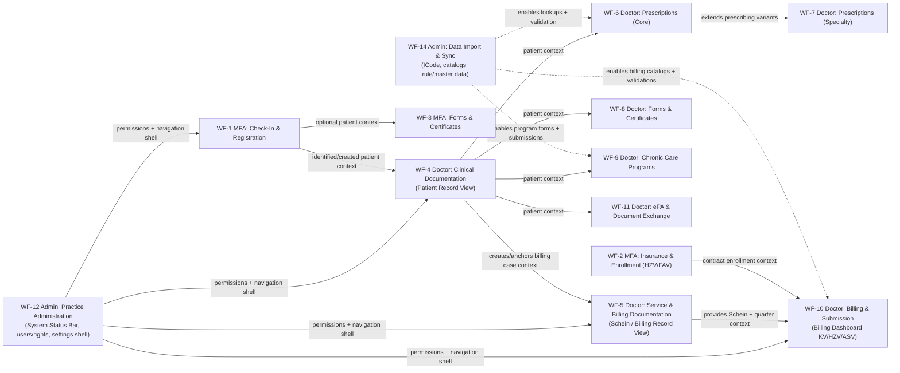

#### Dependency Summary (workflow → depends on)

| # | Workflow Links | Depends on | Why it matters |
|---:|---|---|---|
| 1 | [WF-12](#wf-12) Practice Administration | — | Defines the global shell (status bar, settings entry points) and RBAC that all workflows sit under. |
| 2 | [WF-1](#wf-1) Check-In & Registration | WF-12 | Needs shell + permissions; creates/identifies the patient context for downstream clinical work. |
| 3 | [WF-4](#wf-4) Clinical Documentation | WF-12, (often WF-1) | Patient Record is a hub surface; many later screens launch as panels/dialogs from it. |
| 4 | [WF-5](#wf-5) Service & Billing Documentation | WF-12, WF-4 | Schein view depends on patient hub context and becomes the anchor for the billing lifecycle. |
| 5 | [WF-10](#wf-10) Billing & Submission | WF-12, WF-5, (partly WF-2), WF-14 | Billing UI depends on Schein/quarter context and needs validations + catalogs to avoid redesigning the submission surface. |
| 6 | [WF-6](#wf-6) Prescriptions (Core) | WF-12, WF-4, WF-14 | Prescribing is grounded in patient context and relies on master data for search/safety. |
| 7 | [WF-7](#wf-7) Prescriptions (Specialty) | WF-6 | Reuses the base prescribing workspace patterns; adds variants without changing the core. |
| 8 | [WF-3](#wf-3) MFA Forms & Certificates | WF-12, (often WF-1) | Print flows can exist early, but become realistic once patient identity and context are stable. |
| 9 | [WF-8](#wf-8) Doctor Forms & Certificates | WF-12, WF-4 | Certificates/letters launch from patient context; status/transmission patterns should be consistent across workflows. |
| 10 | [WF-9](#wf-9) Chronic Care Programs | WF-12, WF-4, WF-14 | Program forms + submissions depend on patient hub patterns and structured master data. |
| 11 | [WF-11](#wf-11) ePA & Document Exchange | WF-12, WF-4 | Access/entitlement UI must live in the same patient-context patterns and shell rules. |
| 12 | [WF-2](#wf-2) Insurance & Enrollment | WF-12, WF-4 | Enrollment is often patient-specific and impacts billing mode eligibility and submission constraints. |
| 13 | [WF-14](#wf-14) Data Import & Sync | WF-12 | Admin-only; enables catalogs and validation UIs used across clinical and billing workflows. |
| 14 | [WF-13](#wf-13) System Infrastructure | WF-12 | Mostly admin-only; can run in parallel unless TI/module UI gates ePA/KIM behaviors. |

---

## 2. Workflows

<a id="wf-1"></a>
### 2.1 (WF-1) MFA — Patient Check-In & Registration

Source basis: `research-base`

### Flowchart

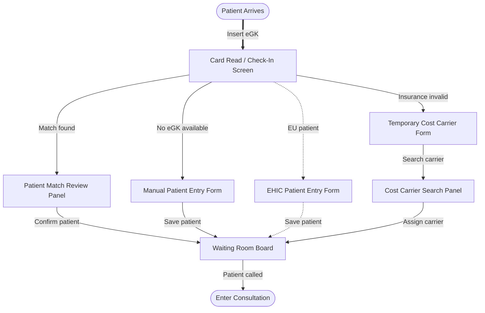

### User Journey

```mermaid
flowchart LR
  classDef patient fill:#E8F3FF,stroke:#5A8FA3,stroke-width:1px,color:#0f2633;
  classDef mfa fill:#EAF7EE,stroke:#4A7C59,stroke-width:1px,color:#0f2633;
  classDef doctor fill:#FFF3E8,stroke:#A3905A,stroke-width:1px,color:#0f2633;
  classDef admin fill:#F1ECFF,stroke:#7A5A18,stroke-width:1px,color:#0f2633;
  classDef system fill:#F4F7FA,stroke:#8DB4C0,stroke-width:1px,color:#0f2633;
  classDef user fill:#FFFFFF,stroke:#C3D6E2,stroke-width:1px,color:#0f2633;

  subgraph Patient
    direction TB
    P1["Arrive at practice"]
    P2["Provide insurance card / eGK"]
    P3["Wait to be called"]
  end

  subgraph MFA
    direction TB
    M1["Card read & check-in"]
    M2["Match review / manual entry"]
    M3["Insurance + cost carrier handling"]
    M4["Place patient in waiting room"]
  end

  subgraph Doctor
    direction TB
    D1["Call patient and start consultation"]
  end

  P1 --> P2
  P2 --> P3
  P3 --> M1
  M1 --> M2
  M2 --> M3
  M3 --> M4
  M4 --> D1

  class P1,P2,P3 patient
  class M1,M2,M3,M4 mfa
  class D1 doctor
```

<a id="wf-1-gpro"></a>
### 2.1b (WF-1 Alt) MFA — Patient Check-In & Registration — gpro-base

Source basis: `gpro-base`

### Flowchart

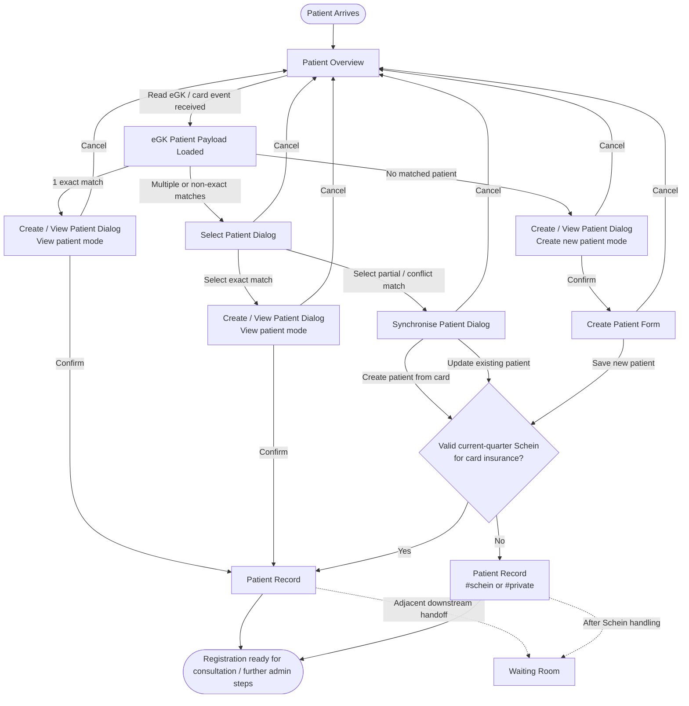

### User Journey

```mermaid
flowchart LR
  classDef patient fill:#E8F3FF,stroke:#5A8FA3,stroke-width:1px,color:#0f2633;
  classDef mfa fill:#EAF7EE,stroke:#4A7C59,stroke-width:1px,color:#0f2633;
  classDef doctor fill:#FFF3E8,stroke:#A3905A,stroke-width:1px,color:#0f2633;
  classDef admin fill:#F1ECFF,stroke:#7A5A18,stroke-width:1px,color:#0f2633;
  classDef system fill:#F4F7FA,stroke:#8DB4C0,stroke-width:1px,color:#0f2633;
  classDef user fill:#FFFFFF,stroke:#C3D6E2,stroke-width:1px,color:#0f2633;

  subgraph Patient
    direction TB
    P1["Arrive at practice"]
    P2["Present eGK / insurance card"]
    P3["Wait for registration result"]
  end

  subgraph MFA
    direction TB
    M1["Open patient overview and receive card read"]
    M2["Resolve match state: create, view, or select"]
    M3["Review candidate patient or synchronise profile when needed"]
    M4["Create patient or update existing details"]
    M5["Route to patient record or Schein-required entry"]
    M6["Optionally hand off to waiting room"]
  end

  subgraph Doctor
    direction TB
    D1["Continue from patient record into consultation"]
  end

  P1 --> P2
  P2 --> M1
  M1 --> M2
  M2 --> M3
  M3 --> M4
  M4 --> M5
  M5 --> D1
  M5 --> M6
  M6 --> D1
  D1 --> P3

  class P1,P2,P3 patient
  class M1,M2,M3,M4,M5,M6 mfa
  class D1 doctor
```

### Key differences — research-base vs gpro-base

| Area | research-base | gpro-base | Design implication |
|---|---|---|---|
| Entry point | Starts at a dedicated `Card Read / Check-In Screen` | Starts at `Patient Overview` and reacts to card-read event | Future design should decide whether check-in is a standalone screen or an event-driven workflow inside the patient overview shell |
| Matching model | Assumes a simple `Patient Match Review Panel` | Explicitly branches into exact match, no match, and ambiguous/non-exact match | Matching states likely need first-class UX states, not just a single review step |
| Registration resolution | Manual entry / EHIC / temporary cost carrier are primary visible branches | `Create patient`, `Select patient`, and `Synchronise patient` are primary visible branches | Flow architecture should separate identity resolution from insurance exception handling |
| Existing patient handling | `Match found -> confirm patient` is comparatively direct | Existing-patient path may require selection and field-level synchronisation before entry | Existing-patient reconciliation needs explicit compare-and-resolve UI, not just confirmation UI |
| Insurance/Schein handling | Highlights invalid insurance and temporary cost carrier resolution up front | Highlights post-save routing based on valid current-quarter Schein and card insurance | Insurance validity and Schein readiness may need to be modeled as different checkpoints in the workflow |
| Patient record routing | Implied handoff toward consultation via waiting room | Explicit route to `Patient Record`, sometimes deep-linked to `#schein` or `#private` | Design should treat patient-record entry as a major state transition with route-level variants |
| Waiting room role | Modeled as a core step in the main flow | Modeled as an optional downstream handoff after patient record / Schein handling | Waiting room should be designed as a downstream operational handoff unless stronger evidence makes it mandatory in core registration |
| Flow shape | More linear front-desk intake model | Match-and-route model with conditional reconciliation and post-registration branching | Spec work should prefer a branched state model over a single linear happy path |

---

<a id="wf-2"></a>
### 2.2 (WF-2) MFA — Insurance & Enrollment (HZV/FAV)

### Flowchart

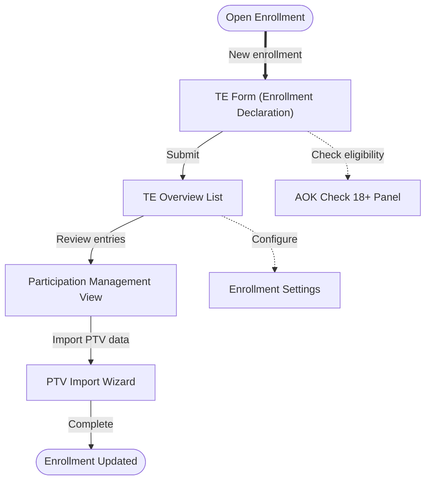

### User Journey

```mermaid
flowchart LR
  classDef patient fill:#E8F3FF,stroke:#5A8FA3,stroke-width:1px,color:#0f2633;
  classDef mfa fill:#EAF7EE,stroke:#4A7C59,stroke-width:1px,color:#0f2633;
  classDef doctor fill:#FFF3E8,stroke:#A3905A,stroke-width:1px,color:#0f2633;
  classDef admin fill:#F1ECFF,stroke:#7A5A18,stroke-width:1px,color:#0f2633;
  classDef system fill:#F4F7FA,stroke:#8DB4C0,stroke-width:1px,color:#0f2633;
  classDef user fill:#FFFFFF,stroke:#C3D6E2,stroke-width:1px,color:#0f2633;

  subgraph Patient
    direction TB
    P1["Provide enrollment details"]
  end

  subgraph MFA
    direction TB
    M1["Open enrollment and start new TE"]
    M2["Check eligibility (AOK 18+)"]
    M3["Submit TE and review overview list"]
    M4["Manage participation entries"]
    M5["Import PTV data (if needed)"]
  end

  P1 --> M1
  M1 --> M2
  M2 --> M3
  M3 --> M4
  M4 --> M5

  class P1 patient
  class M1,M2,M3,M4,M5 mfa
```

---

<a id="wf-3"></a>
### 2.3 (WF-3) MFA — Forms & Certificates

### Flowchart

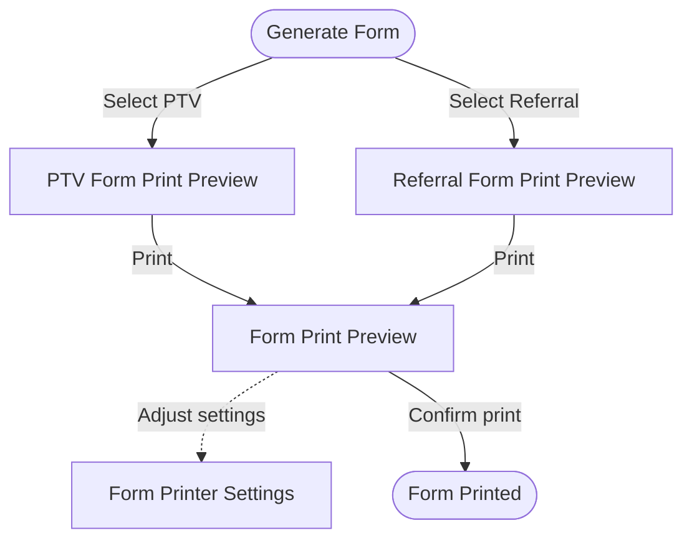

### User Journey

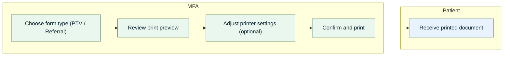

---

<a id="wf-4"></a>
### 2.4 (WF-4) Doctor — Clinical Documentation

### Flowchart

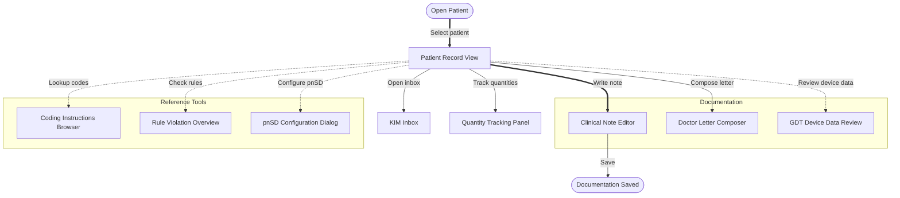

### User Journey

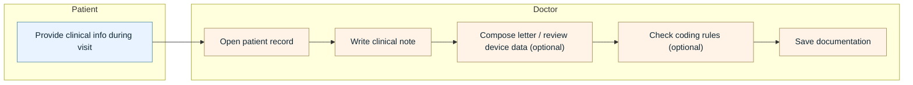

---

<a id="wf-5"></a>
### 2.5 (WF-5) Doctor — Service & Billing Documentation

### Flowchart

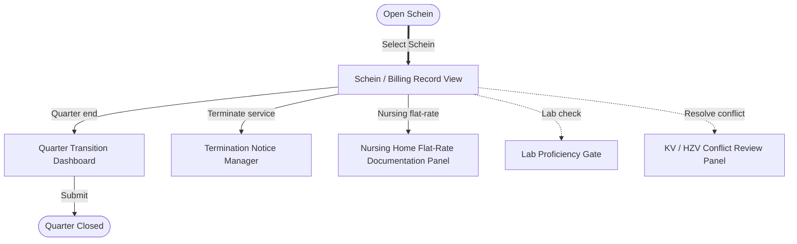

### User Journey

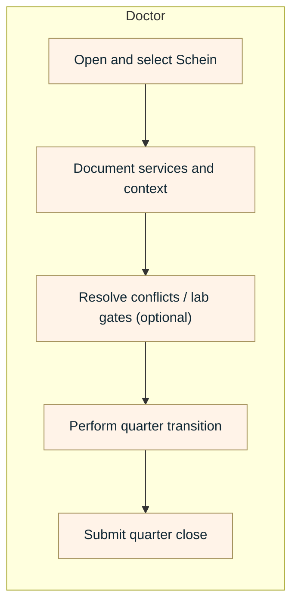

---

<a id="wf-6"></a>
### 2.6 (WF-6) Doctor — Prescriptions (Core)

### Flowchart

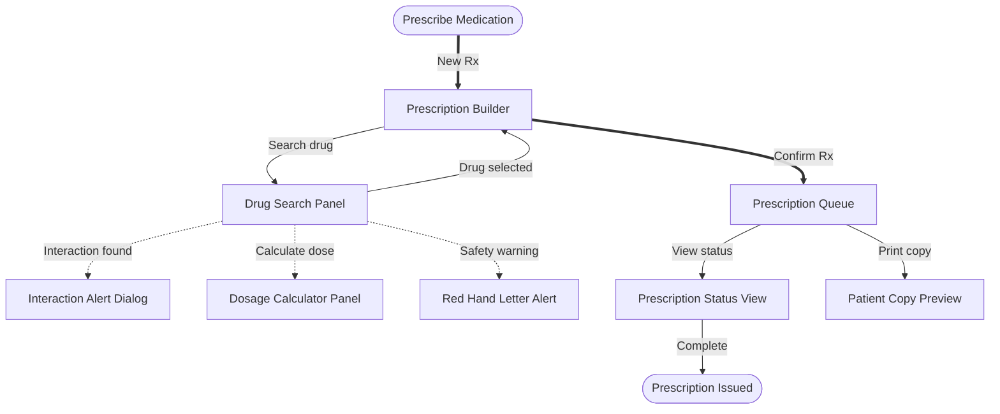

### User Journey

```mermaid
flowchart LR
  classDef patient fill:#E8F3FF,stroke:#5A8FA3,stroke-width:1px,color:#0f2633;
  classDef mfa fill:#EAF7EE,stroke:#4A7C59,stroke-width:1px,color:#0f2633;
  classDef doctor fill:#FFF3E8,stroke:#A3905A,stroke-width:1px,color:#0f2633;
  classDef admin fill:#F1ECFF,stroke:#7A5A18,stroke-width:1px,color:#0f2633;
  classDef system fill:#F4F7FA,stroke:#8DB4C0,stroke-width:1px,color:#0f2633;
  classDef user fill:#FFFFFF,stroke:#C3D6E2,stroke-width:1px,color:#0f2633;

  subgraph Doctor
    direction TB
    D1["Start new prescription"]
    D2["Search and select drug"]
    D3["Review safety alerts / dosage (if shown)"]
    D4["Confirm prescription"]
  end

  subgraph System
    direction TB
    S1["Run interaction + safety checks"]
    S2["Queue and track status"]
  end

  subgraph Patient
    direction TB
    P1["Receive patient copy (optional print)"]
  end

  D1 --> D2
  D2 --> D3
  D3 --> D4
  D4 --> S1
  S1 --> S2
  S2 --> P1

  class P1 patient
  class D1,D2,D3,D4 doctor
  class S1,S2 system
```

<a id="wf-6-gpro"></a>
### 2.6b (WF-6 Alt) Doctor — Prescriptions (Core) — gpro-base

Source basis: `gpro-base`

### Flowchart

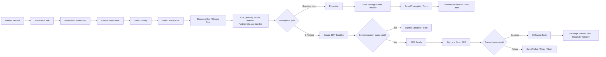

### User Journey

```mermaid
flowchart LR
  classDef patient fill:#E8F3FF,stroke:#5A8FA3,stroke-width:1px,color:#0f2633;
  classDef mfa fill:#EAF7EE,stroke:#4A7C59,stroke-width:1px,color:#0f2633;
  classDef doctor fill:#FFF3E8,stroke:#A3905A,stroke-width:1px,color:#0f2633;
  classDef admin fill:#F1ECFF,stroke:#7A5A18,stroke-width:1px,color:#0f2633;
  classDef system fill:#F4F7FA,stroke:#8DB4C0,stroke-width:1px,color:#0f2633;
  classDef user fill:#FFFFFF,stroke:#C3D6E2,stroke-width:1px,color:#0f2633;

  subgraph Doctor
    direction TB
    D1["Open patient record and medication tab"]
    D2["Search and select medication"]
    D3["Build prescription in shopping bag"]
    D4["Choose standard form or E-Rezept path"]
    D5["Review print, save, sign, send, or recover status"]
  end

  subgraph System
    direction TB
    S1["Load medication context and search results"]
    S2["Validate quantity, intake interval, and free-text completeness"]
    S3["Generate forms, ERP bundles, and transmission status"]
  end

  subgraph Patient
    direction TB
    P1["Receive prescription output or downstream fulfillment result"]
  end

  D1 --> D2
  D2 --> S1
  S1 --> D3
  D3 --> S2
  S2 --> D4
  D4 --> D5
  D5 --> S3
  S3 --> P1

  class P1 patient
  class D1,D2,D3,D4,D5 doctor
  class S1,S2,S3 system
```

### Key differences — research-base vs gpro-base

| Area | research-base | gpro-base | Design implication |
|---|---|---|---|
| Entry point | Starts from a generic `Prescribe Medication` action | Starts from `Patient Record -> Medication Tab -> Prescribed Medication` | Future spec work should model prescribing as a patient-context workflow, not an isolated action entry |
| Core workspace | Uses a direct `Prescription Builder` with supporting search panel | Uses `Prescribed Medication` plus `Shopping Bag / Recipe Pool` as the working workspace | The prescription model likely needs a multi-stage workspace with a persistent draft collection, not a single builder surface |
| Path split | Implies one core path that later queues and tracks status | Explicitly splits into `Standard form` and `E-Rezept` paths after editing prescription details | Workflow state should branch deliberately between form-based and ERP-based fulfillment rather than treating them as one generic output state |
| Standard prescription handling | Goes from builder to queue/status with optional print copy | Goes through `Print Settings / Print Preview`, save, then `Timeline Medication Form Detail` | Standard prescriptions need form-generation and saved-detail states, not only queue/status abstractions |
| E-Rezept lifecycle | Abstracted as queue plus status view | Explicitly models bundle creation, success/failure, sign/send, resend, abort, PDF, and follow-up status actions | The ERP lifecycle should be represented as a dedicated state machine with recovery paths |
| Validation model | Focuses on interaction, dosage, and safety alerts during search | Adds draft validation constraints such as intake interval, quantity, free-text completeness, and empty shopping bag blocking | Spec work should distinguish clinical safety checks from form-readiness and transmission-readiness checks |
| Recovery behavior | Minimal post-confirmation recovery is visible in the base flow | Includes bundle failure, send failure, retry, abort, resend, and reopen prescription context | The design needs explicit recovery and retry states rather than a single terminal status view |
| Flow shape | Relatively linear search -> builder -> queue -> status model | Layered medication workflow with adjacent medication-plan surface, draft editing, branch split, and post-send retrieval | The target workflow should favor a branched, stateful prescribing model over a linear happy-path diagram |

---

<a id="wf-7"></a>
### 2.7 (WF-7) Doctor — Prescriptions (Specialty)

### Flowchart

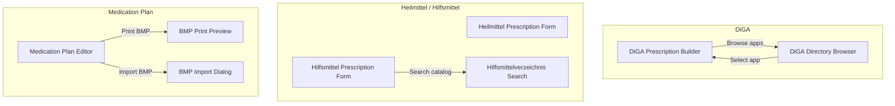

### User Journey

```mermaid
flowchart LR
  classDef patient fill:#E8F3FF,stroke:#5A8FA3,stroke-width:1px,color:#0f2633;
  classDef mfa fill:#EAF7EE,stroke:#4A7C59,stroke-width:1px,color:#0f2633;
  classDef doctor fill:#FFF3E8,stroke:#A3905A,stroke-width:1px,color:#0f2633;
  classDef admin fill:#F1ECFF,stroke:#7A5A18,stroke-width:1px,color:#0f2633;
  classDef system fill:#F4F7FA,stroke:#8DB4C0,stroke-width:1px,color:#0f2633;
  classDef user fill:#FFFFFF,stroke:#C3D6E2,stroke-width:1px,color:#0f2633;

  subgraph Doctor
    direction TB
    D1["Choose specialty flow (DiGA / Heilmittel / Med Plan)"]
    D2["Browse directory or catalog (if needed)"]
    D3["Fill prescription form / edit medication plan"]
    D4["Print or import/export (optional)"]
  end

  subgraph System
    direction TB
    S1["Provide searchable directories & catalogs"]
    S2["Generate print preview / import dialog"]
  end

  D1 --> D2
  D2 --> D3
  D3 --> D4
  D4 --> S1
  S1 --> S2

  class D1,D2,D3,D4 doctor
  class S1,S2 system
```

---

<a id="wf-8"></a>
### 2.8 (WF-8) Doctor — Forms & Certificates

### Flowchart

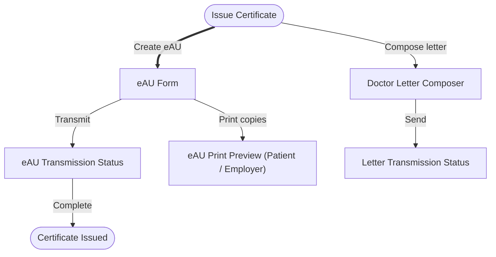

### User Journey

```mermaid
flowchart LR
  classDef patient fill:#E8F3FF,stroke:#5A8FA3,stroke-width:1px,color:#0f2633;
  classDef mfa fill:#EAF7EE,stroke:#4A7C59,stroke-width:1px,color:#0f2633;
  classDef doctor fill:#FFF3E8,stroke:#A3905A,stroke-width:1px,color:#0f2633;
  classDef admin fill:#F1ECFF,stroke:#7A5A18,stroke-width:1px,color:#0f2633;
  classDef system fill:#F4F7FA,stroke:#8DB4C0,stroke-width:1px,color:#0f2633;
  classDef user fill:#FFFFFF,stroke:#C3D6E2,stroke-width:1px,color:#0f2633;

  subgraph Doctor
    direction TB
    D1["Create eAU form"]
    D2["Transmit and verify status"]
    D3["Print copies (optional)"]
    D4["Compose and send letter (optional)"]
  end

  subgraph System
    direction TB
    S1["Transmit eAU / letter and show status"]
  end

  subgraph Patient
    direction TB
    P1["Receive printed copy (if provided)"]
  end

  D1 --> D2
  D2 --> D3
  D3 --> D4
  D4 --> S1
  S1 --> P1

  class P1 patient
  class D1,D2,D3,D4 doctor
  class S1 system
```

---

<a id="wf-9"></a>
### 2.9 (WF-9) Doctor — Chronic Care Programs

### Flowchart

```mermaid
flowchart TD
    START(["Open Chronic Care"])
    START ==>|"Select eDMP patient"| OVERVIEW["eDMP Patient Overview"]
    OVERVIEW ==>|"Document visit"| DOC["eDMP Documentation Form"]
    DOC -.->|"Use scoring"| SCORE["Scoring Calculator Panel"]
    DOC -->|"Validate"| VALID["eDMP Validation Results"]
    VALID -->|"Submit"| SUBMIT["eDMP / eDoc Submission Dashboard"]
    START -->|"eHKS screening"| EHKS["eHKS Documentation Form"]
    EHKS -->|"Submit"| SUBMIT
    SUBMIT -->|"Audit"| AUDIT["Audit Trail Viewer"]
    SUBMIT -->|"Complete"| DONE(["Submission Confirmed"])
```

### User Journey

```mermaid
flowchart LR
  classDef patient fill:#E8F3FF,stroke:#5A8FA3,stroke-width:1px,color:#0f2633;
  classDef mfa fill:#EAF7EE,stroke:#4A7C59,stroke-width:1px,color:#0f2633;
  classDef doctor fill:#FFF3E8,stroke:#A3905A,stroke-width:1px,color:#0f2633;
  classDef admin fill:#F1ECFF,stroke:#7A5A18,stroke-width:1px,color:#0f2633;
  classDef system fill:#F4F7FA,stroke:#8DB4C0,stroke-width:1px,color:#0f2633;
  classDef user fill:#FFFFFF,stroke:#C3D6E2,stroke-width:1px,color:#0f2633;

  subgraph Doctor
    direction TB
    D1["Select program patient (eDMP / eHKS)"]
    D2["Document visit / screening"]
    D3["Use scoring calculator (optional)"]
    D4["Review validation results"]
    D5["Submit documentation"]
    D6["Review audit trail (optional)"]
  end

  subgraph System
    direction TB
    S1["Validate submission and show results"]
    S2["Record audit trail"]
  end

  D1 --> D2
  D2 --> D3
  D3 --> D4
  D4 --> D5
  D5 --> D6
  D6 --> S1
  S1 --> S2

  class D1,D2,D3,D4,D5,D6 doctor
  class S1,S2 system
```

---

<a id="wf-10"></a>
### 2.10 (WF-10) Doctor — Billing & Submission

### Flowchart

```mermaid
flowchart TD
    START(["Open Billing"])
    START ==>|"KV billing"| KV["Billing Dashboard (KV Mode)"]
    START -->|"HZV/FAV billing"| HZV["Billing Dashboard (HZV/FAV Mode)"]
    START -.->|"ASV billing"| ASV["Billing Dashboard (ASV Mode)"]
    HZV -->|"Run validation"| VALID["Billing Validation Results Panel"]
    VALID ==>|"Submit"| SUB["HZV/FAV Submission Panel"]
    SUB -->|"View protocol"| PROTO["Transmission Protocol View"]
    PROTO -.->|"Medi edit"| POST["Post-Submission Editor (Medi)"]
    KV -->|"Print receipt"| RECEIPT["Patient Receipt Preview"]
    SUB -->|"Complete"| DONE(["Billing Submitted"])
```

### User Journey

```mermaid
flowchart LR
  classDef patient fill:#E8F3FF,stroke:#5A8FA3,stroke-width:1px,color:#0f2633;
  classDef mfa fill:#EAF7EE,stroke:#4A7C59,stroke-width:1px,color:#0f2633;
  classDef doctor fill:#FFF3E8,stroke:#A3905A,stroke-width:1px,color:#0f2633;
  classDef admin fill:#F1ECFF,stroke:#7A5A18,stroke-width:1px,color:#0f2633;
  classDef system fill:#F4F7FA,stroke:#8DB4C0,stroke-width:1px,color:#0f2633;
  classDef user fill:#FFFFFF,stroke:#C3D6E2,stroke-width:1px,color:#0f2633;

  subgraph Doctor
    direction TB
    D1["Choose billing mode (KV / HZV/FAV / ASV)"]
    D2["Run validation (HZV/FAV)"]
    D3["Submit billing"]
    D4["Review protocol / post-submit edits (optional)"]
    D5["Print patient receipt (KV optional)"]
  end

  subgraph System
    direction TB
    S1["Produce validation results"]
    S2["Transmit submission and produce protocol"]
  end

  D1 --> D2
  D2 --> D3
  D3 --> D4
  D4 --> D5
  D5 --> S1
  S1 --> S2

  class D1,D2,D3,D4,D5 doctor
  class S1,S2 system
```

---

<a id="wf-11"></a>
### 2.11 (WF-11) Doctor — ePA & Document Exchange

### Flowchart

```mermaid
flowchart TD
    START(["Open ePA"])
    START ==>|"Browse documents"| BROWSER["ePA Document Browser"]
    BROWSER -->|"Manage access"| ENTITLE["ePA Entitlement Manager"]
    BROWSER -->|"Upload document"| UPLOAD["Document Upload Dialog"]
    UPLOAD -->|"Complete"| DONE(["Document Exchanged"])
```

### User Journey

```mermaid
flowchart LR
  classDef patient fill:#E8F3FF,stroke:#5A8FA3,stroke-width:1px,color:#0f2633;
  classDef mfa fill:#EAF7EE,stroke:#4A7C59,stroke-width:1px,color:#0f2633;
  classDef doctor fill:#FFF3E8,stroke:#A3905A,stroke-width:1px,color:#0f2633;
  classDef admin fill:#F1ECFF,stroke:#7A5A18,stroke-width:1px,color:#0f2633;
  classDef system fill:#F4F7FA,stroke:#8DB4C0,stroke-width:1px,color:#0f2633;
  classDef user fill:#FFFFFF,stroke:#C3D6E2,stroke-width:1px,color:#0f2633;

  subgraph Doctor
    direction TB
    D1["Open ePA document browser"]
    D2["Browse patient documents"]
    D3["Manage entitlements (optional)"]
    D4["Upload a document"]
  end

  subgraph System
    direction TB
    S1["Fetch documents and enforce access rules"]
    S2["Upload and confirm completion"]
  end

  D1 --> D2
  D2 --> D3
  D3 --> D4
  D4 --> S1
  S1 --> S2

  class D1,D2,D3,D4 doctor
  class S1,S2 system
```

---

<a id="wf-12"></a>
### 2.12 (WF-12) Admin — Practice Administration

### Flowchart

```mermaid
flowchart TD
    START(["Open Admin"])
    STATUS["System Status Bar"] ==>|"Open settings"| ADMIN["Practice Administration Panel"]
    ADMIN -->|"Manage users"| USERS["User & Rights Management Panel"]
    ADMIN -.->|"MVZ overview"| MVZ["MVZ Dashboard"]
    ADMIN -->|"Manage data"| MASTER["Master Data Management Panel"]
    ADMIN -->|"Fee schedules"| FEE["Fee Schedule Browser"]
    START ==> STATUS
```

### User Journey

```mermaid
flowchart LR
  classDef patient fill:#E8F3FF,stroke:#5A8FA3,stroke-width:1px,color:#0f2633;
  classDef mfa fill:#EAF7EE,stroke:#4A7C59,stroke-width:1px,color:#0f2633;
  classDef doctor fill:#FFF3E8,stroke:#A3905A,stroke-width:1px,color:#0f2633;
  classDef admin fill:#F1ECFF,stroke:#7A5A18,stroke-width:1px,color:#0f2633;
  classDef system fill:#F4F7FA,stroke:#8DB4C0,stroke-width:1px,color:#0f2633;
  classDef user fill:#FFFFFF,stroke:#C3D6E2,stroke-width:1px,color:#0f2633;

  subgraph Admin
    direction TB
    A1["Open admin area"]
    A2["Navigate from status bar to settings"]
    A3["Manage users and rights"]
    A4["Maintain master data"]
    A5["Review fee schedules"]
    A6["View MVZ dashboard (optional)"]
  end

  A1 --> A2
  A2 --> A3
  A3 --> A4
  A4 --> A5
  A5 --> A6

  class A1,A2,A3,A4,A5,A6 admin
```

---

<a id="wf-13"></a>
### 2.13 (WF-13) Admin — System Infrastructure

### Flowchart

```mermaid
flowchart TD
    subgraph TI["TI & Modules"]
        CONN["TI Connector Status Panel"]
        MOD["Module Management Panel"]
        COMPLY["System Compliance Settings"]
        CONN -->|"Manage modules"| MOD
        MOD -->|"Configure compliance"| COMPLY
    end

    subgraph Contracts["Contract Management"]
        HZV_MGMT["HZV/FAV Contract Management Panel"]
        PHYS["Physician Identity Management Panel"]
        DOCS["Contract Documents Viewer"]
        HZV_MGMT -->|"Manage physicians"| PHYS
        HZV_MGMT -->|"View documents"| DOCS
    end

    subgraph Coding["Coding & Rules"]
        CODING_RULES["Coding Rule Settings"]
        MULTI["Multimorbidity Surcharge Patient List"]
        CODING_RULES -->|"Review patients"| MULTI
    end
```

### User Journey

```mermaid
flowchart LR
  classDef patient fill:#E8F3FF,stroke:#5A8FA3,stroke-width:1px,color:#0f2633;
  classDef mfa fill:#EAF7EE,stroke:#4A7C59,stroke-width:1px,color:#0f2633;
  classDef doctor fill:#FFF3E8,stroke:#A3905A,stroke-width:1px,color:#0f2633;
  classDef admin fill:#F1ECFF,stroke:#7A5A18,stroke-width:1px,color:#0f2633;
  classDef system fill:#F4F7FA,stroke:#8DB4C0,stroke-width:1px,color:#0f2633;
  classDef user fill:#FFFFFF,stroke:#C3D6E2,stroke-width:1px,color:#0f2633;

  subgraph Admin
    direction TB
    A1["Check TI connector status"]
    A2["Manage modules"]
    A3["Configure compliance settings"]
    A4["Manage HZV/FAV contracts"]
    A5["Maintain physician identities"]
    A6["Review coding rules and patient lists"]
  end

  A1 --> A2
  A2 --> A3
  A3 --> A4
  A4 --> A5
  A5 --> A6

  class A1,A2,A3,A4,A5,A6 admin
```

---

<a id="wf-14"></a>
### 2.14 (WF-14) Admin — Data Import & Sync

### Flowchart

```mermaid
flowchart TD
    START(["Run Import"])
    START ==>|"View protocol"| IMPORT["Import Protocol View"]
    IMPORT -->|"Manage codes"| ICODE["ICode Management View"]
    ICODE -->|"Complete"| DONE(["Import Synced"])
```

### User Journey

```mermaid
flowchart LR
  classDef patient fill:#E8F3FF,stroke:#5A8FA3,stroke-width:1px,color:#0f2633;
  classDef mfa fill:#EAF7EE,stroke:#4A7C59,stroke-width:1px,color:#0f2633;
  classDef doctor fill:#FFF3E8,stroke:#A3905A,stroke-width:1px,color:#0f2633;
  classDef admin fill:#F1ECFF,stroke:#7A5A18,stroke-width:1px,color:#0f2633;
  classDef system fill:#F4F7FA,stroke:#8DB4C0,stroke-width:1px,color:#0f2633;
  classDef user fill:#FFFFFF,stroke:#C3D6E2,stroke-width:1px,color:#0f2633;

  subgraph Admin
    direction TB
    A1["Run import"]
    A2["Review import protocol"]
    A3["Manage imported codes"]
    A4["Confirm sync completion"]
  end

  subgraph System
    direction TB
    S1["Execute import and record protocol"]
  end

  A1 --> A2
  A2 --> A3
  A3 --> A4
  A4 --> S1

  class A1,A2,A3,A4 admin
  class S1 system
```

---
