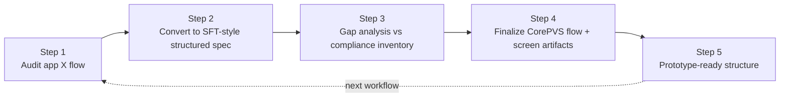

# CorePVS Design Pipeline (v3.1)

## Overview
Design pipeline to transform garrioPRO audit into CorePVS prototype-ready artifacts.

```
Per workflow:
Step 1 Audit → Step 2 Structured Spec → Step 3 Compliance Gap → Step 4 Final Artifacts → Step 5 Prototype Structure
```

### Pipeline



### Core Principle

Do **not** jump from compliance obligations directly into screens.

Instead:
- start from a real reference flow in app X,
- formalize it into a behavior spec,
- layer compliance on top,
- then finalize the CorePVS flow,
- then derive buildable artifacts.

This keeps **UX workflow first** while ensuring compliance coverage is not lost.

---

## Pipeline Stages

### 1. Audit garrioPRO flows
- Extract workflows from garrioPRO
- Identify key screens & transitions
- Output: Flow breakdown

### 2. SFT structured spec
- Convert flows into structured spec
- Normalize actions, entities, states
- Output: Structured flow spec

### 3. Compliance gap analysis
- Compare spec vs compliance inventory
- Identify missing obligations coverage
- Output: Gap report

### 4. Final CorePVS design
- Design optimized flows
- Define screens, regions, states (empty/loading/error/populated)
- Output: Final design artifacts

### 5. Prototype-ready artifacts
- Prepare build-ready specs
- Include interaction logic + UI states
- Output: Prototype package

---

## Notes
- No prompt chaining logic
- Prescription is NOT fixed as pilot (can be any workflow)
- Focus: artifact production (flow → screen → component → interaction)

---

## Kanban Mapping

| Stage | Task Example |
|------|-------------|
| Audit | Extract Prescription flow from garrioPRO |
| Spec | Convert to structured spec |
| Gap | Run compliance check |
| Design | Create CorePVS UX |
| Proto | Prepare build-ready artifacts |

---

Generated: 2026-03-21 10:26:53
