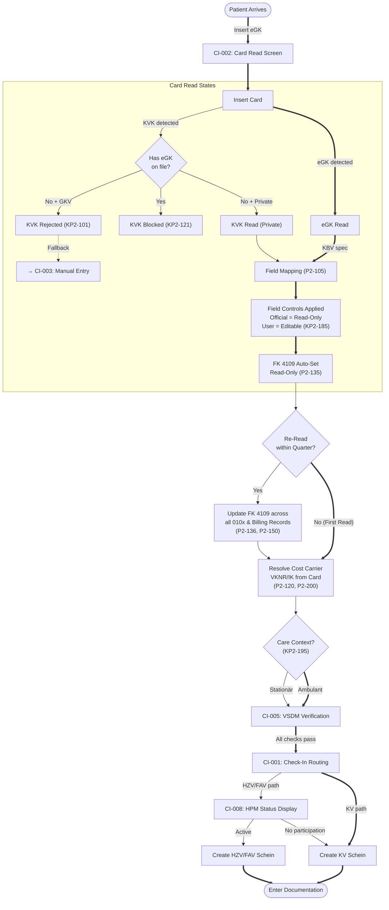
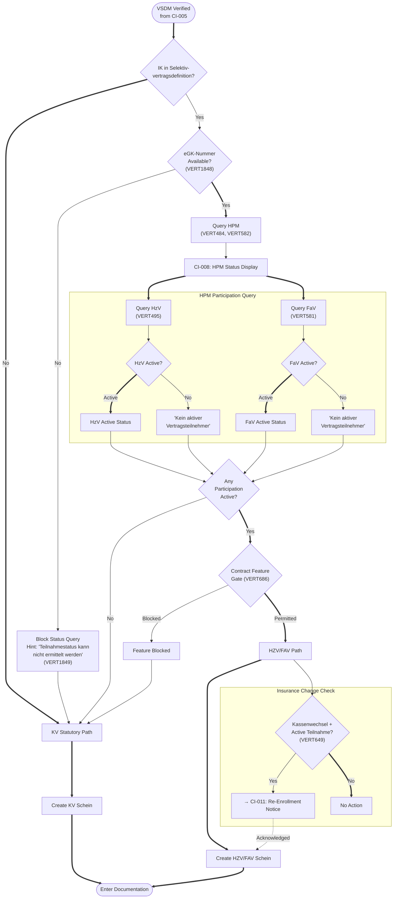
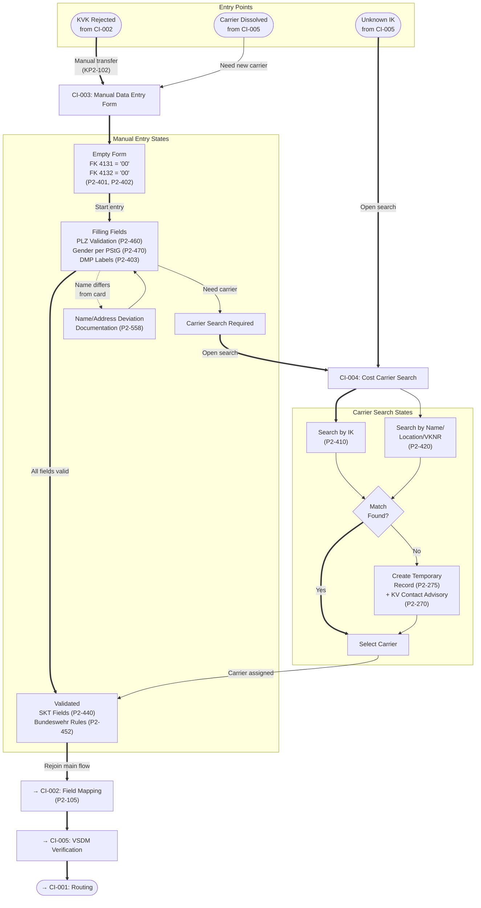
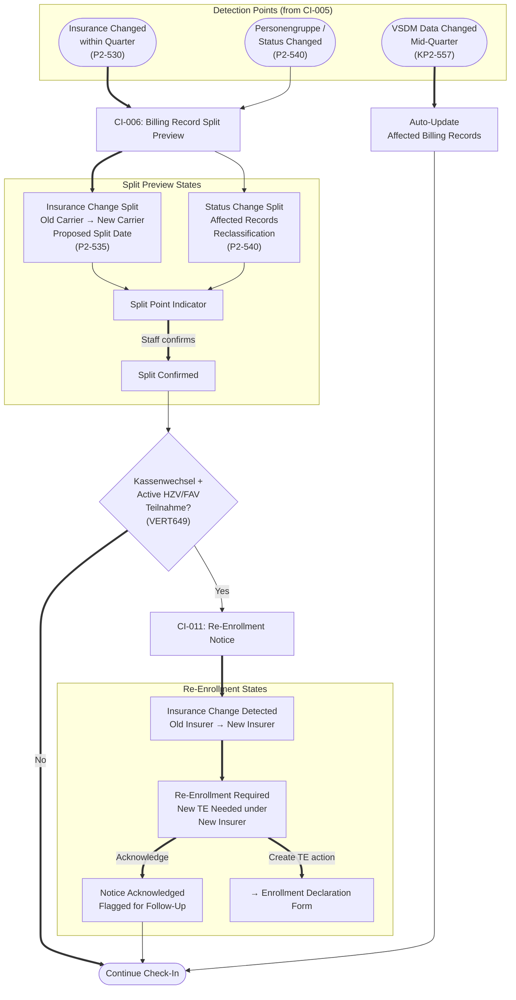
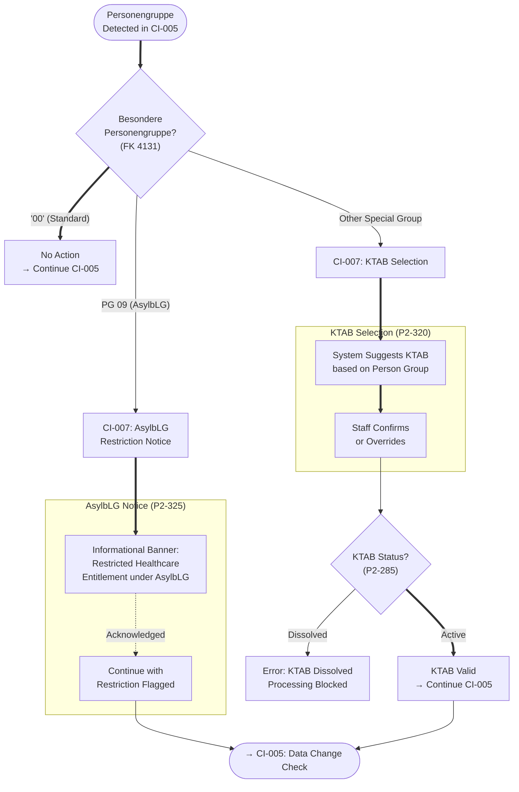
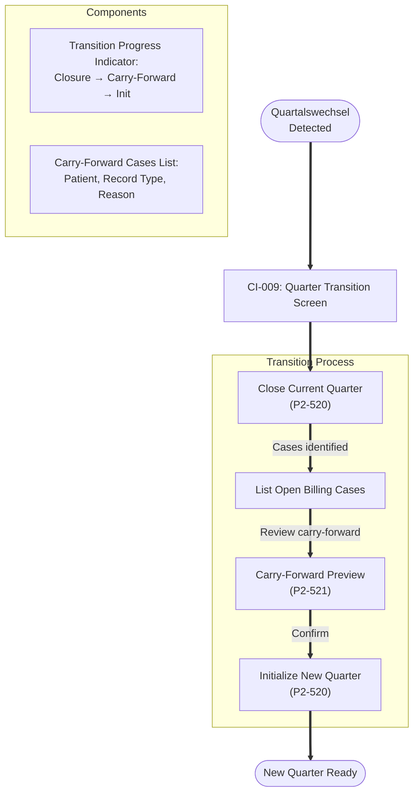
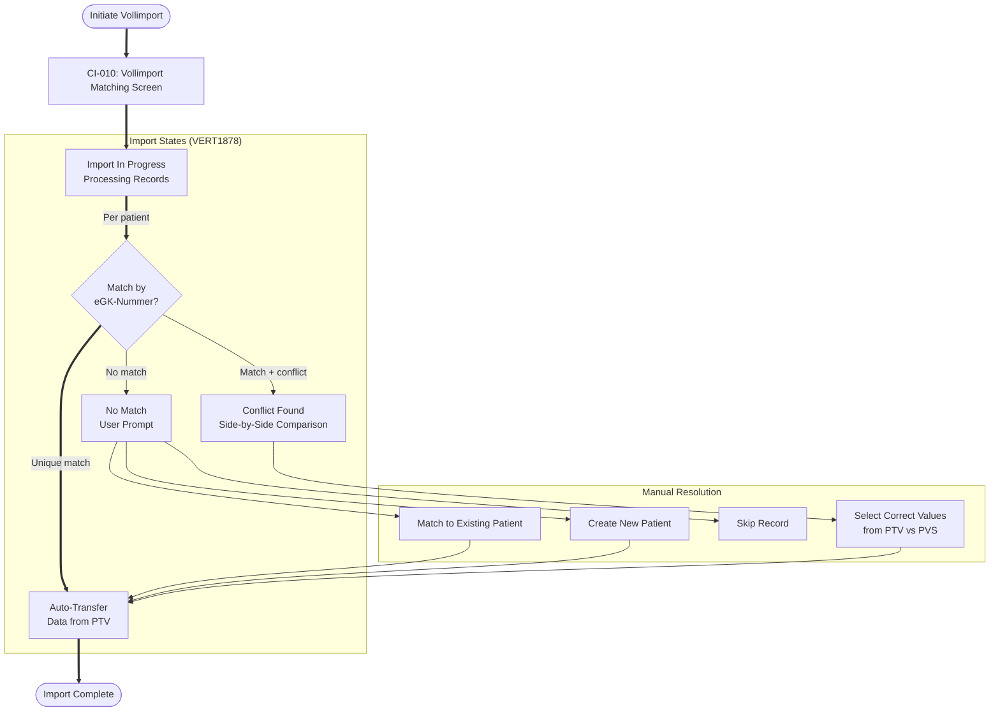
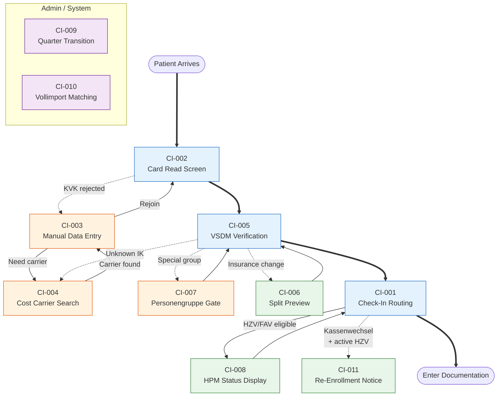

# Patient Check-In — User Workflow Diagrams (Detailed)

Derived from the Patient Check-In Compliance Screen Inventory (11 surfaces, 64 obligations). Unlike the compliance flow diagrams, this version shows **screen transitions, state flows, and component interactions** from the MFA's perspective.

---

## 1. MFA — Check-In Main Flow

The happy path from patient arrival through to documentation entry.

---

## 2. MFA — VSDM & Insurance Verification Detail

Expands the CI-005 node from the main flow. Shows all validation decision points.

```mermaid
flowchart TD
    START(["Card Data Loaded\nfrom CI-002"])

    START ==> VSDM["VSDM Online Check"]
    VSDM ==> FK4136["FK 4136 Captured\n(KP2-190)"]

    FK4136 --> TS{"Timestamp\nCurrent Quarter?\n(KP2-191)"}
    TS ==>|"Yes"| AGE{"Patient\nunder 18?"}
    TS -->|"No / Stale"| TS_WARN["Timestamp Stale Warning"]
    TS_WARN --> AGE

    AGE -->|"Yes"| FEE_EXEMPT["Auto-Mark\nZuzahlungsbefreit"]
    AGE ==>|"No"| COVERAGE
    FEE_EXEMPT --> COVERAGE

    COVERAGE["Check Coverage\n(P2-140)"] --> COV{"Coverage\nValid?"}
    COV ==>|"Valid"| CARRIER
    COV -->|"Expired / Not Begun"| COV_ALERT["Alert: Coverage Issue\n(P2-166)"]
    COV_ALERT -.->|"User acknowledges"| CARRIER

    CARRIER["Check Carrier\nBilling Capability\n(P2-210)"] --> CARR_STATUS{"Carrier\nStatus?"}
    CARR_STATUS ==>|"Active"| IK_CHECK
    CARR_STATUS -->|"Dissolved"| DISSOLVED["Error: Carrier Dissolved\nBilling Blocked (P2-230)"]
    CARR_STATUS -->|"Merged"| FUSION["Redirect to Absorbing\nCarrier (P2-220)"]
    FUSION --> IK_CHECK

    IK_CHECK{"IK Valid?\n(P2-260)"} ==>|"Yes"| PG_CHECK
    IK_CHECK -->|"Invalid / Expired"| IK_WARN["Warning: Invalid IK\nOverride Available"]
    IK_CHECK -->|"Unknown"| IK_UNKNOWN["→ CI-004: Carrier Search\n(P2-270, P2-275)"]
    IK_WARN -.->|"User overrides"| PG_CHECK

    PG_CHECK{"Personen-\ngruppe?\n(P2-320)"} ==>|"Standard"| DATA_CHANGE
    PG_CHECK -->|"PG 09"| ASYL["→ CI-007: AsylbLG\nRestriction Notice\n(P2-325)"]
    PG_CHECK -->|"Other special"| KTAB["→ CI-007: KTAB\nSelection (P2-320)"]
    ASYL --> DATA_CHANGE
    KTAB --> DATA_CHANGE

    subgraph KTAB_Gate["CI-007: Personengruppe Gate"]
        KTAB_DISSOLVED{"KTAB\nDissolved?\n(P2-285)"}
        KTAB_DISSOLVED -->|"Yes"| KTAB_BLOCK["Error: KTAB Dissolved\nProcessing Blocked"]
        KTAB_DISSOLVED ==>|"No"| KTAB_OK["KTAB Valid"]
    end

    DATA_CHANGE{"VSDM Data\nChanged?\n(KP2-557)"} -->|"Yes"| BILLING_UPD["Update Billing\nRecords"]
    DATA_CHANGE ==>|"No"| INS_CHANGE
    BILLING_UPD --> INS_CHANGE

    INS_CHANGE{"Insurance\nChanged?\n(P2-530)"} -->|"Yes"| SPLIT["→ CI-006: Split Preview\n(P2-535)"]
    INS_CHANGE ==>|"No"| CONFLICT
    SPLIT --> CONFLICT

    CONFLICT{"Stammdaten\nConflict?\n(VERT1483)"} -->|"Yes"| CONFLICT_ALERT["Conflict Alert:\neGK vs PVS"]
    CONFLICT ==>|"No"| DONE
    CONFLICT_ALERT -.->|"Resolved"| DONE(["→ CI-001: Routing"])
```

---

## 3. MFA — Check-In Routing & Path Selection

Expands the CI-001 node. Shows the KV vs HZV/FAV decision tree.

---

## 4. MFA — Alternate Path: Manual Entry & Carrier Search

When card read fails or carrier is unknown.

---

## 5. MFA — Insurance Change & Billing Splits

When insurance or status changes mid-quarter.

---

## 6. MFA — Personengruppe & KTAB Gate

Special patient group handling during VSDM verification.

---

## 7. Admin — Quarter Transition

System-level process at Quartalswechsel.

---

## 8. Admin — Vollimport Matching

Bulk patient data import from PTV.

---

## 9. Overview — Surface Navigation Map

How all 11 surfaces connect in the check-in workflow.

**Legend:**
- 🔵 Blue — Tier 1 foundation screens (daily, design-blocking)
- 🟠 Orange — Tier 3 gap-derived screens (manual fallbacks)
- 🟢 Green — Tier 2 supporting screens (conditional triggers)
- 🟣 Purple — Tier 4 admin screens (infrequent)
