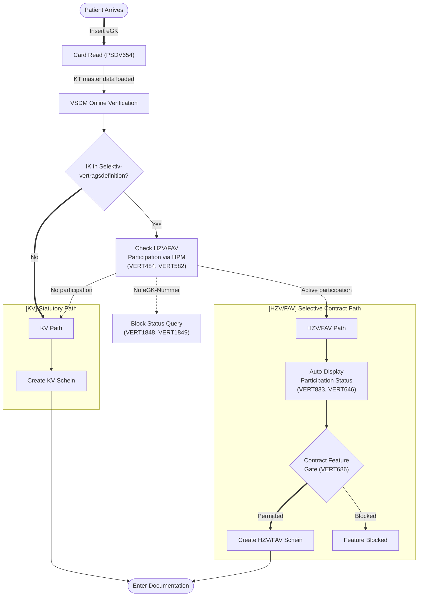
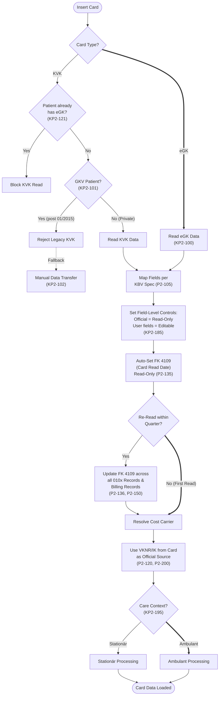
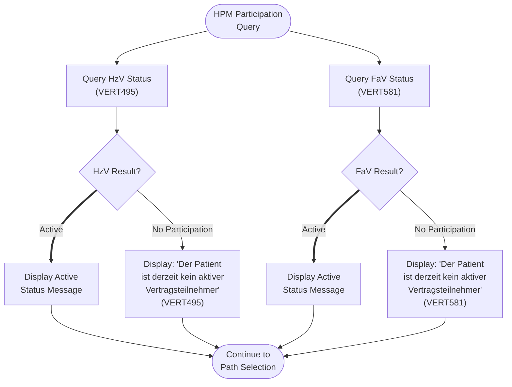
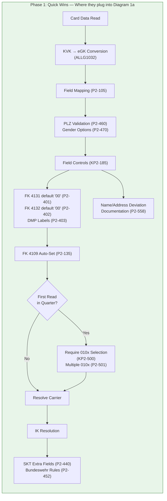
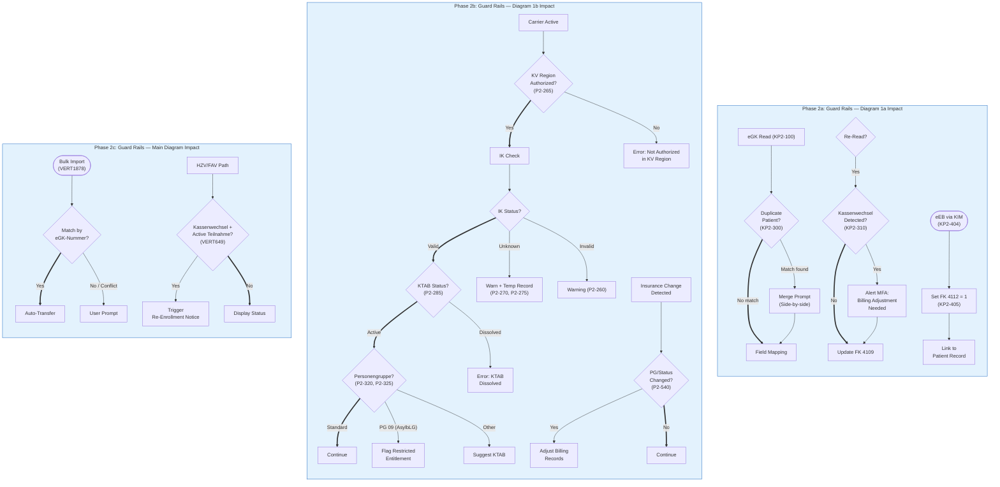
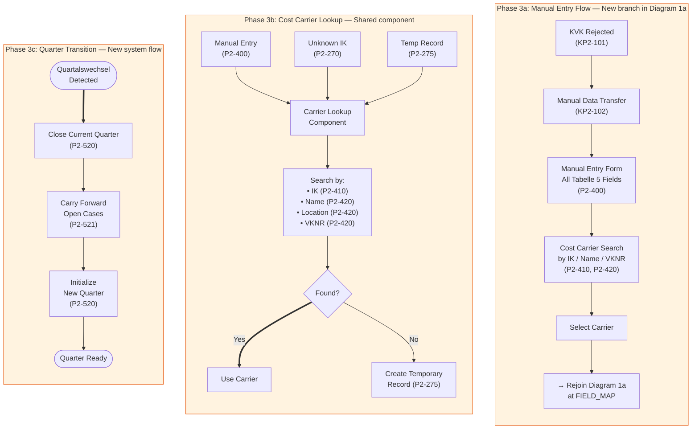

# Flow Diagram: Patient Check-In — Compliance Gates

**Related:** [Compliance Screens (screen-level)](DATA260319-checkin-compliance-screens.md) — compliance obligation mapping per screen.

## 1. Main Diagram — Routing Logic

### Diagram

### Covered Obligations (9)

| # | ID | Obligation | Requirement Type | Ext. Source | Status | Verification Method | User Story & AC | Goals | Track |
|---|---|---|---|---|---|---|---|---|---|
| 305 | PSDV654 | KT master data file (ehd) must be supported | Mandatory | AKA Q1-26-1 | TBC | Data import validation | As a practice staff (MFA), I want kT master data file (ehd) is supported, so that patient master data is pseudonymized correctly. **AC:** Given a KT-Stammdatei (ehd), when imported, then all Kostenträger records are parsed and stored correctly | BG-1a | _ |
| 92 | VERT484 | When creating a KV billing Schein, the Vertragssoftware must provide a function to check the patient's HzV participation status online via the Pruef- und Abrechnungsmodul, if the patient's Kassen-IK is in the current Kostentraegerdaten of the Selektivvertragsdefinitionen and no active participation exists | Mandatory | AKA Q1-26-1 | TBC | Integration test (API) | As a practice owner, I want when creating a KV billing Schein, the Vertragssoftware provide a function to check the patient's HzV participation status online via the Pruef- und Abrechnungsmodul, if the patient's Kassen-IK is in the current Kostentraegerdaten of the Selektivvertragsdefinitionen and no active participation exists, so that contract participation is managed correctly. **AC:** Given a patient whose Kassen-IK matches active Selektivvertragsdefinitionen and no active participation exists, when a KV Schein is created, then an online HzV participation check via HPM is offered; given the HPM returns a result, then it is displayed to the user | BG-1a | _ |
| 96 | VERT582 | When creating a KV Schein or first documenting KV services, the Vertragssoftware must check both FaV and HzV participation status online via the Pruef- und Abrechnungsmodul if the patient's Kassen-IK is in the Selektivvertragsdefinitionen Kostentraegerdaten | Mandatory | AKA Q1-26-1 | TBC | Integration test (API) | As a practice owner, I want when creating a KV Schein or first documenting KV services, the Vertragssoftware check both FaV and HzV participation status online via the Pruef- und Abrechnungsmodul if the patient's Kassen-IK is in the Selektivvertragsdefinitionen Kostentraegerdaten, so that contract participation is managed correctly. **AC:** Given a KV Schein is created or KV services first documented, when the patient's Kassen-IK is in Selektivvertragsdefinitionen Kostentraegerdaten, then both FaV and HzV participation are checked online via HPM | BG-1a | _ |
| 102 | VERT646 | System must display participation status | Mandatory | AKA Q1-26-1 | TBC | Integration test (API) | As a practice owner, I want display participation status, so that contract participation is managed correctly. **AC:** Given a Patient with one or more Verträge, when the patient view is opened, then all Teilnahmestatus values are visible | BG-1a, BG-3 | _ |
| 108 | VERT833 | Participation status must auto-display | Mandatory | AKA Q1-26-1 | TBC | Integration test (API) | As a practice owner, I want participation status auto-display, so that contract participation is managed correctly. **AC:** Given a Patient opened in the system, when the patient has Selektivvertrag-Teilnahme, then the status is automatically visible without manual query | BG-1a, BG-5 | _ |
| 106 | VERT686 | Contract-specific features must be gated by contract support | Mandatory | AKA Q1-26-1 | TBC | Integration test (API) | As a practice owner, I want contract-specific features is gated by contract support, so that contract participation is managed correctly. **AC:** Given a Vertrag not supporting a specific feature, when the user attempts to use it, then access is blocked | BG-1a, BG-3 | _ |
| 128 | VERT1848 | The Vertragssoftware must use the patient's eGK-Nummer for participation status queries; legacy Versichertennummern must not be used, and if no eGK-Nummer is available, participation status must not be determined | Mandatory | AKA Q1-26-1 | TBC | Integration test (API) | As a practice owner, I want the Vertragssoftware use the patient's eGK-Nummer for participation status queries; legacy Versichertennummern not be used, and if no eGK-Nummer is available, participation status not be determined, so that contract participation is managed correctly. **AC:** Given a patient with an eGK-Nummer, when participation status is queried, then the eGK-Nummer is used; given a patient without eGK-Nummer, then the status query is blocked; given a legacy Versichertennummer, then it is not accepted for status queries | BG-1a | _ |
| 129 | VERT1849 | If the participation status cannot be determined because the patient has no valid eGK-Nummer, the Vertragssoftware must display the hint. This hint must only appear when the status is actively being determined | Mandatory | AKA Q1-26-1 | TBC | Integration test (API) | As a practice owner, I want if the participation status cannot be determined because the patient has no valid eGK-Nummer, the Vertragssoftware display the hint, so that contract participation is managed correctly. **AC:** Given a patient without eGK-Nummer, when participation status is being determined, then the hint 'Der Teilnahmestatus kann nicht ermittelt werden, da keine gueltige eGK-Versichertennummer vorliegt' is displayed; given the status is not being actively queried, then the hint does not appear | BG-1a | _ |

### Gaps — Main Diagram (3 missing)

| # | ID | Obligation | Requirement Type | Ext. Source | Status | Verification Method | User Story & AC | Goals | Track |
|---|---|---|---|---|---|---|---|---|---|
| 287 | ALLG1032 | KVK data records must be converted to eGK format per current KBV specifications (KBV_ITA_VGEX_Mapping_KVK.pdf), including for late-arriving cases (Nachzuegler) | Mandatory | AKA Q1-26-1 | TBC | Manual review | As a practice owner, I want kVK data records is converted to eGK format per current KBV specifications, including for late-arriving cases (Nachzuegler), so that general compliance requirements are met. **AC:** Given KVK data records including Nachzuegler cases, when imported, then they are converted to eGK format per current KBV mapping specifications | BG-1a | _ |
| 132 | VERT1878 | During a full import (Vollimport), all data from the PTV must be automatically transferred to the Vertragssoftware if the patient can be uniquely matched by eGK-Nummer; defined exception cases must be handled separately with user prompts | Mandatory | AKA Q1-26-1 | TBC | Integration test (API) | As a practice owner, I want during a full import (Vollimport), all data from the PTV is automatically transferred if the patient can be uniquely matched by eGK-Nummer; exception cases handled with user prompts, so that contract participation is managed correctly. **AC:** Given a Vollimport with patient data, when patients match by eGK-Nummer, then data is auto-transferred; given an exception case (no eGK match, status conflict), then the system prompts the user for manual resolution | BG-1a | _ |
| 105 | VERT649 | System must check for insurance changes and trigger re-enrollment notices | Mandatory | AKA Q1-26-1 | TBC | Integration test (API) | As a practice owner, I want check for insurance changes and trigger re-enrollment notices, so that contract participation is managed correctly. **AC:** Given a Kassenwechsel detected, when the patient has active Teilnahme, then a re-enrollment notice is triggered | BG-1a, BG-3 | _ |

---

## 1a. Card Read-In Detail

### Diagram

Expands the `Card Read (PSDV654)` node from the main diagram.

### Covered Obligations (12)

| # | ID | Obligation | Requirement Type | Ext. Source | Status | Verification Method | User Story & AC | Goals | Track |
|---|---|---|---|---|---|---|---|---|---|
| 323 | KP2-100 | Patient data must be capturable from eGK/KVK cards through connected card terminals | Mandatory | KVDT V6.04 §2–§4 | TBC | Data import validation | As a practice staff (MFA), I want patient data is capturable from eGK/KVK cards through connected card terminals, so that patient data management meets KVDT standards. **AC:** Given a connected Kartenterminal, when an eGK is read, then patient data is captured into the PVS | BG-1b | _ |
| 324 | KP2-101 | Legacy KVK cards must be rejected for statutory insured persons since January 2015 | Mandatory | KVDT V6.04 §2–§4 | TBC | Data import validation | As a practice staff (MFA), I want legacy KVK cards is rejected for statutory insured persons since January 2015, so that patient data management meets KVDT standards. **AC:** Given a KVK card for a GKV-Versicherten, when read after 01/2015, then the card is rejected with an error | BG-1b | _ |
| 325 | KP2-102 | Manual transfer of patient data from rejected cards or mobile terminals must be supported | Mandatory | KVDT V6.04 §2–§4 | TBC | Data import validation | As a practice staff (MFA), I want manual transfer of patient data from rejected cards or mobile terminals is supported, so that patient data management meets KVDT standards. **AC:** Given a rejected card or mobile terminal, when manual data transfer is initiated, then all patient fields are enterable | BG-1b | _ |
| 326 | P2-105 | eGK field mapping must follow the KBV mapping specification exactly | Mandatory | KVDT V6.04 §2–§4 | TBC | Data import validation | As a practice staff (MFA), I want eGK field mapping follow the KBV mapping specification exactly, so that patient data management meets KVDT standards. **AC:** Given eGK data read, when mapped to PVS fields, then the KBV Mapping-Spezifikation is followed exactly | BG-1b | _ |
| 327 | P2-120 | Insurance card data must be treated as official, using VKNR/IK for cost carrier resolution | Mandatory | KVDT V6.04 §2–§4 | TBC | Data import validation | As a practice staff (MFA), I want insurance card data is treated as official, using VKNR/IK for cost carrier resolution, so that patient data management meets KVDT standards. **AC:** Given eGK data, when cost carrier is resolved, then VKNR/IK from the card is used as authoritative source | BG-1b | _ |
| 328 | KP2-121 | Reading outdated KVK cards must be prevented for patients already read on eGK | Mandatory | KVDT V6.04 §2–§4 | TBC | Data import validation | As a practice staff (MFA), I want reading outdated KVK cards is prevented for patients already read on eGK, so that patient data management meets KVDT standards. **AC:** Given a Patient already read via eGK, when a KVK read is attempted, then the KVK read is blocked | BG-1b | _ |
| 329 | P2-135 | Card read date (FK 4109) must be captured automatically and cannot be manually edited | Mandatory | KVDT V6.04 §2–§4 | TBC | Data import validation | As a practice staff (MFA), I want card read date (FK 4109) is captured automatically and cannot be manually edited, so that patient data management meets KVDT standards. **AC:** Given an eGK read, when FK 4109 is captured, then the date is set automatically and the field is read-only | BG-1b | _ |
| 330 | P2-136 | Card read date must be updated across all affected billing records on re-read within quarter | Mandatory | KVDT V6.04 §2–§4 | TBC | Data import validation | As a practice staff (MFA), I want card read date is updated across all affected billing records on re-read within quarter, so that patient data management meets KVDT standards. **AC:** Given eGK re-read within a Quartal, when FK 4109 is updated, then all affected Abrechnungssätze are updated | BG-1b | _ |
| 332 | P2-150 | Read-in date (FK 4109) must be updated across all 010x record types on re-read | Mandatory | KVDT V6.04 §2–§4 | TBC | Data import validation | As a practice staff (MFA), I want read-in date (FK 4109) is updated across all 010x record types on re-read, so that patient data management meets KVDT standards. **AC:** Given eGK re-read, when FK 4109 is updated, then all 010x Satzarten are updated | BG-1b | _ |
| 334 | KP2-185 | Card data must be stored with field-level controls distinguishing official from user-editable fields | Mandatory | KVDT V6.04 §2–§4 | TBC | Data import validation | As a practice staff (MFA), I want card data is stored with field-level controls distinguishing official from user-editable fields, so that patient data management meets KVDT standards. **AC:** Given eGK data stored, when fields are displayed, then official (card) fields are read-only and user-editable fields are marked | BG-1b | _ |
| 338 | P2-200 | Cost carrier must be identified via IK from KT master data file and VKNR/KTAB resolved | Mandatory | KVDT V6.04 §2–§4 | TBC | Data import validation | As a practice staff (MFA), I want cost carrier is identified via IK from KT master data file and VKNR/KTAB resolved, so that patient data management meets KVDT standards. **AC:** Given a VKNR, when Kostenträger is resolved, then the IK is looked up in KT-Stammdatei and KTAB is resolved | BG-1b | _ |
| 337 | KP2-195 | Patient master data must be processed separately for outpatient and inpatient care contexts | Mandatory | KVDT V6.04 §2–§4 | TBC | Data import validation | As a practice staff (MFA), I want patient master data is processed separately for outpatient and inpatient care contexts, so that patient data management meets KVDT standards. **AC:** Given Stammdaten, when processed, then ambulant and stationär contexts are handled separately | BG-1b | _ |

### Gaps — 1a. Card Read-In (17 missing)

| # | ID | Obligation | Requirement Type | Ext. Source | Status | Verification Method | User Story & AC | Goals | Track |
|---|---|---|---|---|---|---|---|---|---|
| 347 | KP2-300 | Duplicate patient records must be prevented by matching card data against existing records | Mandatory | KVDT V6.04 §2–§4 | TBC | Data import validation | As a practice staff (MFA), I want duplicate patient records is prevented by matching card data against existing records, so that patient data management meets KVDT standards. **AC:** Given eGK data, when a matching patient record exists, then the system merges rather than creating a duplicate | BG-1b | _ |
| 348 | KP2-310 | Insurance changes must be detected immediately and user alerted for billing adjustments | Mandatory | KVDT V6.04 §2–§4 | TBC | Data import validation | As a practice staff (MFA), I want insurance changes is detected immediately and user alerted for billing adjustments, so that patient data management meets KVDT standards. **AC:** Given a Kassenwechsel on eGK re-read, when detected, then the user is immediately alerted for Abrechnungsanpassungen | BG-1b | _ |
| 351 | P2-400 | All insured person data fields per Tabelle 5 must be enterable manually | Mandatory | KVDT V6.04 §2–§4 | TBC | Data import validation | As a practice staff (MFA), I want all insured person data fields per Tabelle 5 is enterable manually, so that patient data management meets KVDT standards. **AC:** Given Versichertenstammdaten entry, when manual input is used, then all fields per Tabelle 5 are available | BG-1b | _ |
| 352 | P2-401 | Besondere Personengruppe (FK 4131) must default to '00' with user override | Mandatory | KVDT V6.04 §2–§4 | TBC | Data import validation | As a practice staff (MFA), I want besondere Personengruppe (FK 4131) default to '00' with user override, so that patient data management meets KVDT standards. **AC:** Given FK 4131, when a new patient is created, then the default is '00' and the user can override it | BG-1b | _ |
| 353 | P2-402 | DMP indicator (FK 4132) must default to '00' with user override | Mandatory | KVDT V6.04 §2–§4 | TBC | Data import validation | As a practice staff (MFA), I want dMP indicator (FK 4132) default to '00' with user override, so that patient data management meets KVDT standards. **AC:** Given FK 4132, when a new patient is created, then the default is '00' and the user can override it | BG-1b | _ |
| 354 | P2-403 | DMP indicator code meanings must be displayed in human-readable form | Mandatory | KVDT V6.04 §2–§4 | TBC | Data import validation | As a practice staff (MFA), I want dMP indicator code meanings is displayed in human-readable form, so that patient data management meets KVDT standards. **AC:** Given FK 4132 codes, when displayed, then human-readable DMP-Programm names are shown | BG-1b | _ |
| 355 | KP2-404 | Electronic replacement confirmations (eEB) via KIM must be receivable | Conditional Mandatory | KVDT V6.04 §2–§4 | TBC | Data import validation | As a practice staff (MFA), I want electronic replacement confirmations (eEB) via KIM is receivable, so that patient data management meets KVDT standards. **AC:** Given KIM connectivity, when an eEB is received, then it is processed and linked to the patient record | BG-1b | _ |
| 356 | KP2-405 | FK 4112 = 1 billing marker must be set upon receiving an eEB | Conditional Mandatory | KVDT V6.04 §2–§4 | TBC | Data import validation | As a practice staff (MFA), I want fK 4112 = 1 billing marker is set upon receiving an eEB, so that patient data management meets KVDT standards. **AC:** Given an eEB received, when processed, then FK 4112 is set to 1 in the billing record | BG-1b | _ |
| 357 | P2-410 | Cost carrier search by IK must be available | Mandatory | KVDT V6.04 §2–§4 | TBC | Data import validation | As a practice staff (MFA), I want cost carrier search by IK is available, so that patient data management meets KVDT standards. **AC:** Given a user searching Kostenträger, when IK is entered, then matching carriers are returned | BG-1b | _ |
| 358 | P2-420 | Cost carrier search by name, location, and VKNR must be available | Mandatory | KVDT V6.04 §2–§4 | TBC | Data import validation | As a practice staff (MFA), I want cost carrier search by name, location, and VKNR is available, so that patient data management meets KVDT standards. **AC:** Given a Kostenträger search, when name/location/VKNR is entered, then matching carriers are returned | BG-1b | _ |
| 360 | P2-440 | Additional data fields for SKT cost carriers per kvx3 must be captured | Mandatory | KVDT V6.04 §2–§4 | TBC | Data import validation | As a practice staff (MFA), I want additional data fields for SKT cost carriers per kvx3 is captured, so that patient data management meets KVDT standards. **AC:** Given an SKT-Kostenträger per kvx3, when data is entered, then additional SKT-specific fields are available | BG-1b | _ |
| 361 | P2-452 | German military (Bundeswehr) patients by VKNR 79868/79869 must be recognized with special rules | Mandatory | KVDT V6.04 §2–§4 | TBC | Data import validation | As a practice staff (MFA), I want german military (Bundeswehr) patients by VKNR 79868/79869 is recognized with special rules, so that patient data management meets KVDT standards. **AC:** Given VKNR 79868/79869, when detected, then Bundeswehr patient rules are applied | BG-1b | _ |
| 362 | P2-460 | Postal codes must be validated against PLZ master data | Mandatory | KVDT V6.04 §2–§4 | TBC | Data import validation | As a practice staff (MFA), I want postal codes is validated against PLZ master data, so that patient data management meets KVDT standards. **AC:** Given a PLZ entered, when validated, then it must exist in the current PLZ-Stammdaten | BG-1b | _ |
| 363 | P2-470 | All gender options including diverse (PStG) must be supported | Mandatory | KVDT V6.04 §2–§4 | TBC | Data import validation | As a practice staff (MFA), I want all gender options including diverse (PStG) is supported, so that patient data management meets KVDT standards. **AC:** Given patient gender entry, when all options are available, then male/female/diverse/unbestimmt per PStG are selectable | BG-1b | _ |
| 366 | KP2-500 | Billing record type (Satzart 010x) selection must be required on first card read per quarter | Mandatory | KVDT V6.04 §2–§4 | TBC | Data import validation | As a practice staff (MFA), I want billing record type (Satzart 010x) selection is required on first card read per quarter, so that patient data management meets KVDT standards. **AC:** Given first eGK read in a Quartal, when the card is read, then Satzart 010x selection is required | BG-1b | _ |
| 367 | P2-501 | Multiple 010x billing records per patient per quarter must be supported | Mandatory | KVDT V6.04 §2–§4 | TBC | Data import validation | As a practice staff (MFA), I want multiple 010x billing records per patient per quarter is supported, so that patient data management meets KVDT standards. **AC:** Given a Patient in a Quartal, when multiple billing contexts exist, then multiple 010x records are supported | BG-1b | _ |
| 388 | P2-558 | Name/address deviations from card data must be documentable while preserving official data | Mandatory | KVDT V6.04 §2–§4 | TBC | Data import validation | As a practice staff (MFA), I want name/address deviations from card data is documentable while preserving official data, so that patient data management meets KVDT standards. **AC:** Given name/address deviations from eGK, when documented, then deviations are stored alongside official card data | BG-1b | _ |

---

## 1b. VSDM & Insurance Validation Detail

### Diagram

Expands the `VSDM Online Verification` node and adds the missing insurance validity gates.

```mermaid
flowchart TD
    CARD_DATA(["Card Data Loaded"])

    CARD_DATA ==> VSDM["VSDM Online Check"]

    VSDM --> FK4136["Capture FK 4136\n(Proof Status)\n(KP2-190)"]
    FK4136 --> TS_VALID{"VSDM Timestamp\nwithin Current\nQuarter?\n(KP2-191)"}
    TS_VALID ==>|"Yes"| AGE_CHECK{"Patient\nunder 18?\n(KP2-191)"}
    TS_VALID -->|"No / Stale"| TS_WARN["Timestamp Warning"]
    TS_WARN --> AGE_CHECK

    AGE_CHECK -->|"Yes"| FEE_EXEMPT["Auto-Mark\nZuzahlungsbefreit"]
    AGE_CHECK ==>|"No"| COVERAGE
    FEE_EXEMPT --> COVERAGE

    COVERAGE["Check Insurance\nCoverage Validity\n(P2-140, P2-166)"]
    COVERAGE --> COV_STATUS{"Coverage\nValid?"}
    COV_STATUS ==>|"Valid"| CARRIER_CHECK
    COV_STATUS -->|"Expired / Not Begun"| COV_ALERT["Alert: Coverage\nExpired or Not\nYet Begun (P2-166)"]
    COV_ALERT -.->|"User acknowledges"| CARRIER_CHECK

    CARRIER_CHECK["Check Cost Carrier\nBilling Capability\n(P2-210)"]
    CARRIER_CHECK --> CARRIER_STATUS{"Carrier Status?"}

    CARRIER_STATUS ==>|"Active"| IK_VALID
    CARRIER_STATUS -->|"Dissolved"| DISSOLVED["Error: Carrier Dissolved\nBilling Blocked (P2-230)"]
    CARRIER_STATUS -->|"Merged"| FUSION["Redirect to\nAbsorbing Carrier\n(P2-220)"]
    FUSION --> IK_VALID

    IK_VALID{"IK Valid &\nCurrent?\n(P2-260)"}
    IK_VALID ==>|"Yes"| DATA_CHANGE
    IK_VALID -->|"Invalid / Expired"| IK_WARN["Warning: Invalid IK\n(Proceed after\nManual Check)\n(P2-260)"]
    IK_WARN -.->|"User proceeds"| DATA_CHANGE

    DATA_CHANGE{"VSDM Data\nChanged Mid-Quarter?\n(KP2-557)"}
    DATA_CHANGE -->|"Yes"| UPDATE_BILLING["Update Affected\nBilling Records\n(KP2-557)"]
    DATA_CHANGE ==>|"No"| INS_CHANGE

    UPDATE_BILLING --> INS_CHANGE

    INS_CHANGE{"Insurance Changed\nwithin Quarter?\n(P2-530)"}
    INS_CHANGE -->|"Yes"| SPLIT["Split Billing Records\nat Change Date\n(P2-535)"]
    INS_CHANGE ==>|"No"| CONFLICT

    SPLIT --> CONFLICT

    CONFLICT{"Stammdaten\nConflict?\n(VERT1483)"}
    CONFLICT -->|"Yes"| CONFLICT_ALERT["Flag Conflict:\neGK vs PVS\n(VERT1483)"]
    CONFLICT ==>|"No"| DONE

    CONFLICT_ALERT -.->|"Resolved"| DONE(["Proceed to\nIK / Path Check"])
```

### Covered Obligations (11)

| # | ID | Obligation | Requirement Type | Ext. Source | Status | Verification Method | User Story & AC | Goals | Track |
|---|---|---|---|---|---|---|---|---|---|
| 335 | KP2-190 | VSDM online proof status (FK 4136) must be captured and transmitted | Mandatory | KVDT V6.04 §2–§4 | TBC | Data import validation | As a practice staff (MFA), I want vSDM online proof status (FK 4136) is captured and transmitted, so that patient data management meets KVDT standards. **AC:** Given VSDM online check, when FK 4136 is captured, then the proof status is stored and included in billing | BG-1b | _ |
| 336 | KP2-191 | VSDM timestamps must be validated against current quarter; patients under 18 auto-marked fee-exempt | Mandatory | KVDT V6.04 §2–§4 | TBC | Data import validation | As a practice staff (MFA), I want vSDM timestamps is validated against current quarter; patients under 18 auto-marked fee-exempt, so that patient data management meets KVDT standards. **AC:** Given VSDM timestamp, when validated against current Quartal, then validity is checked; patients under 18 are auto-marked zuzahlungsbefreit | BG-1b | _ |
| 331 | P2-140 | Cost carrier benefit obligation must be verified by checking insurance coverage validity | Mandatory | KVDT V6.04 §2–§4 | TBC | Data import validation | As a practice staff (MFA), I want cost carrier benefit obligation is verified by checking insurance coverage validity, so that patient data management meets KVDT standards. **AC:** Given Versichertendaten, when Leistungspflicht is checked, then insurance coverage validity dates are verified | BG-1b | _ |
| 333 | P2-166 | User must be alerted if insurance coverage has expired or not yet begun | Mandatory | KVDT V6.04 §2–§4 | TBC | Data import validation | As a practice staff (MFA), I want user is alerted if insurance coverage has expired or not yet begun, so that patient data management meets KVDT standards. **AC:** Given Versicherungsschutz expired or not yet started, when eGK is read, then the user receives an alert | BG-1b | _ |
| 339 | P2-210 | Cost carrier must have active billing capability before billing operations proceed | Mandatory | KVDT V6.04 §2–§4 | TBC | Data import validation | As a practice staff (MFA), I want cost carrier have active billing capability before billing operations proceed, so that patient data management meets KVDT standards. **AC:** Given a Kostenträger, when Abrechnungsfähigkeit is checked, then billing is only permitted if the carrier is active | BG-1b | _ |
| 340 | P2-220 | Cost carrier mergers (Kassenfusion) must be detected and billing redirected to absorbing carrier | Mandatory | KVDT V6.04 §2–§4 | TBC | Data import validation | As a practice staff (MFA), I want cost carrier mergers (Kassenfusion) is detected and billing redirected to absorbing carrier, so that patient data management meets KVDT standards. **AC:** Given a Kassenfusion, when detected, then billing is automatically redirected to the aufnehmende Kasse | BG-1b | _ |
| 341 | P2-230 | Dissolved cost carriers must display error and prevent further billing | Mandatory | KVDT V6.04 §2–§4 | TBC | Data import validation | As a practice staff (MFA), I want dissolved cost carriers display error and prevent further billing, so that patient data management meets KVDT standards. **AC:** Given an aufgelöster Kostenträger, when billing is attempted, then an error is displayed and billing is blocked | BG-1b | _ |
| 342 | P2-260 | Invalid/expired IK must display warning but allow user to proceed after checking billing capability | Mandatory | KVDT V6.04 §2–§4 | TBC | Data import validation | As a practice staff (MFA), I want invalid/expired IK display warning but allow user to proceed after checking billing capability, so that patient data management meets KVDT standards. **AC:** Given an ungültiges/abgelaufenes IK, when detected, then a warning is shown but the user can proceed after manual check | BG-1b | _ |
| 384 | P2-530 | Insurance changes within a quarter must be detected and processed | Mandatory | KVDT V6.04 §2–§4 | TBC | Data import validation | As a practice staff (MFA), I want insurance changes within a quarter is detected and processed, so that patient data management meets KVDT standards. **AC:** Given a Kassenwechsel within a Quartal, when detected, then the change is processed and billing adjusted | BG-1b | _ |
| 385 | P2-535 | Billing records must be split on insurance change within quarter | Mandatory | KVDT V6.04 §2–§4 | TBC | Data import validation | As a practice staff (MFA), I want billing records is split on insurance change within quarter, so that patient data management meets KVDT standards. **AC:** Given a Kassenwechsel within a Quartal, when detected, then billing records are split at the change date | BG-1b | _ |
| 387 | KP2-557 | Billing records must update when official insured data changes during quarter via VSDM | Mandatory | KVDT V6.04 §2–§4 | TBC | Data import validation | As a practice staff (MFA), I want billing records update when official insured data changes during quarter via VSDM, so that patient data management meets KVDT standards. **AC:** Given VSDM data change during a Quartal, when detected, then affected billing records are updated | BG-1b | _ |

### Gaps — 1b. VSDM & Insurance Validation (9 missing)

| # | ID | Obligation | Requirement Type | Ext. Source | Status | Verification Method | User Story & AC | Goals | Track |
|---|---|---|---|---|---|---|---|---|---|
| 343 | P2-265 | Cost carriers not authorized in KV region must display error and prevent billing | Mandatory | KVDT V6.04 §2–§4 | TBC | Data import validation | As a practice staff (MFA), I want cost carriers not authorized in KV region display error and prevent billing, so that patient data management meets KVDT standards. **AC:** Given a Kostenträger not zugelassen in the KV-Region, when billing is attempted, then an error blocks it | BG-1b | _ |
| 344 | P2-270 | Unknown IK must display warning, allow temporary master records, and advise contacting KV | Mandatory | KVDT V6.04 §2–§4 | TBC | Data import validation | As a practice staff (MFA), I want unknown IK display warning, allow temporary master records, and advise contacting KV, so that patient data management meets KVDT standards. **AC:** Given an unbekanntes IK, when detected, then a warning is shown, a temporary record is creatable, and KV contact is advised | BG-1b | _ |
| 345 | P2-275 | Temporary cost carrier master data records must be creatable | Mandatory | KVDT V6.04 §2–§4 | TBC | Data import validation | As a practice staff (MFA), I want temporary cost carrier master data records is creatable, so that patient data management meets KVDT standards. **AC:** Given an unknown Kostenträger, when a temporary record is created, then it is stored and usable for billing | BG-1b | _ |
| 346 | P2-285 | Dissolved billing areas (KTAB) must display error and prevent further processing | Mandatory | KVDT V6.04 §2–§4 | TBC | Data import validation | As a practice staff (MFA), I want dissolved billing areas (KTAB) display error and prevent further processing, so that patient data management meets KVDT standards. **AC:** Given an aufgelöster KTAB, when encountered, then an error is displayed and processing is blocked | BG-1b | _ |
| 349 | P2-320 | KTAB selection must be assisted based on Besondere Personengruppe | Mandatory | KVDT V6.04 §2–§4 | TBC | Data import validation | As a practice staff (MFA), I want kTAB selection is assisted based on Besondere Personengruppe, so that patient data management meets KVDT standards. **AC:** Given a Besondere Personengruppe, when KTAB selection is needed, then the system suggests the correct KTAB | BG-1b | _ |
| 350 | P2-325 | Restricted healthcare entitlements under AsylbLG must be flagged for Personengruppe 09 | Mandatory | KVDT V6.04 §2–§4 | TBC | Data import validation | As a practice staff (MFA), I want restricted healthcare entitlements under AsylbLG is flagged for Personengruppe 09, so that patient data management meets KVDT standards. **AC:** Given Personengruppe 09 (AsylbLG), when detected, then restricted Leistungsanspruch is flagged | BG-1b | _ |
| 386 | P2-540 | Billing records must be adjusted on Personengruppe/status changes within quarter | Mandatory | KVDT V6.04 §2–§4 | TBC | Data import validation | As a practice staff (MFA), I want billing records is adjusted on Personengruppe/status changes within quarter, so that patient data management meets KVDT standards. **AC:** Given a Personengruppe/Status change within a Quartal, when detected, then billing records are adjusted | BG-1b | _ |
| 382 | P2-520 | Quarter transition rules must be implemented with proper closure and initialization | Mandatory | KVDT V6.04 §2–§4 | TBC | Data import validation | As a practice staff (MFA), I want quarter transition rules is implemented with proper closure and initialization, so that patient data management meets KVDT standards. **AC:** Given a Quartalswechsel, when triggered, then proper closure of old quarter and initialization of new quarter occurs | BG-1b | _ |
| 383 | P2-521 | Open billing cases must be carried forward to new quarter per transition rules | Mandatory | KVDT V6.04 §2–§4 | TBC | Data import validation | As a practice staff (MFA), I want open billing cases is carried forward to new quarter per transition rules, so that patient data management meets KVDT standards. **AC:** Given offene Behandlungsfälle at Quartalswechsel, when transition runs, then cases are carried forward per rules | BG-1b | _ |

---

## 1c. HZV/FAV Status Messages Detail

### Diagram

Expands the HPM participation check with specific response messages.

### Covered Obligations (3)

| # | ID | Obligation | Requirement Type | Ext. Source | Status | Verification Method | User Story & AC | Goals | Track |
|---|---|---|---|---|---|---|---|---|---|
| 94 | VERT495 | When requesting HzV participation, the Vertragssoftware must verify the patient's current HzV participation status online via the Pruef- und Abrechnungsmodul and display appropriate messages depending on whether participation already exists or not | Mandatory | AKA Q1-26-1 | TBC | Integration test (API) | As a practice owner, I want when requesting HzV participation, the Vertragssoftware verify the patient's current HzV participation status online via the Pruef- und Abrechnungsmodul and display appropriate messages depending on whether participation already exists or not, so that contract participation is managed correctly. **AC:** Given HzV participation is requested, when the HPM returns no active participation, then the message 'Der Patient ist derzeit kein aktiver Vertragsteilnehmer' is shown; given active participation exists, then the appropriate status message is displayed | BG-1a | _ |
| 95 | VERT581 | When requesting FaV participation, the Vertragssoftware must verify the patient's current FaV participation status online via the Pruef- und Abrechnungsmodul and display appropriate messages depending on whether participation already exists or not | Mandatory | AKA Q1-26-1 | TBC | Integration test (API) | As a practice owner, I want when requesting FaV participation, the Vertragssoftware verify the patient's current FaV participation status online via the Pruef- und Abrechnungsmodul and display appropriate messages depending on whether participation already exists or not, so that contract participation is managed correctly. **AC:** Given FaV participation is requested, when the HPM returns no active participation, then the message 'Der Patient ist derzeit kein aktiver Vertragsteilnehmer' is shown; given active participation exists, then the appropriate status message is displayed | BG-1a | _ |
| 118 | VERT1483 | Conflicts in patient master data must be flagged | Optional | AKA Q1-26-1 | TBC | Integration test (API) | As a practice owner, I want conflicts in patient master data is flagged, so that contract participation is managed correctly. **AC:** Given Stammdaten conflicts between eGK and PVS, when detected, then the user is alerted with a conflict resolution prompt | BG-5 | _ |

---

## Summary

| Section | Covered | Gaps | Total |
|---|---|---|---|
| Main Diagram | 9 | 3 | 12 |
| 1a. Card Read-In | 12 | 17 | 29 |
| 1b. VSDM & Insurance | 11 | 9 | 20 |
| 1c. HZV/FAV Messages | 3 | 0 | 3 |
| **Total** | **35** | **29** | **64** |

## Recommendations

### 1. Quick Wins — Extend Existing Nodes (Low Effort)

No new screens or flows — data-layer rules and field logic only.

**Impacts:** Diagram 1a (Card Read-In) and Diagram 1b (VSDM & Insurance Validation). These extend existing nodes with additional validation logic.

| Gap IDs | Where it plugs in | Action |
|---|---|---|
| P2-401, P2-402, P2-403 | 1a → after `FIELD_CTRL` | Set FK 4131/4132 defaults to '00', allow override, display DMP labels in human-readable form. |
| P2-460, P2-470 | 1a → after `FIELD_MAP` | Add PLZ validation against master data. Add diverse/unbestimmt gender options per PStG. |
| P2-558 | 1a → after `FIELD_CTRL` | Allow name/address deviation documentation alongside official card data. |
| KP2-500, P2-501 | 1a → after `FK4109` (first read path) | Require Satzart 010x selection on first read. Support multiple 010x per patient per quarter. |
| P2-440, P2-452 | 1a → after `IK_RESOLVE` | Add SKT extra fields (kvx3). Detect Bundeswehr VKNR 79868/79869 with special rules. |
| ALLG1032 | 1a → before `FIELD_MAP` (KVK path) | Convert KVK records to eGK format per KBV mapping spec, including Nachzuegler. |

---

### 2. Guard Rails — Add Decision Gates (Medium Effort)

New alerts, warnings, or blocks that don't exist in the current UI.

**Impacts:** Diagram 1a (Card Read-In), Diagram 1b (VSDM & Insurance Validation), and Main Diagram (HZV/FAV path). These insert new decision nodes into existing flows.

| Gap IDs | What to build | Impacts diagram | Insertion point |
|---|---|---|---|
| KP2-300 | **Duplicate prevention** — match card data against existing patient records on read | 1a | After `EGK_READ`, before `FIELD_MAP` |
| KP2-310 | **Immediate insurance change alert** — detect Kassenwechsel on re-read, alert MFA | 1a | After `REREAD` → "Yes" path, before `UPDATE_RECORDS` |
| P2-265 | **KV region authorization check** — block carriers not zugelassen in KV region | 1b | After `CARRIER_STATUS` → "Active", new gate before `IK_VALID` |
| P2-270, P2-275 | **Unknown IK handling** — warn, allow temporary record, advise KV contact | 1b | New branch from `IK_VALID` → "Unknown" |
| P2-285 | **Dissolved KTAB block** — display error and prevent further processing | 1b | New check after `IK_VALID`, parallel to carrier status |
| P2-320, P2-325 | **Personengruppe gates** — assist KTAB selection, flag AsylbLG (PG 09) | 1b | After `COVERAGE`, new branch for Personengruppe |
| P2-540 | **Status change adjustment** — adjust billing on Personengruppe/status changes | 1b | After `INS_CHANGE`, new parallel check |
| KP2-404, KP2-405 | **eEB processing** — receive via KIM, set FK 4112 = 1 | 1a | New parallel input path alongside card read |
| VERT649 | **Re-enrollment notice** — Kassenwechsel + active Teilnahme triggers notice | Main | After `CHECK_PART` → HZV/FAV path |
| VERT1878 | **Vollimport matching** — auto-transfer by eGK-Nummer, prompt exceptions | Main | New entry path before `START` (bulk import) |

---

### 3. New Flows (Higher Effort)

New user paths or screens that need wireframes.

**Impacts:** Diagram 1a (new branch from KVK rejection), Diagram 1b (new lookup component), and a new system-level admin flow outside the check-in diagrams.

| Gap IDs | What to build | Impacts diagram | Insertion point |
|---|---|---|---|
| P2-400 | **Manual entry form** — all Tabelle 5 fields for insured person data | 1a | New screen branching off `MANUAL` node (KP2-102 rejection path) |
| P2-410, P2-420 | **Cost carrier search** — search by IK, name, location, VKNR | 1a + 1b | Shared lookup component used by manual entry (1a) and unknown-IK handling (1b) |
| P2-520, P2-521 | **Quarter transition** — proper closure, initialization, and case carry-forward | New (system) | System-level process, runs at Quartalswechsel, not during per-patient check-in |

---

### Recommended Sequence

| Phase | Scope | Obligations | Notes |
|---|---|---|---|
| **Phase 1** (Sprint-sized) | Quick wins (group 1) | 11 obligations | No new UI, data/logic layer only |
| **Phase 2** (Sprint-sized) | Guard rails (group 2) | 13 obligations | Design alert/warning components, carrier gates |
| **Phase 3** (Needs discovery) | New flows (group 3) | 5 obligations | Manual entry form, carrier search, quarter transition |

### Suggested Next Step

Start with a wireframe for the **card read-in sequence** (diagram 1a) — it has the most gaps (17) concentrated in one user moment. Most of Phase 1 lives here, and engineering can implement data-layer rules in parallel while Phase 2 alert states are designed.
