# PVS-Core Compliance Workflow Diagrams

Derived from the PM Compliance Inventory (604 items across AKA, KBV, KVDT, ICD-10-GM, gematik, and crucial workflows). Each diagram shows **where KV and non-KV (HZV/FAV) paths diverge**.

**Convention:** Nodes marked `[KV]` apply to KV/statutory billing only. Nodes marked `[HZV/FAV]` apply to selective contracts only. Unmarked nodes apply to both paths.

---

## Workflow Diagram Index

| # | Workflow | Inventory Source | Items (est.) | Status |
|---|---|---|---|---|
| 1 | Patient Check-In — Compliance Gates | PSDV, VERT, KVDT §2–§4 | ~64 | Done |
| 2 | Contract Participation Management — HZV/FAV Only | VERT (43 items) | ~43 | Diagrammed |
| 3 | Patient Enrollment — HZV/FAV Only | VERE (25 items) | ~25 | Diagrammed |
| 4 | Billing Documentation — KV vs HZV/FAV Divergence | ABRD (46 items) | ~46 | Diagrammed |
| 5 | Billing Submission Process | ABRG (45 items) | ~45 | Diagrammed |
| 6 | Diagnosis Entry & ICD-10-GM Validation | ICD-10-GM (57 items) | ~57 | Diagrammed |
| 7 | Service Documentation — EBM / KVDT Compliance | KBV EBM (14 items), KVDT-SD | ~14 | Diagrammed |
| 8 | Prescription & Drug Safety | Crucial Workflows 3.19, VSST medication | ~54 | Diagrammed |
| 9 | Form Management — KV vs HZV/FAV Forms | FORM (~25 items) | ~25 | Diagrammed |
| 10 | Hilfsmittel Prescribing | VSST623–633 | ~12 | Diagrammed |
| 11 | eDMP & Chronic Care Compliance | Crucial Workflows 3.21 (12 items) | ~12 | Diagrammed |
| 12 | eAU, eArztbrief & ePA | Crucial Workflows 3.20 (20 items) | ~20 | Diagrammed |
| 13 | IT Connectivity & Infrastructure | gematik TI/KIM, ITVE | ~40 | Diagrammed |
| 14 | Compliance Obligation Summary by Path | All sections | 604 | Diagrammed |
| — | TSS Appointment Case Management | KVDT §2–§4 (KP2-502–514) | ~14 | Planned |
| — | Patient Master Data Lifecycle | KVDT §2–§4 (P2-400–470) | ~15 | Planned |
| — | Quarter Transition & Case Carry-Forward | KVDT §2–§4 (P2-520–540) | ~5 | Planned |
| — | General Compliance (ALLG) | ALLG (28 items) | ~28 | Planned |
| — | Billing Infrastructure — KVDT File & Practice Setup | KVDT §1/§5 | ~30 | Planned |
| — | GOÄ Private Billing Validation | GOÄ (1 item) | ~1 | Planned |

> **Status key:** `Done` = diagram + gaps report complete. `Diagrammed` = workflow diagram exists, gaps report pending. `Planned` = not yet diagrammed.

---

## 1. Patient Check-In — Compliance Gates

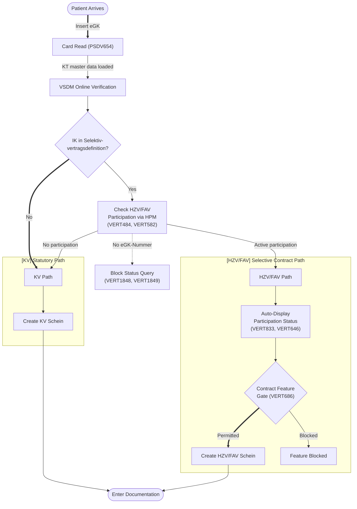

### 1a. Card Read-In Detail

Expands the `Card Read (PSDV654)` node from the main diagram.

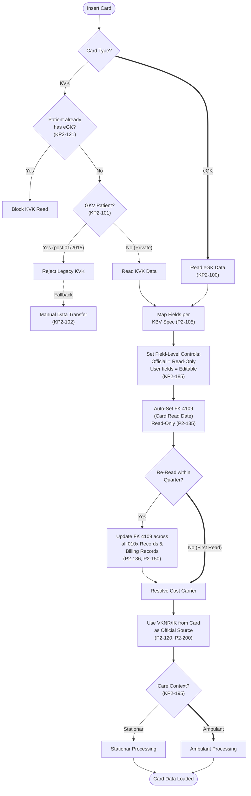

### 1b. VSDM & Insurance Validation Detail

Expands the `VSDM Online Verification` node and adds the missing insurance validity gates.

```mermaid
flowchart TD
    CARD_DATA(["Card Data Loaded"])

    CARD_DATA ==> VSDM["VSDM Online Check"]

    VSDM --> FK4136["Capture FK 4136\n(Proof Status)\n(KP2-190)"]
    FK4136 --> TS_VALID{"VSDM Timestamp\nwithin Current\nQuarter?\n(KP2-191)"}
    TS_VALID ==>|"Yes"| AGE_CHECK{"Patient\nunder 18?\n(KP2-191)"}
    TS_VALID -->|"No / Stale"| TS_WARN["Timestamp Warning"]
    TS_WARN --> AGE_CHECK

    AGE_CHECK -->|"Yes"| FEE_EXEMPT["Auto-Mark\nZuzahlungsbefreit"]
    AGE_CHECK ==>|"No"| COVERAGE
    FEE_EXEMPT --> COVERAGE

    COVERAGE["Check Insurance\nCoverage Validity\n(P2-140, P2-166)"]
    COVERAGE --> COV_STATUS{"Coverage\nValid?"}
    COV_STATUS ==>|"Valid"| CARRIER_CHECK
    COV_STATUS -->|"Expired / Not Begun"| COV_ALERT["Alert: Coverage\nExpired or Not\nYet Begun (P2-166)"]
    COV_ALERT -.->|"User acknowledges"| CARRIER_CHECK

    CARRIER_CHECK["Check Cost Carrier\nBilling Capability\n(P2-210)"]
    CARRIER_CHECK --> CARRIER_STATUS{"Carrier Status?"}

    CARRIER_STATUS ==>|"Active"| IK_VALID
    CARRIER_STATUS -->|"Dissolved"| DISSOLVED["Error: Carrier Dissolved\nBilling Blocked (P2-230)"]
    CARRIER_STATUS -->|"Merged"| FUSION["Redirect to\nAbsorbing Carrier\n(P2-220)"]
    FUSION --> IK_VALID

    IK_VALID{"IK Valid &\nCurrent?\n(P2-260)"}
    IK_VALID ==>|"Yes"| DATA_CHANGE
    IK_VALID -->|"Invalid / Expired"| IK_WARN["Warning: Invalid IK\n(Proceed after\nManual Check)\n(P2-260)"]
    IK_WARN -.->|"User proceeds"| DATA_CHANGE

    DATA_CHANGE{"VSDM Data\nChanged Mid-Quarter?\n(KP2-557)"}
    DATA_CHANGE -->|"Yes"| UPDATE_BILLING["Update Affected\nBilling Records\n(KP2-557)"]
    DATA_CHANGE ==>|"No"| INS_CHANGE

    UPDATE_BILLING --> INS_CHANGE

    INS_CHANGE{"Insurance Changed\nwithin Quarter?\n(P2-530)"}
    INS_CHANGE -->|"Yes"| SPLIT["Split Billing Records\nat Change Date\n(P2-535)"]
    INS_CHANGE ==>|"No"| CONFLICT

    SPLIT --> CONFLICT

    CONFLICT{"Stammdaten\nConflict?\n(VERT1483)"}
    CONFLICT -->|"Yes"| CONFLICT_ALERT["Flag Conflict:\neGK vs PVS\n(VERT1483)"]
    CONFLICT ==>|"No"| DONE

    CONFLICT_ALERT -.->|"Resolved"| DONE(["Proceed to\nIK / Path Check"])
```

### 1c. HZV/FAV Status Messages Detail

Expands the HPM participation check with specific response messages.

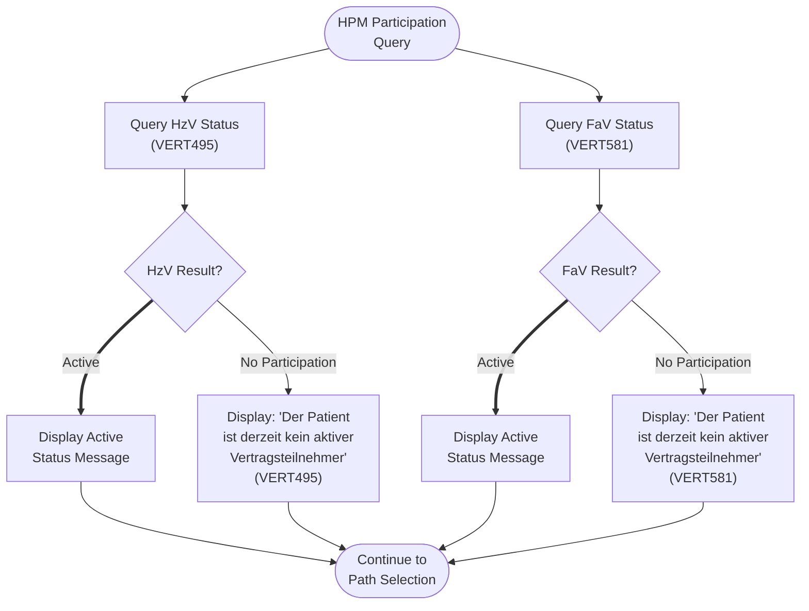

---

## 2. Contract Participation Management — HZV/FAV Only

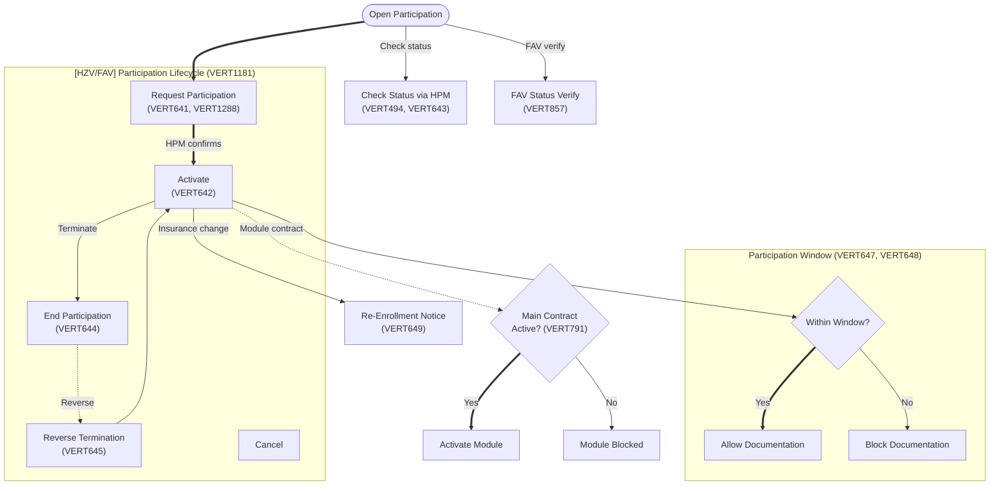

---

## 3. Patient Enrollment — HZV/FAV Only

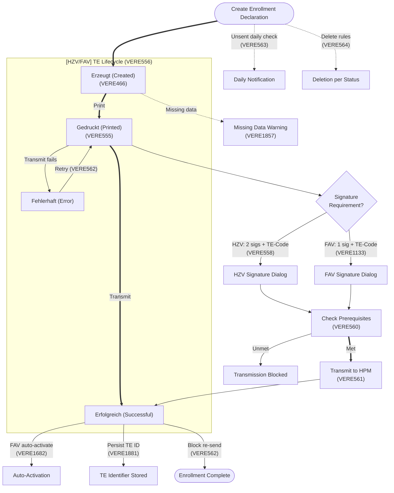

---

## 4. Billing Documentation — KV vs HZV/FAV Divergence

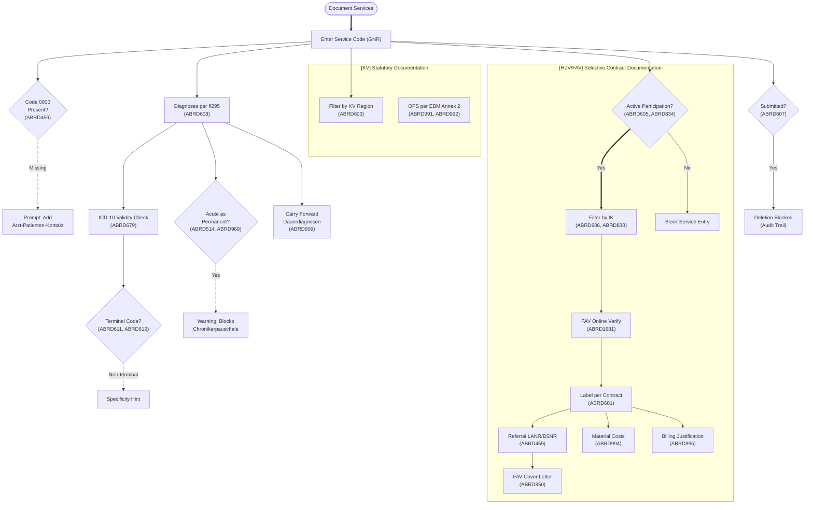

---

## 5. Billing Process — KV vs HZV/FAV Submission

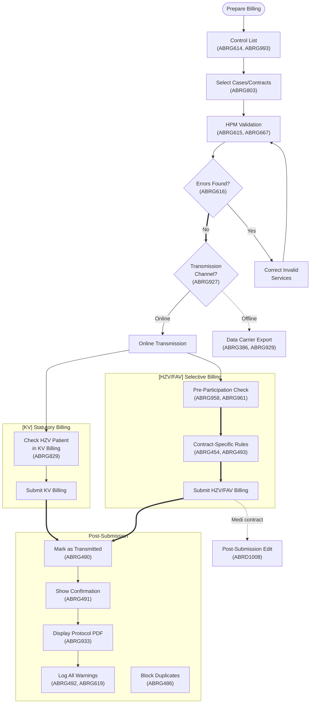

---

## 6. Diagnosis Entry & Coding Validation

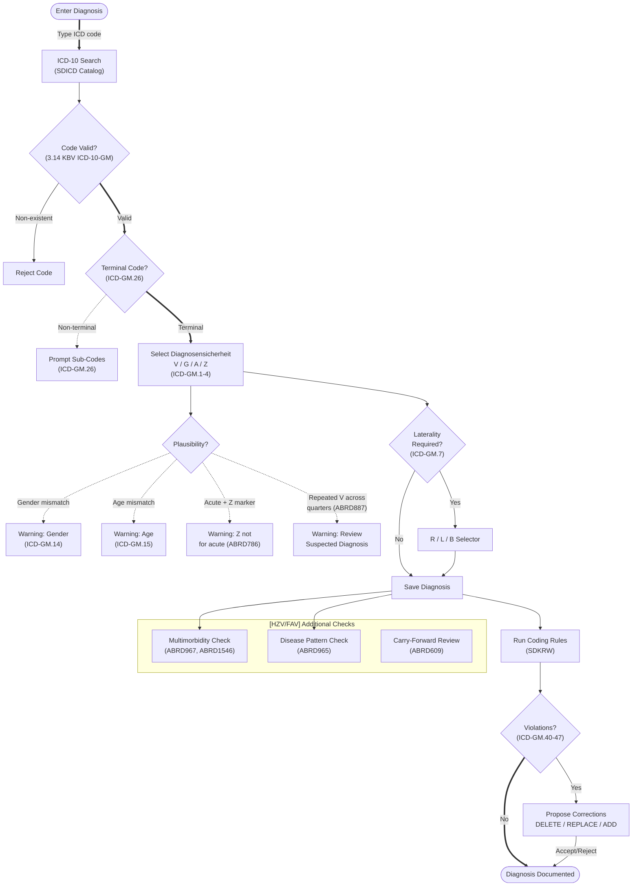

---

## 7. Service Documentation — KVDT Compliance

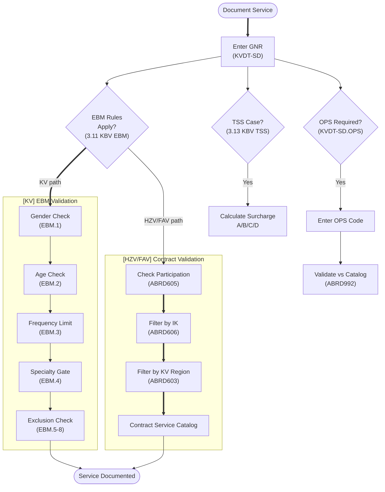

---

## 8. Prescription & Drug Safety

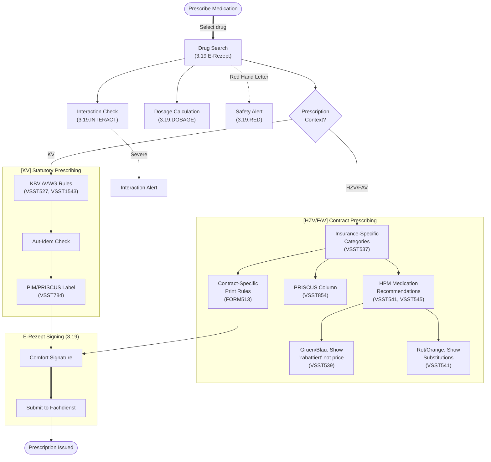

---

## 9. Form Management — KV vs HZV/FAV Forms

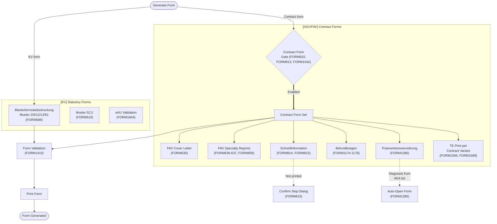

---

## 10. Practice Software (VSST) — Hilfsmittel Path

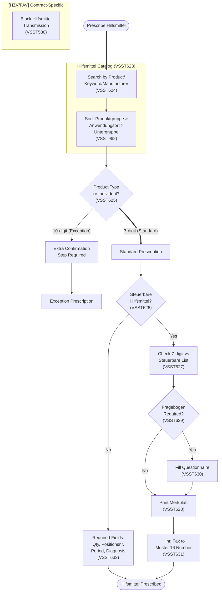

---

## 11. eDMP & Chronic Care Compliance

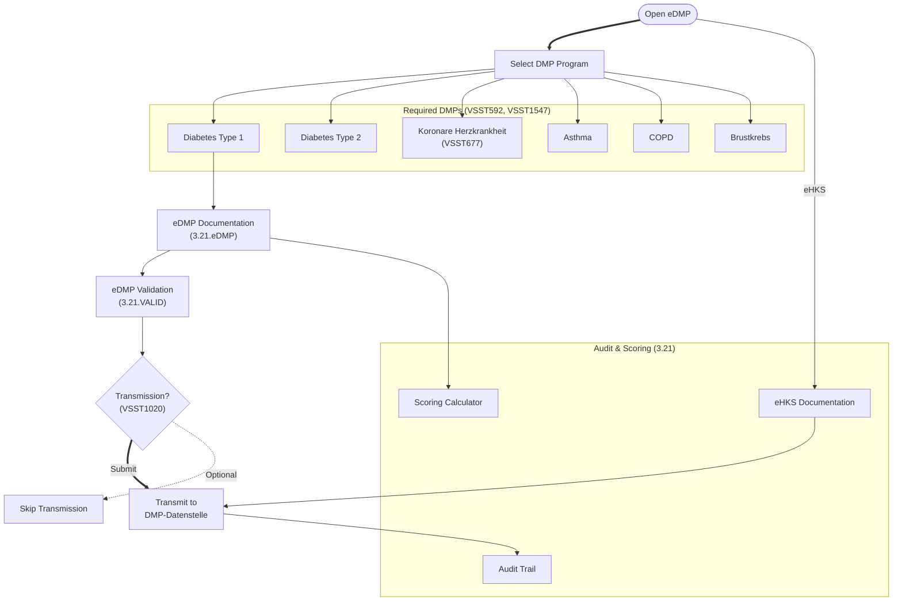

---

## 12. eArztbrief, eAU & ePA Compliance

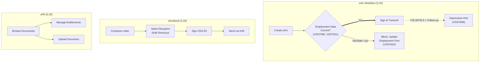

---

## 13. IT Connectivity & Infrastructure

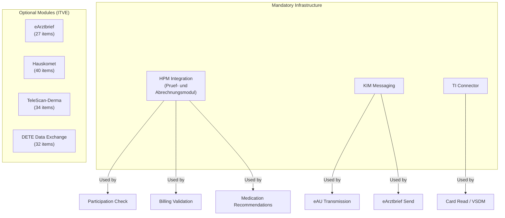

---

## 14. Compliance Obligation Summary by Path

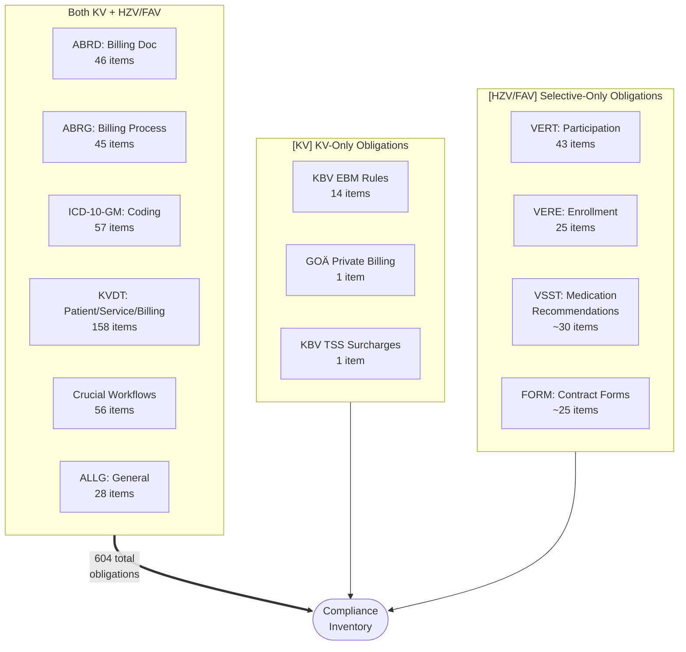
