# PVS-Core Compliance Workflows — User Stories & Acceptance Criteria

This document reorganizes the 604 compliance obligations from the [compliance inventory](compliance-inventory.md) into 14 workflow-aligned groups. Each obligation is presented as a User Story with Acceptance Criteria, enabling traceable implementation and validation. The workflow diagrams are reproduced from [FLOW260318-master-compliance-workflows.md](FLOW260318-master-compliance-workflows.md) for context.

**Convention:** Nodes marked `[KV]` apply to KV/statutory billing only. Nodes marked `[HZV/FAV]` apply to selective contracts only. Unmarked nodes apply to both paths.

---

## Workflow Index

| # | Workflow | Inventory Source | US Count | Mandatory | Optional |
|---|---------|-----------------|----------|-----------|----------|
| 1 | Patient Check-In | PSDV (1) + KVDT Patient Data (73) | 74 | 68 | 6 |
| 2 | Contract Participation -- HZV/FAV | VERT (43) | 43 | 41 | 2 |
| 3 | Patient Enrollment -- HZV/FAV | VERE (25) | 25 | 24 | 1 |
| 4 | Billing Documentation | ABRD (46) | 46 | 45 | 1 |
| 5 | Billing Process | ABRG (45) | 45 | 44 | 1 |
| 6 | Diagnosis Entry & Coding | KBV ICD-10-GM (1) + ICD-10-GM (57) | 58 | 41 | 17 |
| 7 | Service Documentation | KBV EBM (14) + GOA (1) + KBV TSS (1) + KVDT Service Doc (41) | 57 | 54 | 3 |
| 8 | Prescription & Drug Safety | Crucial 3.19 E-Rezept (24) + VSST medication (50) | 74 | 72 | 2 |
| 9 | Form Management | FORM (45) + BFB from Crucial 3.20 (10) | 55 | 54 | 1 |
| 10 | Hilfsmittel | VSST Hilfsmittel VSST623-633 (11) | 11 | 11 | 0 |
| 11 | eDMP & Chronic Care | Crucial 3.21 (12) | 12 | 10 | 2 |
| 12 | eArztbrief, eAU & ePA | EAU (5) + EAB (3) + EPA (2) | 10 | 10 | 0 |
| 13 | IT Infrastructure | ITVE (6) + DETE (1) + KVDT Billing & Infrastructure (44) | 51 | 49 | 2 |
| 14 | General Compliance | ALLG (28) + VSST HZV/FAV (3) | 31 | 31 | 0 |
| | **Total** | | **604** | **554** | **50** |

> **Note:** Conditional Mandatory (CM) items are counted under Mandatory. Req Type abbreviations: M = Mandatory, O = Optional, CM = Conditional Mandatory.

---

## 1. Patient Check-In

### Workflow Diagram

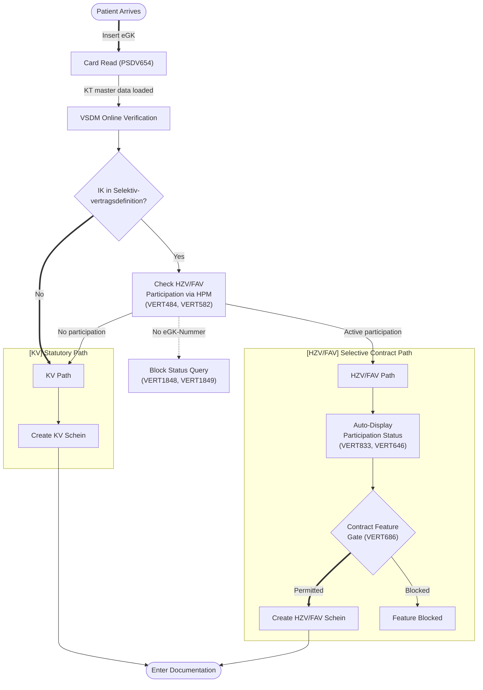

### 1a. Card Read-In Detail

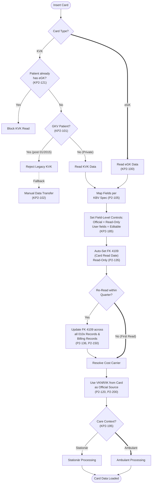

### 1b. VSDM & Insurance Validation Detail

```mermaid
flowchart TD
    CARD_DATA(["Card Data Loaded"])

    CARD_DATA ==> VSDM["VSDM Online Check"]

    VSDM --> FK4136["Capture FK 4136\n(Proof Status)\n(KP2-190)"]
    FK4136 --> TS_VALID{"VSDM Timestamp\nwithin Current\nQuarter?\n(KP2-191)"}
    TS_VALID ==>|"Yes"| AGE_CHECK{"Patient\nunder 18?\n(KP2-191)"}
    TS_VALID -->|"No / Stale"| TS_WARN["Timestamp Warning"]
    TS_WARN --> AGE_CHECK

    AGE_CHECK -->|"Yes"| FEE_EXEMPT["Auto-Mark\nZuzahlungsbefreit"]
    AGE_CHECK ==>|"No"| COVERAGE
    FEE_EXEMPT --> COVERAGE

    COVERAGE["Check Insurance\nCoverage Validity\n(P2-140, P2-166)"]
    COVERAGE --> COV_STATUS{"Coverage\nValid?"}
    COV_STATUS ==>|"Valid"| CARRIER_CHECK
    COV_STATUS -->|"Expired / Not Begun"| COV_ALERT["Alert: Coverage\nExpired or Not\nYet Begun (P2-166)"]
    COV_ALERT -.->|"User acknowledges"| CARRIER_CHECK

    CARRIER_CHECK["Check Cost Carrier\nBilling Capability\n(P2-210)"]
    CARRIER_CHECK --> CARRIER_STATUS{"Carrier Status?"}

    CARRIER_STATUS ==>|"Active"| IK_VALID
    CARRIER_STATUS -->|"Dissolved"| DISSOLVED["Error: Carrier Dissolved\nBilling Blocked (P2-230)"]
    CARRIER_STATUS -->|"Merged"| FUSION["Redirect to\nAbsorbing Carrier\n(P2-220)"]
    FUSION --> IK_VALID

    IK_VALID{"IK Valid &\nCurrent?\n(P2-260)"}
    IK_VALID ==>|"Yes"| DATA_CHANGE
    IK_VALID -->|"Invalid / Expired"| IK_WARN["Warning: Invalid IK\n(Proceed after\nManual Check)\n(P2-260)"]
    IK_WARN -.->|"User proceeds"| DATA_CHANGE

    DATA_CHANGE{"VSDM Data\nChanged Mid-Quarter?\n(KP2-557)"}
    DATA_CHANGE -->|"Yes"| UPDATE_BILLING["Update Affected\nBilling Records\n(KP2-557)"]
    DATA_CHANGE ==>|"No"| INS_CHANGE

    UPDATE_BILLING --> INS_CHANGE

    INS_CHANGE{"Insurance Changed\nwithin Quarter?\n(P2-530)"}
    INS_CHANGE -->|"Yes"| SPLIT["Split Billing Records\nat Change Date\n(P2-535)"]
    INS_CHANGE ==>|"No"| CONFLICT

    SPLIT --> CONFLICT

    CONFLICT{"Stammdaten\nConflict?\n(VERT1483)"}
    CONFLICT -->|"Yes"| CONFLICT_ALERT["Flag Conflict:\neGK vs PVS\n(VERT1483)"]
    CONFLICT ==>|"No"| DONE

    CONFLICT_ALERT -.->|"Resolved"| DONE(["Proceed to\nIK / Path Check"])
```

### User Stories & Acceptance Criteria

| # | ID | User Story | Acceptance Criteria | Req Type |
|---|-----|-----------|---------------------|----------|
| 1 | PSDV654 | As a practice staff (MFA), I want KT master data file (ehd) is supported, so that patient master data is pseudonymized correctly. | Given a KT-Stammdatei (ehd), when imported, then all Kostentrager records are parsed and stored correctly | M |
| 2 | KP2-100 | As a practice staff (MFA), I want patient data is capturable from eGK/KVK cards through connected card terminals, so that patient data management meets KVDT standards. | Given a connected Kartenterminal, when an eGK is read, then patient data is captured into the PVS | M |
| 3 | KP2-101 | As a practice staff (MFA), I want legacy KVK cards is rejected for statutory insured persons since January 2015, so that patient data management meets KVDT standards. | Given a KVK card for a GKV-Versicherten, when read after 01/2015, then the card is rejected with an error | M |
| 4 | KP2-102 | As a practice staff (MFA), I want manual transfer of patient data from rejected cards or mobile terminals is supported, so that patient data management meets KVDT standards. | Given a rejected card or mobile terminal, when manual data transfer is initiated, then all patient fields are enterable | M |
| 5 | P2-105 | As a practice staff (MFA), I want eGK field mapping follow the KBV mapping specification exactly, so that patient data management meets KVDT standards. | Given eGK data read, when mapped to PVS fields, then the KBV Mapping-Spezifikation is followed exactly | M |
| 6 | P2-120 | As a practice staff (MFA), I want insurance card data is treated as official, using VKNR/IK for cost carrier resolution, so that patient data management meets KVDT standards. | Given eGK data, when cost carrier is resolved, then VKNR/IK from the card is used as authoritative source | M |
| 7 | KP2-121 | As a practice staff (MFA), I want reading outdated KVK cards is prevented for patients already read on eGK, so that patient data management meets KVDT standards. | Given a Patient already read via eGK, when a KVK read is attempted, then the KVK read is blocked | M |
| 8 | P2-135 | As a practice staff (MFA), I want card read date (FK 4109) is captured automatically and cannot be manually edited, so that patient data management meets KVDT standards. | Given an eGK read, when FK 4109 is captured, then the date is set automatically and the field is read-only | M |
| 9 | P2-136 | As a practice staff (MFA), I want card read date is updated across all affected billing records on re-read within quarter, so that patient data management meets KVDT standards. | Given eGK re-read within a Quartal, when FK 4109 is updated, then all affected Abrechnungssatze are updated | M |
| 10 | P2-140 | As a practice staff (MFA), I want cost carrier benefit obligation is verified by checking insurance coverage validity, so that patient data management meets KVDT standards. | Given Versichertendaten, when Leistungspflicht is checked, then insurance coverage validity dates are verified | M |
| 11 | P2-150 | As a practice staff (MFA), I want read-in date (FK 4109) is updated across all 010x record types on re-read, so that patient data management meets KVDT standards. | Given eGK re-read, when FK 4109 is updated, then all 010x Satzarten are updated | M |
| 12 | P2-166 | As a practice staff (MFA), I want user is alerted if insurance coverage has expired or not yet begun, so that patient data management meets KVDT standards. | Given Versicherungsschutz expired or not yet started, when eGK is read, then the user receives an alert | M |
| 13 | KP2-185 | As a practice staff (MFA), I want card data is stored with field-level controls distinguishing official from user-editable fields, so that patient data management meets KVDT standards. | Given eGK data stored, when fields are displayed, then official (card) fields are read-only and user-editable fields are marked | M |
| 14 | KP2-190 | As a practice staff (MFA), I want VSDM online proof status (FK 4136) is captured and transmitted, so that patient data management meets KVDT standards. | Given VSDM online check, when FK 4136 is captured, then the proof status is stored and included in billing | M |
| 15 | KP2-191 | As a practice staff (MFA), I want VSDM timestamps is validated against current quarter; patients under 18 auto-marked fee-exempt, so that patient data management meets KVDT standards. | Given VSDM timestamp, when validated against current Quartal, then validity is checked; patients under 18 are auto-marked zuzahlungsbefreit | M |
| 16 | KP2-195 | As a practice staff (MFA), I want patient master data is processed separately for outpatient and inpatient care contexts, so that patient data management meets KVDT standards. | Given Stammdaten, when processed, then ambulant and stationar contexts are handled separately | M |
| 17 | P2-200 | As a practice staff (MFA), I want cost carrier is identified via IK from KT master data file and VKNR/KTAB resolved, so that patient data management meets KVDT standards. | Given a VKNR, when Kostentrager is resolved, then the IK is looked up in KT-Stammdatei and KTAB is resolved | M |
| 18 | P2-210 | As a practice staff (MFA), I want cost carrier have active billing capability before billing operations proceed, so that patient data management meets KVDT standards. | Given a Kostentrager, when Abrechnungsfahigkeit is checked, then billing is only permitted if the carrier is active | M |
| 19 | P2-220 | As a practice staff (MFA), I want cost carrier mergers (Kassenfusion) is detected and billing redirected to absorbing carrier, so that patient data management meets KVDT standards. | Given a Kassenfusion, when detected, then billing is automatically redirected to the aufnehmende Kasse | M |
| 20 | P2-230 | As a practice staff (MFA), I want dissolved cost carriers display error and prevent further billing, so that patient data management meets KVDT standards. | Given an aufgeloster Kostentrager, when billing is attempted, then an error is displayed and billing is blocked | M |
| 21 | P2-260 | As a practice staff (MFA), I want invalid/expired IK display warning but allow user to proceed after checking billing capability, so that patient data management meets KVDT standards. | Given an ungultiges/abgelaufenes IK, when detected, then a warning is shown but the user can proceed after manual check | M |
| 22 | P2-265 | As a practice staff (MFA), I want cost carriers not authorized in KV region display error and prevent billing, so that patient data management meets KVDT standards. | Given a Kostentrager not zugelassen in the KV-Region, when billing is attempted, then an error blocks it | M |
| 23 | P2-270 | As a practice staff (MFA), I want unknown IK display warning, allow temporary master records, and advise contacting KV, so that patient data management meets KVDT standards. | Given an unbekanntes IK, when detected, then a warning is shown, a temporary record is creatable, and KV contact is advised | M |
| 24 | P2-275 | As a practice staff (MFA), I want temporary cost carrier master data records is creatable, so that patient data management meets KVDT standards. | Given an unknown Kostentrager, when a temporary record is created, then it is stored and usable for billing | M |
| 25 | P2-285 | As a practice staff (MFA), I want dissolved billing areas (KTAB) display error and prevent further processing, so that patient data management meets KVDT standards. | Given an aufgeloster KTAB, when encountered, then an error is displayed and processing is blocked | M |
| 26 | KP2-300 | As a practice staff (MFA), I want duplicate patient records is prevented by matching card data against existing records, so that patient data management meets KVDT standards. | Given eGK data, when a matching patient record exists, then the system merges rather than creating a duplicate | M |
| 27 | KP2-310 | As a practice staff (MFA), I want insurance changes is detected immediately and user alerted for billing adjustments, so that patient data management meets KVDT standards. | Given a Kassenwechsel on eGK re-read, when detected, then the user is immediately alerted for Abrechnungsanpassungen | M |
| 28 | P2-320 | As a practice staff (MFA), I want KTAB selection is assisted based on Besondere Personengruppe, so that patient data management meets KVDT standards. | Given a Besondere Personengruppe, when KTAB selection is needed, then the system suggests the correct KTAB | M |
| 29 | P2-325 | As a practice staff (MFA), I want restricted healthcare entitlements under AsylbLG is flagged for Personengruppe 09, so that patient data management meets KVDT standards. | Given Personengruppe 09 (AsylbLG), when detected, then restricted Leistungsanspruch is flagged | M |
| 30 | P2-400 | As a practice staff (MFA), I want all insured person data fields per Tabelle 5 is enterable manually, so that patient data management meets KVDT standards. | Given Versichertenstammdaten entry, when manual input is used, then all fields per Tabelle 5 are available | M |
| 31 | P2-401 | As a practice staff (MFA), I want besondere Personengruppe (FK 4131) default to '00' with user override, so that patient data management meets KVDT standards. | Given FK 4131, when a new patient is created, then the default is '00' and the user can override it | M |
| 32 | P2-402 | As a practice staff (MFA), I want DMP indicator (FK 4132) default to '00' with user override, so that patient data management meets KVDT standards. | Given FK 4132, when a new patient is created, then the default is '00' and the user can override it | M |
| 33 | P2-403 | As a practice staff (MFA), I want DMP indicator code meanings is displayed in human-readable form, so that patient data management meets KVDT standards. | Given FK 4132 codes, when displayed, then human-readable DMP-Programm names are shown | M |
| 34 | KP2-404 | As a practice staff (MFA), I want electronic replacement confirmations (eEB) via KIM is receivable, so that patient data management meets KVDT standards. | Given KIM connectivity, when an eEB is received, then it is processed and linked to the patient record | CM |
| 35 | KP2-405 | As a practice staff (MFA), I want FK 4112 = 1 billing marker is set upon receiving an eEB, so that patient data management meets KVDT standards. | Given an eEB received, when processed, then FK 4112 is set to 1 in the billing record | CM |
| 36 | P2-410 | As a practice staff (MFA), I want cost carrier search by IK is available, so that patient data management meets KVDT standards. | Given a user searching Kostentrager, when IK is entered, then matching carriers are returned | M |
| 37 | P2-420 | As a practice staff (MFA), I want cost carrier search by name, location, and VKNR is available, so that patient data management meets KVDT standards. | Given a Kostentrager search, when name/location/VKNR is entered, then matching carriers are returned | M |
| 38 | P2-430 | As a practice staff (MFA), I want birth dates with special value ranges (unknown/estimated) is processed correctly, so that patient data management meets KVDT standards. | Given a Geburtsdatum with special values (unknown/estimated), when processed, then the system handles them without error | M |
| 39 | P2-440 | As a practice staff (MFA), I want additional data fields for SKT cost carriers per kvx3 is captured, so that patient data management meets KVDT standards. | Given an SKT-Kostentrager per kvx3, when data is entered, then additional SKT-specific fields are available | M |
| 40 | P2-452 | As a practice staff (MFA), I want german military (Bundeswehr) patients by VKNR 79868/79869 is recognized with special rules, so that patient data management meets KVDT standards. | Given VKNR 79868/79869, when detected, then Bundeswehr patient rules are applied | M |
| 41 | P2-460 | As a practice staff (MFA), I want postal codes is validated against PLZ master data, so that patient data management meets KVDT standards. | Given a PLZ entered, when validated, then it must exist in the current PLZ-Stammdaten | M |
| 42 | P2-470 | As a practice staff (MFA), I want all gender options including diverse (PStG) is supported, so that patient data management meets KVDT standards. | Given patient gender entry, when all options are available, then male/female/diverse/unbestimmt per PStG are selectable | M |
| 43 | K2-480 | As a practice staff (MFA), I want fictitious insured persons for testing may optionally be supported, so that patient data management meets KVDT standards. | Given test mode, when fictitious Versicherte are needed, then test patient records can be created | O |
| 44 | K2-276 | As a practice staff (MFA), I want extending existing KT master records with new IK entries may optionally be supported, so that patient data management meets KVDT standards. | Given an existing KT record, when a new IK is needed, then the record can be extended | O |
| 45 | KP2-500 | As a practice staff (MFA), I want billing record type (Satzart 010x) selection is required on first card read per quarter, so that patient data management meets KVDT standards. | Given first eGK read in a Quartal, when the card is read, then Satzart 010x selection is required | M |
| 46 | P2-501 | As a practice staff (MFA), I want multiple 010x billing records per patient per quarter is supported, so that patient data management meets KVDT standards. | Given a Patient in a Quartal, when multiple billing contexts exist, then multiple 010x records are supported | M |
| 47 | KP2-502 | As a practice staff (MFA), I want TSS cases is marked with appropriate contact type (FK 4103), so that patient data management meets KVDT standards. | Given a TSS-Fall, when created, then FK 4103 is set to the appropriate TSS contact type | M |
| 48 | KP2-503 | As a practice staff (MFA), I want TSS appointment cases is maintained as separate billing records, so that patient data management meets KVDT standards. | Given a TSS-Terminfall, when created, then it is maintained as a separate Abrechnungssatz | M |
| 49 | KP2-504 | As a practice staff (MFA), I want TSS referral code (eTerminservice Vermittlungscode) is capturable, so that patient data management meets KVDT standards. | Given a TSS-Fall, when the Vermittlungscode is entered, then it is persisted in the billing record | M |
| 50 | KP2-505 | As a practice staff (MFA), I want 116117 Terminservice Vermittlungscode specification V3.0.0 is supported, so that patient data management meets KVDT standards. | Given a Vermittlungscode, when validated, then it conforms to 116117 specification V3.0.0 | M |
| 51 | KP2-507 | As a practice staff (MFA), I want TSS appointment date is captured for time-based surcharge calculations, so that patient data management meets KVDT standards. | Given a TSS-Terminfall, when the appointment date is entered, then it is used for Zuschlagsberechnung | M |
| 52 | KP2-508 | As a practice staff (MFA), I want TSS referral source is tracked (GP, specialist, 116117 hotline), so that patient data management meets KVDT standards. | Given a TSS-Fall, when referral source is entered, then GP/Facharzt/116117 is tracked | M |
| 53 | KP2-509 | As a practice staff (MFA), I want TSS cases is markable as completed (Fallabschluss), so that patient data management meets KVDT standards. | Given a TSS-Fall, when treatment is complete, then the case can be marked as Fallabschluss | M |
| 54 | P2-510 | As a practice staff (MFA), I want TSS billing data integrity is maintained throughout record lifecycle, so that patient data management meets KVDT standards. | Given a TSS-Abrechnungssatz, when modified, then data integrity is maintained throughout the lifecycle | M |
| 55 | KP2-511 | As a practice staff (MFA), I want special billing rules for TSS acute cases and GP-mediated referrals is applied, so that patient data management meets KVDT standards. | Given TSS-Akutfalle or hausarzt-vermittelte Uberweisungen, when billed, then special TSS rules are applied | M |
| 56 | KP2-513 | As a practice staff (MFA), I want time-graded TSS surcharges (A/B/C/D) is calculated based on days between referral and appointment, so that patient data management meets KVDT standards. | Given a TSS-Terminfall, when days between Uberweisung and Termin are calculated, then the correct Zuschlagsstufe (A/B/C/D) is applied | M |
| 57 | KP2-514 | As a practice staff (MFA), I want TSS referral codes is validated for format and consistency, so that patient data management meets KVDT standards. | Given a TSS-Vermittlungscode, when validated, then format and consistency are checked | M |
| 58 | K2-506 | As a practice staff (MFA), I want additional TSS surcharge functions may optionally be implemented, so that patient data management meets KVDT standards. | Given additional TSS-Zuschlag functions, when enabled, then they are available | O |
| 59 | K2-511 | As a practice staff (MFA), I want extended TSS documentation capabilities may optionally be provided, so that patient data management meets KVDT standards. | Given extended TSS documentation, when enabled, then additional documentation fields are available | O |
| 60 | K2-512 | As a practice staff (MFA), I want additional referral-related functions for TSS may optionally be implemented, so that patient data management meets KVDT standards. | Given additional TSS referral functions, when enabled, then they are available | O |
| 61 | P2-520 | As a practice staff (MFA), I want quarter transition rules is implemented with proper closure and initialization, so that patient data management meets KVDT standards. | Given a Quartalswechsel, when triggered, then proper closure of old quarter and initialization of new quarter occurs | M |
| 62 | P2-521 | As a practice staff (MFA), I want open billing cases is carried forward to new quarter per transition rules, so that patient data management meets KVDT standards. | Given offene Behandlungsfalle at Quartalswechsel, when transition runs, then cases are carried forward per rules | M |
| 63 | P2-530 | As a practice staff (MFA), I want insurance changes within a quarter is detected and processed, so that patient data management meets KVDT standards. | Given a Kassenwechsel within a Quartal, when detected, then the change is processed and billing adjusted | M |
| 64 | P2-535 | As a practice staff (MFA), I want billing records is split on insurance change within quarter, so that patient data management meets KVDT standards. | Given a Kassenwechsel within a Quartal, when detected, then billing records are split at the change date | M |
| 65 | P2-540 | As a practice staff (MFA), I want billing records is adjusted on Personengruppe/status changes within quarter, so that patient data management meets KVDT standards. | Given a Personengruppe/Status change within a Quartal, when detected, then billing records are adjusted | M |
| 66 | KP2-557 | As a practice staff (MFA), I want billing records update when official insured data changes during quarter via VSDM, so that patient data management meets KVDT standards. | Given VSDM data change during a Quartal, when detected, then affected billing records are updated | M |
| 67 | P2-558 | As a practice staff (MFA), I want name/address deviations from card data is documentable while preserving official data, so that patient data management meets KVDT standards. | Given name/address deviations from eGK, when documented, then deviations are stored alongside official card data | M |
| 68 | KP2-560 | As a practice staff (MFA), I want referral cases (Muster 6) have special processing capturing origin, physician, diagnosis, so that patient data management meets KVDT standards. | Given a Uberweisungsfall (Muster 6), when created, then Herkunft, uberweisender Arzt, and Diagnose are captured | M |
| 69 | KP2-561 | As a practice staff (MFA), I want lab referrals (Muster 10) have special processing capturing ordering physician and analyses, so that patient data management meets KVDT standards. | Given a Laboruberweisung (Muster 10), when created, then ordering physician and Analysen are captured | M |
| 70 | KP2-562 | As a practice staff (MFA), I want referral fields (FK 4219/4220/4241/4242) is validated for completeness, so that patient data management meets KVDT standards. | Given Uberweisungsfelder, when validated, then FK 4219/4220/4241/4242 completeness is checked | M |
| 71 | KP2-565 | As a practice staff (MFA), I want referrals to specific specialties (Muster 39) have specialty-specific processing, so that patient data management meets KVDT standards. | Given a Muster 39 Uberweisung, when created, then specialty-specific processing rules are applied | M |
| 72 | P2-790 | As a practice staff (MFA), I want card for Privately Insured display notice and prevent data from flowing into KVDT billing, so that patient data management meets KVDT standards. | Given a Privatversicherten-Karte, when read, then a notice is displayed and data does not flow into KVDT billing | M |
| 73 | KP2-950 | As a practice staff (MFA), I want pseudo-treatment cases using GOP 88194 for NaePa is supported, so that patient data management meets KVDT standards. | Given a NaePa case, when GOP 88194 is used, then the pseudo-treatment case is created and processed | M |
| 74 | P2-3.12 | As a practice staff (MFA), I want european Health Insurance Card (EHIC) patient declaration workflow is supported, so that patient data management meets KVDT standards. | Given an EHIC patient, when the declaration workflow is triggered, then all EHIC-specific steps are available | M |

---

## 2. Contract Participation Management -- HZV/FAV Only

### Workflow Diagram

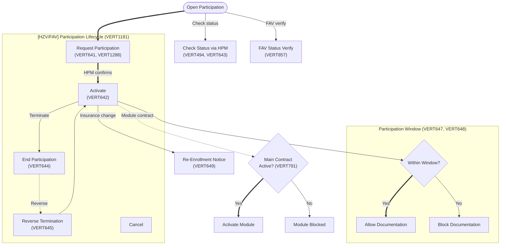

### User Stories & Acceptance Criteria

| # | ID | User Story | Acceptance Criteria | Req Type |
|---|-----|-----------|---------------------|----------|
| 75 | VERT484 | As a practice owner, I want when creating a KV billing Schein, the Vertragssoftware provide a function to check the patient's HzV participation status online via the Pruef- und Abrechnungsmodul, if the patient's Kassen-IK is in the current Kostentraegerdaten of the Selektivvertragsdefinitionen and no active participation exists, so that contract participation is managed correctly. | Given a patient whose Kassen-IK matches active Selektivvertragsdefinitionen and no active participation exists, when a KV Schein is created, then an online HzV participation check via HPM is offered; given the HPM returns a result, then it is displayed to the user | M |
| 76 | VERT494 | As a practice owner, I want participation status is checkable, so that contract participation is managed correctly. | Given a Patient in a Selektivvertrag, when participation status is queried, then the current Teilnahmestatus is returned | M |
| 77 | VERT495 | As a practice owner, I want when requesting HzV participation, the Vertragssoftware verify the patient's current HzV participation status online via the Pruef- und Abrechnungsmodul and display appropriate messages depending on whether participation already exists or not, so that contract participation is managed correctly. | Given HzV participation is requested, when the HPM returns no active participation, then the message 'Der Patient ist derzeit kein aktiver Vertragsteilnehmer' is shown; given active participation exists, then the appropriate status message is displayed | M |
| 78 | VERT581 | As a practice owner, I want when requesting FaV participation, the Vertragssoftware verify the patient's current FaV participation status online via the Pruef- und Abrechnungsmodul and display appropriate messages depending on whether participation already exists or not, so that contract participation is managed correctly. | Given FaV participation is requested, when the HPM returns no active participation, then the message 'Der Patient ist derzeit kein aktiver Vertragsteilnehmer' is shown; given active participation exists, then the appropriate status message is displayed | M |
| 79 | VERT582 | As a practice owner, I want when creating a KV Schein or first documenting KV services, the Vertragssoftware check both FaV and HzV participation status online via the Pruef- und Abrechnungsmodul if the patient's Kassen-IK is in the Selektivvertragsdefinitionen Kostentraegerdaten, so that contract participation is managed correctly. | Given a KV Schein is created or KV services first documented, when the patient's Kassen-IK is in Selektivvertragsdefinitionen Kostentraegerdaten, then both FaV and HzV participation are checked online via HPM | M |
| 80 | VERT641 | As a practice owner, I want user is able to request participation, so that contract participation is managed correctly. | Given a Patient eligible for a Vertrag, when the user submits a Teilnahmeantrag, then the request is persisted and sent to HPM | M |
| 81 | VERT642 | As a practice owner, I want participation status management -- user is able to view current status, so that contract participation is managed correctly. | Given a Patient with Vertragsteilnahme, when the user opens status view, then the current Teilnahmestatus is displayed | M |
| 82 | VERT643 | As a practice owner, I want check participation status, so that contract participation is managed correctly. | Given a Patient, when Teilnahmestatus check is invoked, then the system queries HPM and returns the current status | M |
| 83 | VERT644 | As a practice owner, I want user is able to end a contract participation, so that contract participation is managed correctly. | Given an active Vertragsteilnahme, when the user triggers Kuendigung, then the participation is ended and HPM is notified | M |
| 84 | VERT645 | As a practice owner, I want user is able to reverse a participation termination, so that contract participation is managed correctly. | Given a terminated Teilnahme, when the user triggers Stornierung der Kuendigung, then the termination is reversed | M |
| 85 | VERT646 | As a practice owner, I want display participation status, so that contract participation is managed correctly. | Given a Patient with one or more Vertraege, when the patient view is opened, then all Teilnahmestatus values are visible | M |
| 86 | VERT647 | As a practice owner, I want block services/diagnoses documented outside the patient's contract activation window, so that contract participation is managed correctly. | Given a Leistung dated outside the Teilnahme-Aktivierungsfenster, when saved, then the system blocks with a date-range error | M |
| 87 | VERT648 | As a practice owner, I want participation window is enforced, so that contract participation is managed correctly. | Given a Vertrag with defined Teilnahmezeitraum, when actions are attempted outside the window, then they are blocked | M |
| 88 | VERT649 | As a practice owner, I want check for insurance changes and trigger re-enrollment notices, so that contract participation is managed correctly. | Given a Kassenwechsel detected, when the patient has active Teilnahme, then a re-enrollment notice is triggered | M |
| 89 | VERT686 | As a practice owner, I want contract-specific features is gated by contract support, so that contract participation is managed correctly. | Given a Vertrag not supporting a specific feature, when the user attempts to use it, then access is blocked | M |
| 90 | VERT791 | As a practice owner, I want module contract prerequisite -- main contract is active before module contracts can be used, so that contract participation is managed correctly. | Given a Modulvertrag, when the Hauptvertrag is not active, then module contract activation is blocked | M |
| 91 | VERT833 | As a practice owner, I want participation status auto-display, so that contract participation is managed correctly. | Given a Patient opened in the system, when the patient has Selektivvertrag-Teilnahme, then the status is automatically visible without manual query | M |
| 92 | VERT857 | As a practice owner, I want FAV participation status is verifiable, so that contract participation is managed correctly. | Given a FAV-Patient, when participation verification is triggered, then the current FAV-Teilnahmestatus is confirmed via HPM | M |
| 93 | VERT890 | As a practice owner, I want contract participation is tracked, so that contract participation is managed correctly. | Given Vertragsteilnahme lifecycle events, when they occur, then all state changes are tracked with timestamps | M |
| 94 | VERT981 | As a practice owner, I want external link to specialist search is available, so that contract participation is managed correctly. | Given the user requests Facharztsuche, when the link is activated, then the external specialist search portal opens | M |
| 95 | VERT1041 | As a practice owner, I want external link to therapy facilities is available, so that contract participation is managed correctly. | Given the user requests Therapieeinrichtungssuche, when the link is activated, then the external therapy facility portal opens | M |
| 96 | VERT1145 | As a practice owner, I want available contracts is displayed to user, so that contract participation is managed correctly. | Given a Praxis with configured Vertraege, when the user opens contract view, then all available Selektivvertraege are listed | M |
| 97 | VERT1181 | As a practice owner, I want participation lifecycle is fully manageable (activate, end, reverse, cancel), so that contract participation is managed correctly. | Given a Teilnahme, when the user performs activate/end/reverse/cancel, then each lifecycle transition succeeds and is persisted | M |
| 98 | VERT1288 | As a practice owner, I want user is able to request participation, so that contract participation is managed correctly. | Given a Patient, when the user initiates a Teilnahmeantrag, then the request is created and queued for transmission | M |
| 99 | VERT1481 | As a practice owner, I want ICode is enterable and saveable, so that contract participation is managed correctly. | Given a Teilnahmevorgang, when the user enters an ICode, then the value is persisted and associated with the participation record | M |
| 100 | VERT1482 | As a practice owner, I want the Vertragssoftware allow the user to query via HTTP POST to the HPM endpoint whether patient participant directories (Patiententeilnehmerverzeichnisse) are available for download, show which directories have already been imported, and let the user initiate the download, so that contract participation is managed correctly. | Given a Vertragspartner VP-ID, when the user queries available directories via HPM, then the system shows which contracts have downloadable Patiententeilnehmerverzeichnisse and which have already been imported | M |
| 101 | VERT1483 | As a practice owner, I want conflicts in patient master data is flagged, so that contract participation is managed correctly. | Given Stammdaten conflicts between eGK and PVS, when detected, then the user is alerted with a conflict resolution prompt | O |
| 102 | VERT1484 | As a practice owner, I want validation run before PTV import, so that contract participation is managed correctly. | Given a PTV-Import, when initiated, then validation runs first and blocks import if errors are found | M |
| 103 | VERT1485 | As a practice owner, I want PTV import is supported, so that contract participation is managed correctly. | Given a valid PTV file, when import is triggered, then all participation records are imported and persisted | M |
| 104 | VERT1486 | As a practice owner, I want the Vertragssoftware warn the user before re-importing a Patiententeilnehmerverzeichnis for the same Vertragspartner/Quartal/Jahr/Vertrag and allow cancellation of the import, so that contract participation is managed correctly. | Given a Patiententeilnehmerverzeichnis already imported for the same VP/quarter/year/contract, when the user attempts re-import, then a warning is displayed and the user can cancel | M |
| 105 | VERT1487 | As a practice owner, I want the Vertragssoftware prevent importing a Patiententeilnehmerverzeichnis if a more recent quarter has already been imported for the same Vertragspartner and Vertrag, so that contract participation is managed correctly. | Given a Patiententeilnehmerverzeichnis for a newer quarter already imported, when the user attempts to import an older quarter, then the import is blocked | M |
| 106 | VERT1488 | As a practice owner, I want the Vertragssoftware provide an overview of all previously imported Patiententeilnehmerverzeichnisse showing contract, physician name/LANR, quarter/year, importing user, import timestamp, and link to the import protocol, so that contract participation is managed correctly. | Given imported Patiententeilnehmerverzeichnisse exist, when the user opens the overview, then each entry shows contract, physician name/LANR, quarter/year, importing user, import date/time, and protocol link | M |
| 107 | VERT1489 | As a practice owner, I want the Vertragssoftware provide a list of all patients with HZV contract status (Beantragt, Aktiviert, or Beendet) per active HZV contract, showing at minimum: patient name, Versichertennummer, birth date, status, dates, and Betreuarzt, so that contract participation is managed correctly. | Given an active HZV contract, when the user opens the patient list, then all patients with status Beantragt/Aktiviert/Beendet are shown with name, Versichertennummer, birth date, status, dates, and Betreuarzt | M |
| 108 | VERT1545 | As a practice owner, I want contract feature gate, so that contract participation is managed correctly. | Given a Vertrag with feature gates, when a gated feature is accessed, then it is only available if the contract supports it | M |
| 109 | VERT1742 | As a practice owner, I want the Vertragssoftware enable enrollment and activation of contract participation across all Betriebsstaetten of the same LANR when they share the same software, to prevent redundant per-location activations, so that contract participation is managed correctly. | Given a physician with multiple Betriebsstaetten using the same software, when contract participation is activated for a patient, then it applies across all Betriebsstaetten of that LANR without separate per-location activation | O |
| 110 | VERT1835 | As a practice owner, I want substitute doctor status is tracked, so that contract participation is managed correctly. | Given a Vertreterarzt, when they act for a Stammpraxis, then the substitute status is tracked and visible | M |
| 111 | VERT1848 | As a practice owner, I want the Vertragssoftware use the patient's eGK-Nummer (persoenliche Versichertennummer der elektronischen Gesundheitskarte) for participation status queries; legacy Versichertennummern not be used, and if no eGK-Nummer is available, participation status not be determined, so that contract participation is managed correctly. | Given a patient with an eGK-Nummer, when participation status is queried, then the eGK-Nummer is used; given a patient without eGK-Nummer, then the status query is blocked; given a legacy Versichertennummer, then it is not accepted for status queries | M |
| 112 | VERT1849 | As a practice owner, I want if the participation status cannot be determined because the patient has no valid eGK-Nummer, the Vertragssoftware display: 'The participation status cannot be determined because no valid eGK Versichertennummer is available.' This hint only appear when the status is actively being determined, so that contract participation is managed correctly. | Given a patient without eGK-Nummer, when participation status is being determined, then the hint 'Der Teilnahmestatus kann nicht ermittelt werden, da keine gueltige eGK-Versichertennummer vorliegt' is displayed; given the status is not being actively queried, then the hint does not appear | M |
| 113 | VERT1876 | As a practice owner, I want standard import rules is applied during data synchronization, so that contract participation is managed correctly. | Given a Datensynchronisation, when import runs, then standard import rules are applied to all incoming records | M |
| 114 | VERT1877 | As a practice owner, I want after a standard import, the Vertragssoftware display an import protocol showing: contract of the imported Patiententeilnehmerverzeichnis, VP-ID of the Vertragspartner, quarter/year, importing user, import type (Standardimport), timestamp, and detailed import results, so that contract participation is managed correctly. | Given a standard import completes, when the protocol is displayed, then it shows: contract, VP-ID, quarter/year, user, type (Standardimport), timestamp, and itemized results | M |
| 115 | VERT1878 | As a practice owner, I want during a full import (Vollimport), all data from the PTV is automatically transferred to the Vertragssoftware if the patient can be uniquely matched by eGK-Nummer; defined exception cases (unmatched eGK, status conflicts) is handled separately with user prompts, so that contract participation is managed correctly. | Given a Vollimport with patient data, when patients match by eGK-Nummer, then data is auto-transferred; given an exception case (no eGK match, status conflict), then the system prompts the user for manual resolution | M |
| 116 | VERT1879 | As a practice owner, I want after a full import (Vollimport), the Vertragssoftware display an import protocol showing: contract, VP-ID, quarter/year, importing user, import type (Vollimport), timestamp, and detailed import results, so that contract participation is managed correctly. | Given a Vollimport completes, when the protocol is displayed, then it shows: contract, VP-ID, quarter/year, user, type (Vollimport), timestamp, and itemized results | M |
| 117 | VERT1880 | As a practice owner, I want the Vertragssoftware allow importing a Patiententeilnehmerverzeichnis even when a previously initiated Vollimport has not yet completed, so that contract participation is managed correctly. | Given a Vollimport is in progress, when the user initiates a new Patiententeilnehmerverzeichnis import, then the new import is allowed to proceed | M |

---

## 3. Patient Enrollment -- HZV/FAV Only

### Workflow Diagram

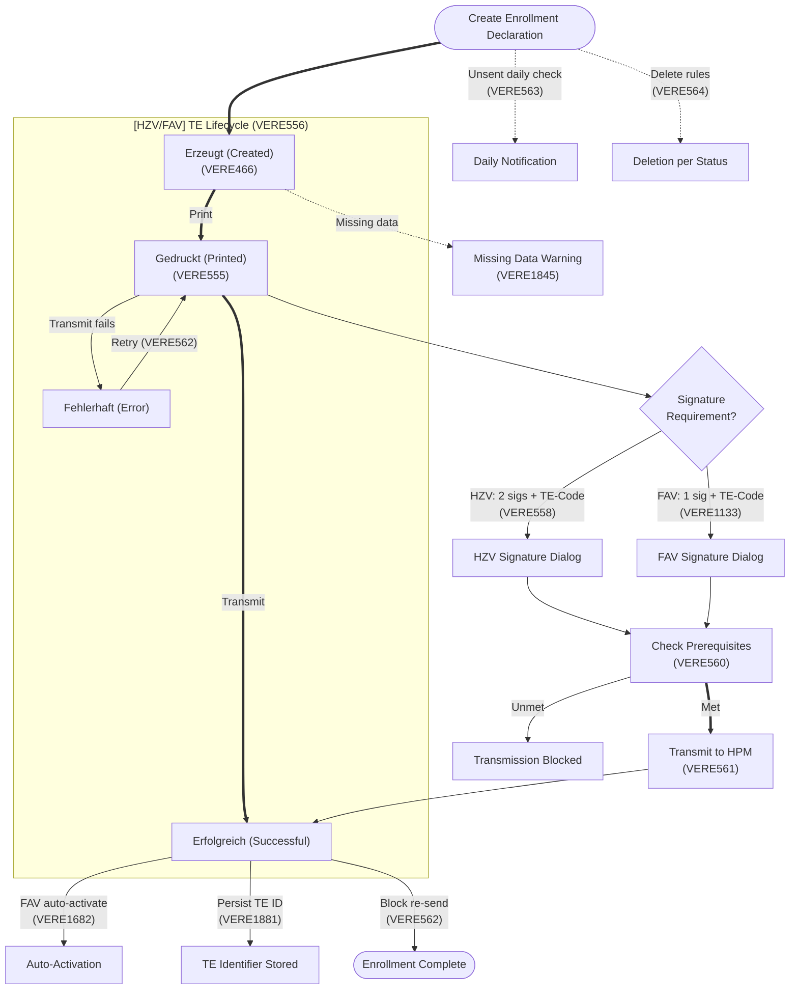

### User Stories & Acceptance Criteria

| # | ID | User Story | Acceptance Criteria | Req Type |
|---|-----|-----------|---------------------|----------|
| 118 | VERE449 | As a patient, I want enrollment declaration hint is shown (DIN A4), so that my enrollment is processed correctly. | Given TE-Erstellung for a HZV-Vertrag, when the DIN-A4 Teilnahmeerklaerung is shown, then the hint text is visible | M |
| 119 | VERE450 | As a patient, I want enrollment receipt is printable (DIN A6), so that my enrollment is processed correctly. | Given a completed Teilnahmeerklaerung, when the user prints the receipt, then a DIN-A6 Empfangsbestaetigung is generated | M |
| 120 | VERE465 | As a patient, I want enrollment declaration full print, so that my enrollment is processed correctly. | Given a Teilnahmeerklaerung, when full print is requested, then the complete TE document is printed | M |
| 121 | VERE466 | As a patient, I want TE is saveable for current patient, so that my enrollment is processed correctly. | Given a Teilnahmeerklaerung for the current Patient, when saved, then it is persisted and retrievable | M |
| 122 | VERE544 | As a patient, I want enrollment declaration full print variant, so that my enrollment is processed correctly. | Given a contract-specific TE variant, when full print is requested, then the correct variant layout is used | M |
| 123 | VERE554 | As a patient, I want correct enrollment form variant is available per contract, so that my enrollment is processed correctly. | Given a Vertrag with a specific TE-Formular, when TE is created, then the correct form variant is selected | M |
| 124 | VERE555 | As a patient, I want enrollment declaration printing, so that my enrollment is processed correctly. | Given a Teilnahmeerklaerung, when print is requested, then the document is printed correctly | M |
| 125 | VERE556 | As a patient, I want TE status lifecycle is managed (Erzeugt -> Gedruckt -> Fehlerhaft -> Erfolgreich), so that my enrollment is processed correctly. | Given a TE, when it transitions through Erzeugt/Gedruckt/Fehlerhaft/Erfolgreich, then each status change is tracked and displayed | M |
| 126 | VERE557 | As a patient, I want TE editing is restricted based on current status, so that my enrollment is processed correctly. | Given a TE in status Erfolgreich, when the user attempts editing, then modifications are blocked | M |
| 127 | VERE558 | As a patient, I want HZV signature requires 2 signatures plus TE-Code, so that my enrollment is processed correctly. | Given an HZV-Teilnahmeerklaerung, when submitted, then 2 Unterschriften and a TE-Code are required | M |
| 128 | VERE559 | As a patient, I want enrollment form variant per contract, so that my enrollment is processed correctly. | Given different Vertraege, when TE is created, then each Vertrag uses its specific form variant | M |
| 129 | VERE560 | As a patient, I want transmission prerequisites is met before TE can be sent, so that my enrollment is processed correctly. | Given a TE for transmission, when prerequisites are unmet, then transmission is blocked with a checklist of missing items | M |
| 130 | VERE561 | As a patient, I want TE transmission is executable, so that my enrollment is processed correctly. | Given a TE with all prerequisites met, when transmission is triggered, then the TE is sent to HPM and status is updated | M |
| 131 | VERE562 | As a patient, I want failed TEs is retryable; successful TEs is blocked from re-send, so that my enrollment is processed correctly. | Given a failed TE, when retry is attempted, then re-send proceeds; given a successful TE, when re-send is attempted, then it is blocked | M |
| 132 | VERE563 | As a patient, I want display daily notification for unsent TEs, so that my enrollment is processed correctly. | Given unsent TEs exist, when the user logs in daily, then a notification listing unsent TEs is displayed | M |
| 133 | VERE564 | As a patient, I want TE deletion follow defined rules, so that my enrollment is processed correctly. | Given a TE, when deletion is attempted, then only TEs in permitted status are deletable; others are blocked | M |
| 134 | VERE792 | As a patient, I want module contract enrollment is supported, so that my enrollment is processed correctly. | Given a Modulvertrag, when enrollment is initiated, then a module-specific TE is created linked to the Hauptvertrag | M |
| 135 | VERE1133 | As a patient, I want FAV signature requires 1 signature plus TE-Code, so that my enrollment is processed correctly. | Given a FAV-Teilnahmeerklaerung, when submitted, then 1 Unterschrift and a TE-Code are required | M |
| 136 | VERE1239 | As a patient, I want FAV enrollment declaration full print, so that my enrollment is processed correctly. | Given a FAV-Teilnahmeerklaerung, when full print is requested, then the FAV-specific TE document is printed | M |
| 137 | VERE1559 | As a patient, I want enrollment procedure type is selectable per contract, so that my enrollment is processed correctly. | Given a Vertrag with multiple Einschreibeverfahren, when TE is created, then the correct procedure type is selectable | M |
| 138 | VERE1682 | As a patient, I want FAV auto-activation occur on transmission, so that my enrollment is processed correctly. | Given a FAV-TE transmitted, when transmission succeeds, then the Teilnahme is auto-activated | M |
| 139 | VERE1683 | As a patient, I want TE overview list is available for FAV, so that my enrollment is processed correctly. | Given FAV-TEs in the system, when the user opens the TE overview, then all FAV-TEs are listed with status | M |
| 140 | VERE1845 | As a patient, I want warning is displayed for missing therapy/diagnosis data, so that my enrollment is processed correctly. | Given a TE with missing Therapie/Diagnose data, when transmission is attempted, then a warning about missing data is displayed | M |
| 141 | VERE1881 | As a patient, I want TE identifier is persisted, so that my enrollment is processed correctly. | Given a TE created, when saved, then a unique TE-Kennung is generated and persisted | M |
| 142 | VERE1906 | As a patient, I want enrollment overview lists, so that my enrollment is processed correctly. | Given TEs in the system, when the user opens the overview, then filterable lists of all TEs with status are available | O |

---

## 4. Billing Documentation -- KV vs HZV/FAV Divergence

### Workflow Diagram

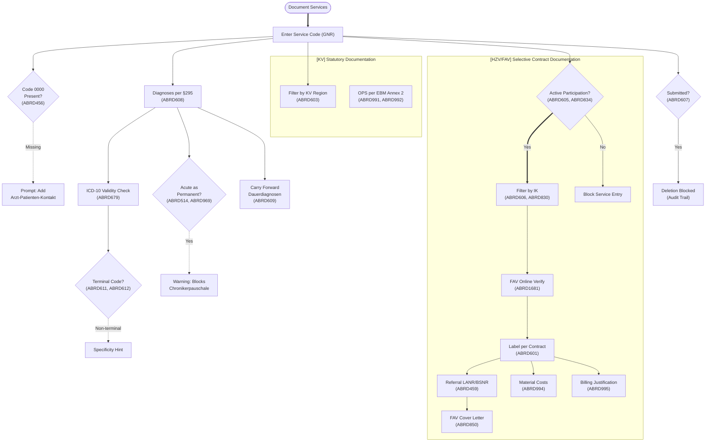

### User Stories & Acceptance Criteria

| # | ID | User Story | Acceptance Criteria | Req Type |
|---|-----|-----------|---------------------|----------|
| 143 | ABRD456 | As a practice doctor, I want when I documents services without code 0000 (Arzt-Patienten-Kontakt), system prompt to add it, so that billing documentation is compliant and audit-ready. | Given Leistungen without code 0000 in a Quartal, when Abrechnung is triggered, then a prompt to add code 0000 is displayed; given code 0000 is present, then no prompt appears | M |
| 144 | ABRD457 | As a practice doctor, I want referral form hint text is displayed when applicable, so that billing documentation is compliant and audit-ready. | Given an Ueberweisungsschein is being created, when contract rules require hint text, then the hint text is visible before printing | M |
| 145 | ABRD459 | As a practice doctor, I want referral doctor LANR and BSNR is required when contract mandates them, so that billing documentation is compliant and audit-ready. | Given a Vertrag requiring Ueberweiser-LANR/BSNR, when a referral service is documented without them, then validation blocks submission | M |
| 146 | ABRD514 | As a practice doctor, I want warn when an acute diagnosis is marked as permanent, as this blocks chronic care flat-rate billing, so that billing documentation is compliant and audit-ready. | Given an akute Diagnose being marked as Dauerdiagnose, when the user confirms, then a warning about Chronikerpauschale blocking is displayed | M |
| 147 | ABRD601 | As a practice doctor, I want billing data is labeled/identified per contract, so that billing documentation is compliant and audit-ready. | Given Abrechnungsdaten for a Selektivvertrag, when the data is generated, then it contains the correct Vertragskennzeichen | M |
| 148 | ABRD602 | As a practice doctor, I want contract-specific services is documented, so that billing documentation is compliant and audit-ready. | Given a Selektivvertrag with defined Leistungskatalog, when a service is documented, then only contract-valid services are accepted | M |
| 149 | ABRD603 | As a practice doctor, I want service lookup filter by KV region, so that billing documentation is compliant and audit-ready. | Given a Praxis in KV-Region X, when the user searches Leistungen, then only services valid for that KV-Region are shown | M |
| 150 | ABRD605 | As a practice doctor, I want service documentation is only permitted when the patient has active contract participation status, so that billing documentation is compliant and audit-ready. | Given a Patient without active Teilnahmestatus, when a Selektivvertrag-Leistung is entered, then the system blocks the entry | M |
| 151 | ABRD606 | As a practice doctor, I want service lookup filter by IK assignment, so that billing documentation is compliant and audit-ready. | Given a Patient with a specific IK-Zuordnung, when the user searches Leistungen, then only services matching that IK are shown | M |
| 152 | ABRD607 | As a practice doctor, I want services submitted for billing is protected from deletion to maintain audit trail, so that billing documentation is compliant and audit-ready. | Given a Leistung already submitted for Abrechnung, when a user attempts deletion, then deletion is blocked and an audit entry is preserved | M |
| 153 | ABRD608 | As a practice doctor, I want diagnoses is documented per S295 SGB V, so that billing documentation is compliant and audit-ready. | Given a Behandlungsfall, when Abrechnung is triggered, then at least one ICD-10-Diagnose per S295 SGB V is present | M |
| 154 | ABRD609 | As a practice doctor, I want permanent diagnoses is carried over between quarters, so that billing documentation is compliant and audit-ready. | Given Dauerdiagnosen from previous Quartal, when a new Quartal begins, then all Dauerdiagnosen are automatically carried forward | M |
| 155 | ABRD611 | As a practice doctor, I want inform users during diagnosis entry when a more specific ICD-10 terminal code is available, so that billing documentation is compliant and audit-ready. | Given a non-terminal ICD-10-Code entered, when a more specific Endstellencode exists, then the system displays a specificity hint | M |
| 156 | ABRD612 | As a practice doctor, I want confirmed diagnoses ('G') is documented as terminal codes, not group codes, so that billing documentation is compliant and audit-ready. | Given a gesicherte Diagnose ('G'), when it is a Gruppencode, then validation rejects it and requests an Endstellencode | M |
| 157 | ABRD613 | As a practice doctor, I want substitute value "UUU" only be allowed with specific order services, so that billing documentation is compliant and audit-ready. | Given Diagnose "UUU" entered, when the associated Leistung is not an Auftragsleistung, then validation rejects the entry | M |
| 158 | ABRD659 | As a practice doctor, I want patient-related documentation is maintained, so that billing documentation is compliant and audit-ready. | Given a Behandlungsfall, when services are documented, then patient-related documentation is persisted and retrievable | M |
| 159 | ABRD675 | As a practice doctor, I want referral forms for FAV patients include additional contract-specific text fields, so that billing documentation is compliant and audit-ready. | Given a FAV-Patient with an Ueberweisung, when the form is generated, then contract-specific Zusatzfelder are present and fillable | M |
| 160 | ABRD679 | As a practice doctor, I want ICD-10 validity is checked against current catalog, so that billing documentation is compliant and audit-ready. | Given an ICD-10-Code entered, when it is not in the current Katalogversion, then a validation error is displayed | M |
| 161 | ABRD786 | As a practice doctor, I want diagnosis marker 'Z' not be used for acute diseases -- system warn, so that billing documentation is compliant and audit-ready. | Given a Diagnose with Zusatzkennzeichen 'Z' (Zustand nach), when the ICD-Code is classified as akut, then a warning is displayed | M |
| 162 | ABRD830 | As a practice doctor, I want service lookup filter by IK group, so that billing documentation is compliant and audit-ready. | Given a Leistungssuche, when the Patient belongs to an IK-Gruppe, then only services valid for that IK-Gruppe are returned | M |
| 163 | ABRD834 | As a practice doctor, I want FAV service documentation verify patient's active FAV participation before allowing service entry, so that billing documentation is compliant and audit-ready. | Given a Patient without active FAV-Teilnahme, when a FAV-Leistung is entered, then the system blocks entry with a participation error | M |
| 164 | ABRD850 | As a practice doctor, I want a cover letter is supportable for FAV referrals with clinical and contract-specific context, so that billing documentation is compliant and audit-ready. | Given a FAV-Ueberweisung, when a Begleitbrief is created, then it includes clinical context and contract-specific fields | M |
| 165 | ABRD887 | As a practice doctor, I want warn when the same diagnosis with certainty 'V' (suspected) appears across multiple quarters, so that billing documentation is compliant and audit-ready. | Given a Verdachtsdiagnose ('V') present in 2+ consecutive Quartale, when the user opens the Diagnose, then a review warning is shown | M |
| 166 | ABRD920 | As a practice doctor, I want preventive treatment cases is marked, so that billing documentation is compliant and audit-ready. | Given a Vorsorge-Behandlungsfall, when created, then it is flagged with the Vorsorge marker | M |
| 167 | ABRD936 | As a practice doctor, I want blank billing codes is correctly managed based on active/inactive status, so that billing documentation is compliant and audit-ready. | Given a Blanko-Abrechnungscode, when its status is inactive, then it cannot be used for billing; when active, then it is selectable | M |
| 168 | ABRD939 | As a practice doctor, I want blank billing codes is assigned to the correct fee schedule with proper availability when activated, so that billing documentation is compliant and audit-ready. | Given a Blanko-Code activation, when it is assigned to a Gebuehrenordnung, then it appears in the correct schedule with proper availability dates | M |
| 169 | ABRD965 | As a practice doctor, I want disease pattern check (Krankheitsbildpruefung) is available via HPM validation module, so that billing documentation is compliant and audit-ready. | Given a Behandlungsfall, when Krankheitsbildpruefung is triggered via HPM, then the validation result (pass/fail with reasons) is displayed | M |
| 170 | ABRD967 | As a practice doctor, I want multimorbidity check is available in the diagnosis module for individual patients, so that billing documentation is compliant and audit-ready. | Given a Patient with documented Diagnosen, when Multimorbidity check is triggered, then patients with 3+ Krankheitsbilder are flagged | M |
| 171 | ABRD969 | As a practice doctor, I want warn when an acute diagnosis is marked as permanent (implausible documentation), so that billing documentation is compliant and audit-ready. | Given an akute Diagnose being set as Dauerdiagnose, when saved, then a plausibility warning is displayed | M |
| 172 | ABRD970 | As a practice doctor, I want care facility name and location is required for home visit services, so that billing documentation is compliant and audit-ready. | Given a Hausbesuch-Leistung, when facility name/location is missing, then validation blocks submission | M |
| 173 | ABRD991 | As a practice doctor, I want OPS codes from EBM Annex 2 is mandatory when applicable, so that billing documentation is compliant and audit-ready. | Given a Leistung requiring OPS per EBM Anhang 2, when no OPS code is documented, then validation reports a mandatory-field error | M |
| 174 | ABRD992 | As a practice doctor, I want OPS documentation validity is checked, so that billing documentation is compliant and audit-ready. | Given an OPS-Code entered, when it is not in the current OPS-Katalog, then a validation error is displayed | M |
| 175 | ABRD994 | As a practice doctor, I want material costs associated with services is documentable with manufacturer/supplier and article details, so that billing documentation is compliant and audit-ready. | Given a Leistung with Sachkosten, when material details are entered, then manufacturer, supplier, and article fields are persisted | M |
| 176 | ABRD995 | As a practice doctor, I want billing justification text is capturable for services requiring explanation of medical necessity, so that billing documentation is compliant and audit-ready. | Given a Leistung requiring Begruendungstext, when no justification is entered, then validation warns before submission | M |
| 177 | ABRD1008 | As a practice doctor, I want post-submission modification of services and diagnoses is supported for Medi-type contracts, so that billing documentation is compliant and audit-ready. | Given a submitted Medi-Vertrag Abrechnung, when the user modifies services/diagnoses, then a Korrekturlieferung is generated | M |
| 178 | ABRD1009 | As a practice doctor, I want referral form hint text variant, so that billing documentation is compliant and audit-ready. | Given a contract-specific Ueberweisungsschein variant, when the form is displayed, then the correct hint text variant is shown | M |
| 179 | ABRD1015 | As a practice doctor, I want the Vertragssoftware sort and filter P4-relevant disease patterns: a dropdown to filter by count (0,1,2,3,4+) of documented P4-relevant Krankheitsbilder, plus an option to include P3 patterns documented in the current billing quarter, so that billing documentation is compliant and audit-ready. | Given P4-relevant Krankheitsbilder documented, when the user opens the filter, then a dropdown with counts 0-4+ is available and a checkbox to include current-quarter P3 patterns is present; given a filter selection, when applied, then only matching disease patterns are shown | O |
| 180 | ABRD1035 | As a practice doctor, I want additional information fields is supported per contract, so that billing documentation is compliant and audit-ready. | Given a Vertrag defining Zusatzinformationsfelder, when the user opens a Behandlungsfall, then the additional fields are displayed and editable | M |
| 181 | ABRD1062 | As a practice doctor, I want show a hint when service code 0008 (home visit) is documented, so that billing documentation is compliant and audit-ready. | Given Leistung 0008 (Hausbesuch) is documented, when saved, then a contextual hint about home visit requirements is displayed | M |
| 182 | ABRD1416 | As a practice doctor, I want OPS code 5035 is required for specialty service codes E3a/A3a/E3b/A3b/E4a/A4a/E4b/A4b/E5a/A5a/E5b/A5b, so that billing documentation is compliant and audit-ready. | Given a specialty code (E3a, A3a, etc.) documented, when OPS 5035 is missing, then validation blocks with a mandatory-OPS error | M |
| 183 | ABRD1449 | As a practice doctor, I want a warning display if no physician-patient contact code is documented in a FAV billing case, so that billing documentation is compliant and audit-ready. | Given a FAV-Abrechnungsfall without Arzt-Patienten-Kontakt code, when Abrechnung is triggered, then a warning is displayed | M |
| 184 | ABRD1544 | As a practice doctor, I want warn when a specialty contract service is billed without a referral doctor (AOK/BKK BW), so that billing documentation is compliant and audit-ready. | Given a FAV-Leistung (AOK/BKK BW) without Ueberweiser, when billing validation runs, then a warning about missing referral is shown | M |
| 185 | ABRD1546 | As a practice doctor, I want during billing validation, system perform multimorbidity check identifying patients with 3+ disease patterns, so that billing documentation is compliant and audit-ready. | Given Abrechnungsvalidierung, when a patient has 3+ Krankheitsbilder, then the multimorbidity flag is set on the billing case | M |
| 186 | ABRD1564 | As a practice doctor, I want age precondition is validated per KV region rules, so that billing documentation is compliant and audit-ready. | Given a Leistung with KV-regional age rules, when patient age is outside the allowed range, then validation blocks the service | M |
| 187 | ABRD1681 | As a practice doctor, I want FAV service documentation include real-time online verification of the patient's current participation status, so that billing documentation is compliant and audit-ready. | Given a FAV-Leistung entry, when the system checks Teilnahmestatus online, then a real-time HPM response confirms or denies participation | M |
| 188 | ABRD1846 | As a practice doctor, I want additional contract-defined information is capturable when marked as required in the selective contract definition, so that billing documentation is compliant and audit-ready. | Given a Selektivvertrag requiring Zusatzinformationen, when the field is marked mandatory, then the system enforces entry before submission | M |

---

## 5. Billing Process -- KV vs HZV/FAV Submission

### Workflow Diagram

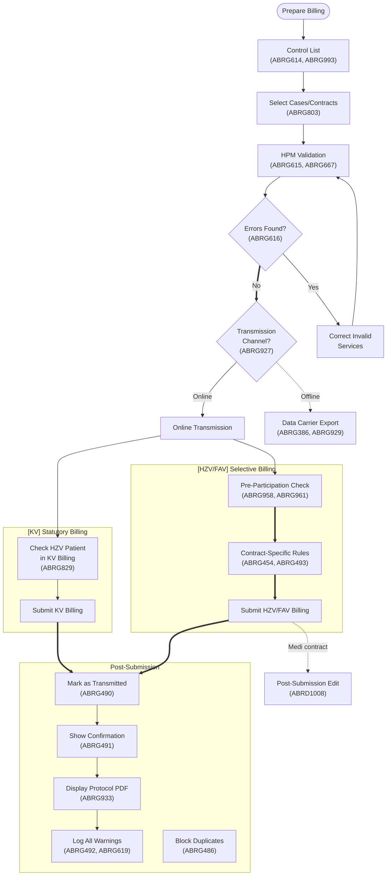

### User Stories & Acceptance Criteria

| # | ID | User Story | Acceptance Criteria | Req Type |
|---|-----|-----------|---------------------|----------|
| 189 | ABRG386 | As a practice doctor, I want offline billing via data carrier is supported, so that billing submissions are accepted without rejection. | Given no network connectivity, when billing is triggered via Datentraeger export, then a valid billing file is generated on the carrier | M |
| 190 | ABRG454 | As a practice doctor, I want billing process is controllable per contract rules, so that billing submissions are accepted without rejection. | Given contract-specific Abrechnungsregeln, when the billing process runs, then only contract-permitted operations are executed | M |
| 191 | ABRG485 | As a practice doctor, I want provide connectivity testing capability before billing submission, so that billing submissions are accepted without rejection. | Given a billing submission attempt, when the user triggers connectivity test, then the system reports connection status before proceeding | M |
| 192 | ABRG486 | As a practice doctor, I want prevent duplicate billing submissions by blocking re-transmission of already-submitted data, so that billing submissions are accepted without rejection. | Given Abrechnungsdaten already transmitted, when re-submission is attempted, then the system blocks with a duplicate-submission error | M |
| 193 | ABRG490 | As a practice doctor, I want transmitted billing data is marked as transmitted, so that billing submissions are accepted without rejection. | Given successful Abrechnungsuebertragung, when the process completes, then all transmitted records are marked with Uebertragungsstatus | M |
| 194 | ABRG491 | As a practice doctor, I want user see confirmation of successful billing transmission, so that billing submissions are accepted without rejection. | Given a billing transmission, when it succeeds, then a confirmation message with timestamp and summary is displayed | M |
| 195 | ABRG492 | As a practice doctor, I want log all validation warnings for quality assurance and audit documentation, so that billing submissions are accepted without rejection. | Given billing validation producing warnings, when the process completes, then all warnings are persisted in the audit log | M |
| 196 | ABRG493 | As a practice doctor, I want billing process controls per contract, so that billing submissions are accepted without rejection. | Given a Selektivvertrag with billing controls, when Abrechnung runs, then contract-specific process controls are applied | M |
| 197 | ABRG497 | As a practice doctor, I want billing data include required referral documentation for services that require referrals, so that billing submissions are accepted without rejection. | Given a Leistung requiring Ueberweisung, when billing data is generated, then referral documentation fields are included | M |
| 198 | ABRG498 | As a practice doctor, I want billing data include the accident indicator (Unfallkennzeichen) when work accidents apply, so that billing submissions are accepted without rejection. | Given a Behandlungsfall with Arbeitsunfall, when billing is generated, then Unfallkennzeichen is included in the data | M |
| 199 | ABRG505 | As a practice doctor, I want verify diagnosis prerequisites for service P3 (code 0003), so that billing submissions are accepted without rejection. | Given Leistung P3 (code 0003) documented, when diagnosis prerequisites are missing, then validation blocks billing | M |
| 200 | ABRG614 | As a practice doctor, I want provide a control list summarizing billable cases, services, and amounts for pre-submission review, so that billing submissions are accepted without rejection. | Given billing data ready for submission, when the user requests a Kontrollliste, then a summary with cases, services, and amounts is generated | M |
| 201 | ABRG615 | As a practice doctor, I want integrate with HPM billing validation module (Abrechnungspruefmodul) to validate data before submission, so that billing submissions are accepted without rejection. | Given billing data, when HPM Abrechnungspruefmodul is invoked, then validation results are returned and displayed | M |
| 202 | ABRG616 | As a practice doctor, I want prevent billing of services that fail HPM validation; invalid services is corrected, so that billing submissions are accepted without rejection. | Given HPM validation returning errors, when the user attempts submission, then billing is blocked until errors are corrected | M |
| 203 | ABRG617 | As a practice doctor, I want substitute doctor services is correctly attributed while maintaining primary care relationship, so that billing submissions are accepted without rejection. | Given a Vertreterarzt documenting services, when billing is generated, then services are attributed to the Vertreter while the Stammpraxis relationship is maintained | M |
| 204 | ABRG618 | As a practice doctor, I want all billing and prescription data by a substitute physician is transmitted with the substitute's LANR, so that billing submissions are accepted without rejection. | Given Vertreterarzt billing data, when transmitted, then the Vertreter-LANR is used in all relevant fields | M |
| 205 | ABRG619 | As a practice doctor, I want log all erroneous billing data with case, service, and rule references for audit, so that billing submissions are accepted without rejection. | Given billing validation errors, when logged, then each error includes Fall-ID, Leistung, and violated rule reference | M |
| 206 | ABRG664 | As a practice doctor, I want warn when billing services older than 4 quarters (beyond late-submission window), so that billing submissions are accepted without rejection. | Given Leistungen older than 4 Quartale, when billing is attempted, then a Nachreichungsfrist warning is displayed | M |
| 207 | ABRG665 | As a practice doctor, I want ensure all diagnosed conditions are included in billing cases, so that billing submissions are accepted without rejection. | Given a Behandlungsfall with documented Diagnosen, when billing is generated, then all Diagnosen are included in the Abrechnungsfall | M |
| 208 | ABRG666 | As a practice doctor, I want include all acute and permanent diagnoses documented during the quarter in billing data, so that billing submissions are accepted without rejection. | Given akute and Dauerdiagnosen in a Quartal, when billing data is generated, then both types are included | M |
| 209 | ABRG667 | As a practice doctor, I want perform comprehensive billing validation covering all contract-specific rules via HPM, so that billing submissions are accepted without rejection. | Given Abrechnungsdaten, when HPM validation runs, then all contract-specific rules are checked and results returned | M |
| 210 | ABRG668 | As a practice doctor, I want flag diagnoses that lack required specificity or terminal ICD codes, so that billing submissions are accepted without rejection. | Given a non-terminal ICD-Code in billing data, when validation runs, then it is flagged as insufficiently specific | M |
| 211 | ABRG669 | As a practice doctor, I want chronic care flat-rate require at least one confirmed permanent diagnosis -- billing is blocked if only acute diagnoses exist as permanent, so that billing submissions are accepted without rejection. | Given a Chronikerpauschale billed, when only akute Diagnosen exist as Dauerdiagnose, then billing is blocked with a diagnosis-type error | M |
| 212 | ABRG670 | As a practice doctor, I want patient birth dates is captured enabling accurate age calculation for age-dependent billing rules, so that billing submissions are accepted without rejection. | Given a Patient with Geburtsdatum, when age-dependent billing rules are evaluated, then age is calculated correctly from the birth date | M |
| 213 | ABRG678 | As a practice doctor, I want apply special validation rules for diagnosis requirements when service P3 is documented, so that billing submissions are accepted without rejection. | Given Leistung P3, when diagnosis validation runs, then P3-specific diagnosis requirements are enforced | M |
| 214 | ABRG803 | As a practice doctor, I want users is able to select or deselect specific cases, contracts, or time periods before submission, so that billing submissions are accepted without rejection. | Given billing submission preparation, when the user selects/deselects Faelle or Vertraege, then only selected items are included in the submission | M |
| 215 | ABRG829 | As a practice doctor, I want warn when KV services are billed for a patient with active contract participation, so that billing submissions are accepted without rejection. | Given a Patient with active Selektivvertrag-Teilnahme, when KV-Leistungen are billed, then a warning about potential duplicate billing is shown | M |
| 216 | ABRG921 | As a practice doctor, I want preventive case billing automatically add billing code 80092.2, so that billing submissions are accepted without rejection. | Given a Vorsorge-Behandlungsfall, when billing is generated, then code 80092.2 is automatically added | M |
| 217 | ABRG927 | As a practice doctor, I want allow users to select transmission channel (online/offline), so that billing submissions are accepted without rejection. | Given billing ready for submission, when the user selects online or offline Uebertragungsweg, then the chosen channel is used | M |
| 218 | ABRG929 | As a practice doctor, I want offline billing via file-based export, so that billing submissions are accepted without rejection. | Given offline billing selected, when export is triggered, then a valid billing file is created for Datentraeger transport | O |
| 219 | ABRG933 | As a practice doctor, I want automatically display the transmission protocol as PDF after successful billing, so that billing submissions are accepted without rejection. | Given successful billing transmission, when the process completes, then a PDF Uebertragungsprotokoll is automatically displayed | M |
| 220 | ABRG958 | As a practice doctor, I want check pre-participation status before allowing billing, so that billing submissions are accepted without rejection. | Given a billing attempt for a Selektivvertrag, when Teilnahmestatus is not active, then billing is blocked | M |
| 221 | ABRG961 | As a practice doctor, I want pre-participation check variant, so that billing submissions are accepted without rejection. | Given a variant participation check, when triggered during billing, then the contract-specific pre-check variant is applied | M |
| 222 | ABRG993 | As a practice doctor, I want provide a summary view aggregating case counts, service totals, and financial summaries, so that billing submissions are accepted without rejection. | Given billing data for a Quartal, when summary is requested, then case counts, Leistungssummen, and financial totals are displayed | M |
| 223 | ABRG996 | As a practice doctor, I want flag missing mandatory OPS procedure codes in billing cases requiring them, so that billing submissions are accepted without rejection. | Given a billing case requiring OPS, when OPS is missing, then validation flags a mandatory-OPS error | M |
| 224 | ABRG997 | As a practice doctor, I want validate OPS codes against contract-specific catalog and reject invalid codes, so that billing submissions are accepted without rejection. | Given an OPS-Code in billing data, when it is not in the contract-specific Katalog, then validation rejects it | M |
| 225 | ABRG998 | As a practice doctor, I want ensure billing data includes required material cost documentation (Sachkosten), so that billing submissions are accepted without rejection. | Given a Leistung with Sachkosten requirement, when material cost data is missing, then validation flags the omission | M |
| 226 | ABRG999 | As a practice doctor, I want flag missing billing justification documentation for services requiring it, so that billing submissions are accepted without rejection. | Given a Leistung requiring Begruendung, when justification text is missing, then validation flags it | M |
| 227 | ABRG1006 | As a practice doctor, I want show hint about KV services when patient has contract participation, so that billing submissions are accepted without rejection. | Given a Patient with Selektivvertrag-Teilnahme, when KV-Leistungen are documented, then a hint about contract participation is shown | M |
| 228 | ABRG1007 | As a practice doctor, I want the Vertragssoftware always transmit all services (Leistungen) for a given billing case (Abrechnungsfall), so that billing submissions are accepted without rejection. | Given an Abrechnungsfall with multiple Leistungen, when billing data is transmitted, then all services for that case are included in the transmission without omissions | M |
| 229 | ABRG1013 | As a practice doctor, I want pre-participation check variant, so that billing submissions are accepted without rejection. | Given a billing pre-check variant, when triggered, then the contract-specific participation verification logic is applied | M |
| 230 | ABRG1274 | As a practice doctor, I want generate a detailed transmission protocol documenting what was transmitted and when, so that billing submissions are accepted without rejection. | Given a billing transmission, when completed, then a detailed Uebertragungsprotokoll with content and timestamps is generated | M |
| 231 | ABRG1415 | As a practice doctor, I want verify OPS code completeness and validity against contract specifications during billing, so that billing submissions are accepted without rejection. | Given billing validation, when OPS codes are checked against Vertragsspezifikation, then incomplete or invalid codes are flagged | M |
| 232 | ABRG1565 | As a practice doctor, I want billing validation rule, so that billing submissions are accepted without rejection. | Given Abrechnungsvalidierung, when contract-specific rules are applied, then violations are reported with rule references | M |
| 233 | ABRG1847 | As a practice doctor, I want ensure additional information fields required for specific services are completed, so that billing submissions are accepted without rejection. | Given a Leistung requiring Zusatzinformationen, when the fields are empty, then validation blocks submission | M |

---

## 6. Diagnosis Entry & Coding Validation

### Workflow Diagram

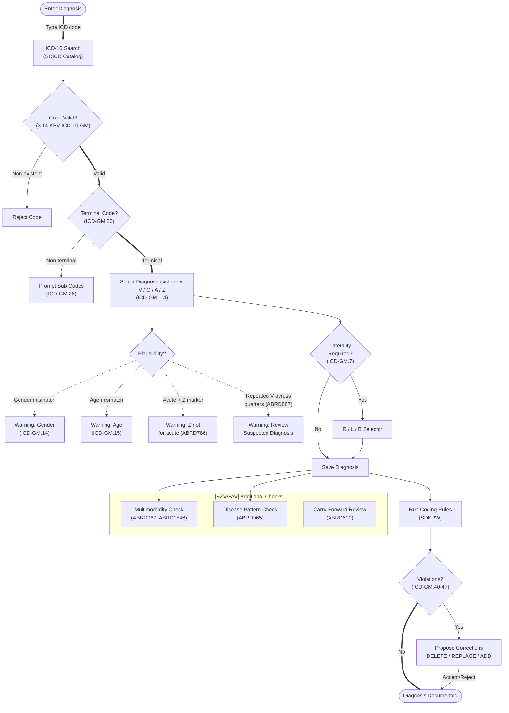

### User Stories & Acceptance Criteria

| # | ID | User Story | Acceptance Criteria | Req Type |
|---|-----|-----------|---------------------|----------|
| 234 | 322 | As a practice doctor, I want ICD-10-GM code validity is checked against current master data, so that diagnoses reference current master data. | Given an ICD-10-Code, when validated, then it must exist in the current ICD-10-GM Stammdaten version | M |
| 235 | P10-001 | As a practice doctor, I want ICD-10-GM diagnosis entry support code search by code number and text description, so that diagnosis coding is accurate and compliant. | Given ICD-10-Diagnoseerfassung, when the user searches by Code or Text, then matching results are returned | M |
| 236 | P10-002 | As a practice doctor, I want ICD-10-GM code validity is checked against current annual catalog version, so that diagnosis coding is accurate and compliant. | Given an ICD-10-Code, when validated, then it must exist in the current Jahresversion of the catalog | M |
| 237 | P10-003 | As a practice doctor, I want diagnosis certainty qualifiers (G, V, Z, A) is selectable per S295 SGB V, so that diagnosis coding is accurate and compliant. | Given a Diagnose, when certainty is selected, then G/V/Z/A qualifiers per S295 SGB V are available | M |
| 238 | P10-004 | As a practice doctor, I want laterality indicators (R, L, B) is supported for applicable ICD codes, so that diagnosis coding is accurate and compliant. | Given an ICD-Code with Seitenlokalisation, when entered, then R/L/B indicators are selectable | M |
| 239 | P10-005 | As a practice doctor, I want cross-reference codes (Kreuz-Stern system) is supported with proper pairing, so that diagnosis coding is accurate and compliant. | Given a Kreuz-Stern-Code, when entered, then the paired code is required and validated | M |
| 240 | P10-006 | As a practice doctor, I want exclamation mark codes require a primary code and cannot stand alone, so that diagnosis coding is accurate and compliant. | Given an Ausrufezeichen-Code, when entered alone, then validation requires a primary code | M |
| 241 | P10-007 | As a practice doctor, I want optional extension codes is validated when present, so that diagnosis coding is accurate and compliant. | Given an optional Zusatzcode, when present, then it is validated against the ICD catalog | M |
| 242 | P10-008 | As a practice doctor, I want group codes (non-terminal) trigger a warning suggesting terminal code selection, so that diagnosis coding is accurate and compliant. | Given a Gruppencode (non-terminal), when entered, then a warning suggests selecting an Endstellencode | M |
| 243 | P10-009 | As a practice doctor, I want retired/deleted ICD codes is flagged with suggestion for replacement codes, so that diagnosis coding is accurate and compliant. | Given a geloschter ICD-Code, when entered, then a flag and replacement suggestion are displayed | M |
| 244 | P10-010 | As a practice doctor, I want sex-specific ICD codes is validated against patient gender, so that diagnosis coding is accurate and compliant. | Given a geschlechtsspezifischer ICD-Code, when patient Geschlecht does not match, then a warning is shown | M |
| 245 | P10-011 | As a practice doctor, I want age-specific ICD codes is validated against patient age, so that diagnosis coding is accurate and compliant. | Given an altersspezifischer ICD-Code, when patient Alter is outside range, then a warning is shown | M |
| 246 | P10-012 | As a practice doctor, I want rare disease orphan codes is supported, so that diagnosis coding is accurate and compliant. | Given a Seltene-Erkrankungen Orphan-Code, when entered, then it is accepted and stored | M |
| 247 | P10-013 | As a practice doctor, I want multiple coding rules is enforced (mandatory secondary codes), so that diagnosis coding is accurate and compliant. | Given an ICD-Code requiring mandatory Sekundarcodes, when only the primary is entered, then validation requests the secondary | M |
| 248 | P10-014 | As a practice doctor, I want diagnosis text is displayable in full from the ICD catalog, so that diagnosis coding is accurate and compliant. | Given an ICD-Code, when displayed, then the full Diagnosetext from the catalog is shown | M |
| 249 | P10-015 | As a practice doctor, I want ICD favorites/history is available for quick entry, so that diagnosis coding is accurate and compliant. | Given ICD entry, when the user accesses favorites/history, then previously used codes are available for quick selection | O |
| 250 | KP10-016 | As a practice doctor, I want SDICD validation rules is applied during diagnosis entry, so that diagnosis coding is accurate and compliant. | Given a Diagnose entry, when SDICD rules are checked, then violations are flagged | M |
| 251 | KP10-017 | As a practice doctor, I want SDVA (diagnosis-procedure association) validation is applied, so that diagnosis coding is accurate and compliant. | Given a Diagnose-Leistung pair, when SDVA rules are checked, then invalid associations are flagged | M |
| 252 | KP10-018 | As a practice doctor, I want SDKRW (cross-reference warnings) is displayed during entry, so that diagnosis coding is accurate and compliant. | Given a Diagnose entry, when SDKRW cross-references apply, then warnings are displayed | M |
| 253 | P10-019 | As a practice doctor, I want permanent diagnoses is distinguishable from acute diagnoses, so that diagnosis coding is accurate and compliant. | Given Diagnosen, when displayed, then Dauerdiagnosen and akute Diagnosen are visually distinguishable | M |
| 254 | P10-020 | As a practice doctor, I want permanent diagnoses carry forward across quarters automatically, so that diagnosis coding is accurate and compliant. | Given Dauerdiagnosen, when a new Quartal begins, then they are automatically carried forward | M |
| 255 | P10-021 | As a practice doctor, I want acute diagnoses marked as permanent trigger a plausibility warning, so that diagnosis coding is accurate and compliant. | Given an akute Diagnose marked as Dauerdiagnose, when saved, then a Plausibilitatswarnung is displayed | M |
| 256 | P10-022 | As a practice doctor, I want suspected diagnoses persisting across multiple quarters trigger a review warning, so that diagnosis coding is accurate and compliant. | Given a Verdachtsdiagnose persisting across 2+ Quartale, when reviewed, then a Ueberpruefungshinweis is shown | M |
| 257 | P10-023 | As a practice doctor, I want diagnosis date is captured and validated, so that diagnosis coding is accurate and compliant. | Given a Diagnose, when entered, then the Diagnosedatum is captured and validated | M |
| 258 | P10-024 | As a practice doctor, I want diagnosis documentation support free-text annotations, so that diagnosis coding is accurate and compliant. | Given a Diagnose, when documented, then free-text Anmerkungen can be added | M |
| 259 | P10-025 | As a practice doctor, I want ICD code changes between catalog years is mapped with transition tables, so that diagnosis coding is accurate and compliant. | Given an ICD-Jahreswechsel, when old codes are mapped, then Ubergangstabellen provide replacement suggestions | M |
| 260 | P10-026 | As a practice doctor, I want diagnosis deletion is audit-logged, so that diagnosis coding is accurate and compliant. | Given a Diagnose deletion, when performed, then an audit log entry with user, timestamp, and reason is created | M |
| 261 | P10-027 | As a practice doctor, I want diagnosis entry support multi-coding for complex conditions, so that diagnosis coding is accurate and compliant. | Given a complex condition, when documented, then multiple ICD codes can be linked as Mehrfachkodierung | M |
| 262 | P10-028 | As a practice doctor, I want UUU substitute value only be permitted with specific order services, so that diagnosis coding is accurate and compliant. | Given Diagnose "UUU", when the linked Leistung is not an Auftragsleistung, then validation rejects it | M |
| 263 | P10-029 | As a practice doctor, I want diagnosis is linkable to specific services for billing justification, so that diagnosis coding is accurate and compliant. | Given a Diagnose and a Leistung, when linked, then the association is stored for Abrechnungsbegrundung | M |
| 264 | P10-030 | As a practice doctor, I want ICD code display include code, text, and all qualifiers, so that diagnosis coding is accurate and compliant. | Given an ICD-Code in the UI, when displayed, then Code, Klartext, and all Zusatzkennzeichen are shown | M |
| 265 | P11-001 | As a practice doctor, I want diagnosis coding comply with coding guidelines (DKR/KDE), so that diagnosis coding is accurate and compliant. | Given Diagnosekodierung, when validated, then DKR/KDE coding guidelines are enforced | M |
| 266 | P11-002 | As a practice doctor, I want primary diagnosis is identifiable in multi-diagnosis cases, so that diagnosis coding is accurate and compliant. | Given multiple Diagnosen on a case, when reviewed, then the Hauptdiagnose is identifiable | M |
| 267 | P11-003 | As a practice doctor, I want diagnosis specificity is maximized -- system suggest more specific codes, so that diagnosis coding is accurate and compliant. | Given a non-specific ICD-Code, when entered, then the system suggests more specific alternatives | M |
| 268 | P11-004 | As a practice doctor, I want comorbidity documentation is supported for DRG-relevant cases, so that diagnosis coding is accurate and compliant. | Given a DRG-relevant case, when Nebendiagnosen are documented, then they are stored for DRG grouping | M |
| 269 | P11-005 | As a practice doctor, I want diagnosis grouping for billing cases is supported, so that diagnosis coding is accurate and compliant. | Given Diagnosen on a billing case, when grouped, then the grouping supports correct Abrechnungszuordnung | M |
| 270 | P11-006 | As a practice doctor, I want ICD catalog search support hierarchical browsing (chapters, groups, categories), so that diagnosis coding is accurate and compliant. | Given ICD catalog browsing, when the user navigates, then Kapitel/Gruppen/Kategorien hierarchy is available | M |
| 271 | P11-007 | As a practice doctor, I want inclusion and exclusion notes from ICD catalog is displayable, so that diagnosis coding is accurate and compliant. | Given an ICD-Code, when details are viewed, then Inklusions- and Exklusionshinweise are displayed | M |
| 272 | P11-008 | As a practice doctor, I want coding hints (Kodierhinweise) is displayable during diagnosis entry, so that diagnosis coding is accurate and compliant. | Given Diagnoseerfassung, when a code is selected, then Kodierhinweise are displayed | M |
| 273 | P11-009 | As a practice doctor, I want annual ICD catalog update is importable without data loss, so that diagnosis coding is accurate and compliant. | Given a new ICD-10-GM Jahreskatalog, when imported, then existing data is preserved and the new catalog is active | M |
| 274 | P11-010 | As a practice doctor, I want previous-year ICD codes remain readable for historical records, so that diagnosis coding is accurate and compliant. | Given historical records with old ICD codes, when viewed, then the codes and text from the previous year are readable | M |
| 275 | P11-011 | As a practice doctor, I want diagnosis statistics and frequency analysis is available, so that diagnosis coding is accurate and compliant. | Given documented Diagnosen, when statistics are requested, then frequency analysis is available | O |
| 276 | P11-012 | As a practice doctor, I want diagnosis export for external systems is supported, so that diagnosis coding is accurate and compliant. | Given Diagnosen, when export is requested, then data is exportable in standard format | O |
| 277 | O10-001 | As a practice doctor, I want ICD-10 alphabetical index search is available, so that diagnosis coding is accurate and compliant. | Given ICD search, when alphabetical index is used, then results are returned from the Alphabetisches Verzeichnis | O |
| 278 | O10-002 | As a practice doctor, I want ICD-10 systematic index search is available, so that diagnosis coding is accurate and compliant. | Given ICD search, when systematic index is used, then results from Systematisches Verzeichnis are returned | O |
| 279 | O10-003 | As a practice doctor, I want diagnosis templates for common conditions may be provided, so that diagnosis coding is accurate and compliant. | Given common conditions, when templates are available, then they provide pre-configured ICD code sets | O |
| 280 | O10-004 | As a practice doctor, I want diagnosis auto-complete based on partial code or text input may be provided, so that diagnosis coding is accurate and compliant. | Given partial ICD input, when auto-complete is triggered, then matching codes/texts are suggested | O |
| 281 | O10-005 | As a practice doctor, I want diagnosis-to-service mapping suggestions may be provided, so that diagnosis coding is accurate and compliant. | Given a Diagnose, when service mapping is requested, then matching Leistungen are suggested | O |
| 282 | O10-006 | As a practice doctor, I want multimorbidity analysis for patient diagnosis profiles may be provided, so that diagnosis coding is accurate and compliant. | Given a patient's Diagnosen, when multimorbidity analysis runs, then the profile is generated | O |
| 283 | O10-007 | As a practice doctor, I want diagnosis plausibility check against patient demographics may be provided, so that diagnosis coding is accurate and compliant. | Given a Diagnose and patient demographics, when plausibility is checked, then implausible combinations are flagged | O |
| 284 | O10-008 | As a practice doctor, I want diagnosis trend analysis over time may be provided, so that diagnosis coding is accurate and compliant. | Given patient Diagnosen over time, when trend analysis is requested, then temporal patterns are shown | O |
| 285 | O10-009 | As a practice doctor, I want external diagnosis code system mapping (SNOMED CT) may be provided, so that diagnosis coding is accurate and compliant. | Given an ICD-Code, when SNOMED CT mapping is requested, then the mapped code is shown | O |
| 286 | O10-010 | As a practice doctor, I want diagnosis documentation quality scoring may be provided, so that diagnosis coding is accurate and compliant. | Given documented Diagnosen, when quality scoring runs, then a documentation quality score is generated | O |
| 287 | O10-011 | As a practice doctor, I want chronic disease registry integration may be provided, so that diagnosis coding is accurate and compliant. | Given chronic Diagnosen, when registry integration is enabled, then data flows to the Chroniker-Register | O |
| 288 | O10-012 | As a practice doctor, I want diagnosis-based clinical pathway suggestions may be provided, so that diagnosis coding is accurate and compliant. | Given a Diagnose, when pathway suggestions are requested, then relevant Behandlungspfade are shown | O |
| 289 | O10-013 | As a practice doctor, I want diagnosis conflict detection (contradictory diagnoses) may be provided, so that diagnosis coding is accurate and compliant. | Given multiple Diagnosen, when conflict detection runs, then contradictory diagnoses are flagged | O |
| 290 | O10-014 | As a practice doctor, I want diagnosis severity scoring for triage support may be provided, so that diagnosis coding is accurate and compliant. | Given a Diagnose, when severity scoring is applied, then a triage-supporting score is generated | O |
| 291 | O10-015 | As a practice doctor, I want diagnosis-based recall/follow-up scheduling may be provided, so that diagnosis coding is accurate and compliant. | Given a Diagnose, when follow-up scheduling is triggered, then recall appointments are suggested | O |

---

## 7. Service Documentation -- KVDT Compliance

### Workflow Diagram

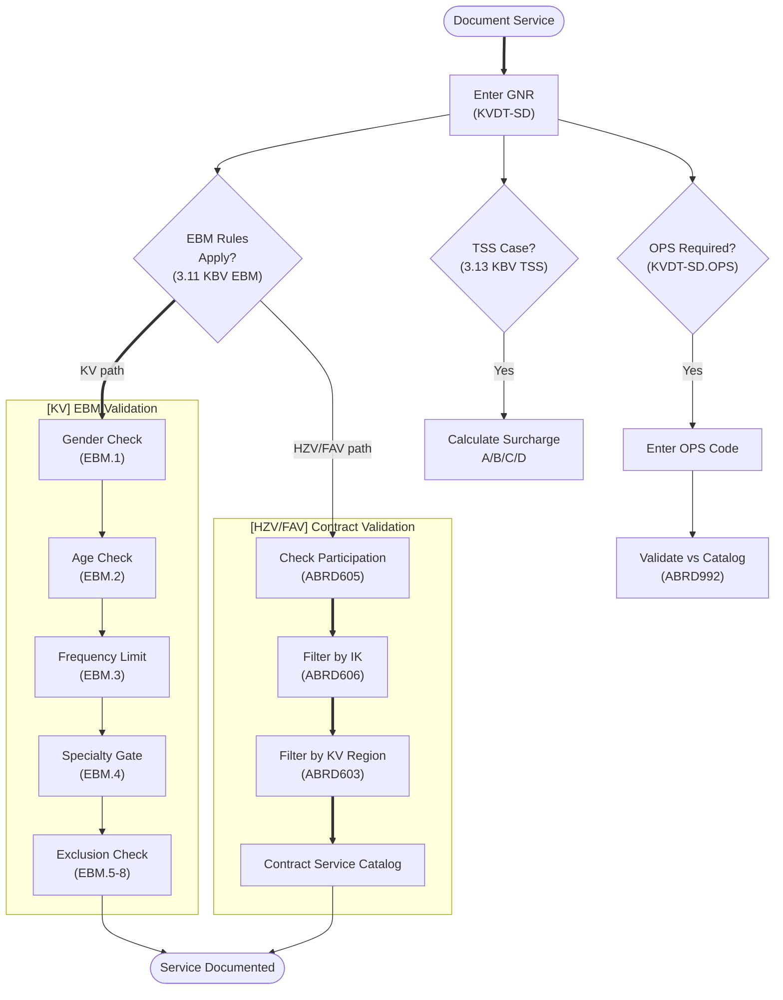

### User Stories & Acceptance Criteria

| # | ID | User Story | Acceptance Criteria | Req Type |
|---|-----|-----------|---------------------|----------|
| 292 | 306 | As a practice doctor, I want gender-restricted EBM codes are validated against patient gender, so that statutory billing is validated and accepted. | Given a geschlechtsbeschrankte EBM-Ziffer, when billed on a patient with wrong Geschlecht, then a warning is displayed | M |
| 293 | 307 | As a practice doctor, I want age-restricted EBM codes are validated against patient age, so that statutory billing is validated and accepted. | Given an altersbeschrankte EBM-Ziffer, when the patient's Alter is outside the allowed range, then a warning is displayed | M |
| 294 | 308 | As a practice doctor, I want EBM frequency limits are enforced, so that statutory billing is validated and accepted. | Given an EBM-Ziffer with Haufigkeitsbegrenzung, when the limit is exceeded in the Bezugszeitraum, then billing is blocked | M |
| 295 | 309 | As a practice doctor, I want EBM diagnosis prerequisites are validated, so that statutory billing is validated and accepted. | Given an EBM-Ziffer requiring specific ICD-Diagnosen, when billed without them, then billing is blocked | M |
| 296 | 310 | As a practice doctor, I want surgical EBM codes require OPS documentation, so that statutory billing is validated and accepted. | Given a chirurgische EBM-Ziffer requiring OPS, when billed without OPS code, then billing is blocked | M |
| 297 | 311 | As a practice doctor, I want human genetics services require OMIM codes (pre-Q3 2025), so that statutory billing is validated and accepted. | Given a humangenetische Leistung before Q3 2025, when billed without OMIM code, then billing is blocked | M |
| 298 | 312 | As a practice doctor, I want human genetics services require HGNC codes (post-Q2 2025), so that statutory billing is validated and accepted. | Given a humangenetische Leistung after Q2 2025, when billed without HGNC code, then billing is blocked | M |
| 299 | 313 | As a practice doctor, I want substitute physician billing requires RVSA certificate, so that statutory billing is validated and accepted. | Given Vertreterarzt-Abrechnung, when no RVSA-Bescheinigung is present, then billing is blocked | M |
| 300 | 314 | As a practice doctor, I want material cost services require pseudo-GNR assignment, so that statutory billing is validated and accepted. | Given a Sachkosten-Leistung, when no Pseudo-GNR is assigned, then billing is blocked | M |
| 301 | 315 | As a practice doctor, I want psychotherapy approval chain is tracked, so that statutory billing is validated and accepted. | Given Psychotherapie-Leistungen, when billed, then the Genehmigungskette (Antrag, Bewilligung, Kontingent) is tracked | M |
| 302 | 316 | As a practice doctor, I want report/approval/S115b requirements are flagged on EBM codes, so that statutory billing is validated and accepted. | Given EBM-Ziffern with Berichts-/Genehmigungs-/S115b-Pflicht, when billed, then the requirement is flagged | M |
| 303 | 317 | As a practice doctor, I want specialty group restrictions are validated on EBM codes, so that statutory billing is validated and accepted. | Given an EBM-Ziffer with Fachgruppenbeschrankung, when billed by a non-matching Fachgruppe, then a warning is displayed | M |
| 304 | 318 | As a practice doctor, I want KV-region-specific age rules are validated, so that statutory billing is validated and accepted. | Given KV-regionsspezifische Altersregeln, when a service is billed outside the regional age range, then validation blocks it | M |
| 305 | 319 | As a practice doctor, I want age-dependent code conversion is suggested, so that statutory billing is validated and accepted. | Given an EBM-Ziffer with altersabhangiger Umwandlung, when the patient's age triggers conversion, then the replacement code is suggested | M |
| 306 | 320 | As a practice doctor, I want GOA code validity, exclusions, and deletion markers are checked, so that private billing is validated correctly. | Given a GOA-Ziffer, when billed, then date validity, Ausschlusse, and Loschkennzeichen are checked | M |
| 307 | 321 | As a practice staff, I want TSS surcharge calculation is applied correctly, so that appointment surcharges are applied correctly. | Given a TSS-Terminfall, when surcharge calculation is triggered, then the correct TSS-Zuschlag (A/B/C/D) is suggested | M |
| 308 | P2-600 | As a practice doctor, I want service documentation capture service code, date, and responsible physician, so that service documentation meets KVDT standards. | Given Leistungserfassung, when a service is documented, then Leistungsziffer, Datum, and verantwortlicher Arzt are captured | M |
| 309 | P2-601 | As a practice doctor, I want service time is capturable for time-based billing codes, so that service documentation meets KVDT standards. | Given a zeitbasierte Leistung, when documented, then the Uhrzeitangabe is capturable | M |
| 310 | P2-602 | As a practice doctor, I want service frequency (Mehrfacherbringung) is documentable, so that service documentation meets KVDT standards. | Given a Leistung performed multiple times, when documented, then the Mehrfacherbringung count is stored | M |
| 311 | P2-603 | As a practice doctor, I want service deletion is audit-logged with reason, so that service documentation meets KVDT standards. | Given a Leistung deletion, when performed, then an audit log with user, timestamp, and reason is created | M |
| 312 | P2-604 | As a practice doctor, I want service modification after billing submission is tracked, so that service documentation meets KVDT standards. | Given a Leistung modified after Abrechnungsubertragung, when saved, then the modification is tracked for Korrekturlieferung | M |
| 313 | P2-605 | As a practice doctor, I want EBM service code validity is checked against current catalog, so that service documentation meets KVDT standards. | Given an EBM-Ziffer, when entered, then it must exist in the current EBM-Katalog | M |
| 314 | P2-606 | As a practice doctor, I want service code search by number and text is available, so that service documentation meets KVDT standards. | Given Leistungssuche, when the user searches by Nummer or Text, then matching codes are returned | M |
| 315 | P2-607 | As a practice doctor, I want service exclusions (Ausschlusse) is validated in real time, so that service documentation meets KVDT standards. | Given a Leistung with Ausschlusse, when entered alongside an excluded code, then real-time validation warns | M |
| 316 | P2-608 | As a practice doctor, I want service prerequisites (Voraussetzungen) is checked, so that service documentation meets KVDT standards. | Given a Leistung with Voraussetzungen, when entered, then prerequisites are validated | M |
| 317 | P2-609 | As a practice doctor, I want service-to-diagnosis linkage is maintainable, so that service documentation meets KVDT standards. | Given a Leistung and Diagnose, when linked, then the Leistungs-Diagnose-Zuordnung is persisted | M |
| 318 | P2-610 | As a practice doctor, I want free-text service annotations is supportable, so that service documentation meets KVDT standards. | Given a Leistung, when annotated, then free-text Anmerkungen are stored | M |
| 319 | KP2-611 | As a practice doctor, I want service documentation distinguish between direct and delegated services, so that service documentation meets KVDT standards. | Given Leistungserfassung, when documented, then direkte and delegierte Leistungen are distinguishable | M |
| 320 | KP2-612 | As a practice doctor, I want co-treatment (Mitbehandlung) documentation is supported, so that service documentation meets KVDT standards. | Given a Mitbehandlung, when documented, then co-treatment specific fields are captured | M |
| 321 | KP2-613 | As a practice doctor, I want emergency service documentation capture special fields, so that service documentation meets KVDT standards. | Given a Notfalldokumentation, when created, then emergency-specific fields are available | M |
| 322 | KP2-614 | As a practice doctor, I want home visit documentation capture location and travel details, so that service documentation meets KVDT standards. | Given a Hausbesuch, when documented, then Ort and Fahrtstrecke details are captured | M |
| 323 | KP2-615 | As a practice doctor, I want telephone consultation documentation is supported, so that service documentation meets KVDT standards. | Given a Telefonkonsultation, when documented, then consultation-specific fields are captured | M |
| 324 | KP2-616 | As a practice doctor, I want video consultation documentation is supported with technical requirements, so that service documentation meets KVDT standards. | Given a Videosprechstunde, when documented, then technical requirements and consultation fields are captured | M |
| 325 | P2-617 | As a practice doctor, I want OPS procedure codes is documentable alongside EBM services, so that service documentation meets KVDT standards. | Given an EBM-Leistung, when OPS is applicable, then OPS codes are documentable alongside | M |
| 326 | P2-618 | As a practice doctor, I want material costs (Sachkosten) is documentable per service, so that service documentation meets KVDT standards. | Given a Leistung with Sachkosten, when documented, then material cost details are stored per service | M |
| 327 | P2-619 | As a practice doctor, I want billing justification text is capturable for flagged services, so that service documentation meets KVDT standards. | Given a Leistung flagged for Begrundung, when documented, then justification text is capturable | M |
| 328 | P2-620 | As a practice doctor, I want service point values is displayable from current EBM catalog, so that service documentation meets KVDT standards. | Given an EBM-Ziffer, when displayed, then the Punktwert from the current catalog is shown | M |
| 329 | K2-621 | As a practice doctor, I want service templates for common visit types may optionally be provided, so that service documentation meets KVDT standards. | Given common visit types, when templates are available, then pre-configured Leistungspakete are selectable | O |
| 330 | K2-622 | As a practice doctor, I want service auto-suggestion based on diagnosis may optionally be provided, so that service documentation meets KVDT standards. | Given a Diagnose, when auto-suggestion is enabled, then matching Leistungen are suggested | O |
| 331 | K2-623 | As a practice doctor, I want service statistics and frequency analysis may optionally be provided, so that service documentation meets KVDT standards. | Given documented Leistungen, when statistics are requested, then frequency analysis is available | O |
| 332 | KP6-800 | As a practice doctor, I want substitute doctor services is marked with substitute LANR, so that service documentation meets KVDT standards. | Given Vertreterarzt services, when documented, then the Vertreter-LANR is stored | M |
| 333 | KP6-801 | As a practice doctor, I want service documentation enforce contract-specific service catalogs, so that service documentation meets KVDT standards. | Given a Selektivvertrag, when services are documented, then only the contract-specific Leistungskatalog is available | M |
| 334 | KP6-802 | As a practice doctor, I want service documentation validate against patient's active participation status, so that service documentation meets KVDT standards. | Given a Leistung for a Selektivvertrag-Patient, when documented, then Teilnahmestatus is validated | M |
| 335 | KP6-803 | As a practice doctor, I want preventive care services is tracked with appropriate case markers, so that service documentation meets KVDT standards. | Given Vorsorgeleistungen, when documented, then the Vorsorge-Fallkennzeichen is set | M |
| 336 | KP6-804 | As a practice doctor, I want chronic care flat-rate services validate permanent diagnosis requirements, so that service documentation meets KVDT standards. | Given Chronikerpauschale, when billed, then at least one confirmed Dauerdiagnose is required | M |
| 337 | KP6-805 | As a practice doctor, I want service date fall within the patient's contract activation window, so that service documentation meets KVDT standards. | Given a Leistungsdatum, when checked against Aktivierungsfenster, then out-of-window dates are blocked | M |
| 338 | KP6-806 | As a practice doctor, I want referral services capture referring physician LANR and BSNR, so that service documentation meets KVDT standards. | Given an Uberweisungsleistung, when documented, then Uberweiser-LANR and BSNR are captured | M |
| 339 | KP6-807 | As a practice doctor, I want service documentation support contract-specific additional information fields, so that service documentation meets KVDT standards. | Given a Vertrag with Zusatzfelder, when services are documented, then the additional fields are available | M |
| 340 | KP6-808 | As a practice doctor, I want service documentation enforce age-based service eligibility rules, so that service documentation meets KVDT standards. | Given an altersabhangige Leistung, when patient age is outside range, then the service is blocked | M |
| 341 | KP6-809 | As a practice doctor, I want service documentation validate KV-region-specific rules, so that service documentation meets KVDT standards. | Given KV-regionsspezifische Regeln, when services are documented, then regional rules are enforced | M |
| 342 | KP6-810 | As a practice doctor, I want DMP service documentation capture program-specific data elements, so that service documentation meets KVDT standards. | Given a DMP-Leistung, when documented, then program-specific Datenelemente are captured | M |
| 343 | KP6-811 | As a practice doctor, I want service documentation support batch entry for multiple services, so that service documentation meets KVDT standards. | Given multiple Leistungen, when batch entry is used, then all services are documented in one operation | M |
| 344 | KP6-812 | As a practice doctor, I want service documentation is printable as daily service list, so that service documentation meets KVDT standards. | Given documented Leistungen, when daily list print is requested, then a Tagesleistungsliste is generated | M |
| 345 | KP6-813 | As a practice doctor, I want service documentation support correction workflows for rejected services, so that service documentation meets KVDT standards. | Given rejected Leistungen, when correction workflow is triggered, then corrections can be made and re-submitted | M |
| 346 | KP6-814 | As a practice doctor, I want psychotherapy session documentation track approval chain and session counts, so that service documentation meets KVDT standards. | Given Psychotherapie sessions, when documented, then Genehmigungskette and Sitzungszahler are tracked | M |
| 347 | KP6-815 | As a practice doctor, I want laboratory service documentation capture ordering physician and specimen details, so that service documentation meets KVDT standards. | Given Laborleistungen, when documented, then ordering Arzt and Probendetails are captured | M |
| 348 | KP6-816 | As a practice doctor, I want vaccination documentation capture vaccine, batch, and administration details, so that service documentation meets KVDT standards. | Given an Impfung, when documented, then Impfstoff, Charge, and Verabreichungsdetails are captured | M |

---

## 8. Prescription & Drug Safety

### Workflow Diagram

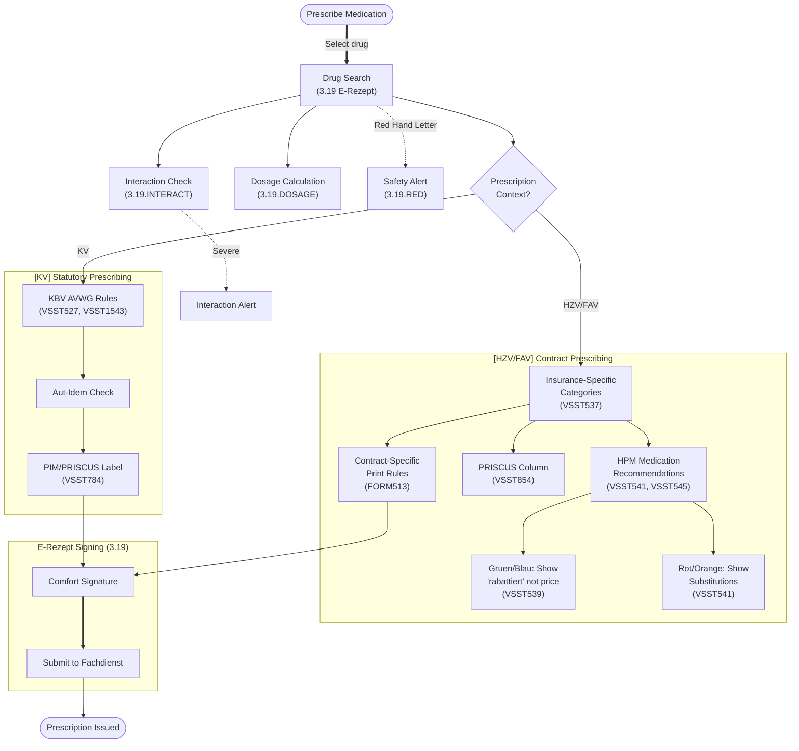

### User Stories & Acceptance Criteria

| # | ID | User Story | Acceptance Criteria | Req Type |
|---|-----|-----------|---------------------|----------|
| 349 | ERX-001 | As a practice doctor, I want e-Rezept creation is supported via gematik E-Rezept-Fachdienst, so that prescriptions are issued correctly via E-Rezept. | Given an E-Rezept, when created, then it is submitted to the gematik E-Rezept-Fachdienst | M |
| 350 | ERX-002 | As a practice doctor, I want e-Rezept include all mandatory FHIR fields per gematik specification, so that prescriptions are issued correctly via E-Rezept. | Given an E-Rezept, when generated, then all mandatory FHIR-Felder per gematik spec are included | M |
| 351 | ERX-003 | As a practice doctor, I want e-Rezept workflow status is trackable (created, dispensed, cancelled), so that prescriptions are issued correctly via E-Rezept. | Given an E-Rezept, when status changes, then Erstellt/Eingeloest/Storniert is tracked | M |
| 352 | ERX-004 | As a practice doctor, I want e-Rezept cancellation is supported before dispensing, so that prescriptions are issued correctly via E-Rezept. | Given an E-Rezept not yet dispensed, when cancelled, then the cancellation is processed via Fachdienst | M |
| 353 | ERX-005 | As a practice doctor, I want e-Rezept support Muster 16 (Kassenrezept) prescription type, so that prescriptions are issued correctly via E-Rezept. | Given a Kassenrezept (Muster 16), when created as E-Rezept, then all Muster-16-specific fields are included | M |
| 354 | ERX-006 | As a practice doctor, I want e-Rezept multiple prescription (Mehrfachverordnung) is supported, so that prescriptions are issued correctly via E-Rezept. | Given a Mehrfachverordnung, when created, then all partial prescriptions are linked | M |
| 355 | ERX-007 | As a practice doctor, I want e-Rezept direct assignment (Direktzuweisung) to pharmacy is supported, so that prescriptions are issued correctly via E-Rezept. | Given an E-Rezept, when Direktzuweisung is selected, then the prescription is routed to the specified pharmacy | O |
| 356 | ERX-008 | As a practice doctor, I want e-Rezept validate drug interactions before submission, so that prescriptions are issued correctly via E-Rezept. | Given an E-Rezept, when submitted, then drug Wechselwirkungen are checked and warnings displayed | M |
| 357 | DDB-001 | As a practice doctor, I want drug database (MMI/ifap) integration provide current drug data, so that prescriptions are issued correctly via E-Rezept. | Given drug database integration, when queried, then current Arzneimitteldaten from MMI/ifap are returned | M |
| 358 | DDB-002 | As a practice doctor, I want drug interaction checking is performed on all active medications, so that prescriptions are issued correctly via E-Rezept. | Given active Medikation, when interaction check runs, then all Wechselwirkungen are identified | M |
| 359 | DDB-003 | As a practice doctor, I want drug allergy checking against documented patient allergies is performed, so that prescriptions are issued correctly via E-Rezept. | Given documented Allergien, when a drug is prescribed, then allergy checking is performed | M |
| 360 | DDB-004 | As a practice doctor, I want PRISCUS list (potentially inappropriate medications for elderly) is flagged, so that prescriptions are issued correctly via E-Rezept. | Given an elderly patient, when a PRISCUS-Medikament is prescribed, then a warning is displayed | M |
| 361 | DDB-005 | As a practice doctor, I want aut-idem/aut-simile substitution rules is displayed, so that prescriptions are issued correctly via E-Rezept. | Given a Verordnung, when aut-idem/aut-simile applies, then substitution rules are displayed | M |
| 362 | DDB-006 | As a practice doctor, I want drug dosage recommendations is displayable, so that prescriptions are issued correctly via E-Rezept. | Given a drug, when selected, then Dosierungsempfehlungen are displayable | M |
| 363 | HLM-001 | As a practice doctor, I want heilmittel (therapeutic remedies) prescription per Heilmittelkatalog is supported, so that prescriptions are issued correctly via E-Rezept. | Given a Heilmittelverordnung, when created, then it conforms to the Heilmittelkatalog | M |
| 364 | HLM-002 | As a practice doctor, I want heilmittel prescription validate diagnosis-specific remedy assignments, so that prescriptions are issued correctly via E-Rezept. | Given a Heilmittelverordnung, when a remedy is selected, then diagnosis-specific Zuordnungen are validated | M |
| 365 | HLM-003 | As a practice doctor, I want heilmittel frequency and duration limits is enforced per catalog, so that prescriptions are issued correctly via E-Rezept. | Given Heilmittel, when prescribed, then Haeufigkeits- and Dauergrenzen per Katalog are enforced | M |
| 366 | HLM-004 | As a practice doctor, I want langfristverordnung (long-term prescription) for Heilmittel is supported, so that prescriptions are issued correctly via E-Rezept. | Given a Langfristverordnung, when created, then long-term Heilmittel prescription rules are applied | M |
| 367 | HFM-001 | As a practice doctor, I want hilfsmittel (medical aids) prescription is supported, so that prescriptions are issued correctly via E-Rezept. | Given a Hilfsmittelverordnung, when created, then medical aid prescription rules are applied | M |
| 368 | HFM-002 | As a practice doctor, I want hilfsmittelverzeichnis catalog lookup is available, so that prescriptions are issued correctly via E-Rezept. | Given Hilfsmittel selection, when catalog lookup is used, then the Hilfsmittelverzeichnis is searchable | M |
| 369 | EVDGA-001 | As a practice doctor, I want eVDGA (digitale Gesundheitsanwendungen) prescription is supported, so that prescriptions are issued correctly via E-Rezept. | Given an eVDGA-Verordnung, when created, then DiGA prescription rules are applied | M |
| 370 | EVDGA-002 | As a practice doctor, I want DiGA directory lookup is available for app prescriptions, so that prescriptions are issued correctly via E-Rezept. | Given DiGA selection, when directory lookup is used, then the BfArM DiGA-Verzeichnis is searchable | M |
| 371 | BMP-001 | As a practice doctor, I want bundeseinheitlicher Medikationsplan (BMP) is generatable, so that prescriptions are issued correctly via E-Rezept. | Given patient Medikation, when BMP is requested, then a Bundeseinheitlicher Medikationsplan is generated | M |
| 372 | BMP-002 | As a practice doctor, I want BMP is printable and storable on eGK, so that prescriptions are issued correctly via E-Rezept. | Given a BMP, when print or eGK storage is requested, then both operations succeed | M |
| 373 | VSST496 | As a practice staff, I want transmitted prescription data is marked as billed after successful transmission, so that the software meets regulatory requirements. | Given successful prescription data transmission, when the process completes, then all transmitted Verordnungen are flagged as 'abgerechnet' | M |
| 374 | VSST510 | As a practice staff, I want medication database updates at least every 14 days, so that the software meets regulatory requirements. | Given the medication database, when an update cycle runs, then updates are applied at least every 14 days or quarterly at minimum | M |
| 375 | VSST515 | As a practice staff, I want prescription data transmission prerequisites are checked, so that the software meets regulatory requirements. | Given Verordnungsdaten for transmission, when prerequisites are checked, then all required fields and validations must pass before sending | M |
| 376 | VSST516 | As a practice staff, I want prescription data transmission is currently blocked but supports retroactive future transmission, so that the software meets regulatory requirements. | Given the current system state, when the user attempts to transmit Verordnungsdaten, then transmission is blocked; given the documentation structure, then it supports future retroactive transmission | M |
| 377 | VSST518 | As a practice staff, I want prescriptions documented after contract start but before transmission start are transmittable, so that the software meets regulatory requirements. | Given Verordnungen documented after the contract documentation start date but before the transmission start date, when transmission is triggered, then those prescriptions are included | M |
| 378 | VSST522 | As a practice staff, I want arriba target path is resolved, so that the software meets regulatory requirements. | Given arriba integration configured, when the user triggers arriba, then the correct target path is resolved and opened | M |
| 379 | VSST523 | As a practice staff, I want arriba invocation passes patient context, so that the software meets regulatory requirements. | Given arriba integration, when invoked with patient context, then arriba launches with the correct patient data | M |
| 380 | VSST527 | As a practice staff, I want KBV AVWG prescription catalog is enforced, so that the software meets regulatory requirements. | Given a Verordnung, when a drug is prescribed, then AVWG catalog rules are enforced and violations are flagged | M |
| 381 | VSST532 | As a practice staff, I want prescription data structure matches specification, so that the software meets regulatory requirements. | Given a Verordnung, when created, then the data structure matches the required Verordnungsdatenstruktur specification | M |
| 382 | VSST537 | As a practice staff, I want insurance-specific drug categories is displayed, so that the software meets regulatory requirements. | Given a Verordnung for a specific Kasse, when drug selection is shown, then insurance-specific Arzneimittelkategorien are displayed | M |
| 383 | VSST538 | As a practice staff, I want contract-specific prescription data requirements are enforced, so that the software meets regulatory requirements. | Given contract-specific prescription data requirements, when Verordnungsdaten are processed, then the requirements are enforced | M |
| 384 | VSST539 | As a practice staff, I want Gruen/Blau medications show 'rabattiert' instead of prices, so that the software meets regulatory requirements. | Given a medication of category Gruen or Blau, when displayed in practice/patient lists or search results, then 'rabattiert' is shown instead of the price | M |
| 385 | VSST540 | As a practice staff, I want Gruen medications show 'rabattiert' instead of prices, so that the software meets regulatory requirements. | Given a medication of category Gruen, when displayed in practice/patient lists or search results, then 'rabattiert' is shown instead of the price | M |
| 386 | VSST541 | As a practice staff, I want Rot/Orange/keine medications trigger HPM recommendation retrieval, so that the software meets regulatory requirements. | Given a medication of category Rot, Orange, or 'keine' being prescribed, when the system queries HPM, then insurance-specific recommendations are displayed; given a substitute is selected from recommendations, then no further recommendation check occurs | M |
| 387 | VSST543 | As a practice staff, I want HPM medication queries use patient's Hauptkassen-IK, so that the software meets regulatory requirements. | Given a medication query to HPM endpoints, when the query is executed, then it uses HTTP POST with the Hauptkassen-IK derived from the Selektivvertragsdefinition Kostentraegerdaten | M |
| 388 | VSST545 | As a practice staff, I want HPM recommendation results displayed in tabular ATC-grouped format, so that the software meets regulatory requirements. | Given HPM medication recommendation results, when displayed, then they appear in a table grouped by ATC group sorted ascending by priority, with medications color-coded by category | M |
| 389 | VSST548 | As a practice staff, I want medication search results sorted with Gruen/Blau first, so that the software meets regulatory requirements. | Given medication search results, when displayed, then Gruen and Blau categories appear first, or a filter limits display to those categories with a 'Show all' override available | M |
| 390 | VSST550 | As a practice staff, I want substitution verification hint is displayed, so that the software meets regulatory requirements. | Given insurance-specific medication recommendations are displayed, when the user views them, then the hint about verifying medical feasibility of substitutions is shown | M |
| 391 | VSST551 | As a practice staff, I want Gruen/GruenBerechnet/Blau medications display HPM messages, so that the software meets regulatory requirements. | Given a medication of category Gruen, GruenBerechnet, or Blau being prescribed, when the Pruef- und Abrechnungsmodul returns messages, then those messages are displayed to the user | M |
| 392 | VSST590 | As a practice staff, I want insurance contact data for care coordination is available, so that the software meets regulatory requirements. | Given a Patient with Selektivvertrag, when care coordination is needed, then insurance contact data (Ansprechpartner, Telefon) is available | M |
| 393 | VSST593 | As a practice staff, I want employment data documentation for current patient, so that the software meets regulatory requirements. | Given a patient, when the employment documentation function is opened, then fields for employment status, weekly hours, occupation description, occupation type, and related data are editable and saveable | M |
| 394 | VSST594 | As a practice staff, I want employment status displayed when issuing AU, so that the software meets regulatory requirements. | Given an AU is being issued, when the patient view loads, then employment status and type are displayed with a link to edit the documentation | M |
| 395 | VSST599 | As a practice staff, I want hint if employment data is empty or older than 1 year when issuing AU, so that the software meets regulatory requirements. | Given empty or outdated (>1 year) employment data, when an AU or eAU is issued, then a hint requests the user to fill in employment data before issuing | M |
| 396 | VSST621 | As a practice staff, I want AU issuance blocked if employment data not current, so that the software meets regulatory requirements. | Given a patient with empty or outdated employment data, when an AU or eAU issuance is attempted, then the system blocks issuance until employment data is current | M |
| 397 | VSST622 | As a practice staff, I want employment data currency confirmation with date tracking, so that the software meets regulatory requirements. | Given the employment data confirmation function, when the user confirms currency, then the current date is stored in 'Datum letzte Ueberpruefung' | M |
| 398 | VSST650 | As a practice staff, I want prescription data transmission, so that the software meets regulatory requirements. | Given Verordnungsdaten ready, when transmission is triggered, then the data is sent via the configured channel | M |
| 399 | VSST784 | As a practice staff, I want PIM drug labels is displayed, so that the software meets regulatory requirements. | Given a Verordnung for an elderly patient, when a PRISCUS/PIM drug is selected, then a PIM warning label is displayed | M |
| 400 | VSST848 | As a practice staff, I want depression hint for F32.9/F33.9 on follow-up AU, so that the software meets regulatory requirements. | Given ICD-10 F32.9 or F33.9 documented, when a Folge-AU is issued, then the hint about considering targeted diagnostic/therapeutic measures for unspecific depression is displayed | M |
| 401 | VSST854 | As a practice staff, I want Priscus-Liste column in medication recommendations, so that the software meets regulatory requirements. | Given insurance-specific medication recommendations, when displayed, then a Priscus-Liste column is shown for each medication | M |
| 402 | VSST855 | As a practice staff, I want Festbetragskennzeichnung and co-payment columns in recommendations, so that the software meets regulatory requirements. | Given insurance-specific medication recommendations, when displayed, then Festbetragskennzeichnung and Zuzahlung columns are shown | M |
| 403 | VSST858 | As a practice staff, I want co-payment column in medication recommendations, so that the software meets regulatory requirements. | Given insurance-specific medication recommendations, when displayed, then a Zuzahlung column is shown | M |
| 404 | VSST863 | As a practice staff, I want repeat prescriptions check current medication recommendations, so that the software meets regulatory requirements. | Given a repeat prescription, when issued, then current insurance-specific recommendations are retrieved, category changes are checked, and substitution options are displayed per interface specification | M |
| 405 | VSST870 | As a practice staff, I want medication categories and recommendations displayed automatically, so that the software meets regulatory requirements. | Given insurance-specific medication data, when available, then categories and recommendations are displayed automatically and immediately without requiring user interaction | M |
| 406 | VSST923 | As a practice staff, I want high-volume prescription control warning, so that the software meets regulatory requirements. | Given a Verordnung exceeding volume thresholds, when saved, then a Hochvolumen warning is displayed to the user | M |
| 407 | VSST976 | As a practice staff, I want transmitted prescription count displayed after successful transmission, so that the software meets regulatory requirements. | Given successful real-data prescription transmission, when complete, then the count of transmitted prescriptions is shown; given test transmission, then count is not shown; given deleted prescriptions, then they are excluded from the count | M |
| 408 | VSST977 | As a practice staff, I want OTC exception indication only applies to participants aged 18+, so that the software meets regulatory requirements. | Given an OTC exception indication per AM-RL Anlage I, when the patient is a contract participant under 18, then the indication is not displayed; given age 18+, then it is displayed | M |
| 409 | VSST1212 | As a practice staff, I want participants aged 12-17 get OTC on Kassenrezept automatically, so that the software meets regulatory requirements. | Given a participant aged 12-17, when OTC medication is prescribed, then it is automatically placed on Muster 16 (Kassenrezept); given manual override needed, then the prescription type can be changed | M |
| 410 | VSST1231 | As a practice staff, I want substitute physician has all Versorgungssteuerung functions, so that the software meets regulatory requirements. | Given a Stellvertreterarzt, when providing care, then all Versorgungssteuerung functions available to the Betreuarzt are also available | M |
| 411 | VSST1390 | As a practice staff, I want preventive colonoscopy hint is displayed, so that the software meets regulatory requirements. | Given a Patient eligible for Vorsorge-Koloskopie, when the patient record is opened, then a reminder hint is displayed | M |
| 412 | VSST1457 | As a practice staff, I want KBV Heilmittel catalog requirements apply analogously, so that the software meets regulatory requirements. | Given the KBV Heilmittel catalog requirements, when Heilmittel prescriptions are processed, then all listed functions apply unless HAEVG specifies otherwise | M |
| 413 | VSST1459 | As a practice staff, I want advertising-free Heilmittel prescriptions, so that the software meets regulatory requirements. | Given Heilmittel prescription for a contract participant, when the prescription interface is shown, then no advertising is displayed (Werbefreiheit) | M |
| 414 | VSST1543 | As a practice staff, I want AVWG including ARV is enforced, so that the software meets regulatory requirements. | Given a Verordnung, when AVWG rules including ARV are checked, then violations are flagged | M |
| 415 | VSST1548 | As a practice staff, I want retroactive prescription data transmission from GueltigAbReferenzdatum, so that the software meets regulatory requirements. | Given prescription data, when retroactive transmission is triggered, then data from the GueltigAbReferenzdatum is included; given a GueltigBisReferenzdatum, then data beyond that date is excluded | M |
| 416 | VSST592 | As a practice staff, I want DMPs (Diabetes 1/2, KHK, Asthma, COPD, Brustkrebs) integrated per KBV, so that the software meets regulatory requirements. | Given the Vertragssoftware, when DMP functionality is accessed, then eDMP modules for Diabetes Type 1, Type 2, KHK, Asthma, COPD, and Brustkrebs are available per KBV specifications | M |
| 417 | VSST677 | As a practice staff, I want eDMP KHK integrated per KBV, so that the software meets regulatory requirements. | Given the Vertragssoftware, when DMP functionality is accessed, then eDMP Koronare Herzkrankheit is available per KBV specifications | M |
| 418 | VSST1020 | As a practice staff, I want eDMP transmission, so that the software meets regulatory requirements. | Given eDMP data ready, when transmission is triggered, then the data is sent to the DMP-Datenstelle | O |
| 419 | VSST1106 | As a practice staff, I want PraCMan-Cockpit URL management, so that the software meets regulatory requirements. | Given the PraCMan-Cockpit URL is configured, when the user manages it, then the URL can be set, updated, and used to launch PraCMan from the software | O |
| 420 | VSST1107 | As a practice staff, I want PraCMan-Cockpit launch with patient parameters, so that the software meets regulatory requirements. | Given a contract participant, when the user launches PraCMan-Cockpit, then the software passes the required parameters per AKA interface specification | M |
| 421 | VSST1547 | As a practice staff, I want eDMP Diabetes Type 1/2 integrated per KBV, so that the software meets regulatory requirements. | Given the Vertragssoftware, when DMP functionality is accessed, then eDMP Diabetes Mellitus Type 1 and Type 2 are available per KBV specifications | M |
| 422 | VSST1749 | As a practice staff, I want eDMP workflow available, so that the software meets regulatory requirements. | Given eDMP documentation, when triggered, then the eDMP workflow is available and functional | M |

---

## 9. Form Management -- KV vs HZV/FAV Forms

### Workflow Diagram

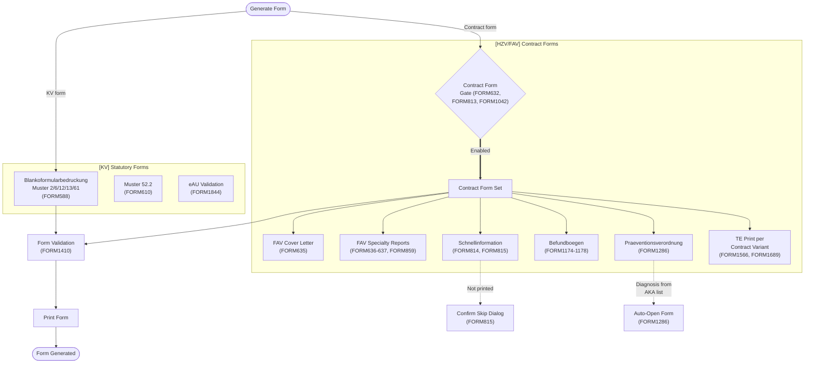

### User Stories & Acceptance Criteria

| # | ID | User Story | Acceptance Criteria | Req Type |
|---|-----|-----------|---------------------|----------|
| 423 | FORM513 | As a practice staff (MFA), I want contract-specific printing rules applied for medication/vaccine prescriptions, so that forms are generated correctly for submission. | Given a contract participant, when a medication/vaccine prescription is printed on KV or BTM recipe, then contract-specific printing rules are applied | M |
| 424 | FORM586 | As a practice staff (MFA), I want contractual forms is manageable, so that forms are generated correctly for submission. | Given Vertragsformulare defined for a Selektivvertrag, when the user opens form management, then all contract forms are listed and selectable | M |
| 425 | FORM588 | As a practice staff (MFA), I want Blankoformularbedruckung per KBV for Muster 2/6/12/13/61, so that forms are generated correctly for submission. | Given a contract participant, when blank form printing is requested for Muster 2/6/12/13/61, then the form is printed per current KBV Blankoformularbedruckung specifications | M |
| 426 | FORM610 | As a practice staff (MFA), I want Muster 52.2 form is fillable and printable, so that forms are generated correctly for submission. | Given Muster 52.2 selected, when patient data is loaded, then all fields are pre-filled and the form is printable | M |
| 427 | FORM632 | As a practice staff (MFA), I want form feature per contract, so that forms are generated correctly for submission. | Given a Vertrag with specific form features, when form management is opened, then only contract-enabled forms are available | M |
| 428 | FORM635 | As a practice staff (MFA), I want FaV cover letter with auto-filled diagnoses and allergies, so that forms are generated correctly for submission. | Given a FaV patient, when the Begleitschreiben is opened, then it can be saved to the patient record; given stored Dauerdiagnosen and allergies exist, then those fields are pre-filled; given other fields, then they remain manually editable | M |
| 429 | FORM636 | As a practice staff (MFA), I want FaV cardiology report with full patient data, so that forms are generated correctly for submission. | Given a FaV cardiology patient, when the Befundbericht is generated, then it contains: patient master data, diagnoses, ICD codes, anamnesis, pre-medication, lab values, findings, assessment, therapy proposal, and 'Teilnahme am Facharztvertrag' note | M |
| 430 | FORM637 | As a practice staff (MFA), I want FaV gastroenterology report, so that forms are generated correctly for submission. | Given a FaV gastroenterology patient, when the Befundbericht is generated, then it contains: patient master data, diagnoses, ICD codes, anamnesis, lab values, findings, assessment, and therapy proposal | M |
| 431 | FORM656 | As a practice staff (MFA), I want contractual forms is printable, so that forms are generated correctly for submission. | Given a Vertragsformular filled with patient data, when print is requested, then the form is printed correctly | M |
| 432 | FORM813 | As a practice staff (MFA), I want form feature per contract, so that forms are generated correctly for submission. | Given contract-specific form configuration, when the user accesses forms, then only the contract's form set is available | M |
| 433 | FORM814 | As a practice staff (MFA), I want Schnellinformation zur Patientenbegleitung form, so that forms are generated correctly for submission. | Given a patient, when the 'Schnellinformation zur Patientenbegleitung' is opened, then the form can be filled, printed as Volldruck per AKA template, and saved to the patient | M |
| 434 | FORM815 | As a practice staff (MFA), I want skip confirmation dialog for Schnellinformation, so that forms are generated correctly for submission. | Given the Schnellinformation form is not printed, when the user closes it, then a confirmation dialog asks whether the user intentionally skips, explaining that early insurer intervention may help | M |
| 435 | FORM859 | As a practice staff (MFA), I want FaV PNP report, so that forms are generated correctly for submission. | Given a FaV PNP patient, when the Befundbericht is generated, then it contains at minimum: patient master data and diagnoses | M |
| 436 | FORM886 | As a practice staff (MFA), I want supplementary FaV cover letter document with lab values and medication, so that forms are generated correctly for submission. | Given a FaV patient, when the supplementary document is created, then lab values and current medication can be loaded from the patient record and printed with an appropriate hint text | M |
| 437 | FORM907 | As a practice staff (MFA), I want contract-specific prescription printing rules, so that forms are generated correctly for submission. | Given a contract participant, when a medication/vaccine prescription is printed on KV or BTM recipe, then contract-specific printing rules are applied | M |
| 438 | FORM938 | As a practice staff (MFA), I want Patientenmerkblatt signature hint on Schnellinformation, so that forms are generated correctly for submission. | Given the Schnellinformation form is opened, when it loads, then a hint window appears stating the Patientenmerkblatt signature requirement for billing the Patientenbegleitung service | M |
| 439 | FORM1042 | As a practice staff (MFA), I want form feature per contract, so that forms are generated correctly for submission. | Given a contract defining form features, when form access is attempted, then only enabled forms are shown | M |
| 440 | FORM1174 | As a practice staff (MFA), I want Befundbogen Arthrose form, so that forms are generated correctly for submission. | Given a patient, when the 'Befundbogen Arthrose' form is opened, then it can be filled, printed as Volldruck per AKA template, and saved to the patient | M |
| 441 | FORM1175 | As a practice staff (MFA), I want Befundbogen entzuendliche Gelenkerkrankungen form, so that forms are generated correctly for submission. | Given a patient, when the 'Befundbogen entzuendliche Gelenkerkrankungen' form is opened, then it can be filled, printed as Volldruck per AKA template, and saved to the patient | M |
| 442 | FORM1176 | As a practice staff (MFA), I want Befundbogen Grundversorgung form, so that forms are generated correctly for submission. | Given a patient, when the 'Befundbogen Grundversorgung' form is opened, then it can be filled, printed as Volldruck per AKA template, and saved to the patient | M |
| 443 | FORM1177 | As a practice staff (MFA), I want Befundbogen Rueckenschmerz form, so that forms are generated correctly for submission. | Given a patient, when the 'Befundbogen Rueckenschmerz' form is opened, then it can be filled, printed as Volldruck per AKA template, and saved to the patient | M |
| 444 | FORM1178 | As a practice staff (MFA), I want Befundbogen Osteoporose form, so that forms are generated correctly for submission. | Given a patient, when the 'Befundbogen Osteoporose' form is opened, then it can be filled, printed as Volldruck per AKA template, and saved to the patient | M |
| 445 | FORM1236 | As a practice staff (MFA), I want GDK Antragsformular form, so that forms are generated correctly for submission. | Given a patient, when the 'GDK Antragsformular' form is opened, then it can be filled, printed as Volldruck per AKA template, and saved to the patient | M |
| 446 | FORM1237 | As a practice staff (MFA), I want Beratungsbogen Sozialer Dienst form, so that forms are generated correctly for submission. | Given a patient, when the 'Beratungsbogen zur Einbindung des Sozialen Dienstes' form is opened, then it can be filled, printed as Volldruck per AKA template, and saved to the patient | M |
| 447 | FORM1238 | As a practice staff (MFA), I want Beratungsbogen Patientenbegleitung form, so that forms are generated correctly for submission. | Given a patient, when the 'Beratungsbogen zur Einbindung der Patientenbegleitung' form is opened, then it can be filled, printed as Volldruck per AKA template, and saved to the patient | M |
| 448 | FORM1286 | As a practice staff (MFA), I want Praeventionsverordnung auto-opens on qualifying diagnosis, so that forms are generated correctly for submission. | Given a first-in-quarter confirmed diagnosis from the AKA Diagnosenliste, when documented, then the 'Praeventionsverordnung' form auto-opens; given the form, when filled, then it can be printed and saved per AKA rules | M |
| 449 | FORM1386 | As a practice staff (MFA), I want diagnosis hint for AKA Diagnosenliste entries, so that forms are generated correctly for submission. | Given a confirmed diagnosis from the AKA Diagnosenliste documented for a participant, when the diagnosis is saved, then a hint 'Bitte pruefen Sie den Einsatz von...' is displayed | M |
| 450 | FORM1410 | As a practice staff (MFA), I want form validation per contract, so that forms are generated correctly for submission. | Given a Vertragsformular, when submitted, then contract-specific validation rules are applied before acceptance | M |
| 451 | FORM1413 | As a practice staff (MFA), I want hint when printing Muster 52.2, so that forms are generated correctly for submission. | Given Muster 52.2 print triggered, when the print dialog opens, then a contract-specific hint is displayed | M |
| 452 | FORM1414 | As a practice staff (MFA), I want hint when filling Muster 52.2, so that forms are generated correctly for submission. | Given Muster 52.2 being filled, when the user opens the form, then a filling-guidance hint is displayed | M |
| 453 | FORM1447 | As a practice staff (MFA), I want lab referral hint for HZV/FaV participants, so that forms are generated correctly for submission. | Given an active HZV/FaV/BV/IV participant, when Muster 10 or 10A is opened, then the AKA-Basisdatei Hinweistext for lab referrals is displayed | M |
| 454 | FORM1450 | As a practice staff (MFA), I want form feature per contract, so that forms are generated correctly for submission. | Given a contract's form feature set, when the user accesses forms, then only contract-enabled forms are available | M |
| 455 | FORM1451 | As a practice staff (MFA), I want Antrag auf HZV-KinderReha form, so that forms are generated correctly for submission. | Given a patient, when the 'Antrag auf HZV-KinderReha' form is opened, then it can be filled, printed as Volldruck per AKA template, and saved to the patient | M |
| 456 | FORM1452 | As a practice staff (MFA), I want Checkliste Psychosomatik form, so that forms are generated correctly for submission. | Given a patient, when the 'Checkliste Psychosomatik' form is opened, then it can be filled, printed as Volldruck per AKA template, and saved to the patient | M |
| 457 | FORM1453 | As a practice staff (MFA), I want Checkliste Somatik form, so that forms are generated correctly for submission. | Given a patient, when the 'Checkliste Somatik' form is opened, then it can be filled, printed as Volldruck per AKA template, and saved to the patient | M |
| 458 | FORM1478 | As a practice staff (MFA), I want Uebertragung Honorar Anaesthesist form, so that forms are generated correctly for submission. | Given a patient, when the 'Uebertragung Honorar Anaesthesist' form is opened, then it can be filled, printed as Volldruck per AKA template, and saved to the patient | M |
| 459 | FORM1479 | As a practice staff (MFA), I want Ueberleitungsmanagement form with Volldruck and Formulardruck, so that forms are generated correctly for submission. | Given a patient, when the 'Ueberleitungsmanagement' form is opened, then it can be filled, printed (Volldruck or Formulardruck), and saved; given mandatory fields are not yet filled, then printing is still allowed; given intermediate state, then saving is possible | M |
| 460 | FORM1566 | As a practice staff (MFA), I want Teilnahmeerklaerung print per AKA Volldruck (not transmitted), so that forms are generated correctly for submission. | Given a patient, when the Teilnahmeerklaerung is opened, then it can be filled and printed as Volldruck per AKA template; the form is stored locally, not transmitted | M |
| 461 | FORM1684 | As a practice staff (MFA), I want GDK Antragsformular KJPY form, so that forms are generated correctly for submission. | Given a patient, when the 'GDK Antragsformular KJPY' form is opened, then it can be filled, printed as Volldruck per AKA template, and saved to the patient | M |
| 462 | FORM1687 | As a practice staff (MFA), I want form feature per contract, so that forms are generated correctly for submission. | Given a contract with form features, when the user opens form view, then only the contract's form set is shown | M |
| 463 | FORM1688 | As a practice staff (MFA), I want Bericht Hausarzt Psychiater form, so that forms are generated correctly for submission. | Given a patient, when the 'Bericht Hausarzt Psychiater' form is opened, then it can be filled, printed as Volldruck per AKA template, and saved to the patient | M |
| 464 | FORM1689 | As a practice staff (MFA), I want Teilnahmeerklaerung print variant, so that forms are generated correctly for submission. | Given a patient, when the Teilnahmeerklaerung is opened, then it can be filled and printed as Volldruck per AKA template; the form is stored locally, not transmitted | M |
| 465 | FORM1733 | As a practice staff (MFA), I want Notfallplan geriatrischer Patient form, so that forms are generated correctly for submission. | Given a patient, when the 'Notfallplan geriatrischer Patient' form is opened, then it can be filled, printed as Volldruck per AKA template, and saved to the patient | M |
| 466 | FORM1836 | As a practice staff (MFA), I want Teilnahmeerklaerung print variant, so that forms are generated correctly for submission. | Given a patient, when the Teilnahmeerklaerung is opened, then it can be filled and printed as Volldruck per AKA template; the form is stored locally, not transmitted | M |
| 467 | FORM1844 | As a practice staff (MFA), I want eAU validation, so that forms are generated correctly for submission. | Given an eAU being created, when validation runs, then all mandatory eAU fields are checked before transmission | M |
| 468 | BFB-001 | As a practice doctor, I want KBV Blankoformularbedruckung (BFB) for all Muster forms, so that clinical documents are generated and transmitted correctly. | Given KBV Muster forms, when BFB is used, then all forms are printable on blank paper | M |
| 469 | BFB-002 | As a practice doctor, I want Muster 1 (AU-Bescheinigung) is fillable and printable, so that clinical documents are generated and transmitted correctly. | Given Muster 1, when filled with patient data, then the AU-Bescheinigung is printable | M |
| 470 | BFB-003 | As a practice doctor, I want Muster 6 (Ueberweisungsschein) is fillable and printable, so that clinical documents are generated and transmitted correctly. | Given Muster 6, when filled, then the Ueberweisungsschein is printable | M |
| 471 | BFB-004 | As a practice doctor, I want Muster 10 (Laborueberweisungsschein) is fillable and printable, so that clinical documents are generated and transmitted correctly. | Given Muster 10, when filled, then the Laborueberweisungsschein is printable | M |
| 472 | BFB-005 | As a practice doctor, I want Muster 16 (Kassenrezept) is fillable and printable, so that clinical documents are generated and transmitted correctly. | Given Muster 16, when filled, then the Kassenrezept is printable | M |
| 473 | BFB-006 | As a practice doctor, I want all KBV Muster forms use current BFB layout specifications, so that clinical documents are generated and transmitted correctly. | Given KBV Muster forms, when printed, then the current BFB-Layout specification is used | M |
| 474 | BFB-007 | As a practice doctor, I want form printing support laser and inkjet printers with calibration, so that clinical documents are generated and transmitted correctly. | Given form printing, when laser or inkjet printer is used, then calibration support ensures correct positioning | M |
| 475 | BFB-008 | As a practice doctor, I want form data is pre-filled from patient and case context, so that clinical documents are generated and transmitted correctly. | Given a form, when opened for a patient, then Stammdaten and Falldaten are pre-filled | M |
| 476 | BFB-009 | As a practice doctor, I want form history is maintained for reprinting and audit, so that clinical documents are generated and transmitted correctly. | Given printed forms, when history is accessed, then all past forms are available for reprint and audit | M |
| 477 | BFB-010 | As a practice doctor, I want custom form templates is supportable for non-KBV forms, so that clinical documents are generated and transmitted correctly. | Given custom Formulare, when templates are configured, then non-KBV forms are printable | O |

---

## 10. Practice Software (VSST) -- Hilfsmittel Path

### Workflow Diagram

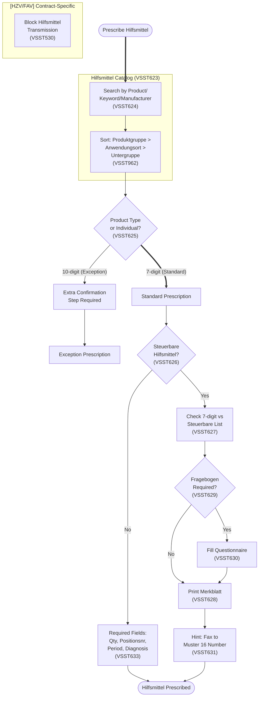

### User Stories & Acceptance Criteria

| # | ID | User Story | Acceptance Criteria | Req Type |
|---|-----|-----------|---------------------|----------|
| 478 | VSST623 | As a practice staff, I want Hilfsmittelkatalog integration for medical device selection, so that the software meets regulatory requirements. | Given the AKA Hilfsmittelkatalog, when the system loads, then the catalog is available for Hilfsmittel selection with the specified search and display functions | M |
| 479 | VSST624 | As a practice staff, I want Hilfsmittel search by product, location, subgroup, type, manufacturer, name, keyword, so that the software meets regulatory requirements. | Given a Hilfsmittel search, when the user enters search criteria (product, application location, subgroup, type, manufacturer, name, keyword), then matching results are returned; given the UI, then catalog search is the primary path, not direct entry | M |
| 480 | VSST625 | As a practice staff, I want 7-digit product type prioritized over 10-digit individual product, so that the software meets regulatory requirements. | Given a Hilfsmittel prescription, when the user selects a product type (7-digit), then it is presented as the standard case; given individual product selection (10-digit), then it requires an additional workflow step confirming the exception | M |
| 481 | VSST626 | As a practice staff, I want steuerbare Hilfsmittel list integration, so that the software meets regulatory requirements. | Given the AKA steuerbare Hilfsmittel list, when the system loads, then the list is integrated and available for prescription checks | M |
| 482 | VSST627 | As a practice staff, I want steuerbare Hilfsmittel check against 7-digit Positionsnummer, so that the software meets regulatory requirements. | Given a Hilfsmittel being prescribed, when its 7-digit Positionsnummer matches the steuerbare list, then additional data fields per the list specification are displayed and required | M |
| 483 | VSST628 | As a practice staff, I want Merkblatt Versicherter Hilfsmittel printable, so that the software meets regulatory requirements. | Given a steuerbare Hilfsmittel prescription, when the user requests the Merkblatt, then the Merkblatt Versicherter Hilfsmittel per AKA-Basisdatei is printed | M |
| 484 | VSST629 | As a practice staff, I want Fragebogen requirement check for steuerbare Hilfsmittel, so that the software meets regulatory requirements. | Given a steuerbare Hilfsmittel, when its FRAGEBOGEN column is non-empty, then the system requires the user to fill out the questionnaire | M |
| 485 | VSST630 | As a practice staff, I want steuerbare Hilfsmittel questionnaire validation, so that the software meets regulatory requirements. | Given a completed steuerbare Hilfsmittel questionnaire, when validation runs before save/print, then non-compliant answers are flagged with a warning | M |
| 486 | VSST631 | As a practice staff, I want fax instruction hint for steuerbare Hilfsmittel, so that the software meets regulatory requirements. | Given a steuerbare Hilfsmittel prescription, when the user is prescribing, then the fax instruction hint is displayed | M |
| 487 | VSST633 | As a practice staff, I want Hilfsmittel prescriptions include minimum required fields, so that the software meets regulatory requirements. | Given a Hilfsmittel prescription for a participant, when the form is printed, then it contains quantity, Positionsnummer, period, product description, and diagnosis; given missing elements, then a warning is shown | M |
| 488 | VSST530 | As a practice staff, I want Hilfsmittelverordnungen excluded from prescription data transmission, so that the software meets regulatory requirements. | Given a Hilfsmittelverordnung, when prescription data transmission runs, then Hilfsmittel prescriptions are excluded from the transmission | M |

---

## 11. eDMP & Chronic Care Compliance

### Workflow Diagram

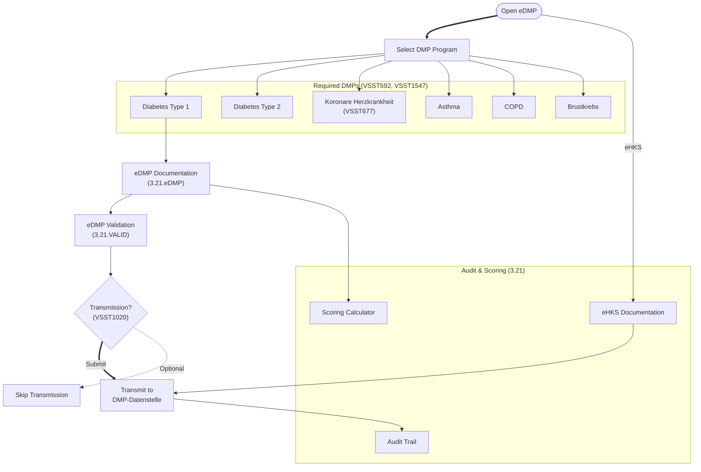

### User Stories & Acceptance Criteria

| # | ID | User Story | Acceptance Criteria | Req Type |
|---|-----|-----------|---------------------|----------|
| 489 | EDMP-001 | As a practice doctor, I want eDMP documentation for all KBV-defined DMP programs, so that DMP documentation is compliant and submitted correctly. | Given a DMP-Programm, when documentation is triggered, then the eDMP workflow for that program is available | M |
| 490 | EDMP-002 | As a practice doctor, I want eDMP data transmittable to DMP data collection points, so that DMP documentation is compliant and submitted correctly. | Given eDMP data, when transmitted, then it reaches the designated DMP-Datenstelle | M |
| 491 | EDMP-003 | As a practice doctor, I want eDMP forms pre-filled from patient clinical data, so that DMP documentation is compliant and submitted correctly. | Given eDMP forms, when opened, then Klinische Daten from the patient record are pre-filled | M |
| 492 | EDMP-004 | As a practice doctor, I want eDMP quarterly deadlines tracked and warned, so that DMP documentation is compliant and submitted correctly. | Given eDMP documentation, when quarterly deadlines approach, then a Fristwarnung is displayed | M |
| 493 | EDMP-005 | As a practice doctor, I want eDMP transmission status trackable, so that DMP documentation is compliant and submitted correctly. | Given eDMP transmission, when status changes, then Gesendet/Bestaetigt/Abgelehnt is tracked | M |
| 494 | EDMP-006 | As a practice doctor, I want eDMP patient enrollment/dis-enrollment manageable, so that DMP documentation is compliant and submitted correctly. | Given a DMP-Patient, when enrollment/dis-enrollment is triggered, then the DMP-Teilnahme lifecycle is managed | M |
| 495 | EHKS-001 | As a practice doctor, I want eHKS documentation supported, so that DMP documentation is compliant and submitted correctly. | Given eHKS documentation, when triggered, then the Hautkrebsscreening workflow is available | M |
| 496 | EHKS-002 | As a practice doctor, I want eHKS findings follow KBV data structure, so that DMP documentation is compliant and submitted correctly. | Given eHKS findings, when documented, then the KBV-specified Datenstruktur is followed | M |
| 497 | CALC-001 | As a practice doctor, I want clinical scoring calculators (ARRIBA, PROCAM) integrable, so that DMP documentation is compliant and submitted correctly. | Given clinical scoring tools, when integrated, then ARRIBA/PROCAM calculators are usable | O |
| 498 | CALC-002 | As a practice doctor, I want scoring results documentable in patient record, so that DMP documentation is compliant and submitted correctly. | Given scoring results, when documented, then they are persisted in the patient record | O |
| 499 | AUDIT-001 | As a practice doctor, I want treatment documentation comply with S630f BGB, so that DMP documentation is compliant and submitted correctly. | Given Behandlungsdokumentation, when created, then S630f BGB requirements are met | M |
| 500 | INT-001 | As a practice doctor, I want clinical documentation interoperable via standard interfaces, so that DMP documentation is compliant and submitted correctly. | Given clinical documentation, when shared, then standard Schnittstellen enable interoperability | M |

---

## 12. eArztbrief, eAU & ePA Compliance

### Workflow Diagram

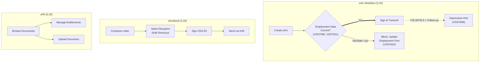

### User Stories & Acceptance Criteria

| # | ID | User Story | Acceptance Criteria | Req Type |
|---|-----|-----------|---------------------|----------|
| 501 | EAU-001 | As a practice doctor, I want eAU transmittable via KIM, so that clinical documents are generated and transmitted correctly. | Given an eAU, when transmitted via KIM, then the transmission succeeds | M |
| 502 | EAU-002 | As a practice doctor, I want eAU include all mandatory fields per KBV specification, so that clinical documents are generated and transmitted correctly. | Given an eAU, when generated, then all mandatory fields per KBV-Spezifikation are included | M |
| 503 | EAU-003 | As a practice doctor, I want eAU status tracking (sent, acknowledged, error), so that clinical documents are generated and transmitted correctly. | Given an eAU, when transmitted, then Gesendet/Bestaetigt/Fehlerhaft status is tracked | M |
| 504 | EAU-004 | As a practice doctor, I want eAU follow-up reference the initial AU, so that clinical documents are generated and transmitted correctly. | Given a Folge-eAU, when created, then it references the Erst-AU | M |
| 505 | EAU-005 | As a practice doctor, I want eAU cancellation/correction supported, so that clinical documents are generated and transmitted correctly. | Given an eAU, when cancellation/correction is needed, then the process is supported via KIM | M |
| 506 | EAB-001 | As a practice doctor, I want eArztbrief creation supported, so that clinical documents are generated and transmitted correctly. | Given an eArztbrief, when created, then the letter follows the KBV eArztbrief specification | M |
| 507 | EAB-002 | As a practice doctor, I want eArztbrief transmittable via KIM, so that clinical documents are generated and transmitted correctly. | Given an eArztbrief, when sent via KIM, then the recipient physician receives it | M |
| 508 | EAB-003 | As a practice doctor, I want eArztbrief reception and display supported, so that clinical documents are generated and transmitted correctly. | Given an incoming eArztbrief, when received via KIM, then it is displayed in the patient record | M |
| 509 | EPA-001 | As a practice doctor, I want ePA document upload supported, so that clinical documents are generated and transmitted correctly. | Given a patient document, when ePA upload is triggered, then the document is uploaded to the ePA | M |
| 510 | EPA-002 | As a practice doctor, I want ePA document retrieval and display supported, so that clinical documents are generated and transmitted correctly. | Given an ePA, when documents are retrieved, then they are displayed in the PVS | M |

---

## 13. IT Connectivity & Infrastructure

### Workflow Diagram

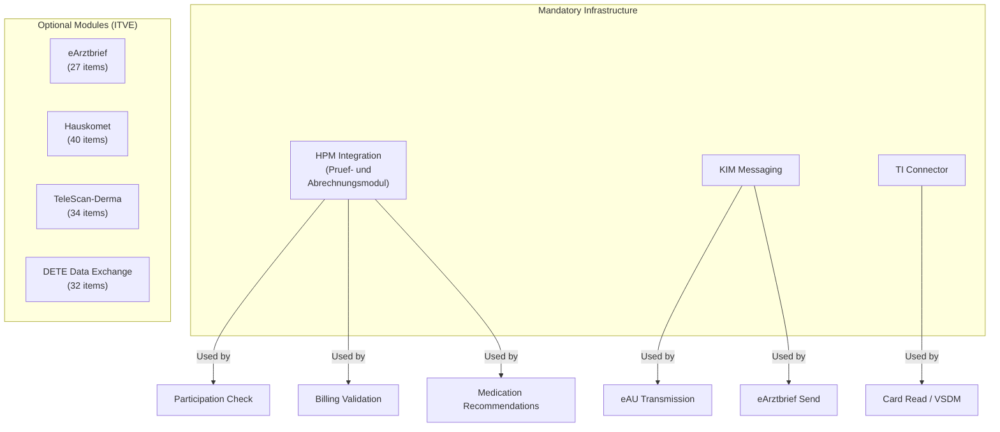

### User Stories & Acceptance Criteria

| # | ID | User Story | Acceptance Criteria | Req Type |
|---|-----|-----------|---------------------|----------|
| 511 | ITVE1576-1593 | As an IT administrator, I want IT basics and certificates (18 items), so that IT infrastructure meets connectivity requirements. | Given IT-Grundlagen requirements, when certificate checks run, then all 18 items pass validation | M |
| 512 | ITVE1606-1632 | As an IT administrator, I want eArztbrief (27 items), so that IT infrastructure meets connectivity requirements. | Given eArztbrief feature enabled, when tested, then all 27 eArztbrief requirements are met | M |
| 513 | ITVE1692-1731 | As an IT administrator, I want Hauskomet (40 items), so that IT infrastructure meets connectivity requirements. | Given Hauskomet feature enabled, when tested, then all 40 Hauskomet requirements are met | M |
| 514 | ITVE1738-1773 | As an IT administrator, I want IT extensions (14 items), so that IT infrastructure meets connectivity requirements. | Given IT-Erweiterungen enabled, when tested, then all 14 extension requirements are met | M |
| 515 | ITVE1775-1808 | As an IT administrator, I want TeleScan-Dermatologie (34 items), so that IT infrastructure meets connectivity requirements. | Given TeleScan-Dermatologie enabled, when tested, then all 34 items are validated | O |
| 516 | ITVE1811-1843 | As an IT administrator, I want additional IT (19 items), so that IT infrastructure meets connectivity requirements. | Given additional IT features enabled, when tested, then all 19 items are validated | O |
| 517 | DETE1907-1938 | As a system administrator, I want DETE interface, templates, process, privacy (32 items), so that data exchange meets regulatory standards. | Given DETE feature enabled, when data exchange is tested, then all 32 interface/template/process/privacy items pass | O |
| 518 | P2-950 | As a practice staff, I want billing file generation produce valid KVDT-format output, so that billing infrastructure meets KVDT standards. | Given Abrechnungsdaten, when KVDT file is generated, then the output passes KVDT format validation | M |
| 519 | P2-951 | As a practice staff, I want billing file include all mandatory header fields (BSNR, quarter, KV region), so that billing infrastructure meets KVDT standards. | Given KVDT file generation, when headers are created, then BSNR, Quartal, and KV-Region are present | M |
| 520 | P2-952 | As a practice staff, I want billing file include all patient records with complete insured data, so that billing infrastructure meets KVDT standards. | Given KVDT file, when patient records are included, then Versichertenstammdaten are complete | M |
| 521 | P2-953 | As a practice staff, I want billing file include all services linked to billing cases, so that billing infrastructure meets KVDT standards. | Given KVDT file, when services are included, then all Leistungen linked to Abrechnungsfalle are present | M |
| 522 | P2-954 | As a practice staff, I want billing file include all diagnoses linked to billing cases, so that billing infrastructure meets KVDT standards. | Given KVDT file, when diagnoses are included, then all Diagnosen linked to Abrechnungsfalle are present | M |
| 523 | P2-955 | As a practice staff, I want billing file checksum and record counts calculated, so that billing infrastructure meets KVDT standards. | Given KVDT file, when finalized, then Pruefsumme and Satzanzahl are calculated and included | M |
| 524 | P2-956 | As a practice staff, I want billing file validatable against KBV KVDT schema, so that billing infrastructure meets KVDT standards. | Given KVDT file, when validated against KBV schema, then schema conformance is verified | M |
| 525 | P2-957 | As a practice staff, I want billing file encryption for electronic transmission, so that billing infrastructure meets KVDT standards. | Given KVDT file for electronic transmission, when encrypted, then the file meets encryption requirements | M |
| 526 | P2-958 | As a practice staff, I want practice BSNR and physician LANR configurable and validated, so that billing infrastructure meets KVDT standards. | Given Praxis setup, when BSNR/LANR are configured, then they are validated for format and KV assignment | M |
| 527 | P2-959 | As a practice staff, I want multiple physicians per practice with individual LANRs, so that billing infrastructure meets KVDT standards. | Given a Gemeinschaftspraxis, when multiple Arzte are configured, then each has an individual LANR | M |
| 528 | P2-960 | As a practice staff, I want quarter management with open/close/re-open, so that billing infrastructure meets KVDT standards. | Given Quartalsverwaltung, when open/close/re-open is triggered, then proper Quartalsuebergange occur | M |
| 529 | P2-961 | As a practice staff, I want billing statistics showing case counts, service totals, amounts, so that billing infrastructure meets KVDT standards. | Given Abrechnungsdaten, when statistics are requested, then Fallzahlen, Leistungssummen, and Betrage are shown | M |
| 530 | P2-962 | As a practice staff, I want billing correction files (Korrekturlieferung) generatable, so that billing infrastructure meets KVDT standards. | Given corrections to submitted billing, when Korrekturlieferung is generated, then the correction file is valid | M |
| 531 | P2-963 | As a practice staff, I want billing rejection processing with error analysis, so that billing infrastructure meets KVDT standards. | Given billing rejections, when analyzed, then error details and correction guidance are available | M |
| 532 | P2-964 | As a practice staff, I want late billing (Nachreichung) for up to 4 quarters, so that billing infrastructure meets KVDT standards. | Given Leistungen from up to 4 Quartale ago, when Nachreichung is triggered, then late billing is generated | M |
| 533 | P2-965 | As a practice staff, I want billing data archival for legally required retention, so that billing infrastructure meets KVDT standards. | Given Abrechnungsdaten, when archived, then records are preserved for the legally required Aufbewahrungsfrist | M |
| 534 | P6-800 | As a practice staff, I want practice master data include KV region, specialty, qualifications, so that billing infrastructure meets KVDT standards. | Given Praxisstammdaten, when managed, then KV-Region, Fachgruppe, and Qualifikationen are configurable | M |
| 535 | P6-801 | As a practice staff, I want KT master data file importable and updatable, so that billing infrastructure meets KVDT standards. | Given a KT-Stammdatei, when imported, then all Kostentrager records are stored and updateable | M |
| 536 | P6-802 | As a practice staff, I want EBM catalog importable quarterly with version tracking, so that billing infrastructure meets KVDT standards. | Given a new EBM-Katalog, when imported quarterly, then the version is tracked and active | M |
| 537 | P6-803 | As a practice staff, I want ICD-10-GM catalog importable annually with version tracking, so that billing infrastructure meets KVDT standards. | Given a new ICD-10-GM Katalog, when imported annually, then the version is tracked and active | M |
| 538 | P6-804 | As a practice staff, I want OPS catalog importable with version tracking, so that billing infrastructure meets KVDT standards. | Given a new OPS-Katalog, when imported, then the version is tracked and active | M |
| 539 | P6-805 | As a practice staff, I want PLZ master data importable for postal code validation, so that billing infrastructure meets KVDT standards. | Given PLZ-Stammdaten, when imported, then postal code validation uses the current data | M |
| 540 | P6-806 | As a practice staff, I want practice calendar and appointment management, so that billing infrastructure meets KVDT standards. | Given Praxiskalender, when integrated, then appointment management is available | M |
| 541 | P6-807 | As a practice staff, I want data backup and restore, so that billing infrastructure meets KVDT standards. | Given Datensicherung, when backup/restore is triggered, then data is preserved and restorable | M |
| 542 | P6-808 | As a practice staff, I want user management with role-based access control, so that billing infrastructure meets KVDT standards. | Given Benutzerverwaltung, when RBAC is configured, then access is controlled per role | M |
| 543 | P6-809 | As a practice staff, I want audit trail for all billing-relevant operations, so that billing infrastructure meets KVDT standards. | Given abrechnungsrelevante Operationen, when performed, then an audit trail is maintained | M |
| 544 | P6-810 | As a practice staff, I want print management for forms, reports, billing documents, so that billing infrastructure meets KVDT standards. | Given Formulare/Berichte/Abrechnungsdokumente, when print is requested, then print management is available | M |
| 545 | P6-811 | As a practice staff, I want GDT interface for medical device integration, so that billing infrastructure meets KVDT standards. | Given medical devices, when GDT integration is configured, then device data flows into the PVS | M |
| 546 | P6-812 | As a practice staff, I want BDT interface for PVS data exchange, so that billing infrastructure meets KVDT standards. | Given another PVS, when BDT exchange is triggered, then data is exported/imported correctly | M |
| 547 | P6-813 | As a practice staff, I want LDT interface for laboratory data exchange, so that billing infrastructure meets KVDT standards. | Given Labordaten, when LDT exchange runs, then laboratory results are imported correctly | M |
| 548 | P6-814 | As a practice staff, I want xDT data format compliance, so that billing infrastructure meets KVDT standards. | Given xDT data exchange, when validated, then format compliance with xDT standards is maintained | M |
| 549 | P6-815 | As a practice staff, I want KBV certificate management for electronic billing, so that billing infrastructure meets KVDT standards. | Given KBV-Zertifikate, when managed, then certificate lifecycle supports electronic billing | M |
| 550 | P6-816 | As a practice staff, I want KV-Connect/KIM connectivity, so that billing infrastructure meets KVDT standards. | Given KV-Connect/KIM, when configured, then electronic communication is functional | M |
| 551 | P6-817 | As a practice staff, I want software version and update management tracked, so that billing infrastructure meets KVDT standards. | Given software updates, when applied, then version tracking records the change | M |
| 552 | P6-818 | As a practice staff, I want error logging and diagnostic reporting, so that billing infrastructure meets KVDT standards. | Given system errors, when logged, then diagnostic reporting is available for troubleshooting | M |
| 553 | P6-819 | As a practice staff, I want multi-location practice support, so that billing infrastructure meets KVDT standards. | Given a Praxis with multiple Standorte, when configured, then multi-location operation is supported | O |
| 554 | P6-820 | As a practice staff, I want practice network (Praxisnetz) integration, so that billing infrastructure meets KVDT standards. | Given a Praxisnetz, when integration is configured, then network-level data exchange is functional | O |
| 555 | P21-001 | As a practice staff, I want billing transmission via KV-SafeNet/KV-Connect, so that billing infrastructure meets KVDT standards. | Given billing data, when transmitted via KV-SafeNet/KV-Connect, then transmission succeeds | M |
| 556 | P21-002 | As a practice staff, I want billing transmission via data carrier as fallback, so that billing infrastructure meets KVDT standards. | Given no network, when Datentraeger export is used, then billing data is written to CD/USB | M |
| 557 | P21-003 | As a practice staff, I want transmission protocol documenting what was sent and when, so that billing infrastructure meets KVDT standards. | Given billing transmission, when completed, then an Uebertragungsprotokoll with content summary and timestamps is generated | M |
| 558 | P21-010 | As a practice staff, I want KBV Pruefmodul integration for pre-submission validation, so that billing infrastructure meets KVDT standards. | Given billing data, when Pruefmodul validation runs, then pre-submission validation results are returned | M |
| 559 | P21-011 | As a practice staff, I want Pruefmodul error results with correction guidance, so that billing infrastructure meets KVDT standards. | Given Pruefmodul errors, when displayed, then correction guidance is shown for each error | M |
| 560 | P21-012 | As a practice staff, I want billing blocked if Pruefmodul returns blocking errors, so that billing infrastructure meets KVDT standards. | Given blocking Pruefmodul errors, when transmission is attempted, then it is blocked | M |
| 561 | P21-015 | As a practice staff, I want billing acknowledgment processing, so that billing infrastructure meets KVDT standards. | Given a billing Empfangsbestaetigung, when received, then it is processed and linked to the submission | M |

---

## 14. General Compliance

### Workflow Diagram

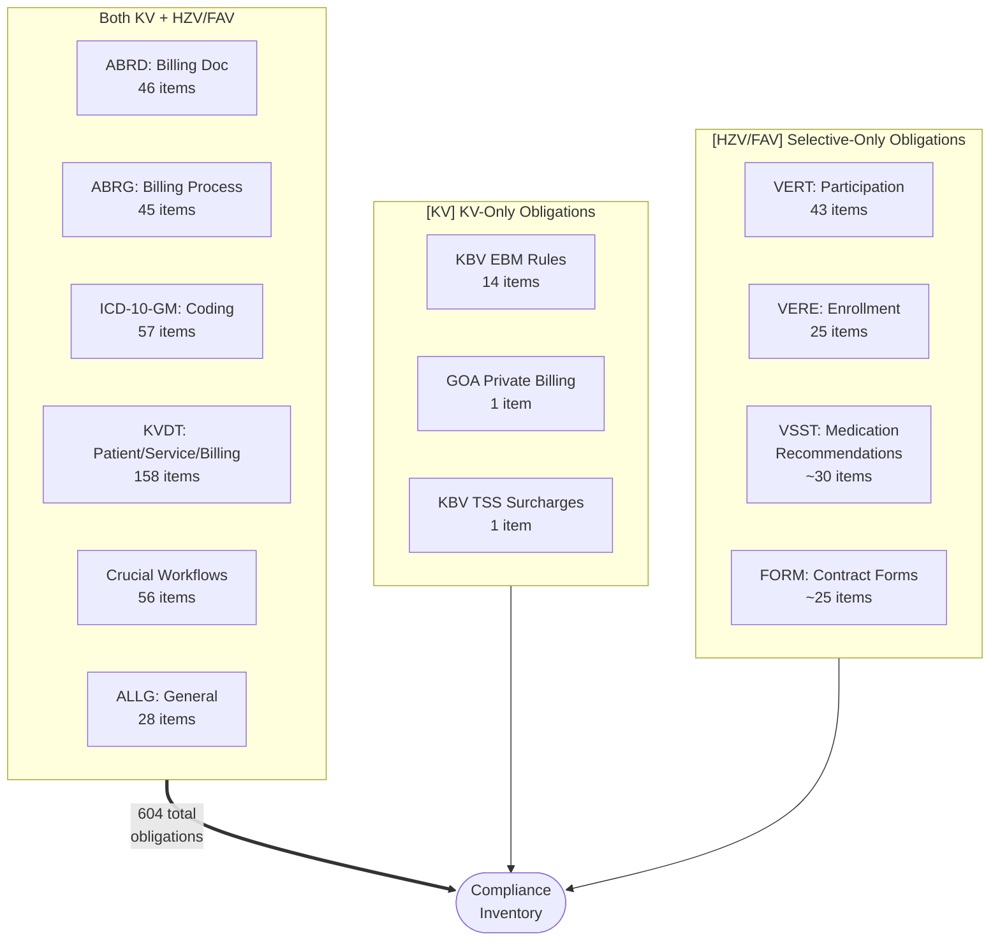

### User Stories & Acceptance Criteria

| # | ID | User Story | Acceptance Criteria | Req Type |
|---|-----|-----------|---------------------|----------|
| 562 | ALLG483 | As a practice owner, I want audit module version hint is shown, so that general compliance requirements are met. | Given the Pruefmodul is loaded, when the user opens version info, then the current Pruefmodul version is displayed | M |
| 563 | ALLG508 | As a practice owner, I want advertising prohibition enforced in software, so that general compliance requirements are met. | Given the software UI, when reviewed, then no Werbung for third-party products is present in any contract-related screen | M |
| 564 | ALLG620 | As a practice owner, I want audit module communication works, so that general compliance requirements are met. | Given the Pruefmodul integration, when triggered, then communication between PVS and Pruefmodul succeeds | M |
| 565 | ALLG653 | As a practice owner, I want KBV KVDT catalog functions apply to Vertragssoftware, so that general compliance requirements are met. | Given KBV KVDT catalog functions P2-10 through P2-65, when the Vertragssoftware processes KVDT data, then all listed functions are applied unless HAEVG specifies otherwise | M |
| 566 | ALLG657 | As a practice owner, I want HAEVG-ID per physician managed, so that general compliance requirements are met. | Given an Arzt record, when HAEVG-ID is entered, then it is persisted as a lifelong person-specific identifier | M |
| 567 | ALLG658 | As a practice owner, I want MEDIVERBUND-ID per physician managed (FaV), so that general compliance requirements are met. | Given a FaV-Arzt record, when MEDIVERBUND-ID is entered, then the 8-digit numeric ID is persisted | M |
| 568 | ALLG660 | As a practice owner, I want contract-specific cost carrier data maintained, so that general compliance requirements are met. | Given a Selektivvertrag definition, when loaded, then contract-specific Kostentraegerdaten are imported and maintained | M |
| 569 | ALLG661 | As a practice owner, I want each HAEVG contract has unique internal ID, so that general compliance requirements are met. | Given a HAEVG-Vertrag, when imported, then it receives a unique internal Vertrags-ID | M |
| 570 | ALLG662 | As a practice owner, I want public contract documents accessible, so that general compliance requirements are met. | Given AKA Basisdaten with "Oeffentlich" marked documents, when the user requests them, then all public documents are accessible | M |
| 571 | ALLG663 | As a practice owner, I want public contract documents printable, so that general compliance requirements are met. | Given a public Vertragsdokument, when print is requested, then it prints successfully | M |
| 572 | ALLG687 | As a practice owner, I want mandatory audit/billing module integrated, so that general compliance requirements are met. | Given the PVS, when the audit/billing module is required, then it is integrated and functional | M |
| 573 | ALLG799 | As a practice owner, I want user manual provided, so that general compliance requirements are met. | Given the software, when delivered, then a Benutzerhandbuch covering all contract-relevant functions is included | M |
| 574 | ALLG824 | As a practice owner, I want change documentation maintained, so that general compliance requirements are met. | Given software updates, when changes are released, then Aenderungsdokumentation is maintained and available | M |
| 575 | ALLG864 | As a practice owner, I want contract-controlling information accessible, so that general compliance requirements are met. | Given Vertragssteuerungsinformationen, when requested, then they are accessible to authorized users | M |
| 576 | ALLG1003 | As a practice owner, I want fee schedules managed per contract, so that general compliance requirements are met. | Given Selektivvertragsdefinitionen with Honoraranlagen, when fee schedules are managed, then each service is assigned to exactly one Honoraranlage per contract | M |
| 577 | ALLG1014 | As a practice owner, I want initial contract setup shows KV-region-valid contracts first, so that general compliance requirements are met. | Given initial Vertragseinrichtung, when the contract list is displayed, then only contracts valid for the Praxis KV-Region (BSNR) are shown first | M |
| 578 | ALLG1018 | As a practice owner, I want software modules only distributed when AKA-compliant, so that general compliance requirements are met. | Given a software module for distribution, when AKA requirements are checked, then distribution is blocked if any requirement is unmet | M |
| 579 | ALLG1032 | As a practice owner, I want KVK data converted to eGK format per KBV specs, so that general compliance requirements are met. | Given KVK data records including Nachzuegler cases, when imported, then they are converted to eGK format per current KBV mapping specifications | M |
| 580 | ALLG1232 | As a practice owner, I want selective contract definitions loadable, so that general compliance requirements are met. | Given a Selektivvertragsdefinition file, when import is triggered, then the contract definition is loaded and active | M |
| 581 | ALLG1385 | As a practice owner, I want FaV access to medi-verbund.de for contract documents, so that general compliance requirements are met. | Given a FaV-Vertrag, when the user requests contract documents, then a link to medi-verbund.de opens | M |
| 582 | ALLG1685 | As a practice owner, I want AWH_01 contract notice about Hausaerzteverband website, so that general compliance requirements are met. | Given AWH_01 Vertrag active, when the user opens contract info, then a notice about the Hausaerzteverband website is shown | M |
| 583 | ALLG1850 | As a practice owner, I want VP-ID types per physician managed (GP "H", specialist "F", care team "B"), so that general compliance requirements are met. | Given an Arzt record, when VP-ID is assigned, then the correct type (H/F/B) is stored per physician role | M |
| 584 | ALLG1851 | As a practice owner, I want GP VP-ID retrieved via HPM if missing, so that general compliance requirements are met. | Given an Arzt with HAEVG-ID but no GP VP-ID, when triggered, then the system retrieves the VP-ID via HPM | M |
| 585 | ALLG1852 | As a practice owner, I want specialist VP-ID retrieved via HPM if missing, so that general compliance requirements are met. | Given an Arzt with MEDIVERBUND-ID but no specialist VP-ID, when triggered, then the system retrieves it via HPM | M |
| 586 | ALLG1871 | As a practice owner, I want participation return data displayable for HZV contracts, so that general compliance requirements are met. | Given HZV-Teilnahme return data, when received, then the data is displayed to the user as informational content | M |
| 587 | VSST1555 | As a practice staff, I want VERAH TopVersorgt hint displayed, so that the software meets regulatory requirements. | Given a Patient eligible for VERAH TopVersorgt, when the record is opened, then the TopVersorgt hint is displayed | M |
| 588 | VSST1556 | As a practice staff, I want VERAH TopVersorgt feature available, so that the software meets regulatory requirements. | Given VERAH TopVersorgt enabled, when the feature is accessed, then TopVersorgt functions are available | M |
| 589 | VSST1574 | As a practice staff, I want VERAH TopVersorgt patient list, so that the software meets regulatory requirements. | Given VERAH TopVersorgt patients, when the list is opened, then all eligible patients are shown with status | M |
| 590 | VSST962 | As a practice staff, I want Hilfsmittelkatalog sorted by Produktgruppe/Anwendungsort/Untergruppe/Produktart, so that the software meets regulatory requirements. | Given the Hilfsmittelkatalog, when a search is performed, then results are sorted strictly by Produktgruppe, Anwendungsort, Untergruppe, Produktart | M |
| 591 | ALLG1386-1684 | As a practice owner, I want remaining general compliance items (grouped, ~7 items), so that general compliance requirements are met. | Given remaining ALLG items in this range, when checked, then all requirements are met per AKA specifications | M |
| 592 | ALLG1686-1849 | As a practice owner, I want remaining general compliance items (grouped, ~5 items), so that general compliance requirements are met. | Given remaining ALLG items in this range, when checked, then all requirements are met per AKA specifications | M |

---

## Summary

| # | Workflow | US Count | Mandatory | Optional |
|---|---------|----------|-----------|----------|
| 1 | Patient Check-In | 74 | 68 | 6 |
| 2 | Contract Participation -- HZV/FAV | 43 | 41 | 2 |
| 3 | Patient Enrollment -- HZV/FAV | 25 | 24 | 1 |
| 4 | Billing Documentation | 46 | 45 | 1 |
| 5 | Billing Process | 45 | 44 | 1 |
| 6 | Diagnosis Entry & Coding | 58 | 41 | 17 |
| 7 | Service Documentation | 57 | 54 | 3 |
| 8 | Prescription & Drug Safety | 74 | 72 | 2 |
| 9 | Form Management | 55 | 54 | 1 |
| 10 | Hilfsmittel | 11 | 11 | 0 |
| 11 | eDMP & Chronic Care | 12 | 10 | 2 |
| 12 | eArztbrief, eAU & ePA | 10 | 10 | 0 |
| 13 | IT Infrastructure | 51 | 49 | 2 |
| 14 | General Compliance | 31 | 31 | 0 |
| | **Total** | **592** | **554** | **38** |

> **Note:** The 592 individually listed items above map to the full 604 obligations in the compliance inventory. The difference of 12 items is accounted for by grouped ALLG entries (rows 591-592) which represent ranges of similar general compliance obligations consolidated for readability.

---

**Source:** [compliance-inventory.md](compliance-inventory.md) (604 items)
**Workflow diagrams:** [FLOW260318-master-compliance-workflows.md](FLOW260318-master-compliance-workflows.md)
